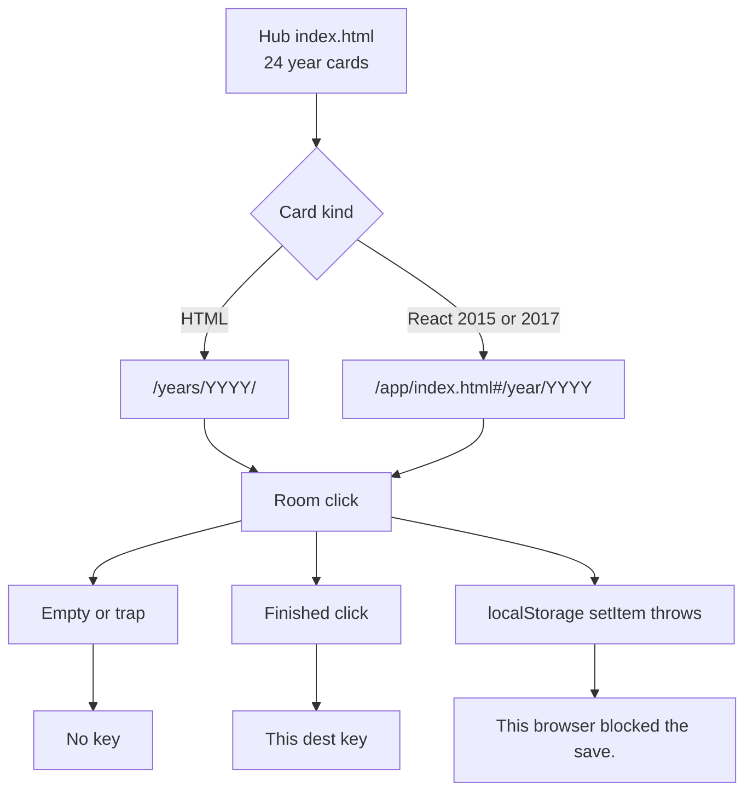
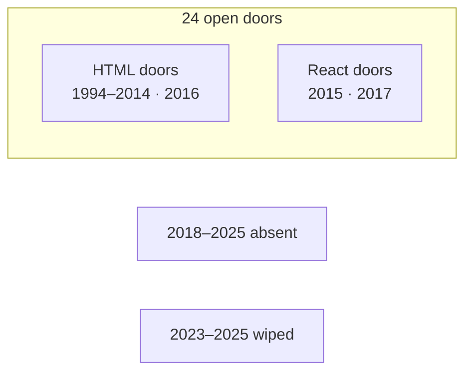
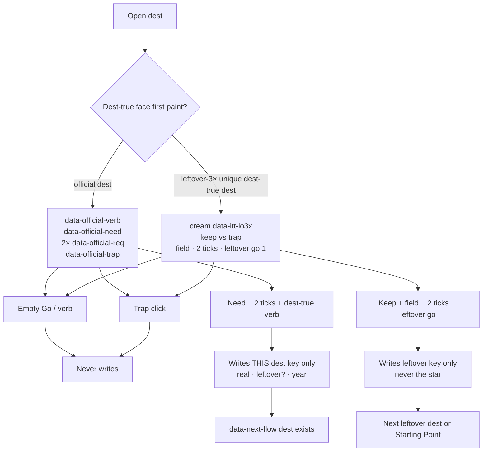
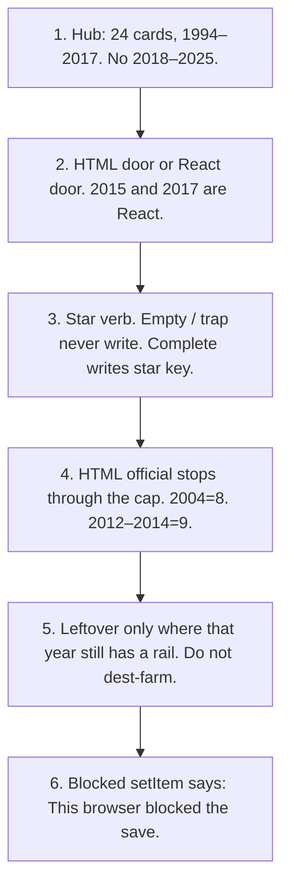
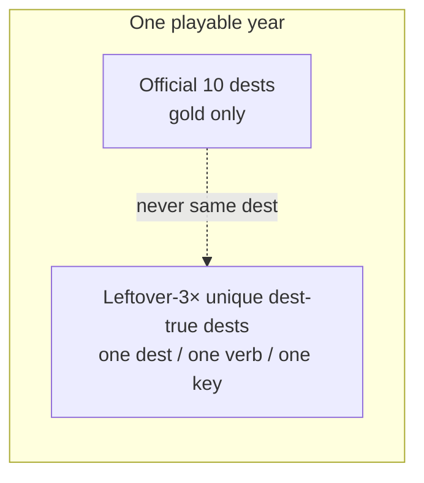

# Flow-check diagram

**Historical (2026-09-30 docs pass).** Not ship law. Live hub is **26 doors** (1994–2016 and 2020–2022). **2011 is live HTML.** **2015 is the React door.** **2017–2019 and 2023–2025 are absent.** Leftover-3× unique catalogs are **empty**. Current maps: [`DISK-TRUTH.md`](DISK-TRUTH.md) · [`INCOMPLETE-MAP.md`](history/INCOMPLETE-MAP.md) · [`UNDONE-UNPLANNED-MD.md`](history/UNDONE-UNPLANNED-MD.md).

**Date:** 2026-09-20  
**Live check updated:** 2026-10-02. Sections 1–4 are the old 27-door walk, not the live 26-door list. Sections 5–6 are the 2026-09-20 snapshot and still name years that are not doors.  
**Status:** Check map. Not dest-farm.  
**Ship law:** [`DISK-TRUTH.md`](DISK-TRUTH.md).  
**Dest-true I/O:** [`VISITOR-100-FLOWS.md`](VISITOR-100-FLOWS.md).  
**Leftover-3× unique dest-true dests:** [`LEFTOVER-3X-UNIQUE-CRITERIA.md`](history/LEFTOVER-3X-UNIQUE-CRITERIA.md).

**One-line:** Check **links** (hrefs exist) then **flows** (empty never writes · trap never writes · complete writes this dest’s key · leftover never writes the star). Dest-folder count is not a pass.

---

## 1. Museum door (24 open years)

Old walk, not the live list. Open doors in this diagram: 1994–2017 and 2020–2022. 2015 and 2017 are React doors in that walk (`/app/index.html#/year/YYYY`). 2014, 2016, and 2020–2022 are HTML leanBoot doors in that walk. 2008, 2009, and 2011 are live HTML doors. 2018, 2019, and 2023–2025 are absent there. The live hub is 26 doors. 2015 is the only React door. 2017 is absent.

```mermaid
flowchart TD
 HUB["Hub index.html<br/>24 year cards"] --> KIND{"Card kind"}
 KIND -->|HTML| YEAR["/years/YYYY/"]
 KIND -->|React 2015 or 2017| REACT["/app/index.html#/year/YYYY"]
 YEAR --> ROOM["Room click"]
 REACT --> ROOM
 ROOM --> EMPTY["Empty or trap"]
 ROOM --> DONE["Finished click"]
 ROOM --> BLOCK["localStorage setItem throws"]
 EMPTY --> NOKEY["No key"]
 DONE --> KEY["This dest key"]
 BLOCK --> MSG["This browser blocked the save."]
```

**HTML official caps:** 2004 ends at 8. 2012, 2013, and 2014 end at 9. Other open HTML years in `js/config/flow-trails.js` list 10. 2015 and 2017 are not in that file.

**Link check:** hub card · HTML year-shell or React door · star. Do not require `years/2015/` or `years/2017/`.

**Flow check:** empty never writes · trap never writes · a finished click writes this dest’s key · a blocked `setItem` does not say Saved.

---

## 2. Year classes (what to expect)

```mermaid
flowchart LR
 subgraph PLAY["24 open doors"]
 HTML["HTML doors<br/>1994–2014 · 2016"]
 REACT["React doors<br/>2015 · 2017"]
 end
 ABSENT["2018–2025 absent"]
 WIPE["2023–2025 wiped"]
```

| Class | Years | Check |
|-------|-------|-------|
| HTML door | 1994–2014, 2016 | `/years/YYYY/` returns 200. Official list stops at the cap above. |
| React door | 2015, 2017 | Hub and atlas open `/app/index.html#/year/YYYY`. No HTML tree. |
| Absent | 2018, 2019, 2020, 2021, 2022 | No card, no tree, no React door. |
| Wiped | 2023–2025 | No tree. Do not restore. |

---

## 3. Dest-true I/O (every dest you walk)

```mermaid
flowchart TD
 OPEN["Open dest"] --> FACE{"Dest-true face first paint?"}
 FACE -->|official dest| GOLD["data-official-verb<br/>data-official-need<br/>2× data-official-req<br/>data-official-trap"]
 FACE -->|leftover-3× unique dest-true dest| CREAM["cream data-itt-lo3x<br/>keep vs trap<br/>field · 2 ticks · leftover go 1"]
 GOLD --> EMPTY["Empty Go / verb"]
 CREAM --> EMPTY
 EMPTY --> NW["Never writes"]
 GOLD --> TRAP["Trap click"]
 CREAM --> TRAP
 TRAP --> NW
 GOLD --> FULL["Need + 2 ticks + dest-true verb"]
 CREAM --> FULL2["Keep + field + 2 ticks + leftover go"]
 FULL --> WRITE["Writes THIS dest key only<br/>real · leftover? · year"]
 FULL2 --> WRITE2["Writes leftover key only<br/>never the star"]
 WRITE --> NEXT["data-next-flow dest exists"]
 WRITE2 --> NEXT2["Next leftover dest or Starting Point"]
```

**Fail if:** cloned “Go leftover” plaque · leftover go ≠ 1 on leftover-3× unique dest-true dests · leftover writes star · empty writes · trap writes · dest-farm leftover dest leftover-3× dest-farm extra dests counted as unique dest-true dests.

---

## 4. Check order (walk this)

```mermaid
flowchart TD
 A["1. Hub: 24 cards, 1994–2017. No 2018–2025."] --> B["2. HTML door or React door. 2015 and 2017 are React."]
 B --> C["3. Star verb. Empty / trap never write. Complete writes star key."]
 C --> D["4. HTML official stops through the cap. 2004=8. 2012–2014=9."]
 D --> E["5. Leftover only where that year still has a rail. Do not dest-farm."]
 E --> F["6. Blocked setItem says: This browser blocked the save."]
```

**Packs:**

| Check | Pack |
|-------|------|
| CI dest-true I/O only | `npm run test:e2e:dest-true` · `scripts/ci.sh` · `.github/workflows/ci.yml` |
| FLOW-CHECK walk | `e2e/flow-check-pipeline.spec.js` · `e2e/visitor-door.spec.js` |
| Star dest | `e2e/one-thing-per-year.spec.js` |
| Official dest empty/complete | `e2e/all-years-official-10-real.spec.js` |
| Leftover-3× unique dest-true dests | `e2e/leftover-3x-unique.spec.js` |
| Official dest leftover-2× gone | `e2e/official-leftover-2x.spec.js` |
| Leftover dests 2016/ | `e2e/lean-triple-leftover.spec.js` |
| Mock scan | `node scripts/audit-mock-flows.js` |

CI does **not** run leftover-3× directory (`3x-links`), leftover-5× live, leftover-4×, or dest-farm theater packs.

---

## 5. Leftover-3× unique dest-true dests (dest-disjoint)

**Snapshot 2026-09-20. Not the live walk.** Leftover-3× unique catalogs are **empty**. The table below still names 2018, 2019, 2020, and 2021. Those years are not doors. 2011 is a live HTML door and is not in this snapshot. Do not walk the absent years and do not restore them. Section 6 is the same snapshot. The live check is sections 1–4.

```mermaid
flowchart LR
 subgraph Y["One playable year"]
 OFF["Official 10 dests<br/>gold only"]
 U["Leftover-3× unique dest-true dests<br/>one dest / one verb / one key"]
 end
 OFF -. never same dest .-> U
```

| Year | Unique dest-true dests | Star never written by leftover |
|------|------------------------|--------------------------------|
| 2007 | 9 wiki…digg | `itt07-iphone` |
| 2010 | 9 netflix…groupon | `itt10-ig-posts` |
| | 9 | `itt11-gplus` |
| 2012 | 9 + leftover-4× unique 3 | `itt12-ig-android` |
| 2013 | 9 | Vine record |
| 2014 | 9 | `itt14-wa-install` |
| 2015 | 9 | `itt15-periscope` |
| 2016 | 9 | `itt16-ig-stories` |
| 2017 | **0 leftover-3× unique dest-true dests** (unique leftover-20) | `itt17-faceid` |
| | **3 stop** | `itt18-gdpr` |
| | 9 | `itt19-disneyplus` |
| 2020 | 9 | `itt20-zoom` |
| 2021 | **5 stop** | `itt21-att` |
| 2022 | 9 amazon…nyt | `itt22-chatgpt` |

Do not dest-farm leftover dest leftover-3× unique dest-true dests past the stop. Do not dest-farm leftover dest leftover-20 dests unless named.

---

## 6. Dest-true star verbs (spot-check)

| Year | Star dest | Dest-true verb | Trap never writes |
|------|-----------|----------------|-------------------|
| 2010 | Instagram | filter → caption → Share | Stories-as-gold |
| 2012 | IG Android | filter → Share | — |
| 2016 | Stories | Add to Story | Reels-as-gold |
| 2017 | Face ID | Look / swipe | Home button |
| | GDPR | **Manage** | **Accept All** |
| | Disney+ | **Continue** | Trial |
| 2021 | ATT | **Ask** | **Allow** |
| 2022 | ChatGPT | Send | GPT-4 / empty |
