# Flow-check diagrams — every year 1994–2020

Walk these in the museum. Each year has a **live map** plus the diagram below.
Guided list stays **6 items**. Incomplete never writes. One locked star per year.

## How to check one year

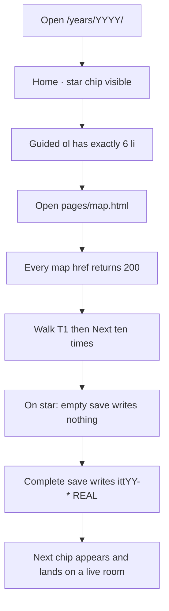

| Step | Where | Pass if |
|---|---|---|
| Shell | `/years/YYYY/` | year chrome, iframe loads home |
| Star | home `data-ott-one-thing` | one chip, href 200 |
| Guided | `#ott-guided-YYYY ol li` | count **6** |
| Live map | `/years/YYYY/pages/map.html` | tree + ten-flows, no 404 |
| Ten-trail | T1 → T10 below | each hop 200 |
| REAL | star / densify room | empty blocked · complete writes |
| Next | `[data-next-flow]` after save | visible, first href live |

## All years at a glance

| Year | Star | Live map | Ten-trail T1 |
|---|---|---|---|
| 1994 | [Cool Site of the Day](/years/1994/sites/csotd/index.html) | [map](/years/1994/pages/map.html) | CSotD guestbook |
| 1995 | [SSL checkout](/years/1995/sites/amazon/ssl-checkout.html) | [map](/years/1995/pages/map.html) | SSL checkout |
| 1996 | [Portal wars](/years/1996/sites/portals/wars.html) | [map](/years/1996/pages/map.html) | Portal wars |
| 1997 | [PointCast](/years/1997/sites/pointcast/index.html) | [map](/years/1997/pages/map.html) | PointCast |
| 1998 | [I'm Feeling Lucky](/years/1998/sites/google/lucky.html) | [map](/years/1998/pages/map.html) | I'm Feeling Lucky |
| 1999 | [AIM Buddy List](/years/1999/sites/aim/index.html) | [map](/years/1999/pages/map.html) | AIM sign-on |
| 2000 | [MapQuest directions](/years/2000/sites/mapquest/index.html) | [map](/years/2000/pages/map.html) | MapQuest |
| 2001 | [MSN Messenger](/years/2001/sites/msn/index.html) | [map](/years/2001/pages/map.html) | MSN Messenger |
| 2002 | [StumbleUpon](/years/2002/sites/stumbleupon/index.html) | [map](/years/2002/pages/map.html) | StumbleUpon |
| 2003 | [Photobucket hotlink](/years/2003/sites/photobucket/index.html) | [map](/years/2003/pages/map.html) | Photobucket |
| 2004 | [thefacebook networks](/years/2004/sites/facebook/networks.html) | [map](/years/2004/pages/map.html) | thefacebook networks |
| 2005 | [Pandora Radio](/years/2005/sites/pandora/index.html) | [map](/years/2005/pages/map.html) | Pandora station |
| 2006 | [Twitter 140](/years/2006/sites/twitter/index.html) | [map](/years/2006/pages/map.html) | Twitter 140 |
| 2007 | [iPhone Safari](/years/2007/sites/iphone/index.html) | [map](/years/2007/pages/map.html) | iPhone Safari |
| 2008 | [GitHub issue](/years/2008/sites/github/issue.html) | [map](/years/2008/pages/map.html) | GitHub issue |
| 2009 | [Facebook Like](/years/2009/sites/facebook/feed.html) | [map](/years/2009/pages/map.html) | Facebook Like |
| 2010 | [Imgur](/years/2010/sites/imgur/index.html) | [map](/years/2010/pages/map.html) | Imgur upload |
| 2011 | [Airbnb](/years/2011/sites/airbnb/index.html) | [map](/years/2011/pages/map.html) | Airbnb request |
| 2012 | [SoundCloud](/years/2012/sites/soundcloud/index.html) | [map](/years/2012/pages/map.html) | SoundCloud |
| 2013 | [Vine 6s](/years/2013/sites/vine/record.html) | [map](/years/2013/pages/map.html) | Vine hold |
| 2014 | [WhatsApp deal + chat](/years/2014/sites/whatsapp/index.html) | [map](/years/2014/pages/map.html) | WhatsApp install |
| 2015 | [Apple Watch Apr 24](/years/2015/sites/apple/watch.html) | [map](/years/2015/pages/map.html) | Apple Watch |
| 2016 | [Instagram Stories Aug 2](/years/2016/sites/instagram/stories.html) | [map](/years/2016/pages/map.html) | IG Stories |
| 2017 | [iPhone X / Face ID](/years/2017/sites/iphone/x.html) | [map](/years/2017/pages/map.html) | Face ID / X |
| 2018 | [GDPR Manage](/years/2018/sites/gdpr/index.html) | [map](/years/2018/pages/map.html) | GDPR Manage |
| 2019 | [Disney+ Who's watching](/years/2019/sites/disneyplus/home.html) | [map](/years/2019/pages/map.html) | Disney+ |
| 2020 | [Zoom join → mute → leave](/years/2020/sites/zoom/index.html) | [map](/years/2020/pages/map.html) | Zoom mute |


## 1994

- **Open:** `/years/1994/` · **home:** `/years/1994/pages/home.html` · **live map:** `/years/1994/pages/map.html`
- **Star:** [Cool Site of the Day](/years/1994/sites/csotd/index.html) · key `itt94-csotd`
- **Guided 6:** CSotD → Yahoo → CERN/Mosaic → Fish Cam/WH → map

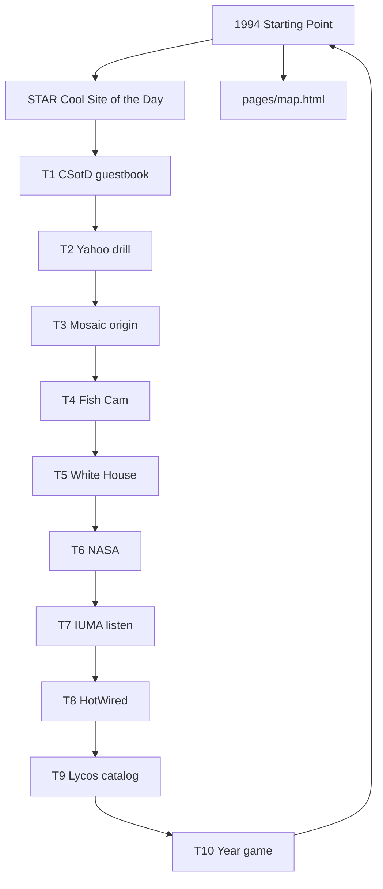

| # | Room | Path | Next | Key |
|---|---|---|---|---|
| 1 | CSotD guestbook | `sites/csotd/index.html` | Browse Yahoo · don't search | `itt94-csotd` |
| 2 | Yahoo drill | `sites/yahoo/index.html` | CERN / WWW | `—` |
| 3 | Mosaic origin | `sites/cern/index.html` | NCSA Mosaic | `—` |
| 4 | Fish Cam | `sites/fishcam/index.html` | White House | `—` |
| 5 | White House | `sites/whitehouse/index.html` | NASA | `—` |
| 6 | NASA | `sites/nasa/index.html` | IUMA | `—` |
| 7 | IUMA listen | `sites/iuma/index.html` | HotWired | `itt94-iuma` |
| 8 | HotWired | `sites/hotwired/index.html` | Lycos | `—` |
| 9 | Lycos catalog | `sites/lycos/index.html` | Cool Site of the Day | `—` |
| 10 | Year game | `sites/playable/game.html` | CSotD guestbook | `itt94-game-hotlist` |

## 1995

- **Open:** `/years/1995/` · **home:** `/years/1995/pages/home.html` · **live map:** `/years/1995/pages/map.html`
- **Star:** [SSL checkout](/years/1995/sites/amazon/ssl-checkout.html) · key `itt95-ssl-checkout`
- **Guided 6:** SSL → Amazon books → AuctionWeb → GeoCities → Yahoo/map

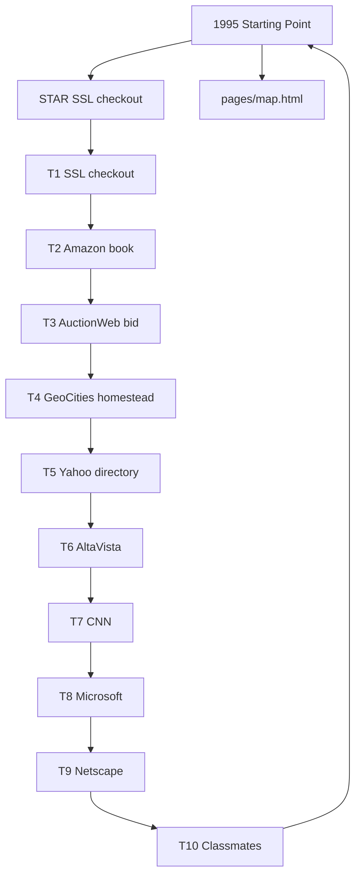

| # | Room | Path | Next | Key |
|---|---|---|---|---|
| 1 | SSL checkout | `sites/amazon/ssl-checkout.html` | Bid higher · AuctionWeb | `itt95-ssl-checkout` |
| 2 | Amazon book | `sites/amazon/index.html` | SSL checkout | `—` |
| 3 | AuctionWeb bid | `sites/auctionweb/index.html` | GeoCities homestead | `—` |
| 4 | GeoCities homestead | `sites/geocities/homestead.html` | Yahoo directory | `—` |
| 5 | Yahoo directory | `sites/yahoo/index.html` | AltaVista | `—` |
| 6 | AltaVista | `sites/altavista/index.html` | CNN | `—` |
| 7 | CNN | `sites/cnn/index.html` | Microsoft | `—` |
| 8 | Microsoft | `sites/microsoft/index.html` | Netscape | `—` |
| 9 | Netscape | `sites/netscape/index.html` | Amazon books | `—` |
| 10 | Classmates | `sites/classmates/index.html` | SSL checkout | `—` |

## 1996

- **Open:** `/years/1996/` · **home:** `/years/1996/pages/home.html` · **live map:** `/years/1996/pages/map.html`
- **Star:** [Portal wars](/years/1996/sites/portals/wars.html) · key `itt96-portal-wars`
- **Guided 6:** Portal wars → HoTMaiL → Space Jam → My Yahoo → GeoCities → map

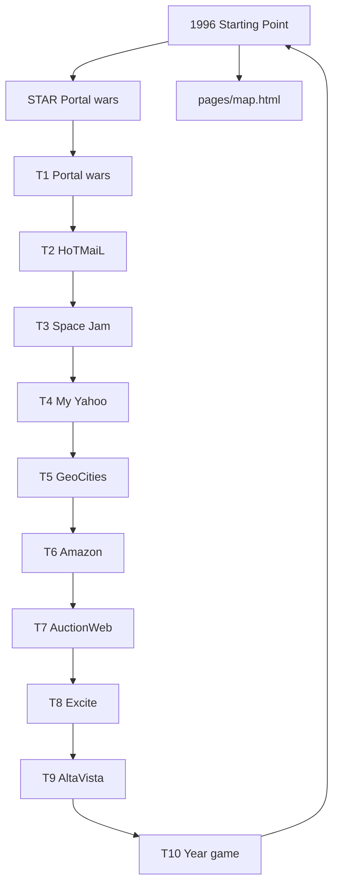

| # | Room | Path | Next | Key |
|---|---|---|---|---|
| 1 | Portal wars | `sites/portals/wars.html` | HoTMaiL | `itt96-portal-wars` |
| 2 | HoTMaiL | `sites/hotmail/index.html` | Space Jam | `—` |
| 3 | Space Jam | `sites/spacejam/index.html` | My Yahoo! | `—` |
| 4 | My Yahoo | `sites/yahoo/my.html` | GeoCities | `—` |
| 5 | GeoCities | `sites/geocities/index.html` | Amazon | `—` |
| 6 | Amazon | `sites/amazon/index.html` | AuctionWeb | `—` |
| 7 | AuctionWeb | `sites/auctionweb/index.html` | Excite | `—` |
| 8 | Excite | `sites/excite/index.html` | AltaVista | `—` |
| 9 | AltaVista | `sites/altavista/index.html` | Portal wars | `—` |
| 10 | Year game | `sites/playable/game.html` | Portal wars | `itt96-game-planets` |

## 1997

- **Open:** `/years/1997/` · **home:** `/years/1997/pages/home.html` · **live map:** `/years/1997/pages/map.html`
- **Star:** [PointCast](/years/1997/sites/pointcast/index.html) · key `itt97-pointcast`
- **Guided 6:** PointCast → ICQ → eBay laptop → HoTMaiL → Slashdot → map

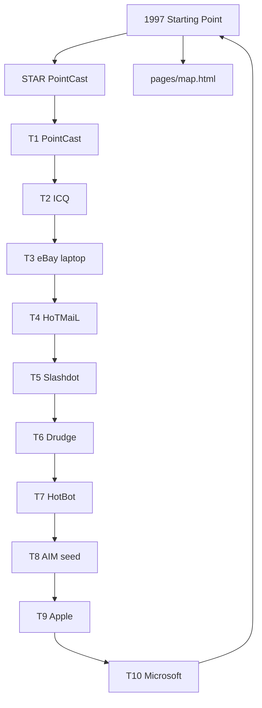

| # | Room | Path | Next | Key |
|---|---|---|---|---|
| 1 | PointCast | `sites/pointcast/index.html` | ICQ sign-on | `itt97-pointcast` |
| 2 | ICQ | `sites/icq/index.html` | eBay laptop | `—` |
| 3 | eBay laptop | `sites/ebay/item-laptop.html` | HoTMaiL | `—` |
| 4 | HoTMaiL | `sites/hotmail/index.html` | Slashdot | `—` |
| 5 | Slashdot | `sites/slashdot/index.html` | Drudge | `—` |
| 6 | Drudge | `sites/drudge/index.html` | HotBot | `—` |
| 7 | HotBot | `sites/hotbot/index.html` | AIM seed | `—` |
| 8 | AIM seed | `sites/aim/index.html` | Apple | `—` |
| 9 | Apple | `sites/apple/index.html` | IE 4 | `—` |
| 10 | Microsoft | `sites/microsoft/index.html` | PointCast | `—` |

## 1998

- **Open:** `/years/1998/` · **home:** `/years/1998/pages/home.html` · **live map:** `/years/1998/pages/map.html`
- **Star:** [I'm Feeling Lucky](/years/1998/sites/google/lucky.html) · key `itt98-lucky`
- **Guided 6:** Lucky → Google → Yahoo → Amazon Music → eBay → map

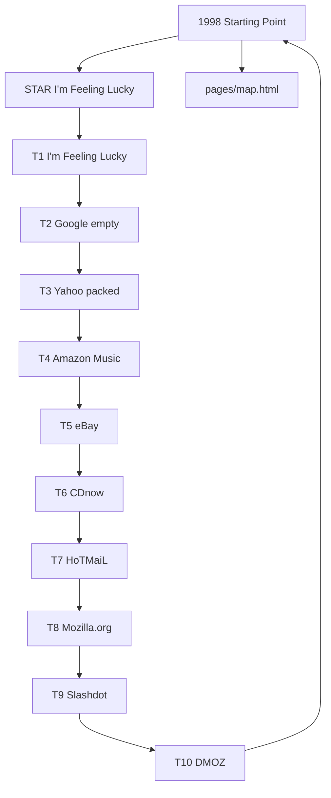

| # | Room | Path | Next | Key |
|---|---|---|---|---|
| 1 | I'm Feeling Lucky | `sites/google/lucky.html` | Yahoo packed portal | `itt98-lucky` |
| 2 | Google empty | `sites/google/index.html` | I'm Feeling Lucky | `—` |
| 3 | Yahoo packed | `sites/yahoo/index.html` | Amazon Music | `—` |
| 4 | Amazon Music | `sites/amazon/music.html` | eBay | `—` |
| 5 | eBay | `sites/ebay/index.html` | CDnow | `—` |
| 6 | CDnow | `sites/cdnow/index.html` | HoTMaiL | `—` |
| 7 | HoTMaiL | `sites/hotmail/index.html` | Mozilla.org | `—` |
| 8 | Mozilla.org | `sites/mozilla/index.html` | Slashdot | `—` |
| 9 | Slashdot | `sites/slashdot/index.html` | Open Directory | `—` |
| 10 | DMOZ | `sites/dmoz/index.html` | I'm Feeling Lucky | `—` |

## 1999

- **Open:** `/years/1999/` · **home:** `/years/1999/pages/home.html` · **live map:** `/years/1999/pages/map.html`
- **Star:** [AIM Buddy List](/years/1999/sites/aim/index.html) · key `itt99-aim`
- **Guided 6:** AIM → Napster → Google → Blogger → Y2K → map

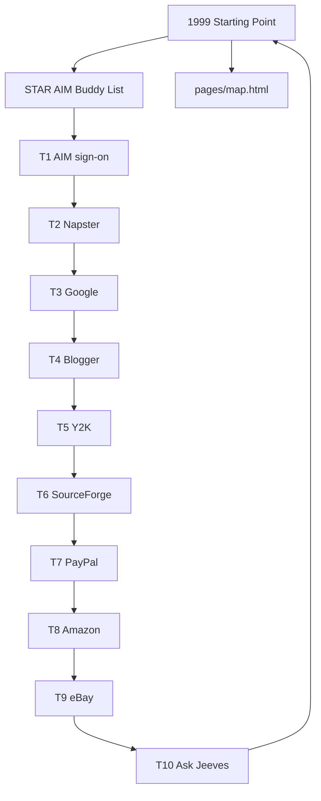

| # | Room | Path | Next | Key |
|---|---|---|---|---|
| 1 | AIM sign-on | `sites/aim/index.html` | Napster | `itt99-aim` |
| 2 | Napster | `sites/napster/index.html` | Google | `—` |
| 3 | Google | `sites/google/index.html` | Blogger | `—` |
| 4 | Blogger | `sites/blogger/edit.html` | Y2K | `—` |
| 5 | Y2K | `sites/y2k/index.html` | SourceForge | `—` |
| 6 | SourceForge | `sites/sourceforge/index.html` | PayPal | `—` |
| 7 | PayPal | `sites/paypal/index.html` | Amazon | `—` |
| 8 | Amazon | `sites/amazon/index.html` | eBay | `—` |
| 9 | eBay | `sites/ebay/index.html` | Ask Jeeves | `—` |
| 10 | Ask Jeeves | `sites/askjeeves/index.html` | AIM | `—` |

## 2000

- **Open:** `/years/2000/` · **home:** `/years/2000/pages/home.html` · **live map:** `/years/2000/pages/map.html`
- **Star:** [MapQuest directions](/years/2000/sites/mapquest/index.html) · key `itt00-mapquest`
- **Guided 6:** MapQuest → Amazon smile → Napster → Pets.com/Google → map

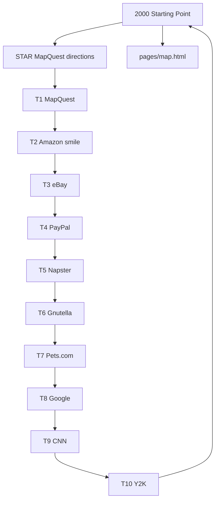

| # | Room | Path | Next | Key |
|---|---|---|---|---|
| 1 | MapQuest | `sites/mapquest/index.html` | Amazon smile | `itt00-mapquest` |
| 2 | Amazon smile | `sites/amazon/index.html` | eBay | `—` |
| 3 | eBay | `sites/ebay/index.html` | PayPal | `—` |
| 4 | PayPal | `sites/paypal/index.html` | Napster | `—` |
| 5 | Napster | `sites/napster/index.html` | Gnutella | `—` |
| 6 | Gnutella | `sites/gnutella/index.html` | Pets.com | `—` |
| 7 | Pets.com | `sites/pets/index.html` | Google | `—` |
| 8 | Google | `sites/google/index.html` | CNN | `—` |
| 9 | CNN | `sites/cnn/index.html` | Blogger | `—` |
| 10 | Y2K | `sites/y2k/index.html` | MapQuest | `—` |

## 2001

- **Open:** `/years/2001/` · **home:** `/years/2001/pages/home.html` · **live map:** `/years/2001/pages/map.html`
- **Star:** [MSN Messenger](/years/2001/sites/msn/index.html) · key `itt01-msn`
- **Guided 6:** MSN → Wikipedia edit → iPod → Wayback → IE6 → map

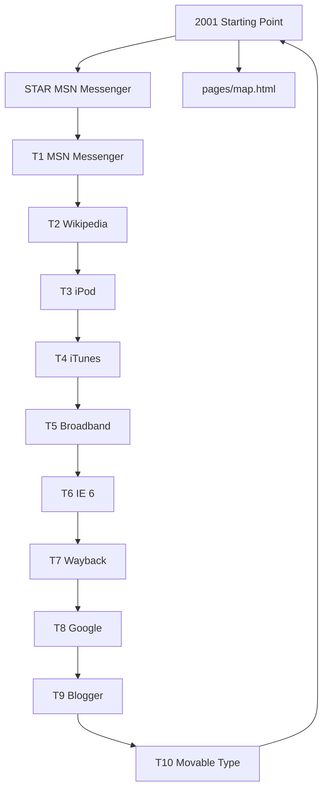

| # | Room | Path | Next | Key |
|---|---|---|---|---|
| 1 | MSN Messenger | `sites/msn/index.html` | Wikipedia edit | `itt01-msn` |
| 2 | Wikipedia | `sites/wikipedia/edit.html` | iPod | `—` |
| 3 | iPod | `sites/apple/ipod.html` | iTunes | `—` |
| 4 | iTunes | `sites/apple/itunes.html` | Broadband | `—` |
| 5 | Broadband | `sites/broadband/index.html` | IE 6 | `—` |
| 6 | IE 6 | `sites/microsoft/ie6.html` | Wayback | `—` |
| 7 | Wayback | `sites/wayback/index.html` | Google | `—` |
| 8 | Google | `sites/google/index.html` | Amazon smile | `—` |
| 9 | Blogger | `sites/blogger/index.html` | Movable Type | `—` |
| 10 | Movable Type | `sites/movabletype/index.html` | MSN Messenger | `—` |

## 2002

- **Open:** `/years/2002/` · **home:** `/years/2002/pages/home.html` · **live map:** `/years/2002/pages/map.html`
- **Star:** [StumbleUpon](/years/2002/sites/stumbleupon/index.html) · key `itt02-stumble`
- **Guided 6:** StumbleUpon → Friendster → KaZaA → Blogger/News → map

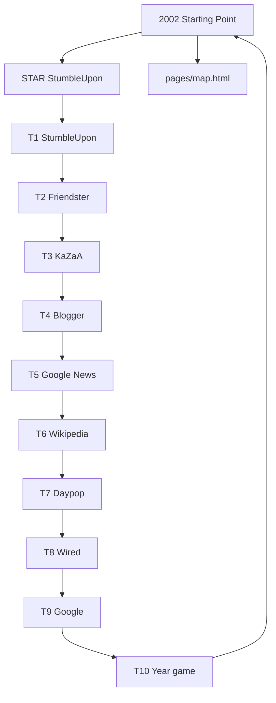

| # | Room | Path | Next | Key |
|---|---|---|---|---|
| 1 | StumbleUpon | `sites/stumbleupon/index.html` | Friendster | `itt02-stumble` |
| 2 | Friendster | `sites/friendster/index.html` | KaZaA | `—` |
| 3 | KaZaA | `sites/kazaa/index.html` | Blogger | `—` |
| 4 | Blogger | `sites/blogger/index.html` | Google News | `—` |
| 5 | Google News | `sites/googlenews/index.html` | Wikipedia | `—` |
| 6 | Wikipedia | `sites/wikipedia/index.html` | Daypop | `—` |
| 7 | Daypop | `sites/daypop/index.html` | Wired | `—` |
| 8 | Wired | `sites/wired/index.html` | Google | `—` |
| 9 | Google | `sites/google/index.html` | StumbleUpon | `—` |
| 10 | Year game | `sites/playable/game.html` | StumbleUpon | `itt02-game-roomsticky` |

## 2003

- **Open:** `/years/2003/` · **home:** `/years/2003/pages/home.html` · **live map:** `/years/2003/pages/map.html`
- **Star:** [Photobucket hotlink](/years/2003/sites/photobucket/index.html) · key `itt03-photobucket`
- **Guided 6:** Photobucket → MySpace → iTunes 99¢ → WordPress/LinkedIn → map

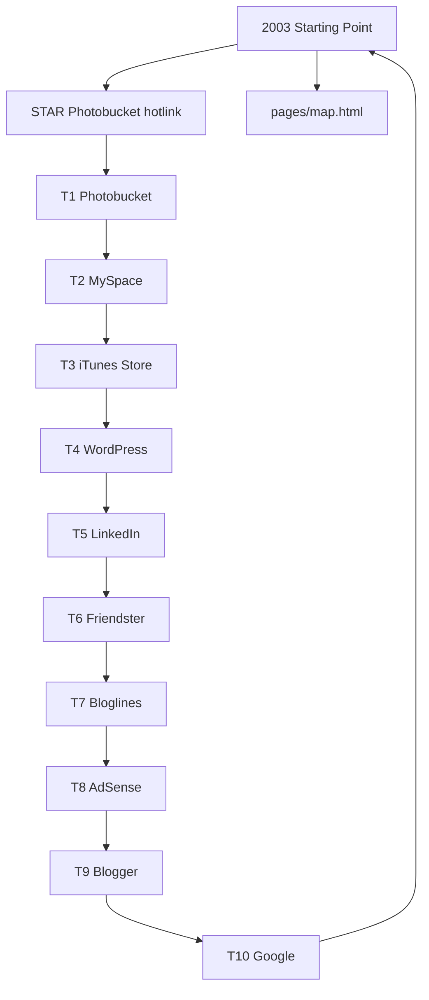

| # | Room | Path | Next | Key |
|---|---|---|---|---|
| 1 | Photobucket | `sites/photobucket/index.html` | MySpace | `itt03-photobucket` |
| 2 | MySpace | `sites/myspace/index.html` | iTunes Store 99¢ | `—` |
| 3 | iTunes Store | `sites/itunes/index.html` | WordPress | `—` |
| 4 | WordPress | `sites/wordpress/index.html` | LinkedIn | `—` |
| 5 | LinkedIn | `sites/linkedin/index.html` | Friendster | `—` |
| 6 | Friendster | `sites/friendster/index.html` | Bloglines | `—` |
| 7 | Bloglines | `sites/bloglines/index.html` | AdSense | `—` |
| 8 | AdSense | `sites/adsense/index.html` | Google | `—` |
| 9 | Blogger | `sites/blogger/index.html` | Photobucket | `—` |
| 10 | Google | `sites/google/index.html` | Photobucket | `—` |

## 2004

- **Open:** `/years/2004/` · **home:** `/years/2004/pages/home.html` · **live map:** `/years/2004/pages/map.html`
- **Star:** [thefacebook networks](/years/2004/sites/facebook/networks.html) · key `itt04-thefacebook-networks`
- **Guided 6:** networks → Firefox 1.0 → Gmail → Flickr/thefacebook → map

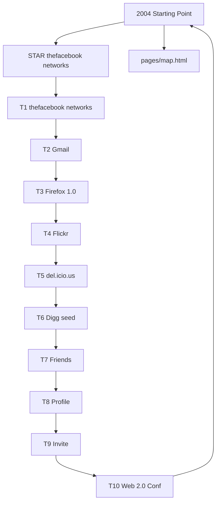

| # | Room | Path | Next | Key |
|---|---|---|---|---|
| 1 | thefacebook networks | `sites/facebook/networks.html` | Gmail 1 GB | `itt04-thefacebook-networks` |
| 2 | Gmail | `sites/gmail/index.html` | Firefox 1.0 | `—` |
| 3 | Firefox 1.0 | `sites/firefox/index.html` | Flickr | `—` |
| 4 | Flickr | `sites/flickr/index.html` | del.icio.us | `—` |
| 5 | del.icio.us | `sites/delicious/index.html` | Digg seed | `—` |
| 6 | Digg seed | `sites/digg/index.html` | Friends | `—` |
| 7 | Friends | `sites/facebook/friends.html` | Profile | `—` |
| 8 | Profile | `sites/facebook/profile.html` | Invite | `—` |
| 9 | Invite | `sites/facebook/invite.html` | Gmail | `—` |
| 10 | Web 2.0 Conf | `sites/web20conference/index.html` | thefacebook | `—` |

## 2005

- **Open:** `/years/2005/` · **home:** `/years/2005/pages/home.html` · **live map:** `/years/2005/pages/map.html`
- **Star:** [Pandora Radio](/years/2005/sites/pandora/index.html) · key `itt05-pandora`
- **Guided 6:** Pandora → YouTube → Maps → Reddit/Digg → map

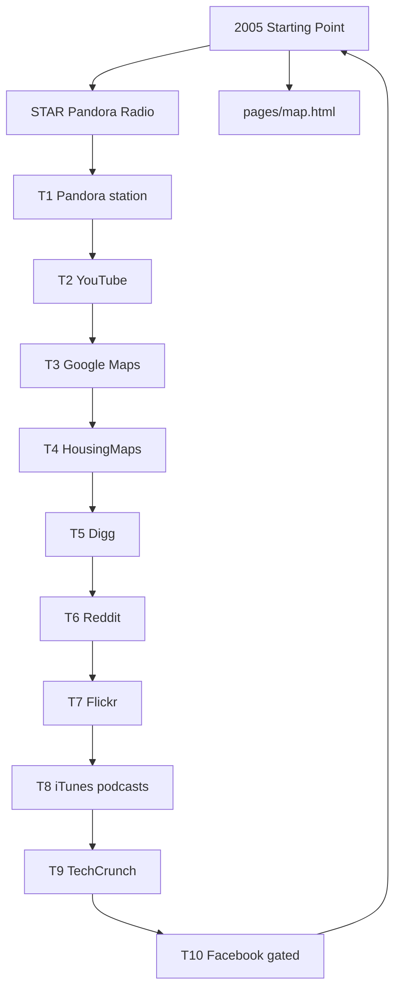

| # | Room | Path | Next | Key |
|---|---|---|---|---|
| 1 | Pandora station | `sites/pandora/index.html` | Broadcast Yourself | `itt05-pandora` |
| 2 | YouTube | `sites/youtube/index.html` | Google Maps | `itt05-yt-uploads` |
| 3 | Google Maps | `sites/maps/index.html` | HousingMaps | `—` |
| 4 | HousingMaps | `sites/housingmaps/index.html` | Digg | `—` |
| 5 | Digg | `sites/digg/index.html` | Reddit | `—` |
| 6 | Reddit | `sites/reddit/index.html` | Flickr | `—` |
| 7 | Flickr | `sites/flickr/index.html` | del.icio.us | `—` |
| 8 | iTunes podcasts | `sites/itunes/index.html` | TechCrunch | `—` |
| 9 | TechCrunch | `sites/techcrunch/index.html` | Pandora | `—` |
| 10 | Facebook gated | `sites/facebook/index.html` | YouTube | `—` |

## 2006

- **Open:** `/years/2006/` · **home:** `/years/2006/pages/home.html` · **live map:** `/years/2006/pages/map.html`
- **Star:** [Twitter 140](/years/2006/sites/twitter/index.html) · key `itt06-tweets`
- **Guided 6:** Twitter 140 → News Feed → YouTube → Digg/Reddit → map

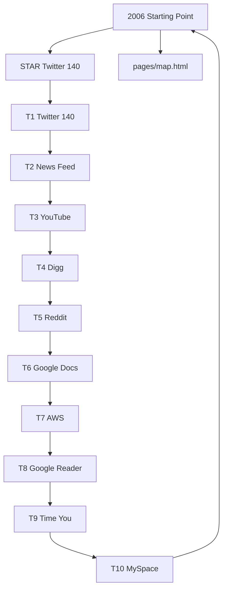

| # | Room | Path | Next | Key |
|---|---|---|---|---|
| 1 | Twitter 140 | `sites/twitter/index.html` | News Feed | `itt06-tweets` |
| 2 | News Feed | `sites/facebook/index.html` | YouTube | `—` |
| 3 | YouTube | `sites/youtube/index.html` | Digg | `—` |
| 4 | Digg | `sites/digg/index.html` | Reddit | `—` |
| 5 | Reddit | `sites/reddit/index.html` | Google Docs | `—` |
| 6 | Google Docs | `sites/docs/index.html` | AWS | `—` |
| 7 | AWS | `sites/aws/index.html` | Google Reader | `—` |
| 8 | Google Reader | `sites/reader/index.html` | Time You | `—` |
| 9 | Time You | `sites/time-you/index.html` | Twitter | `—` |
| 10 | MySpace | `sites/myspace/index.html` | Twitter | `—` |

## 2007

- **Open:** `/years/2007/` · **home:** `/years/2007/pages/home.html` · **live map:** `/years/2007/pages/map.html`
- **Star:** [iPhone Safari](/years/2007/sites/iphone/index.html) · key `itt07-iphone`
- **Guided 6:** iPhone Safari → Street View → Gmail open → Beacon → map

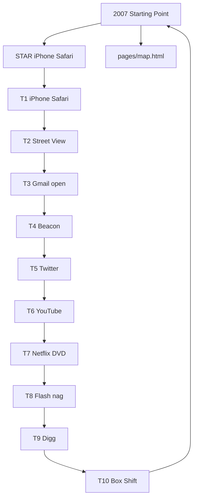

| # | Room | Path | Next | Key |
|---|---|---|---|---|
| 1 | iPhone Safari | `sites/iphone/index.html` | Street View | `itt07-iphone` |
| 2 | Street View | `sites/maps/index.html` | Gmail open | `—` |
| 3 | Gmail open | `sites/gmail/index.html` | Beacon | `—` |
| 4 | Beacon | `sites/facebook/beacon.html` | Twitter | `—` |
| 5 | Twitter | `sites/twitter/index.html` | YouTube | `—` |
| 6 | YouTube | `sites/youtube/index.html` | Netflix DVD | `—` |
| 7 | Netflix DVD | `sites/netflix/index.html` | iPhone Safari | `—` |
| 8 | Flash nag | `sites/flashplayer/index.html` | iPhone Safari | `—` |
| 9 | Digg | `sites/digg/index.html` | iPhone Safari | `—` |
| 10 | Box Shift | `sites/playable/game.html` | iPhone Safari | `itt07-game-boxshift` |

## 2008

- **Open:** `/years/2008/` · **home:** `/years/2008/pages/home.html` · **live map:** `/years/2008/pages/map.html`
- **Star:** [GitHub issue](/years/2008/sites/github/issue.html) · key `itt08-github`
- **Guided 6:** GitHub → App Store → Chrome → Android G1 → map

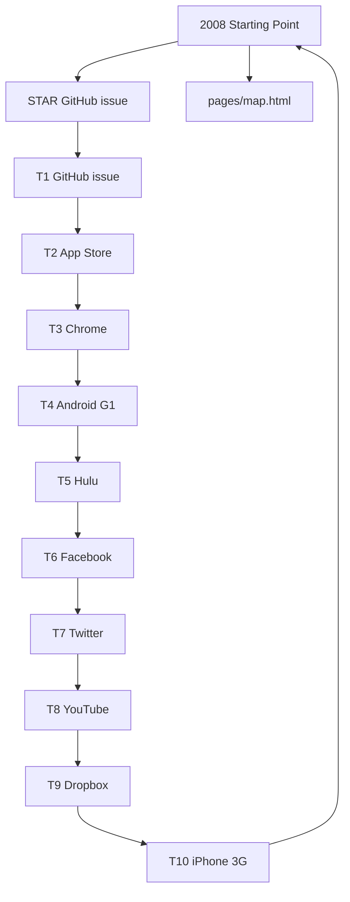

| # | Room | Path | Next | Key |
|---|---|---|---|---|
| 1 | GitHub issue | `sites/github/issue.html` | App Store | `itt08-github` |
| 2 | App Store | `sites/appstore/index.html` | Chrome | `—` |
| 3 | Chrome | `sites/chrome/index.html` | Android G1 | `—` |
| 4 | Android G1 | `sites/android/index.html` | Hulu | `—` |
| 5 | Hulu | `sites/hulu/index.html` | Facebook | `—` |
| 6 | Facebook | `sites/facebook/index.html` | Twitter | `—` |
| 7 | Twitter | `sites/twitter/index.html` | YouTube | `—` |
| 8 | YouTube | `sites/youtube/index.html` | Dropbox | `—` |
| 9 | Dropbox | `sites/dropbox/index.html` | iPhone 3G | `—` |
| 10 | iPhone 3G | `sites/iphone/index.html` | GitHub issue | `—` |

## 2009

- **Open:** `/years/2009/` · **home:** `/years/2009/pages/home.html` · **live map:** `/years/2009/pages/map.html`
- **Star:** [Facebook Like](/years/2009/sites/facebook/feed.html) · key `itt09-fb-likes`
- **Guided 6:** Like → FarmVille → Stack Overflow → Bing → map

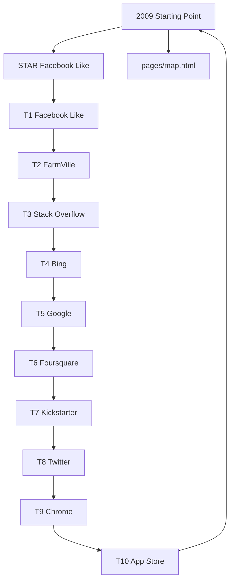

| # | Room | Path | Next | Key |
|---|---|---|---|---|
| 1 | Facebook Like | `sites/facebook/feed.html` | FarmVille | `itt09-fb-likes` |
| 2 | FarmVille | `sites/farmville/index.html` | Stack Overflow | `—` |
| 3 | Stack Overflow | `sites/stackoverflow/index.html` | Bing | `—` |
| 4 | Bing | `sites/bing/index.html` | Google | `—` |
| 5 | Google | `sites/google/index.html` | Foursquare | `—` |
| 6 | Foursquare | `sites/foursquare/index.html` | Kickstarter | `—` |
| 7 | Kickstarter | `sites/kickstarter/index.html` | Twitter | `—` |
| 8 | Twitter | `sites/twitter/index.html` | Chrome | `—` |
| 9 | Chrome | `sites/chrome/index.html` | App Store | `—` |
| 10 | App Store | `sites/appstore/index.html` | Facebook Like | `—` |

## 2010

- **Open:** `/years/2010/` · **home:** `/years/2010/pages/home.html` · **live map:** `/years/2010/pages/map.html`
- **Star:** [Imgur](/years/2010/sites/imgur/index.html) · key `itt10-imgur`
- **Guided 6:** Imgur → Reddit → Instagram → iPad → map

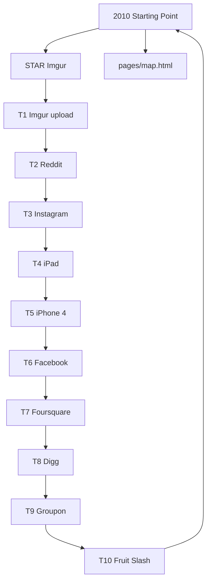

| # | Room | Path | Next | Key |
|---|---|---|---|---|
| 1 | Imgur upload | `sites/imgur/index.html` | Reddit | `itt10-imgur` |
| 2 | Reddit | `sites/reddit/index.html` | Instagram | `—` |
| 3 | Instagram | `sites/instagram/index.html` | iPad | `—` |
| 4 | iPad | `sites/ipad/index.html` | iPhone 4 | `—` |
| 5 | iPhone 4 | `sites/iphone/index.html` | Facebook | `—` |
| 6 | Facebook | `sites/facebook/index.html` | Foursquare | `—` |
| 7 | Foursquare | `sites/foursquare/index.html` | Digg | `—` |
| 8 | Digg | `sites/digg/index.html` | Groupon | `—` |
| 9 | Groupon | `sites/groupon/index.html` | Fruit Slash | `—` |
| 10 | Fruit Slash | `sites/playable/fruit.html` | Imgur | `itt10-game-fruit` |

## 2011

- **Open:** `/years/2011/` · **home:** `/years/2011/pages/home.html` · **live map:** `/years/2011/pages/map.html`
- **Star:** [Airbnb](/years/2011/sites/airbnb/index.html) · key `itt11-airbnb`
- **Guided 6:** Airbnb → Timeline → Spotify US → Siri → map

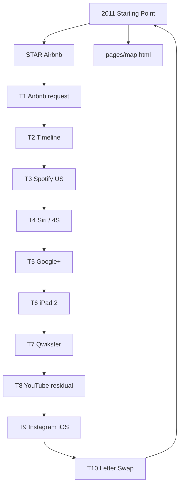

| # | Room | Path | Next | Key |
|---|---|---|---|---|
| 1 | Airbnb request | `sites/airbnb/index.html` | Timeline · JSON, not 1 | `itt11-airbnb` |
| 2 | Timeline | `sites/facebook/timeline.html` | Spotify US | `itt11-fb-timeline` |
| 3 | Spotify US | `sites/spotify/index.html` | Siri on 4S | `itt11-spotify-plan` |
| 4 | Siri / 4S | `sites/iphone/index.html` | Google+ | `—` |
| 5 | Google+ | `sites/googleplus/index.html` | iPad 2 | `—` |
| 6 | iPad 2 | `sites/ipad/index.html` | Qwikster | `—` |
| 7 | Qwikster | `sites/netflix/qwikster.html` | YouTube residual | `itt11-qwikster` |
| 8 | YouTube residual | `sites/youtube/index.html` | Instagram iOS | `itt11-yt-did-upload` |
| 9 | Instagram iOS | `sites/instagram/index.html` | Twitch / Justin.tv | `—` |
| 10 | Letter Swap | `sites/playable/game.html` | Airbnb request | `itt11-game-letterswap` |

## 2012

- **Open:** `/years/2012/` · **home:** `/years/2012/pages/home.html` · **live map:** `/years/2012/pages/map.html`
- **Star:** [SoundCloud](/years/2012/sites/soundcloud/index.html) · key `itt12-soundcloud`
- **Guided 6:** SoundCloud → IG Android → FB IPO → SOPA → map

```mermaid
flowchart TD
  H2012["2012 Starting Point"] --> S2012["STAR SoundCloud"]
  H2012 --> M2012["pages/map.html"]
  S2012 --> y2012t1["T1 SoundCloud"]
  y2012t1["T1 SoundCloud"] --> y2012t2["T2 IG Android"]
  y2012t2["T2 IG Android"] --> y2012t3["T3 Facebook IPO"]
  y2012t3["T3 Facebook IPO"] --> y2012t4["T4 SOPA blackout"]
  y2012t4["T4 SOPA blackout"] --> y2012t5["T5 Reddit AMA"]
  y2012t5["T5 Reddit AMA"] --> y2012t6["T6 iPhone 5"]
  y2012t6["T6 iPhone 5"] --> y2012t7["T7 Windows 8"]
  y2012t7["T7 Windows 8"] --> y2012t8["T8 Pinterest"]
  y2012t8["T8 Pinterest"] --> y2012t9["T9 Uber seed"]
  y2012t9["T9 Uber seed"] --> y2012t10["T10 Guess Doodle"]
  y2012t10 --> H2012
```

| # | Room | Path | Next | Key |
|---|---|---|---|---|
| 1 | SoundCloud | `sites/soundcloud/index.html` | Instagram Android | `itt12-soundcloud` |
| 2 | IG Android | `sites/instagram/android.html` | FB buys IG | `itt12-ig-android` |
| 3 | Facebook IPO | `sites/facebook/ipo.html` | SOPA blackout | `—` |
| 4 | SOPA blackout | `sites/wikipedia/sopa-blackout.html` | Obama AMA | `—` |
| 5 | Reddit AMA | `sites/reddit/ama.html` | iPhone 5 | `—` |
| 6 | iPhone 5 | `sites/iphone/index.html` | iPad mini | `—` |
| 7 | Windows 8 | `sites/windows8/index.html` | Chrome | `—` |
| 8 | Pinterest | `sites/pinterest/index.html` | Snap seed | `—` |
| 9 | Uber seed | `sites/uber/index.html` | SoundCloud | `—` |
| 10 | Guess Doodle | `sites/playable/game.html` | SoundCloud | `itt12-game-guessdoodle` |

## 2013

- **Open:** `/years/2013/` · **home:** `/years/2013/pages/home.html` · **live map:** `/years/2013/pages/map.html`
- **Star:** [Vine 6s](/years/2013/sites/vine/record.html) · key `itt13-vine-posts`
- **Guided 6:** Vine → IG Video → Snap Stories → iOS 7/Touch ID → Snowden

```mermaid
flowchart TD
  H2013["2013 Starting Point"] --> S2013["STAR Vine 6s"]
  H2013 --> M2013["pages/map.html"]
  S2013 --> y2013t1["T1 Vine hold"]
  y2013t1["T1 Vine hold"] --> y2013t2["T2 IG Video"]
  y2013t2["T2 IG Video"] --> y2013t3["T3 Snap Stories"]
  y2013t3["T3 Snap Stories"] --> y2013t4["T4 iOS 7"]
  y2013t4["T4 iOS 7"] --> y2013t5["T5 Touch ID"]
  y2013t5["T5 Touch ID"] --> y2013t6["T6 Snowden"]
  y2013t6["T6 Snowden"] --> y2013t7["T7 WhatsApp"]
  y2013t7["T7 WhatsApp"] --> y2013t8["T8 Telegram"]
  y2013t8["T8 Telegram"] --> y2013t9["T9 HealthCare.gov"]
  y2013t9["T9 HealthCare.gov"] --> y2013t10["T10 Pipe Hop"]
  y2013t10 --> H2013
```

| # | Room | Path | Next | Key |
|---|---|---|---|---|
| 1 | Vine hold | `sites/vine/record.html` | IG Video 15s | `itt13-vine-posts` |
| 2 | IG Video | `sites/instagram/video.html` | Snap Stories | `—` |
| 3 | Snap Stories | `sites/snapchat/story.html` | iOS 7 | `—` |
| 4 | iOS 7 | `sites/iphone/ios7.html` | Touch ID | `—` |
| 5 | Touch ID | `sites/iphone/touchid.html` | Snowden / PRISM | `—` |
| 6 | Snowden | `sites/snowden/index.html` | WhatsApp pre-FB | `—` |
| 7 | WhatsApp | `sites/whatsapp/index.html` | Telegram | `—` |
| 8 | Telegram | `sites/telegram/index.html` | HealthCare.gov | `—` |
| 9 | HealthCare.gov | `sites/healthcare/index.html` | Pipe Hop | `—` |
| 10 | Pipe Hop | `sites/playable/game.html` | Vine hold | `itt13-game-pipehop` |

## 2014

- **Open:** `/years/2014/` · **home:** `/years/2014/pages/home.html` · **live map:** `/years/2014/pages/map.html`
- **Star:** [WhatsApp deal + chat](/years/2014/sites/whatsapp/index.html) · key `itt14-wa-install`
- **Guided 6:** WhatsApp → Heartbleed → iPhone 6 → Ice Bucket → map

```mermaid
flowchart TD
  H2014["2014 Starting Point"] --> S2014["STAR WhatsApp deal + chat"]
  H2014 --> M2014["pages/map.html"]
  S2014 --> y2014t1["T1 WhatsApp install"]
  y2014t1["T1 WhatsApp install"] --> y2014t2["T2 WhatsApp chat"]
  y2014t2["T2 WhatsApp chat"] --> y2014t3["T3 Heartbleed"]
  y2014t3["T3 Heartbleed"] --> y2014t4["T4 iPhone 6"]
  y2014t4["T4 iPhone 6"] --> y2014t5["T5 Apple Pay"]
  y2014t5["T5 Apple Pay"] --> y2014t6["T6 Ice Bucket"]
  y2014t6["T6 Ice Bucket"] --> y2014t7["T7 Serial"]
  y2014t7["T7 Serial"] --> y2014t8["T8 Slack"]
  y2014t8["T8 Slack"] --> y2014t9["T9 1B websites"]
  y2014t9["T9 1B websites"] --> y2014t10["T10 Tile Fold"]
  y2014t10 --> H2014
```

| # | Room | Path | Next | Key |
|---|---|---|---|---|
| 1 | WhatsApp install | `sites/whatsapp/index.html` | WhatsApp chat | `itt14-wa-install` |
| 2 | WhatsApp chat | `sites/whatsapp/chat.html` | Heartbleed rotate | `itt14-wa-msgs` |
| 3 | Heartbleed | `sites/heartbleed/rotate.html` | iPhone 6 | `itt14-heartbleed-rotate` |
| 4 | iPhone 6 | `sites/iphone/index.html` | Apple Pay | `—` |
| 5 | Apple Pay | `sites/iphone/pay.html` | Ice Bucket | `—` |
| 6 | Ice Bucket | `sites/icebucket/index.html` | Serial | `—` |
| 7 | Serial | `sites/serial/index.html` | Slack public | `—` |
| 8 | Slack | `sites/slack/index.html` | 1B websites | `itt14-slack` |
| 9 | 1B websites | `sites/billion/index.html` | Tile Fold | `—` |
| 10 | Tile Fold | `sites/playable/game.html` | WhatsApp | `itt14-game-tilefold` |

## 2015

- **Open:** `/years/2015/` · **home:** `/years/2015/pages/home.html` · **live map:** `/years/2015/pages/map.html`
- **Star:** [Apple Watch Apr 24](/years/2015/sites/apple/watch.html) · key `itt15-watch`
- **Guided 6:** Watch → Win10 → Periscope → Music/blockers → map
- **Check these new / repaired hops first:**
  - Continuity archive to 2014 P0 is residual, not spine

```mermaid
flowchart TD
  H2015["2015 Starting Point"] --> S2015["STAR Apple Watch Apr 24"]
  H2015 --> M2015["pages/map.html"]
  S2015 --> y2015t1["T1 Apple Watch"]
  y2015t1["T1 Apple Watch"] --> y2015t2["T2 Win10"]
  y2015t2["T2 Win10"] --> y2015t3["T3 Periscope"]
  y2015t3["T3 Periscope"] --> y2015t4["T4 Meerkat"]
  y2015t4["T4 Meerkat"] --> y2015t5["T5 Apple Music"]
  y2015t5["T5 Apple Music"] --> y2015t6["T6 Blockers"]
  y2015t6["T6 Blockers"] --> y2015t7["T7 Google Photos"]
  y2015t7["T7 Google Photos"] --> y2015t8["T8 Discord"]
  y2015t8["T8 Discord"] --> y2015t9["T9 Facebook Live"]
  y2015t9["T9 Facebook Live"] --> y2015t10["T10 Blob Rush"]
  y2015t10 --> H2015
```

| # | Room | Path | Next | Key |
|---|---|---|---|---|
| 1 | Apple Watch | `sites/apple/watch.html` | Win10 free upgrade | `itt15-watch` |
| 2 | Win10 | `sites/windows10/index.html` | Periscope | `—` |
| 3 | Periscope | `sites/periscope/index.html` | Meerkat | `—` |
| 4 | Meerkat | `sites/meerkat/index.html` | Apple Music | `—` |
| 5 | Apple Music | `sites/applemusic/index.html` | Content blockers | `—` |
| 6 | Blockers | `sites/ios9/blockers.html` | Google Photos | `—` |
| 7 | Google Photos | `sites/googlephotos/index.html` | Discord | `—` |
| 8 | Discord | `sites/discord/index.html` | Facebook Live | `—` |
| 9 | Facebook Live | `sites/fblive/index.html` | Apple Watch | `—` |
| 10 | Blob Rush | `sites/playable/game.html` | Apple Watch | `itt15-game-blobrush` |

## 2016

- **Open:** `/years/2016/` · **home:** `/years/2016/pages/home.html` · **live map:** `/years/2016/pages/map.html`
- **Star:** [Instagram Stories Aug 2](/years/2016/sites/instagram/stories.html) · key `itt16-ig-stories`
- **Guided 6:** Stories → PoGO → Reactions → Vine/jack → map
- **Check these new / repaired hops first:**
  - NEW Next chain: musical.ly → Dyn → STEM → Jio → Marketplace → Reactions (Stories stays star)
  - Marketplace Next first hop is reactions.html (not Stories)
  - Harvest rooms: Live, AMP SERP, FB Live, Pixel, Home, Spectacles

```mermaid
flowchart TD
  H2016["2016 Starting Point"] --> S2016["STAR Instagram Stories Aug 2"]
  H2016 --> M2016["pages/map.html"]
  S2016 --> y2016t1["T1 IG Stories"]
  y2016t1["T1 IG Stories"] --> y2016t2["T2 Pokémon GO"]
  y2016t2["T2 Pokémon GO"] --> y2016t3["T3 Reactions"]
  y2016t3["T3 Reactions"] --> y2016t4["T4 Jack / AirPods"]
  y2016t4["T4 Jack / AirPods"] --> y2016t5["T5 AirPods"]
  y2016t5["T5 AirPods"] --> y2016t6["T6 Vine goodbye"]
  y2016t6["T6 Vine goodbye"] --> y2016t7["T7 musical.ly"]
  y2016t7["T7 musical.ly"] --> y2016t8["T8 WhatsApp E2E"]
  y2016t8["T8 WhatsApp E2E"] --> y2016t9["T9 Dyn"]
  y2016t9["T9 Dyn"] --> y2016t10["T10 Gym Rush"]
  y2016t10 --> H2016
```

| # | Room | Path | Next | Key |
|---|---|---|---|---|
| 1 | IG Stories | `sites/instagram/stories.html` | Pokémon GO | `itt16-ig-stories` |
| 2 | Pokémon GO | `sites/pokemongo/index.html` | Reactions | `itt16-pogo` |
| 3 | Reactions | `sites/facebook/reactions.html` | Jack death | `itt16-reactions` |
| 4 | Jack / AirPods | `sites/iphone/jack.html` | AirPods | `itt16-iphone7-jack` |
| 5 | AirPods | `sites/airpods/index.html` | Vine goodbye | `itt16-airpods` |
| 6 | Vine goodbye | `sites/vine/goodbye.html` | musical.ly | `itt16-vine-end` |
| 7 | musical.ly | `sites/musically/create.html` | WhatsApp E2E | `itt16-musically` |
| 8 | WhatsApp E2E | `sites/whatsapp/security.html` | Dyn | `itt16-wa-e2e` |
| 9 | Dyn | `sites/dyn/index.html` | STEM | `itt16-dyn` |
| 10 | Gym Rush | `sites/playable/game.html` | IG Stories | `itt16-game-gymrush` |

## 2017

- **Open:** `/years/2017/` · **home:** `/years/2017/pages/home.html` · **live map:** `/years/2017/pages/map.html`
- **Star:** [iPhone X / Face ID](/years/2017/sites/iphone/x.html) · key `itt17-faceid`
- **Guided 6:** Face ID → Fortnite BR → Twitter 280 → WannaCry → Vine/Teams

```mermaid
flowchart TD
  H2017["2017 Starting Point"] --> S2017["STAR iPhone X / Face ID"]
  H2017 --> M2017["pages/map.html"]
  S2017 --> y2017t1["T1 Face ID / X"]
  y2017t1["T1 Face ID / X"] --> y2017t2["T2 Fortnite BR"]
  y2017t2["T2 Fortnite BR"] --> y2017t3["T3 Twitter 280"]
  y2017t3["T3 Twitter 280"] --> y2017t4["T4 WannaCry"]
  y2017t4["T4 WannaCry"] --> y2017t5["T5 Vine gone"]
  y2017t5["T5 Vine gone"] --> y2017t6["T6 Teams GA"]
  y2017t6["T6 Teams GA"] --> y2017t7["T7 Equifax"]
  y2017t7["T7 Equifax"] --> y2017t8["T8 Switch"]
  y2017t8["T8 Switch"] --> y2017t9["T9 YouTube TV"]
  y2017t9["T9 YouTube TV"] --> y2017t10["T10 Storm Circle"]
  y2017t10 --> H2017
```

| # | Room | Path | Next | Key |
|---|---|---|---|---|
| 1 | Face ID / X | `sites/iphone/x.html` | Fortnite BR | `itt17-faceid` |
| 2 | Fortnite BR | `sites/fortnite/index.html` | Twitter 280 | `itt17-fortnite` |
| 3 | Twitter 280 | `sites/twitter/280.html` | WannaCry | `itt17-twitter280` |
| 4 | WannaCry | `sites/wannacry/index.html` | Vine gone | `itt17-wannacry` |
| 5 | Vine gone | `sites/vine/gone.html` | Teams GA | `itt17-vine-gone` |
| 6 | Teams GA | `sites/teams/index.html` | Equifax | `—` |
| 7 | Equifax | `sites/equifax/index.html` | Switch | `—` |
| 8 | Switch | `sites/switch/index.html` | YouTube TV | `—` |
| 9 | YouTube TV | `sites/youtube/tv.html` | Storm Circle | `—` |
| 10 | Storm Circle | `sites/playable/game.html` | Face ID | `itt17-game-stormcircle` |

## 2018

- **Open:** `/years/2018/` · **home:** `/years/2018/pages/home.html` · **live map:** `/years/2018/pages/map.html`
- **Star:** [GDPR Manage](/years/2018/sites/gdpr/index.html) · key `itt18-gdpr`
- **Guided 6:** GDPR → TikTok FYP → Hearing → IGTV → map
- **Check these new / repaired hops first:**
  - GDPR is star; TikTok FYP is T2 not 2019 invent

```mermaid
flowchart TD
  H2018["2018 Starting Point"] --> S2018["STAR GDPR Manage"]
  H2018 --> M2018["pages/map.html"]
  S2018 --> y2018t1["T1 GDPR Manage"]
  y2018t1["T1 GDPR Manage"] --> y2018t2["T2 TikTok FYP"]
  y2018t2["T2 TikTok FYP"] --> y2018t3["T3 Hearing"]
  y2018t3["T3 Hearing"] --> y2018t4["T4 IGTV"]
  y2018t4["T4 IGTV"] --> y2018t5["T5 Chrome 68"]
  y2018t5["T5 Chrome 68"] --> y2018t6["T6 HomePod"]
  y2018t6["T6 HomePod"] --> y2018t7["T7 Fortnite Switch"]
  y2018t7["T7 Fortnite Switch"] --> y2018t8["T8 GitHub Microsoft"]
  y2018t8["T8 GitHub Microsoft"] --> y2018t9["T9 G+ sunset"]
  y2018t9["T9 G+ sunset"] --> y2018t10["T10 Consent Dash"]
  y2018t10 --> H2018
```

| # | Room | Path | Next | Key |
|---|---|---|---|---|
| 1 | GDPR Manage | `sites/gdpr/index.html` | TikTok For You | `itt18-gdpr` |
| 2 | TikTok FYP | `sites/tiktok/fyp.html` | Hearing | `itt18-tiktok-fyp` |
| 3 | Hearing | `sites/trust/index.html` | IGTV | `itt18-ca` |
| 4 | IGTV | `sites/instagram/igtv.html` | Chrome 68 | `itt18-igtv` |
| 5 | Chrome 68 | `sites/chrome/not-secure.html` | HomePod | `—` |
| 6 | HomePod | `sites/homepod/index.html` | Fortnite Switch | `—` |
| 7 | Fortnite Switch | `sites/fortnite/switch.html` | GitHub $7.5B | `—` |
| 8 | GitHub Microsoft | `sites/github/microsoft.html` | Google+ sunset | `—` |
| 9 | G+ sunset | `sites/googleplus/sunset.html` | Consent Dash | `—` |
| 10 | Consent Dash | `sites/playable/game.html` | GDPR Manage | `itt18-game-consentdash` |

## 2019

- **Open:** `/years/2019/` · **home:** `/years/2019/pages/home.html` · **live map:** `/years/2019/pages/map.html`
- **Star:** [Disney+ Who's watching](/years/2019/sites/disneyplus/home.html) · key `itt19-disneyplus`
- **Guided 6:** Disney+ home → TikTok → Arcade/TV+ → Stadia/iPhone 11 → map
- **Check these new / repaired hops first:**
  - Continuity archive on home: AirPods Pro · Chrome · Win10 · Edge preview · GDPR
  - Ten-trail 7–9: AirPods Pro → Chrome habit → Win10 residual (no Netflix/YouTube)
  - Literacy REAL now writes: Edge preview, Inbox, Huawei GMS, iPadOS, Libra, World Cup, iOS 13
  - Star is Disney+ Who's watching at sites/disneyplus/home.html

```mermaid
flowchart TD
  H2019["2019 Starting Point"] --> S2019["STAR Disney+ Who's watching"]
  H2019 --> M2019["pages/map.html"]
  S2019 --> y2019t1["T1 Disney+"]
  y2019t1["T1 Disney+"] --> y2019t2["T2 TikTok"]
  y2019t2["T2 TikTok"] --> y2019t3["T3 Arcade"]
  y2019t3["T3 Arcade"] --> y2019t4["T4 TV+"]
  y2019t4["T4 TV+"] --> y2019t5["T5 Stadia"]
  y2019t5["T5 Stadia"] --> y2019t6["T6 iPhone 11"]
  y2019t6["T6 iPhone 11"] --> y2019t7["T7 AirPods Pro"]
  y2019t7["T7 AirPods Pro"] --> y2019t8["T8 Chrome habit"]
  y2019t8["T8 Chrome habit"] --> y2019t9["T9 Windows 10 residual"]
  y2019t9["T9 Windows 10 residual"] --> y2019t10["T10 Continue Row"]
  y2019t10 --> H2019
```

| # | Room | Path | Next | Key |
|---|---|---|---|---|
| 1 | Disney+ | `sites/disneyplus/index.html` | TikTok For You | `itt19-disneyplus` |
| 2 | TikTok | `sites/tiktok/index.html` | Apple Arcade | `—` |
| 3 | Arcade | `sites/arcade/index.html` | Apple TV+ | `—` |
| 4 | TV+ | `sites/appletv/index.html` | Stadia | `—` |
| 5 | Stadia | `sites/stadia/index.html` | iPhone 11 | `—` |
| 6 | iPhone 11 | `sites/iphone/iphone11.html` | AirPods Pro | `—` |
| 7 | AirPods Pro | `sites/airpodspro/index.html` | Chrome habit | `—` |
| 8 | Chrome habit | `sites/chrome/index.html` | Windows 10 residual | `—` |
| 9 | Windows 10 residual | `sites/windows10/index.html` | Continue Row | `—` |
| 10 | Continue Row | `sites/playable/game.html` | Disney+ | `itt19-game-continuerow` |

## 2020

- **Open:** `/years/2020/` · **home:** `/years/2020/pages/home.html` · **live map:** `/years/2020/pages/map.html`
- **Star:** [Zoom join → mute → leave](/years/2020/sites/zoom/index.html) · key `itt20-zoom`
- **Guided 6:** Zoom → Reels → CCPA → Flash EOL → map
- **Check these new / repaired hops first:**
  - Do not reopen Zoom as broken; Reels is not Stories

```mermaid
flowchart TD
  H2020["2020 Starting Point"] --> S2020["STAR Zoom join → mute → leave"]
  H2020 --> M2020["pages/map.html"]
  S2020 --> y2020t1["T1 Zoom mute"]
  y2020t1["T1 Zoom mute"] --> y2020t2["T2 Reels"]
  y2020t2["T2 Reels"] --> y2020t3["T3 CCPA"]
  y2020t3["T3 CCPA"] --> y2020t4["T4 Flash EOL"]
  y2020t4["T4 Flash EOL"] --> y2020t5["T5 Edge 79"]
  y2020t5["T5 Edge 79"] --> y2020t6["T6 Shorts"]
  y2020t6["T6 Shorts"] --> y2020t7["T7 ACNH"]
  y2020t7["T7 ACNH"] --> y2020t8["T8 Astronomical"]
  y2020t8["T8 Astronomical"] --> y2020t9["T9 Meet"]
  y2020t9["T9 Meet"] --> y2020t10["T10 Sus Vote"]
  y2020t10 --> H2020
```

| # | Room | Path | Next | Key |
|---|---|---|---|---|
| 1 | Zoom mute | `sites/zoom/index.html` | Reels · Aug 5 | `itt20-zoom` |
| 2 | Reels | `sites/instagram/reels.html` | CCPA | `—` |
| 3 | CCPA | `sites/ccpa/index.html` | Flash EOL | `—` |
| 4 | Flash EOL | `sites/flash/eol.html` | Edge 79 | `—` |
| 5 | Edge 79 | `sites/edge/index.html` | YouTube Shorts | `—` |
| 6 | Shorts | `sites/youtube/shorts.html` | ACNH | `—` |
| 7 | ACNH | `sites/acnh/island.html` | Astronomical | `—` |
| 8 | Astronomical | `sites/fortnite/astronomical.html` | Meet / Teams | `—` |
| 9 | Meet | `sites/meet/index.html` | Sus Vote | `—` |
| 10 | Sus Vote | `sites/playable/game.html` | Zoom | `itt20-game-among` |

## 2016 densify Next (beyond the ten-trail)

These are the extra rooms added around Stories. Marketplace Next is **Reactions**, not the star.

```mermaid
flowchart LR
  Stories[IG Stories star] --> PoGO[Pokémon GO]
  PoGO --> Reactions[FB Reactions]
  Reactions --> Jack[iPhone 7 jack]
  Jack --> AirPods[AirPods]
  AirPods --> Vine[Vine goodbye]
  Vine --> Mly[musical.ly]
  Mly --> Dyn[Dyn / Mirai]
  Dyn --> STEM[STEM]
  STEM --> Jio[Jio Welcome Offer]
  Jio --> MP[Marketplace]
  MP --> Reactions
  Live[IG Live] --> Stories
  AMP[AMP SERP] --> Reactions
  FBLive[FB Live everyone] --> Reactions
  Pixel[Pixel] --> GHome[Google Home]
  GHome --> Pixel
```

## 2019 Continuity + literacy (beyond the ten-trail)

```mermaid
flowchart TD
  Home[2019 Starting Point] --> Star[Disney+ Who's watching]
  Home --> Cont[Continuity archive]
  Cont --> APP[AirPods Pro]
  Cont --> Chrome[Chrome habit]
  Cont --> Win10[Win10 residual · ended 2016]
  Cont --> Edge[Edge preview · ships Jan 15 2020]
  Cont --> GDPR[GDPR residual]
  Star --> TikTok[TikTok For You]
  TikTok --> Arcade[Apple Arcade]
  Arcade --> TV[Apple TV+]
  TV --> Stadia[Stadia]
  Stadia --> IP11[iPhone 11]
  IP11 --> APP
  Home --> Lit[Literacy rooms write itt19-*]
  Lit --> Edge
  Lit --> Inbox[Inbox gone]
  Lit --> Huawei[Huawei GMS]
  Lit --> iPadOS[iPadOS]
  Lit --> Libra[Libra not live]
  Lit --> WC[Fortnite World Cup]
  Lit --> iOS13[iOS 13]
```

## Fail if

- Guided list is not 6 items
- Star href 404 or two stars on home
- Map link 404 (2019 Netflix/YouTube was this class of bug)
- Empty save writes a key
- Next chip hidden after a complete REAL save
- Next first href 404
- 2016 Marketplace Next skips Facebook and jumps only to Stories
- 2019 home missing Continuity archive or `airpods` href

