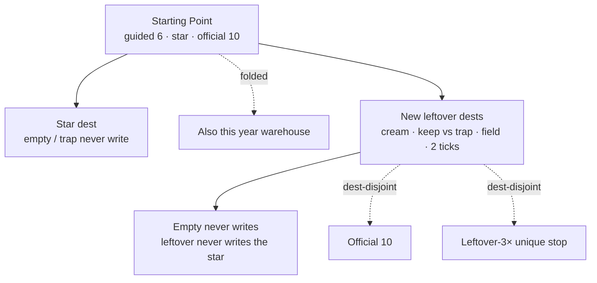

# 2015–2020 triple — criteria only

**Date:** 2026-09-20  
**Status:** Criteria. Not dest-farm. Not leftover-3× unique growth. **Do not implement dest folders from this file.**  
**Ship law:** [`DISK-TRUTH.md`](DISK-TRUTH.md).  
**Sibling:** [`LEAN-DOUBLE-CRITERIA.md`](LEAN-DOUBLE-CRITERIA.md) D1–D15. Triple inherits those rows.  
**Visitor 100%:** dest-true **flows**, not dest-folder count.

---

## 1. One-line

**Triple dest folders on 2015 / 2017 / 2019 is dest-farm.** Those years are already dest-lock-reverted warehouses. Triple leftover dests only on thin 2016 / 2018 / 2020 leftover dests, dest-disjoint from official 10 ∪ leftover-3× unique ∪ unique leftover-20. Leftover-3× unique stops stay. Unique leftover-20 stays 2017 only. Incomplete never writes. Leftover never writes the star.

Starting Point still guided **6**. Extra dests live in folded leftover dests, not first-paint dump.

---

## 2. Naive 3× (what the numbers look like if you multiply disk)

Disk now (2026-09-20). **This table is the look, not the implement map.**

| Year | Dest folders now | 3× dests | Links now | 3× links | Dest-true flows now | 3× flows | Law |
|------|-----------------:|---------:|----------:|---------:|--------------------:|---------:|-----|
| **2015** | 213 | **639** | 233 | **699** | 19 | **57** | **Stop.** Warehouse. Dest-farm. |
| **2016** | 64 | **192** | 101 | **303** | 19 | **57** | Thin leftover dests only. Do not restore 132-dest forest. 192 is denser than origin forest **82**. |
| **2017** | 222 | **666** | 265 | **795** | 10 + leftover-20 = 30 | **90** | **Stop.** Unique leftover-20 already ships. Do not dest-farm leftover-20. |
| **2018** | 26 | **78** | 17 | **51** | 13 | **39** | Leftover dests, **not** leftover-3× unique (stop **3**). GDPR Manage stays the chip. |
| **2019** | 170 | **510** | 181 | **543** | 19 | **57** | **Stop.** Warehouse. Dest-farm. |
| **2020** | 39 | **117** | 11 | **33** | 19 | **57** | Holes only unless a cited COVID-web hole. 117 is dest-farm. |
| **Sum** | 734 | **2202** | 808 | **2424** | 119 | **357** | Most of 2202 dests would be dest-farm. |

**How it would look if dest-farmed:** Starting Point dumps 200 leftover dests. 2018 looks like 2017. Visitor 100% **fails**. A year that looks full because it has 600 leftover dests has failed I/O.

---

## 3. How a legal triple would look (visitor)

First paint does **not** triple. The extra dests are leftover dest pages you open from folded leftover / leftover dest crumb. Each leftover dest is one dest / one verb / one leftover key.

| Surface | Stays | Does not become |
|---------|-------|-----------------|
| Guided Starting Point | exactly 6 `<li>` | 18 items |
| Official 10 | same dest folders · same whenKeys | official 30 |
| Leftover-3× unique | 2015=9 · 2016=9 · 2017=0 · **2018=3** · 2019=9 · 2020=9 | 27 unique leftover-3× dests |
| Unique leftover-20 | **2017 only** | leftover-20 on 2015 / 2018 / 2019 / 2020 |
| Star | one chip | leftover dest writes GDPR / Zoom / Stories / Face ID / Disney+ / Periscope |
| 2018 first paint | GDPR Manage | 78 dest dump |
| Pixels | `[failed-final]` | invented brand marks |

---

## 4. Legal leftover dest cap (thin years only)

Official 10 stays 10. Leftover-3× unique dest-true dests stay at the stop. **Aim is a cap, not a quota.** Miss the cap rather than invent.

Triple is from **origin lean dest count**, not from warehouse dest count.

| Year | Origin lean | Now | 3× origin (cap dests) | New leftover dests (cap) | Leftover-3× unique | This pass |
|------|------------:|----:|----------------------:|-------------------------:|-------------------:|-----------|
| 2015 | dest-farm 213 | 213 | — | **0** | 9 stop | **Stop.** |
| 2016 | 32 | 64 | **96** | **+32** leftover dests | 9 stop | Thin leftover dests. Not a 192 forest. |
| 2017 | dest-farm 222 | 222 | — | **0** | 0 · leftover-20 already | **Stop.** |
| 2018 | 13 | 26 | **39** | **+13** leftover dests | **3 stop** | Leftover dests, not leftover-3× unique. |
| 2019 | dest-farm 170 | 170 | — | **0** | 9 stop | **Stop.** |
| 2020 | 38 + Clubhouse hole | 39 | holes only | **0** unless a cited hole | 9 stop | **Stop** dest-farm to 117. |

If you instead triple **dest-true flows** without dest-farming leftover-3× unique: each new leftover dest is one leftover dest-true flow (empty never writes · leftover never writes the star).

| Year | Flows now | Legal leftover dest add | Flows after (cap) |
|------|----------:|------------------------:|------------------:|
| 2015 | 19 | 0 | **19** |
| 2016 | 19 | +32 leftover dests | **51** |
| 2017 | 30 | 0 | **30** |
| 2018 | 13 | +13 leftover dests | **26** |
| 2019 | 19 | 0 | **19** |
| 2020 | 19 | 0 | **19** |

Links grow with leftover dest crumbs (home · next leftover dest). They do **not** dump on Starting Point first paint.

---

## 5. Taken (do not reuse inside the year)

2016 leftover dests already on disk include the official 10, leftover-3× unique (slack reddit netflix youtube alphago assistant dyn fblive moments), and the lean-double leftover dests (douyin wikipedia twitter amazon google yahoo baidu yandex chrome github pinterest tumblr twitch discord airpods pixel nougat allo duo googlehome oculusrift psvr overwatch doom2016 uncharted4 nomanssky clashroyale signal telegram paypal applepay panamapapers).

2018 leftover dests already on disk: official 10 + leftover-3× unique reddit youtube wikipedia + lean-double leftover dests facebook twitter amazon google yahoo baidu yandex netflix snapchat discord gplusgone androidpie ios12.

2020 leftover dests already on disk include official 10 + leftover-3× unique 9 + Clubhouse hole.

Star traps: 2016 Reels · 2018 Accept All · 2020 ChatGPT dest.

---

## 6. Sequence

| Step | What | When |
|------|------|------|
| **0** | This file is law | This file |
| **1** | Cite leftover dests dest-disjoint from §5 | Cited list · drop uncited |
| **2** | Named implement pass (only if you say so) | Dest HTML + one leftover writer |
| **3** | e2e empty never writes · leftover never writes star | Named spec green |
| **H** | Triple dest folders on 2015 / 2017 / 2019 | **Never this pass** |

Do not write dest HTML from this file. Cap is not a quota.

**Look checklist (if 3× were done):** [`LEAN-TRIPLE-2015-2020-CHECKLIST.md`](LEAN-TRIPLE-2015-2020-CHECKLIST.md).
