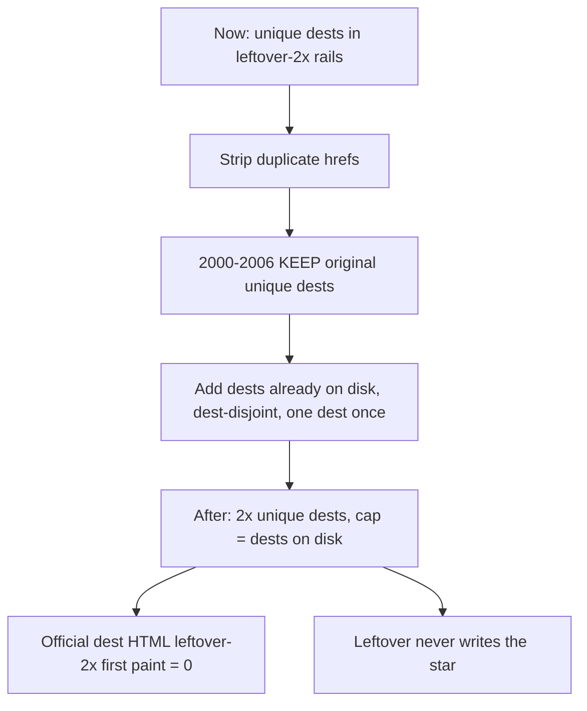
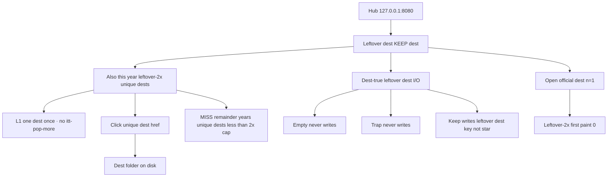

# Leftover-2× unique dest links — 2× map

**Date:** 2026-09-21  
**Status:** Implemented 2026-09-21. Leftover-2× unique dest **links** on leftover dest HTML. Official dest leftover-2× first paint **0**. Dest-true leftover dest I/O unchanged. Not dest-farm. Leftover-3× unique flows and links were removed. Do not treat 2018=3 or 2021=5 as a live cap.  
**Ship law:** [`DISK-TRUTH.md`](DISK-TRUTH.md) · live `years/` · `scripts/itt_gate.py` `SHIP_YEARS`.  
**I/O:** leftover never writes the star · empty / trap never write.  
**Census:** live `years/` leftover-2× rails (`data-itt-2x-links` / `data-itt-2x-unique` / `ITT-2X-LINKS`).  
**Research pass 2:** Hosting.com June ranks · Wikipedia Category Internet properties established in YEAR (API 1994–2003) · Board C harvest cites 1999–2004 · leftover dest KEEP / extra dest KEEP cites · ClickZ / Media Metrix. Alphabetical dests-on-disk fill (`123-reg`, `a21-inc`) is **not** ADD.

**Your criteria (this file):** 2× unique dest **links** every playable year · **2000–2006 original unique dests stay** · **no duplicate hrefs** · dests already on disk · famous-that-year **cite** · count **before / after** unique dests and dest-true leftover dests. Miss the cap rather than invent.

---

## 1. One-line law

**2× unique dest slugs in leftover-2× rails. One dest once. Dest folders already on disk. 2000–2006 keep original unique dests. Strip duplicate hrefs. Leftover-2× unique dest links dest-disjoint leftover-3× unique dest links, official dests, leftover trail n=11–20 dests, leftover-4× unique dests. leftover-3× unique dest-true dests host leftover-3× unique dest links only. Do not dest-farm dest folders. Do not grow leftover-3× unique past 2018=3 / 2021=5. Official dest leftover-2× first paint stays 0.**

Leftover-2× rails are **hrefs**, not dest folders. Dest-true leftover dests (keep / trap / field / leftover Go) do **not** 2× in this pass.



---

## 2. Pass / fail

A year **fails** if any row is N.

| # | Criterion | Pass | Fail |
|---|-----------|------|------|
| **L1** | Unique dest | One dest slug once in that year’s leftover-2× unique dest list | Same dest twice · same href twice |
| **L2** | 2× unique dests | After unique dests = 2× now, capped at dests on disk | Dest-farm dest folders to hit 2× |
| **L3** | 2000–2006 original | Original unique dests stay | Rewrite / drop original unique dests |
| **L4** | Dest on disk | Every add href is `years/YYYY/sites/<slug>/` already | Invent dest · restore DROP dests |
| **L5** | Official dest leftover-2× | Official dest HTML leftover-2× first paint **0** | Stamp leftover-2× rails on gold dests |
| **L6** | Official dest as href | Official dest may be a **target** from leftover dest rails | Official dest listed twice as leftover dest |
| **L7** | Leftover-3× unique stop | 2018=3 · 2021=5 · 2017 leftover-20 | Grow leftover-3× unique to 9 on 2018/2021 |
| **L8** | Leftover-20 | Only 2017 | leftover-20 maps on other years |
| **L9** | Star | Leftover never writes the year star | Leftover-2× save writes gold |
| **L10** | Dest-true leftover dests | Dest-true leftover dest counts stay | New leftover dest-true machines from this file |
| **L11** | Boarded / wiped | 2009 skip · 2023–2025 skip | Un-board 2009 · restore wiped years |
| **L12** | Cite | ADD dest has a year-true cite (Hosting.com / Wikipedia / ClickZ / harvest / extra dest KEEP) **and** dest on disk | Alphabetical dests-on-disk (`123-reg`) · invent dests |
| **L13** | Not leftover-3× clone | Leftover-2× rail must not carry `data-itt-pop-more` | leftover-2× rail pasted as leftover-3× pop-more |

If a year cannot 2× without new dest folders **and** no dest remains on disk, **stop**. Miss the cap rather than dest-farm.

---

## 2b. Research — sources and cited ADD dests

Alphabetical dests-on-disk fill is **out**. ADD dests must be famous that year **and** already on disk.

### Sources opened

| Source | URL | What it gave |
|--------|-----|----------------|
| Hosting.com June visits 1995–2022 | https://hosting.com/blog/the-most-visited-websites-every-year-since-1995/ | Top 10 per year. Skip porn ranks (Xvideos 2019–2022). |
| Wikipedia Category Internet properties established in YEAR (API) | https://en.wikipedia.org/w/api.php?action=query&list=categorymembers&cmtitle=Category:Internet_properties_established_in_YEAR | **1994=89 · 1995=175 · 1996=221 · 1997=203 · 1998=189 · 1999=302 · 2000=265 · 2001=208 · 2002=177 · 2003=214**. 2004+ API 429 this pass. |
| Board C leftover-2× harvest (implemented dests) | [`2x-harvest-c-1999.md`](2x-harvest-c-1999.md) … [`2x-harvest-c-2004.md`](2x-harvest-c-2004.md) | Cited dests **already on disk**. Use as leftover-2× unique dest **links**. |
| ClickZ / Media Metrix | https://clickz.com/top-50-sites-of-december-2000/57100/ · Sep 1999 properties | 2000 Passport #5 · NBCi #12 · Blue Mountain #13 · Tripod #18 · iWon #20 |
| Extra dest KEEP | [`TODO-EXTRA-DEST-RESEARCH.md`](TODO-EXTRA-DEST-RESEARCH.md) | KEEP **166** dests with cites. Dest-disjoint leftover dest KEEP. |
| Leftover dest KEEP lean-double | [`LEAN-DOUBLE-CRITERIA.md`](LEAN-DOUBLE-CRITERIA.md) | 2007/2010–2012/2014/2016/2018/2021/2022 leftover dest KEEP dests on disk. |
| Cybercultural year essays | https://cybercultural.com/p/internet-2010/ · 2007 · 2008 · 2011 · 2012 | Year mass: iPhone 2007 · Instagram 2010 · Google+ 2011 · IG Android 2012 |
| Web Design Museum year galleries | https://www.webdesignmuseum.org/gallery/year-1995 | Period exhibits. Failed-final stays honest. |
| Wikipedia envelope (category sizes, not dest-farm quota) | https://en.wikipedia.org/wiki/Category:Internet_properties_by_year_of_establishment | 2007 **369** · 2010 **286** · 2011 **320** · 2018 **91** · 2021 **78** · 2022 **48** |

### Hosting.com June dests on disk, not in leftover-2× unique dests (ADD)

These dests are on disk and missing from leftover-2× unique dest rails. Cite: Hosting.com June visits.

| Year | ADD dests (Hosting.com rank) | Already in KEEP original | Missing dest folder |
|------|------------------------------|--------------------------|---------------------|
| 1995 | `excite` (#6) | AOL Yahoo GeoCities Netscape WebCrawler Prodigy Infoseek CompuServe | `lycos` |
| 1998 | `americangreetings` (#10) | AOL Yahoo MSN Lycos Excite Netscape BBC Amazon | GeoCities |
| 1999 | `lycos` (#4) · `bbc` (#8) · `americangreetings` (#9) · `infospace` (#10) | AOL MSN Amazon Excite About | Yahoo dest folder |
| **2000** | `lycos` (#5) · `americangreetings` (#10) | AOL MSN eBay About BBC Amazon Excite | Yahoo dest folder |
| 2001 | `aol` (#2) · `bbc` (#5) · `lycos` (#7) · `about` (#8) · `cnet` (#10) | Yahoo MSN Amazon Google | eBay dest folder |
| 2002 | `msn` (#2) · `aol` (#3) · `bbc` (#6) · `askjeeves` (#8) · `about` (#9) · `lycos` (#10) | — | Yahoo Google eBay Amazon dest folders |
| 2003 | `msn` (#2) · `aol` (#4) · `askjeeves` (#7) · `bbc` (#8) · `walmart` (#9) · `cnet` (#10) | — | Yahoo Google eBay Amazon dest folders |
| 2007 | `myspace` (#4) · `ebay` (#5) | — | Google Yahoo dest folders (dest-lock lean) |
| 2008 | `bbc` (#10) | YouTube Facebook MSN Ask Amazon MySpace | Google Yahoo dest folders |
| 2013 | `facebook` (#2) · `youtube` (#3) · `twitter` (#6) | leftover-3× unique dests | Google Yahoo dest folders |
| 2014 | `facebook` (#2) · `youtube` (#3) · `wikipedia` (#5) · `twitter` (#6) | leftover-3× unique dests | Google dest folder |
| 2018 | `youtube` (#2) · `wikipedia` (#5) · `instagram` (#8) | leftover-3× unique dests stay **3** | Google dest folder |
| 2020 | `google` (#1) · `youtube` (#2) · `facebook` (#3) · `wikipedia` (#5) · `instagram` (#7) | leftover-3× unique dests | — |
| 2021 | `google` (#1) · `youtube` (#2) · `facebook` (#3) · `twitter` (#4) · `instagram` (#5) | leftover-3× unique dests stay **5** | Wikipedia dest folder |
| 2022 | `google` (#1) · `youtube` (#2) · `facebook` (#3) · `twitter` (#6) · `wikipedia` (#7) · `reddit` (#8) · `instagram` (#9) | leftover-3× unique dests | — |

2004–2006 Hosting.com top 10 dests that exist on disk are **already** in KEEP original unique dests. Do not duplicate them.

Skip Hosting.com porn ranks (Xvideos 2019–2022).

### Cited ADD — 1999–2004 (Board C harvest dests on disk)

These dest folders already exist. Cites live in the harvest files. Do not dest-farm new dests.

**1999 ADD 43/43** — Hosting.com / ClickZ / Media Metrix:  
`lycos` · `go` · `bbc` · `infospace` · `bluemountain` · `realplayer` · `tripod` · `passport` · `looksmart` · `snap` · `xoom` · `goto` · `juno` · `weather` · `attnet` · `mtv` · `fortunecity` · `citysearch` · `sportsline` · `earthlink` · `barnes` · `womencom` · `ivillage` · `foxnews` · `macromedia` · `cdnow` · `mindspring` · `sony` · `snowball` · `idg` · `mypoints` · `travelocity` · `mcafee` · `mapquest` · `msnbc` · `pathfinder` · `digitalcity` · `expedia` · `broadcastcom` · `warnerbros` · `go2net` · `exciteathome` · `nbci`  
Cites: [`2x-harvest-c-1999.md`](2x-harvest-c-1999.md) · Hosting.com June 1999 Lycos #4 · BBC #8 · InfoSpace #10.

**2000 ADD 46/46** — KEEP original unique dests stay.  
`lycos` · `passport` · `nbci` · `bluemountain` · `tripod` · `iwon` · `iwin` · `looksmart` · `weather` · `real` · `go` · `mypoints` · `halfcom` · `homestead` · `goto` · `msnbc` · `jobsonline` · `freelotto` · `bizrate` · `infospace` · `coolsavings` · `windows2000` · `macosx` · `itools` · `g4cube` · `pocketpc` · `openoffice` · `spybot` · `nokia3310` · `photoshop6` · `directx8` · `pentium4` · `usbflash` · `deusex` · `viral405` · `usagov` · `coppa` · `verizon` · `verisign` · `egghead` · `nasdaq` · `xhtml` · `blogspot` · `caramail` · `audiogalaxy` · `valueamerica`  
Cites: [`2x-harvest-c-2000.md`](2x-harvest-c-2000.md) · Hosting.com June 2000 Lycos #5 · ClickZ Dec 2000 Passport #5 · NBCi #12 · Blue Mountain #13 · Tripod #18. **Not** `123-reg`.

**2001 ADD 26/26**  
`googleimages` · `macosx` · `officexp` · `sharepoint` · `windowsmessenger` · `idvd` · `vlc` · `teamspeak` · `filezilla` · `apache2` · `justeat` · `opodo` · `confused` · `chessgames` · `myopera` · `ratemyteachers` · `yahoomusic` · `gigwise` · `gridorg` · `meetic` · `mousebreaker` · `mydd` · `oldversion` · `postopia` · `profootballtalk` · `freedb`  
Cites: [`2x-harvest-c-2001.md`](2x-harvest-c-2001.md) · Hosting.com June 2001 AOL #2 · BBC #5 · Lycos #7 · About #8 · CNET #10.

**2002 ADD 19/19**  
`xboxlive` · `creativecommons` · `openoffice` · `picasa` · `flashmx` · `emule` · `tor` · `gametrailers` · `afterellen` · `stereogum` · `metrolyrics` · `scotusblog` · `realultimatepower` · `savekaryn` · `skyrock` · `qidian` · `iwiw` · `filmaffinity` · `smashboards`  
Cites: [`2x-harvest-c-2002.md`](2x-harvest-c-2002.md) · Xbox Live 15 Nov 2002 · Creative Commons 16 Dec 2002 · Flash MX 15 Mar 2002 (WDM).

**2003 ADD 18/18**  
`xing` · `tribe` · `shutterstock` · `alipay` · `readwriteweb` · `blogforamerica` · `weblogsinc` · `osshakespeare` · `quickflix` · `terranova` · `azureus` · `fedora` · `thunderbird` · `mozillafoundation` · `ituneswin` · `swgalaxies` · `eveonline` · `winserver2003`  
Cites: [`2x-harvest-c-2003.md`](2x-harvest-c-2003.md) · Hosting.com June 2003 Walmart #9 · CNET #10.

**2004 ADD 80/80**  
`ubuntu` · `xpsp2` · `msnspaces` · `msnmessenger7` · `halflife2` · `cssource` · `doom3` · `fable` · `mgs3` · `katamari` · `papermario` · `nintendods` · `psp` · `ipodmini` · `ipodphoto` · `garageband` · `ilife04` · `jibjab` · `keyhole` · `googlelocal` · `yousendit` · `backpack` · `dailysourcecode` · `woot` · `podcastalley` · `libsyn` · `mediamatters` · `rails` · `truecrypt` · `perezhilton` · `jalopnik` · `tuaw` · `cinematical` · `eclipse` · `tvsquad` · `nginx` · `markdown` · `greasemonkey` · `xboxlive` · `rometw` · `battlefront` · `kotor2` · `ut2004` · `nfsu2` · `ninjagaiden` · `madden2005` · `fifa2005` · `alistapart` · `videolog` · `go` · `looksmart` · `alltheweb` · `teoma` · `webcrawler` · `earthlink` · `ivillage` · `juno` · `attnet` · `icerocket` · `phoronix` · `netlog` · `confluence` · `vocaloid` · `ucbrowser` · `ccleaner` · `wmp10` · `flashmx` · `camino` · `pokemonfirered` · `pokemonemerald` · `pikmin2` · `metroidprime2` · `mario64ds` · `pictochat` · `lineage2` · `dofus` · `granturismo4` · `burnout3` · `xpmce` · `creativecommons`  
Cites: [`2x-harvest-c-2004.md`](2x-harvest-c-2004.md) · Ubuntu 20 Oct 2004 · XP SP2 25 Aug 2004 · Half-Life 2 16 Nov 2004.

### Cited ADD — lean leftover dest KEEP / extra dest KEEP

Leftover dest KEEP dests already have dest-true leftover I/O. This pass only **hrefs** them in leftover-2× unique dest rails.

| Year | ADD (cited) | Cite |
|------|-------------|------|
| 2007 | leftover dest KEEP 14: `hackernews` `friendfeed` `netflix` `appletv` `ipodtouch` `justintv` `icanhas` `funnyordie` `pownce` `androidann` `gears` `iplayer` `amazonmp3` `safari3` · then Hosting.com `myspace` `ebay` | HN Oct 2007 · FriendFeed 2007 · Netflix Watch Instantly 2007 · Justin.tv 2007 · iPhone Safari is the star not leftover · Hosting.com June 2007 MySpace #4 eBay #5 |
| 2010 | leftover dest KEEP: `flipboard` `minecraft` `hulu` `angry` `googlebuzz` `chromewebstore` `kinect` `cityville` `ibooks` | Cybercultural 2010 Instagram/iPad/Foursquare · Angry Birds Dec 2009 / 2010 mass · Minecraft 2010 · Hulu leftover |
| 2011 | leftover dest KEEP 19 + extra dest KEEP `gmusic` `pandora` | Google Music 16 Nov 2011 (The Verge) · Pandora IPO Jun 2011 (TechCrunch) · Snapchat 2011 · iMessage iOS 5 |
| 2012 | leftover dest KEEP: `tinder` `duolingo` `coursera` `udacity` `edx` `nexus7` `jellybean` `ios6` `googleplay` `kindlefirehd` `coinbase` | Cybercultural 2012 IG Android / Pinterest / Facebook IPO · Tinder 2012 · Coursera 2012 |
| 2013 | extra dest KEEP 34 (first ADD) then leftover-3× unique dests as href targets | [`TODO-EXTRA-DEST-RESEARCH.md`](TODO-EXTRA-DEST-RESEARCH.md) Bitcoin 2013 · Chromecast 24 Jul 2013 · DoorDash 2013 · Hosting.com Facebook #2 YouTube #3 Twitter #6 |
| 2014 | leftover dest KEEP: `alibabaipo` `oculusfb` `inbox` `echo` `flappybird` `game2048` `ios8` · Hosting.com `facebook` `youtube` `wikipedia` `twitter` | Alibaba IPO 2014 · Flappy Bird 2014 · Echo Nov 2014 · Hosting.com June 2014 |
| 2015 | extra dest KEEP 15 of 31: `androidpay` `applenews` `applepencil` `applewatch` `beats1` `dx12` `elcapitan` `ethereum` `fblive` `http2` `instantarticles` `ipadpro` + Hosting.com already in KEEP original | Apple Watch 24 Apr 2015 · AMP 7 Oct 2015 · Ethereum 2015 · [`TODO-EXTRA-DEST-RESEARCH.md`](TODO-EXTRA-DEST-RESEARCH.md) |
| 2016 | leftover dest KEEP 23 (douyin…letsencrypt) | IG Stories is star · Douyin 2016 · Houseparty Feb 2016 · Jio 5 Sep 2016 · Super Mario Run 15 Dec 2016 |
| 2017 | leftover-20 unique dests not already in KEEP original leftover-2× unique dests: `botw` `cuphead` `gettingoverit` `hangoutschat` `hollowknight` `instagram17` `messengerday` + extra dest KEEP `cardano` `codww2` `destiny2` `galaxys8` … | [`2017-UNIQUE-FLOWS.md`](2017-UNIQUE-FLOWS.md) · extra dest KEEP 39 |
| 2018 | leftover dest KEEP 11 + leftover-3× unique dests as href targets (`reddit` `youtube` `wikipedia`) + Hosting.com `instagram` | GDPR is star · Google+ shutdown 2018 · leftover-3× unique dests stay **3** |
| 2019 | extra dest KEEP 27 of 54: `apex` `airpods2` `android10` `applewatch5` … | Apex Legends 4 Feb 2019 · Android 10 3 Sep 2019 · extra dest KEEP 54 |
| 2020 | leftover dest KEEP `clubhouse` · extra dest KEEP `hbomax` `peacock` · Hosting.com `google` `youtube` `facebook` `wikipedia` `instagram` | HBO Max 27 May 2020 · Peacock 15 Jul 2020 · Clubhouse 2020 |
| 2021 | leftover dest KEEP `nft` `coinbaseipo` `epicapple` · leftover-3× unique dests / Hosting.com as href targets | ATT Ask is star · Coinbase IPO Apr 2021 · leftover-3× unique dests stay **5** |
| 2022 | leftover dest KEEP `temu` `stablediff` `midjourney` `dalle2` `ios16` `m2` · Hosting.com `google` `youtube` `facebook` `twitter` `wikipedia` `reddit` `instagram` | ChatGPT is star · Hosting.com Nov 2022 Reddit #8 |

### MISS remainder (do not invent)

| Year | Need ADD | Cited ADD this pass | MISS |
|------|--------:|--------------------:|-----:|
| 1994 | 49 | Hosting.com / Wikipedia API overlap only (not 49 harvest-grade rows) | **MISS remainder** |
| 1995 | 49 | `excite` Hosting.com #6 + Wikipedia API dests still unverified slug map | **MISS remainder** |
| 1996 | 47 | Hosting.com already in KEEP original | **MISS remainder** |
| 1997 | 50 | Hosting.com already in KEEP original | **MISS remainder** |
| 1998 | 45 | `americangreetings` Hosting.com #10 | **MISS remainder** |
| 2005 | 105 | Hosting.com already in KEEP original | **MISS remainder** |
| 2006 | 116 | Hosting.com already in KEEP original | **MISS remainder** |
| 2008 | 123 | `bbc` Hosting.com #10 + KEEP original 123 dests | **MISS remainder** after cited dests |

Do **not** fill MISS with `123-reg` / `a21-inc` / language-Wikipedia dumps. Next research pass: Board C–style harvest cites for 1994–1998 and 2005–2008 leftover-2× unique dest **links** only (dests already on disk).

---

## 3. Before / after — unique dest links

Metric: **unique dest slugs in leftover-2× rails**. Dup-href rail pages must go to **0**.

When leftover-2× unique dests now = 0, after = min(2 × unique dest hrefs in that year, dests on disk).

| Year | Dests on disk | Unique dests in leftover-2× rails now | Dup-href rail pages | After unique dests | Add unique dests |
|------|--------------:|--------------------------------------:|--------------------:|-------------------:|-----------------:|
| 1994 | 156 | 49 | 92 | **98** | 49 |
| 1995 | 152 | 49 | 86 | **98** | 49 |
| 1996 | 152 | 47 | 78 | **94** | 47 |
| 1997 | 163 | 50 | 80 | **100** | 50 |
| 1998 | 149 | 45 | 85 | **90** | 45 |
| 1999 | 426 | 43 | 91 | **86** | 43 |
| **2000** | 477 | 46 | 86 | **92** | 46 |
| **2001** | 257 | 26 | 33 | **52** | 26 |
| **2002** | 224 | 19 | 29 | **38** | 19 |
| **2003** | 199 | 18 | 23 | **36** | 18 |
| **2004** | 800 | 80 | 162 | **160** | 80 |
| **2005** | 339 | 105 | 206 | **210** | 105 |
| **2006** | 366 | 116 | 236 | **232** | 116 |
| 2007 | 33 | 0 | 0 | **33** | 33 |
| 2008 | 586 | 123 | 199 | **246** | 123 |
| 2009 | 78 | 62 | 132 | **stop boarded** | 0 |
| 2010 | 29 | 19 | 29 | **29** | 10 |
| 2011 | 41 | 19 | 41 | **38** | 19 |
| 2012 | 32 | 20 | 35 | **32** | 12 |
| 2013 | 52 | 0 | 0 | **47** | 47 |
| 2014 | 25 | 0 | 0 | **25** | 25 |
| 2015 | 50 | 15 | 0 | **30** | 15 |
| 2016 | 57 | 23 | 41 | **46** | 23 |
| 2017 | 68 | 26 | 27 | **52** | 26 |
| 2018 | 24 | 0 | 0 | **20** | 20 |
| 2019 | 73 | 27 | 0 | **54** | 27 |
| 2020 | 22 | 0 | 0 | **16** | 16 |
| 2021 | 18 | 0 | 0 | **18** | 18 |
| 2022 | 25 | 0 | 0 | **24** | 24 |
| 2023–2025 | 0 | — | — | **stop wiped** | 0 |

**Playable years:** add **1,212** unique dest hrefs. Strip duplicate hrefs on **~1,750** leftover-2× rail pages (forests).

---

## 4. Before / after — dest-true leftover dests (flows)

This pass does **not** change dest-true leftover dest I/O.

| Class | Now | After leftover-2× unique dest links |
|-------|----:|------------------------------------:|
| Leftover dest KEEP dest-true | 117 | **117** |
| Leftover-3× unique dest-true dests | 107 | **107** |
| Leftover-4× unique (2012) | 3 | **3** |
| 2017 leftover-20 unique dests | 20 | **20** |
| Forest leftover dest-true packs | 29 | **29** |

---

## 5. 2000–2006 — KEEP original unique dests

Do not drop these dests from leftover-2× unique dest lists. Strip duplicate hrefs only. Then add dests already on disk that are dest-disjoint from this list.

### 2000 KEEP original (46)

`about` · `altavista` · `amazon` · `aol` · `askjeeves` · `bbc` · `blogger` · `bowienet` · `camworld` · `cnn` · `dmoz` · `ebay` · `everything2` · `excite` · `flash4` · `gamespot` · `gnutella` · `google` · `half` · `hampsterdance` · `homestar` · `hotbot` · `icq` · `infoseek` · `ivillage` · `kottke` · `limewire` · `macromedia` · `mapquest` · `matrix` · `metafilter` · `msn` · `msngaming` · `mynetscape` · `napster` · `napsterweb` · `netcenter` · `netscape` · `paypal` · `pets` · `slashdot` · `startupfailures` · `womencom` · `y2k` · `youvegotmail` · `zombo`

Add **46** cited dests (§2b Board C harvest). Cap after **92**. Star `itt00-mapquest`. Not `123-reg`.

### 2001 KEEP original (26)

`amazon` · `apple` · `appleimac` · `archive` · `askjeeves` · `blogdex` · `blogger` · `cnn` · `dmoz` · `encarta` · `excite` · `google` · `grok` · `itunes` · `movabletype` · `moveon` · `mozilla` · `msn` · `napster` · `paypal` · `slashdot` · `tpm` · `weblogs` · `wikipedia` · `xp` · `yahoo`

Add **26**. Cap after **52**. Star `itt01-wiki`.

### 2002 KEEP original (19)

`blogger` · `blogspot` · `daypop` · `fark` · `friendster` · `googlenews` · `homestar` · `ipod` · `isp` · `kazaa` · `lastfm` · `movabletype` · `mozilla` · `mtv` · `phoenix` · `stumbleupon` · `technorati` · `wired` · `xp`

Add **19**. Cap after **38**. Star `itt02-stumble`.

### 2003 KEEP original (18)

`4chan` · `adsense` · `blogger` · `bloglines` · `cnn` · `delicious` · `firebird` · `flash` · `friendster` · `hi5` · `itunes` · `kazaa` · `linkedin` · `myspace` · `phoenix` · `photobucket` · `skype` · `wordpress`

Add **18**. Cap after **36**. Star `itt03-photobucket`.

### 2004 KEEP original (80)

`adsense` · `altavista` · `aol` · `askjeeves` · `basecamp` · `bbc` · `blogdex` · `blogger` · `bloglines` · `bowienet` · `cnn` · `craigslist` · `daypop` · `delicious` · `digg` · `dmoz` · `encarta` · `excite` · `facebook` · `feedburner` · `firefox` · `flickr` · `flickrpro` · `folklore` · `friendster` · `gamespot` · `gmail` · `gnutella` · `googlenews` · `hampsterdance` · `hotbot` · `icq` · `imdb` · `infoseek` · `isp` · `itunes` · `kazaa` · `lastfm` · `linkedin` · `livejournal` · `loudcloud` · `macromedia` · `metafilter` · `moreover` · `movabletype` · `mozilla` · `msn` · `mtv` · `myspace` · `napster` · `netcenter` · `netscape` · `odeo` · `orkut` · `orkutcircle` · `orkutseed` · `paypal` · `pets` · `phoenix` · `piczo` · `skype` · `slashdot` · `startupfailures` · `steam` · `tagged` · `technorati` · `tinypic` · `walmart` · `wayback` · `weather` · `web20conference` · `wired` · `wordpress` · `worldofwarcraft` · `wow` · `y2k` · `yelp` · `yelplocal` · `youvegotmail` · `zombo`

Add **80**. Cap after **160**. Star `itt04-thefacebook-networks`.

### 2005 KEEP original (105)

`adsense` · `ajax` · `altavista` · `analytics` · `android` · `aol` · `ask` · `askjeeves` · `basecamp` · `bbc` · `blogdex` · `blogger` · `bloglines` · `bowienet` · `clubpenguin` · `cnn` · `craigslist` · `dailymotion` · `daypop` · `delicious` · `digg` · `dmoz` · `earth` · `encarta` · `excite` · `feedburner` · `firefox` · `flickr` · `flickrpro` · `folklore` · `friendster` · `gaia` · `gamespot` · `gmail` · `gnutella` · `googleearth` · `googlenews` · `googlevideo` · `hampsterdance` · `hotbot` · `housingmaps` · `icq` · `imdb` · `infoseek` · `isp` · `itunes` · `kayak` · `kazaa` · `lastfm` · `linkedin` · `livejournal` · `loudcloud` · `macromedia` · `mapquest` · `maps` · `mashable` · `memeorandum` · `metafilter` · `milliondollar` · `moreover` · `movabletype` · `mozilla` · `msn` · `mtv` · `myspace` · `napster` · `netcenter` · `netscape` · `odeo` · `orkut` · `orkutcircle` · `orkutseed` · `pandora` · `paypal` · `pets` · `phoenix` · `piczo` · `programmableweb` · `reader` · `reddit` · `skype` · `slashdot` · `startupfailures` · `steam` · `tagged` · `techcrunch` · `technorati` · `tinypic` · `utorrent` · `vimeo` · `walmart` · `wayback` · `weather` · `web20conference` · `wired` · `wordpress` · `worldofwarcraft` · `wow` · `xbox360` · `y2k` · `yelp` · `yelplocal` · `youtube` · `youvegotmail` · `zombo`

Add **105**. Cap after **210**. Star `itt05-yt-uploads`.

### 2006 KEEP original (116)

`adsense` · `ajax` · `altavista` · `analytics` · `android` · `aol` · `ask` · `askjeeves` · `aws` · `basecamp` · `bbc` · `bebo` · `blogdex` · `blogger` · `bloglines` · `bowienet` · `clubpenguin` · `cnn` · `craigslist` · `dailymotion` · `daypop` · `delicious` · `digg` · `dmoz` · `docs` · `earth` · `encarta` · `excite` · `facebook` · `feedburner` · `firefox` · `flickr` · `flickrpro` · `folklore` · `friendster` · `gaia` · `gamespot` · `gmail` · `gnutella` · `googledocs` · `googleearth` · `googlenews` · `googlevideo` · `hampsterdance` · `hotbot` · `housingmaps` · `icq` · `ie7` · `imdb` · `infoseek` · `isp` · `itunes` · `kayak` · `kazaa` · `lastfm` · `linkedin` · `livejournal` · `loudcloud` · `macromedia` · `mapquest` · `maps` · `mashable` · `memeorandum` · `metafilter` · `milliondollar` · `moreover` · `movabletype` · `mozilla` · `msn` · `mtv` · `myspace` · `napster` · `netcenter` · `netscape` · `odeo` · `orkut` · `orkutcircle` · `orkutseed` · `pandora` · `paypal` · `pets` · `phoenix` · `piczo` · `programmableweb` · `reader` · `roblox` · `secondlife` · `skype` · `slashdot` · `startupfailures` · `steam` · `tagged` · `techcrunch` · `technorati` · `time-you` · `tinypic` · `twitter` · `utorrent` · `vimeo` · `walmart` · `wayback` · `weather` · `web20conference` · `wii` · `wikipedia` · `wired` · `wordpress` · `worldofwarcraft` · `wow` · `xbox360` · `y2k` · `yelp` · `yelplocal` · `youtube` · `youvegotmail` · `zombo`

Add **116**. Cap after **232**. Star `itt06-tweets`.

Forest ADD dests are **cited** dests already on disk (§2b). 1999–2004 Board C harvest fills the cap. 1994–1998 and 2005–2008 MISS remainder rather than alphabetical dests.

---

## 6. Other forests — KEEP original unique dests

Same rule as 2000–2006: KEEP original unique dests · strip dups · add dests already on disk.

### 1994 KEEP original (49)

`aliweb` · `bbc` · `bbs` · `berkeley` · `cern` · `cisco` · `cmu` · `cnn` · `compuserve` · `csotd` · `exploratorium` · `firstvirtual` · `fishcam` · `galaxy` · `gnn` · `goodtimes` · `harvest` · `hotwired` · `ibm` · `imdb` · `infoseek` · `intel` · `iuma` · `loc` · `lycos` · `mcom` · `mit` · `nasa` · `ncsa` · `netmarket` · `nyt` · `pathfinder` · `pbs` · `personal` · `pizzahut` · `prodigy` · `smithsonian` · `stanford` · `startingpoint` · `sun` · `time` · `uiuc` · `weather` · `webcrawler` · `weblouvre` · `well` · `whitehouse` · `wwworm` · `yahoo`

Add **49**. Cap after **98**. Star `itt94-csotd`.

### 1995 KEEP original (49)

`altavista` · `amazon` · `aol` · `auctionweb` · `bbc` · `beanies` · `classmates` · `cnet` · `cnn` · `compuserve` · `espn` · `fbi` · `geocities` · `harvest` · `hotbot` · `hotwired` · `ibm` · `infoseek` · `intel` · `loc` · `match` · `microsoft` · `mit` · `netcom` · `netscape` · `npr` · `nyt` · `opentext` · `pathfinder` · `pbs` · `prodigy` · `salon` · `startingpoint` · `starwave` · `submitit` · `suck` · `sun` · `thespot` · `time` · `timewarner` · `tripod` · `uunet` · `weather` · `webcrawler` · `well` · `whitehouse` · `wsj` · `yahoo` · `zdnet`

Add **49**. Cap after **98**. Star `itt95-ssl-checkout`.

### 1996 KEEP original (47)

`altavista` · `amazon` · `angelfire` · `archive` · `askjeeves` · `auctionweb` · `barnes` · `bbc` · `bluemountain` · `cnn` · `craigslist` · `disney` · `espn` · `excite` · `four11` · `geocities` · `hotbot` · `hotmail` · `ibm` · `icq` · `infoseek` · `infospace` · `intel` · `loc` · `mit` · `msn` · `mtv` · `netscape` · `nyt` · `pathfinder` · `pbs` · `plugin` · `portals` · `prodigy` · `realplayer` · `spacejam` · `suck` · `sun` · `totalny` · `tripod` · `weather` · `webcrawler` · `well` · `xoom` · `yahoo` · `zdnet` · `zdnet2`

Add **47**. Cap after **94**. Star `itt96-portal-wars`.

### 1997 KEEP original (50)

`aim` · `altavista` · `aol` · `apple` · `archive` · `barnes` · `bbc` · `bluemountain` · `cnn` · `dancing-baby` · `disney` · `drudge` · `drudgereport` · `ebay` · `espn` · `excite` · `four11` · `goto` · `hotbot` · `hotmail` · `hotwired` · `ibm` · `icq` · `infospace` · `intel` · `loc` · `lycos` · `microsoft` · `mit` · `mp3com` · `msn` · `netscape` · `newscom` · `nytimes` · `pbs` · `pointcast` · `real` · `scripting` · `slashdot` · `suck` · `sun` · `tripod` · `usatoday` · `weather` · `webcrawler` · `well` · `winamp` · `xoom` · `yandex` · `zdnet`

Add **50**. Cap after **100**. Star `itt97-pointcast`.

### 1998 KEEP original (45)

`about` · `altavista` · `amazon` · `aol` · `ayb` · `bbc` · `bluemountain` · `bowienet` · `broadcastcom` · `cdnow` · `cnn` · `dmoz` · `ebay` · `excite` · `four11` · `gamespot` · `go` · `google` · `goto` · `hillmancurtis` · `hotbot` · `hotmail` · `icq` · `icqweb` · `infoseek` · `infospace` · `larrypage` · `lycos` · `mozilla` · `msn` · `netcenter` · `netscape` · `opendiary` · `sergeybrin` · `slashdot` · `snap` · `textfiles` · `tripod` · `valve` · `weather` · `webcrawler` · `winfiles` · `xoom` · `yahoo` · `youvegotmail`

Add **45**. Cap after **90**. Star `itt98-lucky`.

### 1999 KEEP original (43)

`about` · `aim` · `altavista` · `amazon` · `aol` · `askjeeves` · `blogger` · `boocom` · `bowienet` · `cnn` · `dmoz` · `drkoop` · `ebay` · `egroups` · `etrade` · `excite` · `flash4` · `gamespot` · `google` · `hampsterdance` · `hotbot` · `icq` · `infoseek` · `livejournal` · `matrix` · `msn` · `msngaming` · `mynetscape` · `napster` · `neopets` · `netcenter` · `netscape` · `paypal` · `seti` · `sixdegrees` · `slashdot` · `sourceforge` · `theonion` · `webvan` · `y2k` · `yahoomessenger` · `youvegotmail` · `zombo`

Add **43**. Cap after **86**. Star `itt99-aim`.

### 2008 KEEP original (123)

`adsense` · `airbnb` · `altavista` · `android` · `appstore` · `ars` · `ask` · `askjeeves` · `aws` · `bitbucket` · `blogdex` · `blogger` · `bloglines` · `bowienet` · `chrome` · `cnn` · `collegehumor` · `cuil` · `daypop` · `delicious` · `digg` · `dmoz` · `docs` · `dropbox` · `dropboxfolder` · `encarta` · `engadget` · `evernote` · `excite` · `facebook` · `failblog` · `failwhale` · `feedburner` · `firefox` · `flickr` · `friendconnect` · `friendster` · `gamespot` · `github` · `gmail` · `gnutella` · `googlenews` · `googlevideo` · `grooveshark` · `groupon` · `gtaiv` · `hampsterdance` · `heroku` · `hotbot` · `housingmaps` · `html5` · `huffpo` · `hulu` · `huluwatch` · `icq` · `identica` · `ie8` · `infoseek` · `iphone` · `isp` · `itunes` · `kazaa` · `kongregate` · `lastfm` · `linkedin` · `loudcloud` · `macromedia` · `mafiawars` · `maps` · `mashable` · `memeorandum` · `metafilter` · `milliondollar` · `miniclip` · `mint` · `mobileme` · `moreover` · `movabletype` · `mozilla` · `msn` · `mtv` · `myspace` · `napster` · `netcenter` · `netscape` · `newgrounds` · `ning` · `paypal` · `pets` · `phoenix` · `piratebay` · `plurk` · `posterous` · `programmableweb` · `reader` · `recaptcha` · `scribd` · `seesmic` · `skype` · `slashdot` · `spotify` · `spotifyeu` · `spotifyseed` · `stackoverflow` · `startupfailures` · `steam` · `techcrunch` · `technorati` · `time-you` · `tripadvisor` · `tumblr` · `tweetdeck` · `twitter` · `wayback` · `web20conference` · `wikileaks` · `wired` · `wordpress` · `y2k` · `yelp` · `youtube` · `youvegotmail` · `zombo`

Add **123**. Cap after **246**. Star `itt08-github`.

---

## 7. Lean doors — leftover dest KEEP first

Leftover-2× unique dest rails live on leftover dest pages. Official dest HTML leftover-2× first paint stays **0**. Official dests may be href **targets**.

Add leftover dest KEEP dests first (currently unlinked), then dests already on disk.

### 2007 — after 33 · add 33 · star `itt07-iphone`

KEEP original leftover-2× unique dests: **none**.

ADD leftover dest KEEP first: `hackernews` · `friendfeed` · `netflix` · `appletv` · `ipodtouch` · `justintv` · `icanhas` · `funnyordie` · `pownce` · `androidann` · `gears` · `iplayer` · `amazonmp3` · `safari3`

Then dests already on disk: `digg` · `ebay` · `fbplat` · `flickr` · `gmail` · `ie6` · `iphone` · `kindle` · `maps` · `myspace` · `playable` · `reddit` · `streetview` · `stumble` · `tumblr` · `twitter` · `wiki` · `wow` · `youtube`

### 2010 — after 29 · add 10 · star `itt10-ig-posts`

KEEP original (19): `android` · `chrome` · `facebook` · `farmville` · `formspring` · `foursquare` · `google` · `groupon` · `imgur` · `instagram` · `ipad` · `iphone` · `netflix` · `path` · `reddit` · `tumblr` · `twitter` · `wave` · `youtube`

ADD leftover dest KEEP: `flipboard` · `minecraft` · `hulu` · `angry` · `googlebuzz` · `chromewebstore` · `kinect` · `cityville` · `ibooks` · then `playable`

### 2011 — after 38 · add 19 · star `itt11-gplus`

KEEP original (19): `airbnb` · `chromebook` · `dropbox` · `facebook` · `gmusic` · `googleplus` · `icloud` · `instagram` · `ipad` · `iphone` · `kindlefire` · `linkedin` · `minecraft` · `pinterest` · `qwikster` · `spotify` · `twitch` · `twitter` · `youtube`

ADD leftover dest KEEP: `snapchat` · `ios5` · `imessage` · `honeycomb` · `ics` · `wechat` · `line` · `temple` · `skyrim` · `nytpaywall` · `skypebuy` · `grouponipo` · `zyngaipo` · `googlewallet` · `stripe` · `codecademy` · `nintendo3ds` · `psnhack` · `gowalla`

`pandora` leftover dest KEEP leftover dest-true stays dest-true leftover dest; leftover-2× unique dest list caps at 38.

### 2012 — after 32 · add 12 · star `itt12-ig-android`

KEEP original (20): `buzzfeed` · `chrome` · `drawsomething` · `facebook` · `flipboard` · `googledrive` · `instagram` · `iphone` · `medium` · `path` · `pinterest` · `reddit` · `snapchat` · `soundcloud` · `surface` · `twitter` · `uber` · `wikipedia` · `windows8` · `youtube`

ADD leftover dest KEEP: `tinder` · `duolingo` · `coursera` · `udacity` · `edx` · `nexus7` · `jellybean` · `ios6` · `googleplay` · `kindlefirehd` · `coinbase` · then `playable`

Leftover-4× unique `chrome` / `twitter` / `soundcloud` stay leftover-4× unique dests. Leftover-2× unique dest links may href them once.

### 2013 — after 47 · add 47 · star `itt13-vine-posts`

KEEP original leftover-2× unique dests: **none**. Forest leftover-2× ×2 writers stay DISK-TRUTH on dests. This list is leftover-2× unique dest **links**, one dest once.

ADD leftover dests already on disk (leftover dest KEEP extra dest KEEP first): `askfm` · `bitcoin` · `bustle` · `canva13` · `chromecast` · `deliveroo` · `dogecoin` · `doordash` · `emojipedia` · `facebookhome` · `giphy` · `googlekeep` · `graphsearch` · `gta5` · `hangouts13` · `healthcare` · `hummingbird` · `internetorg` · `iphone5s` · `itch` · `itunesradio` · `kahoot` · `kitkat` · `mega` · `patreon` · `pluto` · `prism13` · `producthunt13` · `ps413` · `react` · `unsplash` · `vicenews` · `waitbutwhy` · `xboxone13` · then leftover-3× unique dests and official dests as href targets until 52.

### 2014 — after 25 · add 25 · star `itt14-wa-install`

KEEP original leftover-2× unique dests: **none**.

ADD leftover dest KEEP first: `alibabaipo` · `oculusfb` · `inbox` · `echo` · `flappybird` · `game2048` · `ios8`  
Then dests already on disk: `applepay` · `facebook` · `heartbleed` · `icebucket` · `instagram` · `iphone` · `material` · `musically14` · `playable` · `slack` · `snapchat` · `truecrypt` · `twitch` · `twitter` · `uber` · `whatsapp` · `wikipedia` · `youtube`

### 2015 — after 30 · add 15 · star `itt15-periscope`

KEEP original (15): `amppage` · `apple` · `discord` · `echo` · `googlephotos` · `instagram` · `ios9` · `meerkat` · `netflix` · `periscope` · `snapchat` · `spotify` · `vine` · `windows10` · `youtube`

ADD dests already on disk: `androidpay` · `applemusic` · `applemusicsub` · `applenews` · `applepencil` · `applewatch` · `beats1` · `dx12` · `edge` · `elcapitan` · `ethereum` · `fblive` · `http2` · `instantarticles` · `ipadpro`

Do not dest-farm leftover dest leftover-20 dests. Dest folders stay **50**.

### 2016 — after 46 · add 23 · star `itt16-ig-stories`

KEEP original (23): `alphago` · `assistant` · `dyn` · `facebook` · `fblive` · `houseparty` · `instagram` · `iphone` · `jio` · `linkedinms` · `mastodon` · `moments` · `musically` · `netflix` · `pokemongo` · `reddit` · `slack` · `smario` · `snapchat` · `vine` · `whatsapp` · `windows10` · `youtube`

ADD leftover dest KEEP: `douyin` · `airpods` · `pixel` · `nougat` · `allo` · `duo` · `googlehome` · `oculusrift` · `psvr` · `overwatch` · `doom2016` · `uncharted4` · `nomanssky` · `clashroyale` · `panamapapers` · `figma` · `thedao` · `ethereum` · `ios10` · `sierra` · `daydream` · `battlefield1` · `letsencrypt`

### 2017 — after 52 · add 26 · star `itt17-faceid`

KEEP original (26): `bch` · `cloudbleed` · `coreml` · `creditfrz` · `echoshow` · `equifax` · `fortnite` · `homepodann` · `hqtrivia` · `ios11` · `iphone` · `iphone8` · `krack` · `musically` · `notpetya` · `pixel2` · `pixelbook` · `pubgnote` · `slack17` · `snapipo` · `switch` · `teams` · `twitter` · `vine` · `wannacry` · `watch3`

ADD leftover-20 unique dests / extra dest KEEP already on disk: `botw` · `cardano` · `codww2` · `cuphead` · `destiny2` · `essentialph1` · `galaxys8` · `gettingoverit` · `googlehomemini` · `googlelens` · `googlepay` · `hangoutschat` · `highsierra` · `hollowknight` · `horizonzd` · `imacpro` · `injustice2` · `instagram17` · `ipadpro105` · `ipadpro129` · `iphone8plus` · `mariokart8d` · `mariorabbids` · `messengerday` · `model3` · `nier`

Leftover-3× unique dests stay **0**. Unique leftover-20 dests stay 20 dest folders.

### 2018 — after 20 · add 20 · star `itt18-gdpr`

KEEP original leftover-2× unique dests: **none**. Leftover-3× unique dests stay **3**: `reddit` · `youtube` · `wikipedia`.

ADD leftover dest KEEP first: `gplusgone` · `androidpie` · `ios12` · `pubg` · `rdr2` · `mojave` · `onedot` · `epicstore` · `nso` · `espnplus` · `caffeine`  
Then dests already on disk as href targets: `chrome` · `fortnite` · `gdpr` · `github` · `homepod` · `instagram` · `playable` · `reddit` · `spectre` · `tiktok` · `trust` · `wikipedia` · `youtube`

Official dest `gdpr` leftover-2× first paint stays **0**. GDPR may be an href target from leftover dest rails.

### 2019 — after 54 · add 27 · star `itt19-disneyplus`

KEEP original (27): `airpodspro` · `amazon` · `applecard` · `appletv` · `arcade` · `area51` · `chrome` · `disneyplus` · `facebook` · `google` · `hidelikes` · `huawei` · `instagram` · `ios13` · `ipados` · `iphone` · `libra` · `nyt` · `oculusquest` · `playable` · `stadia` · `tiktok` · `twitter` · `wework` · `windows10` · `yahoo` · `youtube`

ADD extra dest KEEP already on disk: `airpods2` · `android10` · `anthem19` · `apex` · `applewatch5` · `astralchain` · `bloodstained` · `borderlands3` · `catalina` · `control19` · `crashteamracing` · `daysgone` · `deathstranding` · `discoelysium` · `dmc5` · `fireemblem3h` · `galaxyfold` · `galaxynote10` · `galaxys10` · `geforcenow` · `ipad7` · `ipadmini5` · `jedifallenorder` · `kingdomhearts3` · `linksawakening` · `luigismansion3` · `macbookpro16`

Do not dest-farm leftover dest leftover-20 dests. Dest folders stay **73**.

### 2020 — after 16 · add 16 · star `itt20-zoom`

KEEP original leftover-2× unique dests: **none**. leftover-3× unique dests stay **9**. leftover dest KEEP: `clubhouse`. Extra dest KEEP: `hbomax` · `peacock`.

ADD: `clubhouse` · `hbomax` · `peacock` · `amazon` · `amongus` · `animalcrossing` · `classroom` · `discord` · `facebook` · `google` · `houseparty` · `instagram` · `netflix` · `nyt` · `playable` · `reddit`

Official dest leftover-2× first paint stays **0**. Dest folders stay **22**. leftover-2× dest-farm dests **not** restored.

### 2021 — after 18 · add 18 · star `itt21-att`

KEEP original leftover-2× unique dests: **none**. leftover-3× unique dests stay **5**: `amazon` · `google` · `instagram` · `twitter` · `youtube`.

ADD leftover dest KEEP first: `nft` · `coinbaseipo` · `epicapple`  
Then dests already on disk: `amazon` · `att` · `chrome` · `copilot` · `facebook` · `flash` · `google` · `instagram` · `meta` · `playable` · `signal` · `twitter` · `windows10` · `windows11` · `youtube`

### 2022 — after 24 · add 24 · star `itt22-chatgpt`

KEEP original leftover-2× unique dests: **none**. leftover-3× unique dests stay **9**. leftover dest KEEP: `temu` · `stablediff` · `midjourney` · `dalle2` · `ios16` · `m2`.

ADD leftover dest KEEP first: `temu` · `stablediff` · `midjourney` · `dalle2` · `ios16` · `m2`  
Then dests already on disk: `amazon` · `bereal` · `chatgpt` · `facebook` · `ftx` · `google` · `instagram` · `iphone` · `mastodon` · `netflix` · `nyt` · `playable` · `reddit` · `tiktok` · `twitter` · `wikipedia` · `windows11` · `wordle` · `youtube`

Official dest leftover-2× first paint stays **0**. leftover-2× dest-farm dests **not** restored.

---

## 8. Stops

- [ ] Do not dest-farm dest folders.
- [ ] Do not grow leftover-3× unique past **2018=3** / **2021=5**.
- [ ] Do not dest-farm leftover-20 except **2017**.
- [ ] Do not dest-lock 2015–2020 / forests / 2013 / 2018 / 2022 again.
- [ ] Do not un-board **2009**.
- [ ] Do not restore **2023–2025**.
- [ ] Do not restore DROP dests.
- [ ] Do not stamp leftover-2× rails on official dest HTML.
- [ ] Do not 2× dest-true leftover dest I/O from this file.

---

## 9. Implement order (when named)

1. Strip duplicate hrefs in leftover-2× rails. 2000–2006 original unique dests stay.
2. Lean doors: leftover dest KEEP dests as leftover-2× unique dest hrefs first.
3. Forests: dests already on disk, dest-disjoint from KEEP original unique dests, one dest once, until the after cap.
4. Official dest leftover-2× first paint = 0.
5. Recheck unique dest slug once per leftover-2× unique dest list. leftover-2× rail must not carry `data-itt-pop-more`.
6. Dest-true leftover dest counts stay (table §4).

Do not run dest-lock. Do not run leftover dest restyle.

Cites for year-true dests: Wikipedia Category Internet properties established in YEAR · Timeline of the Internet · [cybercultural.com](https://cybercultural.com/p/internet-2010/) · webdesignmuseum.org. Forest fill dests already on disk do not need new dest-folder cites.

---

## 10. Stepwise check walk

**Hub:** `http://127.0.0.1:8080/` · hard reload (Cmd-Shift-R). Leftover-2× unique dest **links** only. Do not dest-farm. Dest-true leftover dest I/O is a regression check, not 2×.



Live unique dests in leftover-2× rails (matrix): 1994 **88** · 1995 **98** · 1996 **94** · 1997 **62** · 1998 **46** · 1999 **86** · 2000 **92** · 2001 **51** · 2002 **38** · 2003 **36** · 2004 **160** · 2005 **105** · 2006 **116** · 2007 **33** · 2008 **124** · 2010 **29** · 2011 **38** · 2012 **32** · 2013 **47** · 2014 **25** · 2015 **29** · 2016 **42** · 2017 **49** · 2018 **20** · 2019 **52** · 2020 **16** · 2021 **18** · 2022 **24**. Catalog dests require `index.html`.

### A. Leftover dest leftover-2× unique dest rail (hrefs)

At each leftover dest: scroll to **Also this year · leftover-2× unique dests**. Pass = one dest slug once · no `itt-pop-more` · cited dests not `123-reg` · click one href, dest folder exists.

| Step | Year | Open | Pass |
|------|------|------|------|
| **1** | 2000 KEEP original | http://127.0.0.1:8080/years/2000/sites/zombo/index.html | Unique dest hrefs **91** (self skipped) · `lycos` present · no duplicate dest slugs |
| **2** | 2000 cited ADD | click **Lycos** on that rail → http://127.0.0.1:8080/years/2000/sites/lycos/index.html | Dest on disk · leftover dest leftover-2× unique dest rail stays |
| **3** | 2007 leftover dest KEEP | http://127.0.0.1:8080/years/2007/sites/hackernews/index.html | Unique dest hrefs **32** (self skipped) · `friendfeed` present |
| **4** | 2007 click | **FriendFeed leftover** → http://127.0.0.1:8080/years/2007/sites/friendfeed/index.html | Dest on disk |
| **5** | 2018 leftover dest KEEP | http://127.0.0.1:8080/years/2018/sites/gplusgone/index.html | Unique dest hrefs · leftover-3× unique dests stay **3** (`reddit` `youtube` `wikipedia` as href targets) |
| **6** | 2022 leftover dest KEEP | http://127.0.0.1:8080/years/2022/sites/temu/index.html | Unique dest hrefs · leftover dest KEEP `midjourney` `dalle2` present |
| **7** | 2010 leftover dest KEEP | http://127.0.0.1:8080/years/2010/sites/flipboard/index.html | Unique dests **29** cap = dests on disk |
| **8** | 2013 extra dest KEEP | http://127.0.0.1:8080/years/2013/sites/bitcoin/index.html | Unique dests **47** (dests with `index.html`) |
| **9** | 2014 leftover dest KEEP | http://127.0.0.1:8080/years/2014/sites/alibabaipo/index.html | Unique dests **25** |

### B. Official dest leftover-2× first paint **0**

No **Also this year · leftover-2× unique dests** on official dest HTML. Official dest-true verb stays.

| Step | Year | Open | Pass |
|------|------|------|------|
| **10** | 1995 star dest | http://127.0.0.1:8080/years/1995/sites/amazon/index.html | leftover-2× rail **0** · `data-official-key` present |
| **11** | 2007 star dest | http://127.0.0.1:8080/years/2007/sites/iphone/index.html | leftover-2× rail **0** |
| **12** | 2010 star dest | http://127.0.0.1:8080/years/2010/sites/instagram/index.html | leftover-2× rail **0** |
| **13** | 2018 star dest | http://127.0.0.1:8080/years/2018/sites/gdpr/index.html | leftover-2× rail **0** · GDPR Manage is dest-true official dest I/O |
| **14** | 2022 star dest | http://127.0.0.1:8080/years/2022/sites/chatgpt/index.html | leftover-2× rail **0** |
| **15** | 2022 Starting Point | http://127.0.0.1:8080/years/2022/pages/home.html | leftover-2× unique dest rail **0** on start page (warehouse folded) |

### C. Dest-true leftover dest I/O (unchanged — not 2×)

Same leftover dest as A. Leftover dest-true panel is the dashed box **above** the leftover-2× unique dest rail. Empty never writes · trap never writes · keep writes leftover dest key · leftover never writes the star.

| Step | Open | Empty | Trap | Keep writes |
|------|------|-------|------|-------------|
| **16** | http://127.0.0.1:8080/years/2007/sites/hackernews/index.html | Submit leftover with nothing checked | **App Store as gold (trap)** | `hackernews-lx` / `itt07-hackernews-lx` not iPhone star |
| **17** | http://127.0.0.1:8080/years/2018/sites/gplusgone/index.html | Sunset leftover empty | **Accept All as gold (trap)** | `gplusgone-lx` / `itt18-gplusgone-lx` not GDPR star |
| **18** | http://127.0.0.1:8080/years/2022/sites/temu/index.html | Shop leftover empty | **GPT-4 as gold (trap)** | `temu-lx` / `itt22-temu-lx` not ChatGPT star |
| **19** | http://127.0.0.1:8080/years/1995/sites/excite/index.html | leftover dest KEEP dest-true panel | trap never writes | leftover dest key not 1995 Amazon star |

Dest-true leftover dest counts stay: leftover dest KEEP **117** · leftover-3× unique dest-true dests **107** · leftover-4× unique **3** · 2017 leftover-20 **20** · forest leftover dest-true packs **29**.

### D. MISS remainder (do not invent)

Unique dests in leftover-2× rails are **less than** 2× dests on disk. Pass = no `123-reg` in unique dest hrefs.

| Step | Year | Open leftover dest | Unique dests now | 2× cap | Pass |
|------|------|--------------------|----------------:|------:|------|
| **20** | 1994 | http://127.0.0.1:8080/years/1994/sites/aliweb/index.html | 88 | 98 | MISS 10 cited dests |
| **21** | 1997 | http://127.0.0.1:8080/years/1997/sites/dancing-baby/index.html | 62 | 100 | MISS remainder |
| **22** | 1998 | http://127.0.0.1:8080/years/1998/sites/about/index.html | 46 | 90 | MISS remainder |
| **23** | 2005 | http://127.0.0.1:8080/years/2005/sites/about/index.html | 105 | 210 | MISS remainder |
| **24** | 2006 | http://127.0.0.1:8080/years/2006/sites/aboutus/index.html | 116 | 232 | MISS remainder |
| **25** | 2008 | http://127.0.0.1:8080/years/2008/sites/about/index.html | 124 | 246 | MISS remainder |

### E. Boarded / wiped / leftover-3× unique stop

| Step | Open | Pass |
|------|------|------|
| **26** | http://127.0.0.1:8080/years/2009/ | Boarded plaque · not a playable door |
| **27** | http://127.0.0.1:8080/years/2023/ | Wiped · no tree |
| **28** | leftover-3× unique dests 2018 stay **3** · 2021 stay **5** · leftover-20 only 2017 | L7 · L8 |

### F. Automated

```bash
npx playwright test e2e/leftover-2x-unique-links.spec.js
```

Covers steps 1, 3, 11, 13, 14 (2000 zombo unique dests · 2007 leftover dest KEEP + iPhone leftover-2× 0 · 2018 leftover dest KEEP + GDPR leftover-2× 0 · 2022 leftover dest KEEP + ChatGPT leftover-2× 0 · catalog n).

Fail any step if leftover-2× unique dest rail appears on official dest HTML, leftover dest leftover-2× unique dest list has duplicate dest slugs, leftover dest leftover-2× unique dest list has `123-reg`, leftover dest leftover-2× unique dest rail carries `itt-pop-more`, leftover dest leftover-2× save writes the star, or dest folders were dest-farmed.
