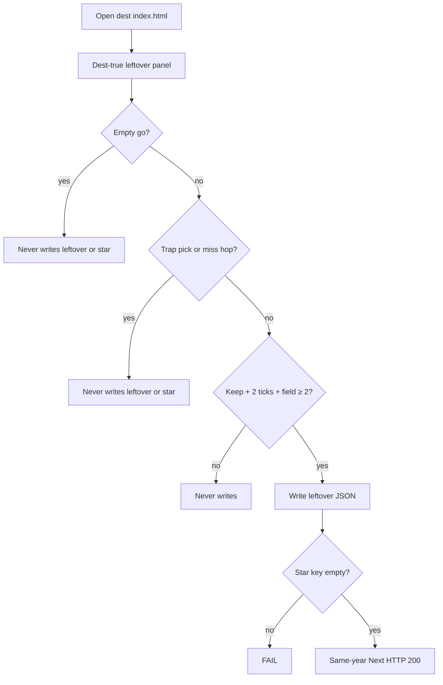
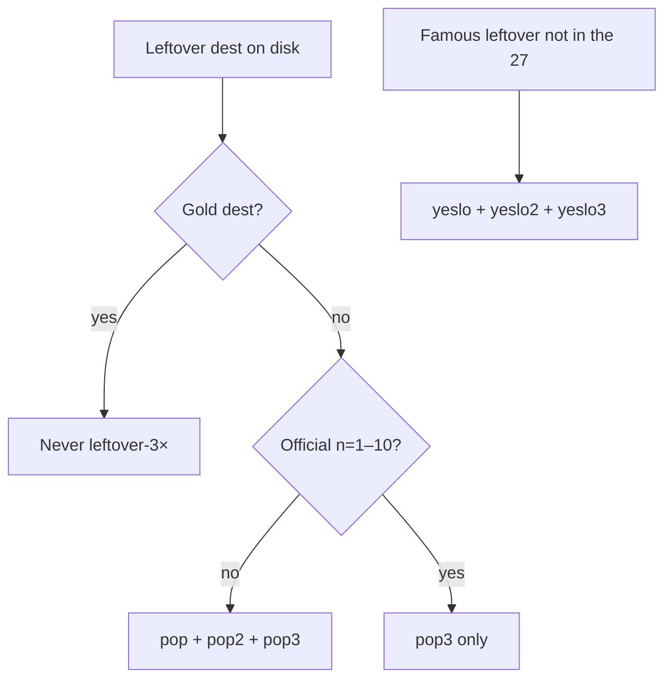
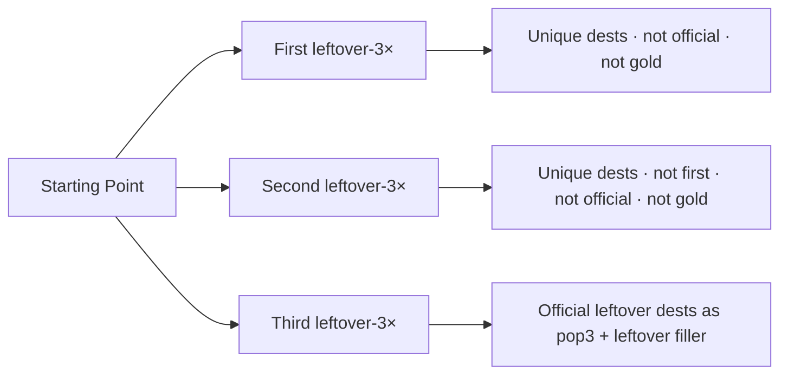
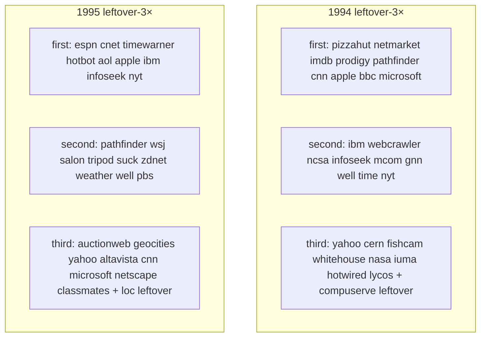
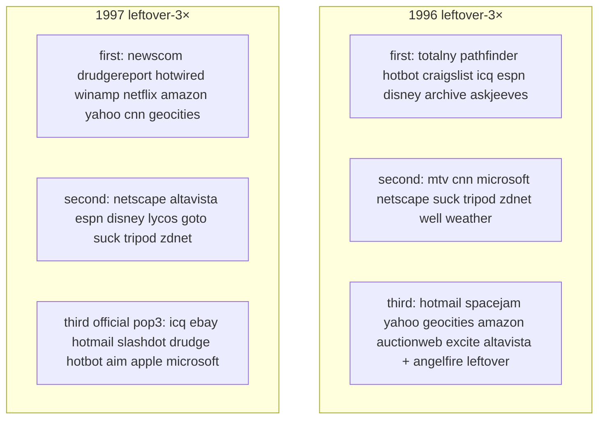
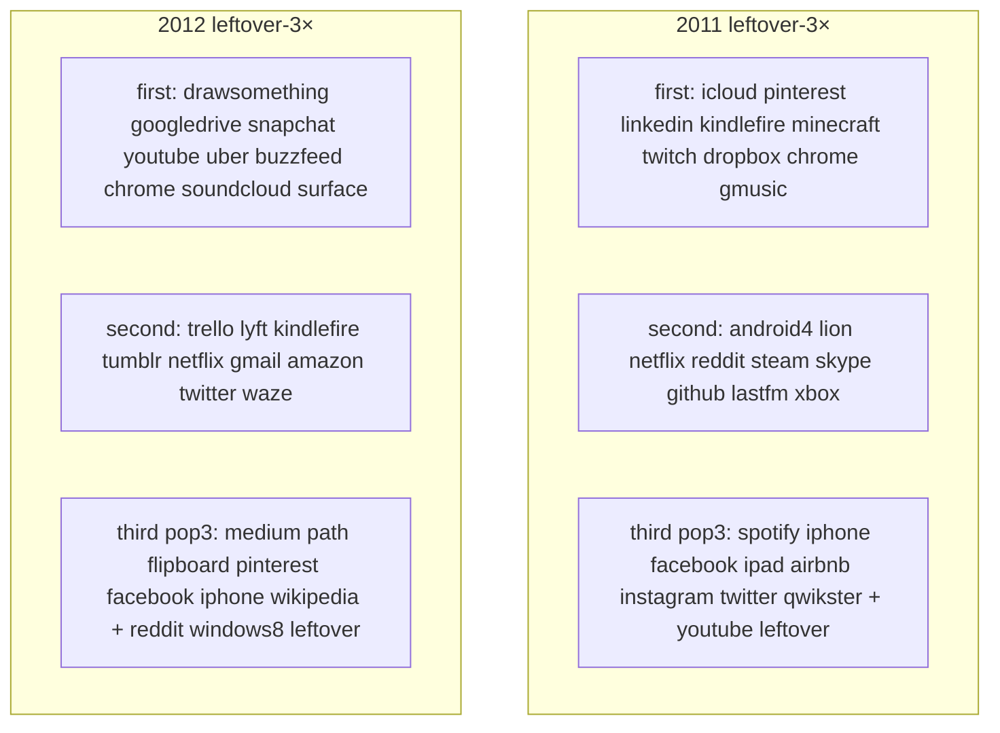
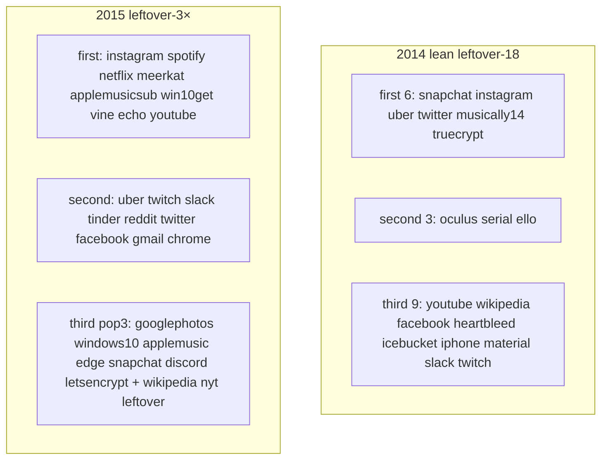
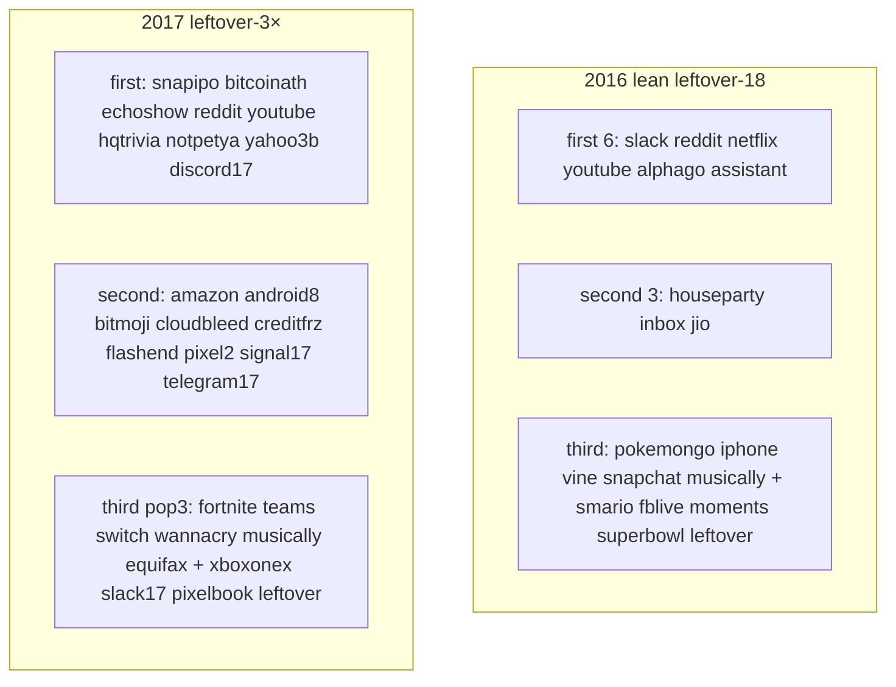

# Leftover-3× — done report + every-flow diagrams

**Date:** 2026-09-07  
**Scope:** dest-true leftover-3× on every **live** year on disk (1994–2012, 2014–2017, 2019, 2021–2022).  
**Wiped (not rebuilt):** 2013 · 2018 · 2020 · 2023–2025.

Locks held: no dest-farm · gold dest never leftover-3× first/second · leftover-3× first/second never official n=1–10 (third may as `pop3`) · leftover never writes the star · famous that calendar year only.

---

## Visitor machine — every leftover-3× / YES leftover flow

This is the same dest-true leftover walk on every painted dest. Incomplete never writes. Complete leftover JSON is `{real, leftover, multiStep, year}`. Star key stays empty.



| Machine | Storage key | Who gets it |
|---------|-------------|-------------|
| leftover-3× first | `ittYY-pop-<id>` · unkeyed `[data-pop-go]` | leftover dests only |
| leftover-3× second | `ittYY-pop2-<id>` · `data-pop-key="pop2-<id>"` | leftover dests only |
| leftover-3× third | `ittYY-pop3-<id>` · `data-pop-key="pop3-<id>"` | leftover dests **and** official dests |
| YES leftover | `ittYY-yeslo-<id>` / `yeslo2` / `yeslo3` | famous leftover dests **not** in leftover-3× 27, not gold |



---

## Home leftover strips — 3× the leftover-3× flow number



Usual 3×: leftover doors **9** → unique dests **27** (9/9/9).  
Leftover-18 / lean: 2001 6/6/6 · 2002 6/6/6 · 2003 6/5/6 · 2014 6/3/9 · 2016 6/3/9.

---

## Before → after (live years)

| Year | Dest folders | Before leftover doors | After strips | Leftover-3× machines | YES leftover |
|------|-------------:|----------------------:|--------------|---------------------:|-------------:|
| 1994 | 53 | 9 | **9 / 9 / 9** | 65 | 27 |
| 1995 | 51 | 9 | **9 / 9 / 9** | 65 | 18 |
| 1996 | 52 | 9 | **9 / 9 / 9** | 65 | 21 |
| 1997 | 56 | 9 | **9 / 9 / 9** | 63 | 15 |
| 1998 | 52 | 9 | **9 / 9 / 9** | 65 | 21 |
| 1999 | 48 | 9 | **9 / 9 / 9** | 65 | 9 |
| 2000 | 54 | 9 | **9 / 9 / 9** | 65 | 36 |
| 2001 | 29 leftover-18 | 6 | **6 / 6 / 6** | 46 | 18 |
| 2002 | 26 leftover-18 | 6 | **6 / 6 / 6** | 48 | 15 |
| 2003 | 23 leftover-18 | 5–6 | **6 / 5 / 6** | 43 | 12 |
| 2004 | 90 | 9 | **9 / 9 / 9** | 67 | 6 |
| 2005 | 117 | 9 | **9 / 9 / 9** | 63 | 45 |
| 2006 | 126 | 9 | **9 / 9 / 9** | 67 | 27 |
| 2007 | 55 | 9 | **9 / 9 / 9** | 65 | 18 |
| 2008 | 199 | 9 | **9 / 9 / 9** | 63 | 27 |
| 2009 | 68 | 9 | **9 / 9 / 9** | 65 | 12 |
| 2010 | 44 | 9 | **9 / 9 / 9** | 65 | 15 |
| 2011 | 71 | 3 | **9 / 9 / 9** | 65 | 27 |
| 2012 | 45 | 3 | **9 / 9 / 9** | 67 | 21 |
| 2013 | 0 wiped | — | — | 0 | 0 |
| 2014 | 21 lean | 3+3 | **6 / 3 / 9** | 42 | 0 |
| 2015 | 71 | 3 | **9 / 9 / 9** | 67 | 27 |
| 2016 | 32 lean | 3 | **6 / 3 / 9** | 44 | 3 |
| 2017 | 55 | 3 | **9 / 9 / 9** | 69 | 3 |
| 2018 | 0 wiped | — | — | 0 | 0 |
| 2019 | 55 | 3 | **9 / 9 / 9** | 67 | 9 |
| 2020 | 0 wiped | — | — | 0 | 0 |
| 2021 | 107 | 3 | **9 / 9 / 9** | 65 | 27 |
| 2022 | 88 | 3 | **9 / 9 / 9** | 65 | 27 |

| Slice | Leftover-3× | YES leftover | Combined |
|-------|------------:|-------------:|---------:|
| 1994–1998 | 323 | 102 | 425 |
| 1999–2005 | 397 | 141 | 538 |
| 2006–2010 | 325 | 99 | 424 |
| 2011–2015 (2013 skip) | 241 | 75 | 316 |
| 2016 / 2017 / 2019 | 180 | 15 | 195 |
| 2021–2022 | 130 | 54 | 184 |
| **Live leftover-3× years** | **1596** | **486** | **2082** |

Dest folders did not grow.

---

## Per-year leftover-3× dests (the flows)

Gold dests stay off leftover-3×. Official dests on third are `pop3` only.





```mermaid
flowchart TB
  subgraph y98 [1998 leftover-3×]
    E1[first: opendiary icqweb broadcastcom go excite geocities aol lycos winamp]
    E2[second: cnn microsoft netscape icq altavista about gamespot valve youvegotmail]
    E3[third: yahoo amazon ebay cdnow hotmail mozilla slashdot dmoz + snap leftover]
  end
  subgraph y99 [1999 leftover-3×]
    F1[first 9 leftover dests]
    F2[second 9 leftover dests]
    F3[third official pop3 + leftover filler]
  end
```

1999–2010 leftover-3× 27 dests (leftover-18 2001/2002/2003) are on the 1999–2005 and 2006–2010 maps. 2010 first includes chrome / wave / android (known fame-lock tension, not rebuilt).







```mermaid
flowchart TB
  subgraph y19 [2019 leftover-3×]
    M1[first: facebook fortnite hidelikes instagram netflix reddit slack snapchat twitch]
    M2[second: youtube zoom10m wework gplus pinterest twitter spotify tumblr wikipedia]
    M3[third pop3: tiktok arcade appletv stadia airpodspro chrome windows10 + oculusquest nyt leftover]
  end
  subgraph y21 [2021 leftover-3×]
    N1[first: youtube wikipedia discord clubhouse nft squid shorts airtag gme]
    N2[second: beeple bayc opensea coinbase spaces21 fboutage haugen log4j rbxipo]
    N3[third pop3: signal copilot meta windows11 flash chrome windows10 facebook + tiktok leftover]
  end
```

```mermaid
flowchart TB
  subgraph y22 [2022 leftover-3×]
    O1[first: youtube wikipedia facebook ftx steamdeck passkeys midjourney lensa3 tiktok]
    O2[second: temu merge lastpass whisper copilotga ios16 figmaad reddit instagram]
    O3[third pop3: twitter wordle stablediffusion mastodon bereal dalle2 chrome windows10 + craiyon leftover]
  end
```

Gold chips (never leftover-3× first/second): 1994 CSotD · 1995 Amazon SSL · 1996 Portal wars · 1997 PointCast · 1998 I'm Feeling Lucky · 1999 AIM · 2000 MapQuest · 2001 Wikipedia · 2002 StumbleUpon · 2003 Photobucket · 2004 thefacebook · 2005 YouTube upload · 2006 Twttr · 2007 iPhone Safari · 2008 GitHub · 2009 Facebook Like · 2010 Instagram iOS · 2011 G+ · 2012 IG Android · 2014 WhatsApp Install · 2015 Periscope · 2016 IG Stories · 2017 Face ID · 2019 Disney+ · 2021 ATT Ask · 2022 ChatGPT Send.

---

## Broken leftover leak — fixed

Leftover-3× paint put extra leftover machines on dests that already had an older leftover go. Unscoped leftover rooms saw leftover-3× honesty ticks and blocked (Netflix Play instantly, Tumblr Reblog, Neopets Adopt, iCloud leftover, 2015 Netflix leftover, …).

```mermaid
flowchart LR
  DEST[Same dest] --> OLD[Original leftover room]
  DEST --> NEW[Leftover-3× panels]
  OLD --> WRAP[Wrapped data-pop-panel]
  NEW --> SCOPE[scopeOf stays in its panel]
  WRAP --> OK[Original leftover still writes]
  SCOPE --> OK2[Leftover-3× writes its own key]
```

Also stripped leftover-3× **first** from official dests that had it illegally (2005 flickr · 2006 facebook · 2006 youtube). `pop3` stayed.

---

## Tests

| Pack | Result |
|------|--------|
| `test:e2e:1999-2005-3x` | **2010 passed** |
| `test:e2e:2006-2010-3x` | **1693 passed** |
| `test:e2e:2010-2015-3x` | **1271 passed** |
| 1994–1998 + 2016/2017/2019 dest-true + YES + third writers | **2911 passed** |
| `test:e2e:2018-2022-3x` + third writers | **717 passed** |
| leftover strips + popular leftover + no-mock | **103 passed**, 7 skipped |
| leftover-unique after wrap | **24 passed** |
| `score-undone-leftover-3x.py` | **+5 / 5** |
| `score-2010-2015-leftover-3x.py` | **+5 / 5** |
| `score-2018-2022-leftover-3x.py` | **+6 / 6** |
| `audit-mock-flows.js` | no dest-field / weak-real / hash-cta |

Empty never writes. Trap never writes. Complete leftover JSON. Gold key empty.

---

## Still undone (by design)

- leftover-official factory (not leftover-3×)
- leftover-3× every residual dest on disk
- dest-farm 2003’s 6th second dest · rebuild 2013 / 2018 / 2020 / 2023–2025 · dest-farm 2014 or 2016 to 27
- leftover-3× gold dests
- rebuild 2010 chrome / wave / android first-vs-third fame-lock tension

Maps: [`1994-1998-LEFTOVER-3X-X3-MAP-2026-09-07.md`](1994-1998-LEFTOVER-3X-X3-MAP-2026-09-07.md) · [`1999-2005-LEFTOVER-3X-X3-MAP-2026-09-07.md`](1999-2005-LEFTOVER-3X-X3-MAP-2026-09-07.md) · [`2006-2010-LEFTOVER-3X-X3-MAP-2026-09-07.md`](2006-2010-LEFTOVER-3X-X3-MAP-2026-09-07.md) · [`2010-2015-LEFTOVER-3X-X3-MAP-2026-09-07.md`](2010-2015-LEFTOVER-3X-X3-MAP-2026-09-07.md) · [`2016-2019-LEFTOVER-3X-X3-MAP-2026-09-07.md`](2016-2019-LEFTOVER-3X-X3-MAP-2026-09-07.md) · [`2018-2022-LEFTOVER-3X-X3-MAP-2026-09-07.md`](2018-2022-LEFTOVER-3X-X3-MAP-2026-09-07.md)
