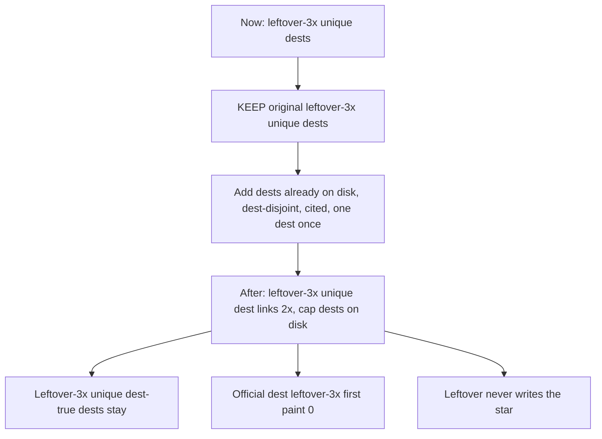

# Leftover-3× unique dest links — 2× map

**Removed.** Leftover-3× unique links are gone. No rails, no 107-dest set, no 2018=3 or 2021=5 cap. The text below is the old map.

**Date:** 2026-09-22  
**Status:** Removed. Was: leftover-3× unique dest links on leftover dest HTML. Official dest first paint 0. The old set was 107. The 2014 / 2020 / 2021 / 2022 caps were filled 2026-09-22 with official dest **hrefs** already on disk (T6). No new dest folders. Deep-research-2 **partial** (Hosting.com / Wikipedia category membership unverified). Leftover dest KEEP dest-disjoint cite walks 2007–2014 and 2015–2022 **KEEP**. Leftover dest DROP dests stay gone and must not be restored.  
**Ship law:** [`DISK-TRUTH.md`](DISK-TRUTH.md) · live `years/` · `scripts/itt_gate.py` `SHIP_YEARS`.  
**Leftover-3× unique dest-true dests:** [`LEFTOVER-3X-UNIQUE-CRITERIA.md`](LEFTOVER-3X-UNIQUE-CRITERIA.md) · `e2e/leftover-3x-unique.matrix.json`.  
**Leftover-2× unique dest links (already implemented):** [`LEFTOVER-2X-UNIQUE-LINKS.md`](LEFTOVER-2X-UNIQUE-LINKS.md).  
**I/O:** leftover never writes the star · empty / trap never write.  
**Census:** leftover-3× unique dest-true dests (first / second / third) · leftover dest KEEP dests dest-disjoint · dests already on disk with `index.html`.

**Your criteria (same as leftover-2× unique dest links):** leftover-3× unique dest **links** 2× unique dest slugs · **KEEP original leftover-3× unique dests** · **no duplicate dest slugs** · dests already on disk · famous-that-year **cite** · count **before / after** leftover-3× unique dests and dest-true leftover dest I/O. Miss the cap rather than invent.

---

## 1. One-line law

**2× unique dest slugs in leftover-3× unique dest rails. One dest once. Dest folders already on disk. KEEP original leftover-3× unique dests. Leftover-3× unique dest-true dests stay. Do not dest-farm dest folders. Do not grow leftover-3× unique dest-true dests past 2018=3 / 2021=5. 2017 leftover-20 stays. Forests skip leftover-3× unique dest-true dests. Official dest leftover-3× first paint stays 0.**

Leftover-3× unique dest **links** are **hrefs**, not dest folders. Leftover-3× unique dest-true dests (keep / trap / field / leftover Go) do **not** 2× in this pass.

Leftover dest leftover-3× unique dest **links** live on leftover dest leftover-3× unique dest-true dest pages and Starting Point leftover-3× unique dest strips. Official dest leftover-3× unique dest rails stay folded unless `?deep=1`. leftover-2× unique dest rails stay leftover-2× unique dest rails (T14).

---

## 2. Pass / fail

A year **fails** if any row is N.

| # | Criterion | Pass | Fail |
|---|-----------|------|------|
| **T1** | Unique dest | One dest slug once in that year’s leftover-3× unique dest **links** | Same dest twice · leftover-3× unique dest stacked `pop`/`pop2`/`pop3` on one dest |
| **T2** | leftover-3× unique dest **links** 2× | After unique dest hrefs = 2× leftover-3× unique dests now, capped at dests on disk dest-disjoint | Dest-farm dest folders to hit 2× |
| **T3** | KEEP original leftover-3× unique dests | Original leftover-3× unique dests stay leftover-3× unique dest-true dests **and** leftover-3× unique dest **links** | Drop leftover-3× unique dest-true dests |
| **T4** | Dest on disk | Every add href is `years/YYYY/sites/<slug>/index.html` already | Invent dest · restore DROP dests |
| **T5** | Official dest leftover-3× | Official dest leftover-3× first paint **0** unless `?deep=1` | Yellow leftover-3× unique dest rail on GDPR first paint |
| **T6** | Official dest as href | Official dest may be a leftover-3× unique dest **link** target | Official dest listed as leftover-3× unique dest-true dest |
| **T7** | Leftover-3× unique dest-true dests stop | 2018 leftover-3× unique dest-true dests stay **3** · 2021 stay **5** | Grow leftover-3× unique dest-true dests to 9 on 2018/2021 |
| **T8** | Leftover-20 | Only 2017. Skip leftover-3× unique dests on 2017 | leftover-3× unique dests on 2017 leftover-20 |
| **T9** | Star | Leftover never writes the year star | leftover-3× unique dest **links** write gold |
| **T10** | Dest-true leftover dest I/O | Leftover-3× unique dest-true dest counts stay · leftover dest KEEP dest-true leftover dest I/O stays | New leftover dest dest-true leftover dest I/O machines from leftover-3× unique dest **links** |
| **T11** | Forests | Forests 1994–2006 + 2008 leftover-3× unique dest-true dests **not the forest job** (stacked workshop) | Dest-lock forests · unique leftover-3×n dest-farm |
| **T12** | Boarded / wiped | 2009 skip · 2023–2025 skip | Un-board 2009 · restore wiped years |
| **T13** | Cite | ADD dest has a year-true cite **and** dest on disk dest-disjoint from leftover-3× unique dests | Alphabetical dests-on-disk (`123-reg`) · invent dests |
| **T14** | Not leftover-2× clone | leftover-3× unique dest **links** must not be leftover-2× unique dest rails pasted as leftover-3× unique dest pop-more | leftover-2× unique dest rail tagged `data-itt-pop-more` |
| **T15** | leftover-4× unique dests | 2012 leftover-4× unique dests stay leftover-4× unique dests (`chrome` `twitter` `soundcloud`) | leftover-4× unique dests restaged as leftover-3× unique dest-true dests |

If a year cannot leftover-3× unique dest **links** 2× without new dest folders **and** no dest remains on disk dest-disjoint, **stop**. Miss the cap rather than dest-farm.

---

## 2b. Research — sources

Alphabetical dests-on-disk fill is **out**. ADD dests must be famous that year **and** already on disk dest-disjoint from leftover-3× unique dests.

| Source | URL | What it gave |
|--------|-----|----------------|
| Hosting.com June visits 1995–2022 | https://hosting.com/blog/the-most-visited-websites-every-year-since-1995/ | Top 10 per year. Skip porn ranks. leftover-3× unique dests already include many Hosting.com dests as leftover-3× unique dest-true dests. |
| Leftover dest KEEP lean-double | [`LEAN-DOUBLE-CRITERIA.md`](LEAN-DOUBLE-CRITERIA.md) | 2007 / 2010–2012 / 2014 / 2016 / 2018 / 2021 / 2022 leftover dest KEEP dests on disk dest-disjoint. |
| Extra dest KEEP | [`TODO-EXTRA-DEST-RESEARCH.md`](TODO-EXTRA-DEST-RESEARCH.md) | KEEP **166** dests with cites. Dest-disjoint leftover dest KEEP. 2013 extra dest KEEP **34** · 2015 extra dest KEEP **31** · 2019 extra dest KEEP **54**. |
| Leftover-3× unique dest-true dests | [`LEFTOVER-3X-UNIQUE-CRITERIA.md`](LEFTOVER-3X-UNIQUE-CRITERIA.md) · `e2e/leftover-3x-unique.matrix.json` | KEEP original leftover-3× unique dests. 2018=**3** · 2021=**5** · 2017 leftover-20. |
| Cybercultural year essays | https://cybercultural.com/p/internet-2010/ · 2007 · 2011 · 2012 | Year mass: iPhone 2007 · Instagram 2010 · Google+ 2011 · IG Android 2012. |
| Web Design Museum year galleries | https://www.webdesignmuseum.org/gallery/year-1995 | Period exhibits. Failed-final stays honest. |
| 2017 leftover-20 | [`2017-UNIQUE-FLOWS.md`](2017-UNIQUE-FLOWS.md) | Skip leftover-3× unique dests on 2017 leftover-20. |

Leftover dest KEEP dests already have dest-true leftover dest I/O. This pass only **hrefs** them in leftover-3× unique dest **links**.

### Research complete 2026-09-21

Deep-research-2 **partial**. Hosting.com June ranks name leftover-3× unique dests / official dests / missing dest folders, not leftover dest KEEP dest-disjoint ADD dests (`friendfeed` `flipboard` `snapchat`). Wikipedia Category Internet properties established in YEAR truncated. Leftover dest KEEP dest-disjoint cite walks (2007–2014 · 2015–2022) **KEEP** leftover dest KEEP dests already on disk.

Verified leftover dest KEEP dest-disjoint ADD dests (independently checked):

| Year | Verified ADD dest | Cite |
|------|-------------------|------|
| 2007 | `friendfeed` | FriendFeed launched Oct 2007 · [Cybercultural 2007](https://cybercultural.com/p/internet-2007/) · [FriendFeed](https://en.wikipedia.org/wiki/FriendFeed) |
| 2010 | `flipboard` | Flipboard Jul 2010 · [Cybercultural 2010](https://cybercultural.com/p/internet-2010/) · [Flipboard launches](https://about.flipboard.com/press/flipboard-launches-worlds-first-social-magazine/) |
| 2011 | `snapchat` | Snapchat Sep 2011 · [Cybercultural 2011](https://cybercultural.com/p/internet-2011/) · [Snapchat](https://en.wikipedia.org/wiki/Snapchat) |
| 2014 | leftover dest KEEP dest-disjoint **7**: `alibabaipo` `oculusfb` `inbox` `echo` `flappybird` `game2048` `ios8` | leftover dest dests on disk dest-disjoint leftover dest KEEP dest-true dests are these 7. Dest folders **25** = leftover-3× unique dests 9 + official dests 9 + leftover dest KEEP dest-disjoint 7 |
| 2021 | leftover dest KEEP dest-disjoint **3**: `nft` `coinbaseipo` `epicapple` | Coinbase IPO Apr 2021. Dest folders **18** = leftover-3× unique dests 5 + official dests 10 + leftover dest KEEP dest-disjoint 3. leftover-3× unique dest-true dests stay **5** |

Leftover dest KEEP dest-disjoint ADD dests in leftover-3× unique dest **links** §6 (2007 hackernews…pownce · 2010 hulu…ibooks · 2011 ios5…codecademy · 2012 tinder…googleplay · 2013 extra dest KEEP · 2015 extra dest KEEP · 2016 leftover dest KEEP · 2018 gplusgone epicstore ios12 · 2019 extra dest KEEP · 2020 clubhouse hbomax peacock · 2022 temu…m2) stay leftover dest KEEP dests on disk dest-disjoint. Extra dest KEEP ADD dests (2013 / 2015 / 2019) stay cited in [`TODO-EXTRA-DEST-RESEARCH.md`](TODO-EXTRA-DEST-RESEARCH.md).

---

## 3. Before / after — leftover-3× unique dest **links**

Metric: **unique dest slugs in leftover-3× unique dest rails** (hrefs). Leftover-3× unique dest-true dests stay.

| Year | Dests on disk | Leftover-3× unique dest-true dests now | Leftover dest KEEP dest-disjoint | After leftover-3× unique dest **links** | ADD unique dest hrefs | Leftover-3× unique dest-true dests after |
|------|--------------:|---------------------------------------:|---------------------------------:|----------------------------------------:|----------------------:|-----------------------------------------:|
| 2007 | 33 | 9 | 14 | **18** | 9 | **9** |
| 2010 | 29 | 9 | 10 | **18** | 9 | **9** |
| 2011 | 41 | 9 | 22 | **18** | 9 | **9** |
| 2012 | 32 | 9 | 11 (leftover-4× unique dests out) | **18** | 9 | **9** |
| 2013 | 52 | 9 | 34 | **18** | 9 | **9** |
| 2014 | 25 | 9 | 7 | **18** | 9 | **9** |
| 2015 | 50 | 9 | 28 | **18** | 9 | **9** |
| 2016 | 57 | 9 | 34 | **18** | 9 | **9** |
| 2017 | 68 | 0 leftover-20 | leftover-20 extras 20 | **stop leftover-20** | 0 | leftover-20 **20** |
| 2018 | 24 | **3** | 11 | **6** leftover-3× unique dest **links** | 3 | **3** |
| 2019 | 73 | 9 | 49 | **18** | 9 | **9** |
| 2020 | 22 | 9 | 3 | **18** | 9 | **9** |
| 2021 | 18 | **5** | 3 | **10** leftover-3× unique dest **links** | 5 | **5** |
| 2022 | 25 | 9 | 6 | **18** | 9 | **9** |
| Forests 1994–2006 + 2008 | dense | stacked workshop | — | **stop forests** | 0 | stacked workshop |
| 2009 | 78 | boarded | — | **stop boarded** | 0 | — |
| 2023–2025 | 0 | wiped | — | **stop wiped** | 0 | — |

Playable leftover-3× unique dest **links** years: add **107** unique dest hrefs (94 leftover dest KEEP dest-disjoint + 13 official dest hrefs). Leftover-3× unique dest-true dests stay **107**.

---

## 4. Before / after — dest-true leftover dest I/O (flows)

This pass does **not** change dest-true leftover dest I/O.

| Class | Now | After leftover-3× unique dest **links** |
|-------|----:|----------------------------------------:|
| Leftover dest KEEP dest-true | 117 | **117** |
| Leftover-3× unique dest-true dests | 107 | **107** |
| Leftover-4× unique (2012) | 3 | **3** |
| 2017 leftover-20 unique dests | 20 | **20** |
| Forest leftover dest-true packs | 29 | **29** |

---

## 5. KEEP original leftover-3× unique dests

Do not drop these leftover-3× unique dest-true dests. leftover-3× unique dest **links** 2× only **hrefs** dests already on disk dest-disjoint from this list.

| Year | First | Second | Third | Star |
|------|-------|--------|-------|------|
| 2007 | `wiki` `myspace` `maps` | `ebay` `stumble` `wow` | `flickr` `reddit` `digg` | `itt07-iphone` |
| 2010 | `netflix` `tumblr` `formspring` | `chrome` `wave` `android` | `reddit` `google` `groupon` | `itt10-ig-posts` |
| 2011 | `icloud` `pinterest` `linkedin` | `kindlefire` `minecraft` `twitch` | `youtube` `dropbox` `hulu` | `itt11-gplus` |
| 2012 | `drawsomething` `googledrive` `snapchat` | `uber` `buzzfeed` `youtube` | `reddit` `surface` `windows8` | `itt12-ig-android` |
| 2013 | `askfm` `whisper` `youtube` | `chrome` `medium` `yikyak` | `reddit` `facebook` `twitter` | `itt13-vine-posts` |
| 2014 | `snapchat` `instagram` `uber` | `twitter` `musically14` `truecrypt` | `facebook` `wikipedia` `youtube` | `itt14-wa-install` |
| 2015 | `instagram` `spotify` `netflix` | `meerkat` `applemusicsub` `win10get` | `vine` `echo` `youtube` | `itt15-periscope` |
| 2016 | `slack` `reddit` `netflix` | `youtube` `alphago` `assistant` | `dyn` `fblive` `moments` | `itt16-ig-stories` |
| 2018 | `reddit` `youtube` `wikipedia` | — | — | `itt18-gdpr` |
| 2019 | `amazon` `facebook` `google` | `instagram` `nyt` `oculusquest` | `twitter` `yahoo` `youtube` | `itt19-disneyplus` |
| 2020 | `amazon` `facebook` `google` | `instagram` `youtube` `slack` | `reddit` `wikipedia` `nyt` | `itt20-zoom` |
| 2021 | `amazon` `google` `instagram` | `twitter` `youtube` | — | `itt21-att` |
| 2022 | `amazon` `google` `instagram` | `facebook` `youtube` `reddit` | `wikipedia` `netflix` `nyt` | `itt22-chatgpt` |

---

## 6. Year-by-year leftover-3× unique dest **links**

Leftover dest leftover-3× unique dest **links** ADD leftover dest KEEP dests dest-disjoint first. Official dest leftover-3× first paint stays **0**. Official dests may be leftover-3× unique dest **link** targets. leftover-4× unique dests stay leftover-4× unique dests.

### 2007 — leftover-3× unique dest **links** after 18 · ADD 9 · leftover-3× unique dest-true dests stay 9 · star `itt07-iphone`

KEEP original leftover-3× unique dests: `wiki` · `myspace` · `maps` · `ebay` · `stumble` · `wow` · `flickr` · `reddit` · `digg`

ADD leftover dest KEEP dest-disjoint (cited): `hackernews` · `friendfeed` · `netflix` · `appletv` · `ipodtouch` · `justintv` · `icanhas` · `funnyordie` · `pownce`  
Cites: HN Oct 2007 · FriendFeed 2007 · Netflix Watch Instantly 2007 · Justin.tv 2007.

Leftover dest KEEP leftover dest-true stays dest-true leftover dest: `androidann` · `gears` · `iplayer` · `amazonmp3` · `safari3`

### 2010 — leftover-3× unique dest **links** after 18 · ADD 9 · leftover-3× unique dest-true dests stay 9 · star `itt10-ig-posts`

KEEP original leftover-3× unique dests: `netflix` · `tumblr` · `formspring` · `chrome` · `wave` · `android` · `reddit` · `google` · `groupon`

ADD leftover dest KEEP dest-disjoint: `flipboard` · `minecraft` · `hulu` · `angry` · `googlebuzz` · `chromewebstore` · `kinect` · `cityville` · `ibooks`  
Cites: Cybercultural 2010 · Angry Birds 2010 mass · Minecraft 2010.

Leftover dest KEEP leftover dest-true stays dest-true leftover dest: `path`

### 2011 — leftover-3× unique dest **links** after 18 · ADD 9 · leftover-3× unique dest-true dests stay 9 · star `itt11-gplus`

KEEP original leftover-3× unique dests: `icloud` · `pinterest` · `linkedin` · `kindlefire` · `minecraft` · `twitch` · `youtube` · `dropbox` · `hulu`

ADD leftover dest KEEP dest-disjoint: `snapchat` · `ios5` · `imessage` · `gmusic` · `pandora` · `wechat` · `line` · `stripe` · `codecademy`  
Cites: Snapchat 2011 · Google Music 16 Nov 2011 (The Verge) · Pandora IPO Jun 2011 (TechCrunch) · iMessage iOS 5.

### 2012 — leftover-3× unique dest **links** after 18 · ADD 9 · leftover-3× unique dest-true dests stay 9 · star `itt12-ig-android`

KEEP original leftover-3× unique dests: `drawsomething` · `googledrive` · `snapchat` · `uber` · `buzzfeed` · `youtube` · `reddit` · `surface` · `windows8`

ADD leftover dest KEEP dest-disjoint (leftover-4× unique dests out): `tinder` · `duolingo` · `coursera` · `udacity` · `edx` · `nexus7` · `jellybean` · `ios6` · `googleplay`  
Cites: Tinder 2012 · Coursera 2012 · Cybercultural 2012.

Leftover-4× unique dests stay leftover-4× unique dests: `chrome` · `twitter` · `soundcloud`. Leftover dest KEEP leftover dest-true stays dest-true leftover dest: `kindlefirehd` · `coinbase`

### 2013 — leftover-3× unique dest **links** after 18 · ADD 9 · leftover-3× unique dest-true dests stay 9 · star `itt13-vine-posts`

KEEP original leftover-3× unique dests: `askfm` · `whisper` · `youtube` · `chrome` · `medium` · `yikyak` · `reddit` · `facebook` · `twitter`

ADD extra dest KEEP dest-disjoint: `bitcoin` · `chromecast` · `doordash` · `bustle` · `giphy` · `patreon` · `kahoot` · `kitkat` · `ios7`  
Cites: Bitcoin 2013 · Chromecast 24 Jul 2013 · DoorDash 2013 · [`TODO-EXTRA-DEST-RESEARCH.md`](TODO-EXTRA-DEST-RESEARCH.md).

### 2014 — leftover-3× unique dest **links** after 18 · ADD 9 · leftover-3× unique dest-true dests stay 9 · star `itt14-wa-install`

KEEP original leftover-3× unique dests: `snapchat` · `instagram` · `uber` · `twitter` · `musically14` · `truecrypt` · `facebook` · `wikipedia` · `youtube`

ADD leftover dest KEEP dest-disjoint **7**, then official dest hrefs already on disk **2**: `alibabaipo` · `oculusfb` · `inbox` · `echo` · `flappybird` · `game2048` · `ios8` · `heartbleed` · `icebucket`  
Cites: Alibaba IPO 2014 · Flappy Bird 2014 · Echo Nov 2014 · Heartbleed disclosed 7 Apr 2014 · ALS Ice Bucket Challenge summer 2014.

Cap filled. No new dest folders. WhatsApp (the star) and `playable` stay out of the rail. Dest-true stays 9.

### 2015 — leftover-3× unique dest **links** after 18 · ADD 9 · leftover-3× unique dest-true dests stay 9 · star `itt15-periscope`

KEEP original leftover-3× unique dests: `instagram` · `spotify` · `netflix` · `meerkat` · `applemusicsub` · `win10get` · `vine` · `echo` · `youtube`

ADD extra dest KEEP dest-disjoint: `applewatch` · `ios9` · `ethereum` · `k8s` · `marshmallow` · `ipadpro` · `androidpay` · `applenews` · `beats1`  
Cites: Apple Watch 24 Apr 2015 · Ethereum 2015 · AMP 7 Oct 2015.

### 2016 — leftover-3× unique dest **links** after 18 · ADD 9 · leftover-3× unique dest-true dests stay 9 · star `itt16-ig-stories`

KEEP original leftover-3× unique dests: `slack` · `reddit` · `netflix` · `youtube` · `alphago` · `assistant` · `dyn` · `fblive` · `moments`

ADD leftover dest KEEP dest-disjoint: `douyin` · `airpods` · `allo` · `daydream` · `ethereum` · `figma` · `googlehome` · `ios10` · `letsencrypt`  
Cites: Douyin 2016 · Houseparty Feb 2016 · Super Mario Run 15 Dec 2016.

### 2017 — stop leftover-20

Leftover-20 unique dests stay **20**. Do not leftover-3× unique dests. Map [`2017-UNIQUE-FLOWS.md`](2017-UNIQUE-FLOWS.md).

### 2018 — leftover-3× unique dest **links** after 6 · ADD 3 · leftover-3× unique dest-true dests stay **3** · star `itt18-gdpr`

KEEP original leftover-3× unique dests: `reddit` · `youtube` · `wikipedia`

ADD leftover dest KEEP dest-disjoint: `gplusgone` · `epicstore` · `ios12`  
Cites: Google+ consumer shutdown 8 Oct 2018 · leftover dest KEEP leftover dest-true stays dest-true leftover dest.

Leftover dest KEEP leftover dest-true stays dest-true leftover dest: `androidpie` · `caffeine` · `espnplus` · `mojave` · `nso` · `onedot` · `pubg` · `rdr2`

Official dest leftover-3× first paint **0**: http://127.0.0.1:8080/years/2018/sites/gdpr/index.html

### 2019 — leftover-3× unique dest **links** after 18 · ADD 9 · leftover-3× unique dest-true dests stay 9 · star `itt19-disneyplus`

KEEP original leftover-3× unique dests: `amazon` · `facebook` · `google` · `instagram` · `nyt` · `oculusquest` · `twitter` · `yahoo` · `youtube`

ADD extra dest KEEP dest-disjoint: `apex` · `airpods2` · `android10` · `applewatch5` · `catalina` · `galaxyfold` · `ios13` · `ipados` · `sekiro`  
Cites: Apex Legends 4 Feb 2019 · Android 10 3 Sep 2019.

### 2020 — leftover-3× unique dest **links** after 18 · ADD 9 · leftover-3× unique dest-true dests stay 9 · star `itt20-zoom`

KEEP original leftover-3× unique dests: `amazon` · `facebook` · `google` · `instagram` · `youtube` · `slack` · `reddit` · `wikipedia` · `nyt`

ADD leftover dest KEEP + extra dest KEEP dest-disjoint **3**, then official dest hrefs already on disk **6**: `clubhouse` · `hbomax` · `peacock` · `animalcrossing` · `houseparty` · `netflix` · `tiktok` · `amongus` · `discord`  
Cites: HBO Max 27 May 2020 · Peacock 15 Jul 2020 · Clubhouse 2020 · Animal Crossing: New Horizons 20 Mar 2020 · Houseparty March 2020 · Netflix lockdown streaming 2020 · TikTok 2020 · Among Us peak September 2020 · Discord 2020.

Cap filled. No new dest folders. Zoom (the star) and `playable` stay out of the rail. Dest-true stays 9.

### 2021 — leftover-3× unique dest **links** after 10 · ADD 5 · leftover-3× unique dest-true dests stay **5** · star `itt21-att`

KEEP original leftover-3× unique dests: `amazon` · `google` · `instagram` · `twitter` · `youtube`

ADD leftover dest KEEP dest-disjoint **3**, then official dest hrefs already on disk **2**: `nft` · `coinbaseipo` · `epicapple` · `windows11` · `meta`  
Cites: Coinbase IPO Apr 2021 · Windows 11 released 5 Oct 2021 · Facebook renamed Meta 28 Oct 2021.

Cap filled (2× of 5). No new dest folders. ATT (the star) and `playable` stay out of the rail. Dest-true stays 5.

### 2022 — leftover-3× unique dest **links** after 18 · ADD 9 · leftover-3× unique dest-true dests stay 9 · star `itt22-chatgpt`

KEEP original leftover-3× unique dests: `amazon` · `google` · `instagram` · `facebook` · `youtube` · `reddit` · `wikipedia` · `netflix` · `nyt`

ADD leftover dest KEEP dest-disjoint **6**, then official dest hrefs already on disk **3**: `temu` · `stablediff` · `midjourney` · `dalle2` · `ios16` · `m2` · `wordle` · `bereal` · `ftx`  
Cites: Temu Sep 2022 · Wordle bought by The New York Times 31 Jan 2022 · BeReal 2022 · FTX collapse November 2022.

Cap filled. No new dest folders. ChatGPT (the star) and `playable` stay out of the rail. `iphone` has no `index.html`. Dest-true stays 9.

Official dest leftover-3× first paint **0**: http://127.0.0.1:8080/years/2022/sites/chatgpt/index.html

---

## 7. Cap fill (official dest hrefs already on disk)

| Year | Need ADD | Leftover dest KEEP dest-disjoint | Official dest hrefs added 2026-09-22 | MISS |
|------|--------:|---------------------------------:|---------------------------------------:|-----:|
| 2014 | 9 | 7 | `heartbleed` `icebucket` | **0** |
| 2020 | 9 | 3 | `animalcrossing` `houseparty` `netflix` `tiktok` `amongus` `discord` | **0** |
| 2021 | 5 | 3 | `windows11` `meta` | **0** |
| 2022 | 9 | 6 | `wordle` `bereal` `ftx` | **0** |

These are hrefs only. They are not new leftover-3× unique dest-true dests. Do **not** fill a future gap with `123-reg`. Do **not** restore YEAR-FALSE leftover dest DROP dests (gone from disk 2026-09-20). Restoring leftover dest DROP dests is dest-farm / restore DROP dests (T4 fail).

| Year | leftover dest DROP dests (gone from disk · not ADD) |
|------|-----------------------------------------------------|
| 2014 | `androidl` `baidu` `yandex` `vk` `chrome` `google` `yahoo` `amazon` `netflix` `github` `reddit` |
| 2021 | `m1` `clubhouse21` `yahoo` `baidu` `yandex` `wikipedia` `reddit` `netflix` `tiktok` `discord` `twitch` `github` |
| 2022 | `musk` `chrome` `baidu` `yandex` `yahoo` `github` `discord` `twitch` `spotify` `snapchat` `whatsapp` `linkedin` `pinterest` |

Dest HTML leftover-3× unique dest **links** implemented 2026-09-21. Dest-true leftover dest I/O unchanged.

---

## 8. Official dest leftover-3× first paint 0

| Year | Official dest | URL |
|------|---------------|-----|
| 2007 | iPhone Safari | http://127.0.0.1:8080/years/2007/sites/iphone/index.html |
| 2010 | Instagram | http://127.0.0.1:8080/years/2010/sites/instagram/index.html |
| 2018 | GDPR Manage | http://127.0.0.1:8080/years/2018/sites/gdpr/index.html |
| 2022 | ChatGPT Send | http://127.0.0.1:8080/years/2022/sites/chatgpt/index.html |

Leftover dest leftover-3× unique dest-true dest check: http://127.0.0.1:8080/years/2007/sites/wiki/index.html · http://127.0.0.1:8080/years/2018/sites/reddit/index.html · http://127.0.0.1:8080/years/2022/sites/amazon/index.html

---

## 9. Stops

- [ ] Do not dest-farm dest folders.
- [ ] Do not grow leftover-3× unique dest-true dests past **2018=3** / **2021=5**.
- [ ] Do not leftover-3× unique dests on **2017** leftover-20.
- [ ] Do not leftover-3× unique dest-true dests on forests 1994–2006 + 2008.
- [ ] Do not dest-lock 2015–2020 / forests / 2013 / 2018 / 2022 again.
- [ ] Do not un-board **2009**.
- [ ] Do not restore **2023–2025**.
- [ ] Do not stamp leftover-3× unique dest rails on official dest HTML first paint.
- [ ] Do not 2× dest-true leftover dest I/O from this file.
- [ ] Do not leftover-2× unique dest rail pasted as leftover-3× unique dest pop-more.
- [ ] Do not leftover-4× unique dests restaged as leftover-3× unique dest-true dests.
- [x] Dest HTML leftover-3× unique dest **links** implemented 2026-09-21. Dest-true leftover dest I/O unchanged.

---

## 10. Implement order (when named)

1. KEEP original leftover-3× unique dests leftover-3× unique dest-true dests.
2. leftover-3× unique dest **links** ADD dests already on disk dest-disjoint, cited leftover dest KEEP dests first.
3. Official dest leftover-3× first paint = 0.
4. Recheck unique dest slug once per leftover-3× unique dest **links**. leftover-3× unique dest **links** must not carry leftover-2× unique dest rail markup.
5. Dest-true leftover dest counts stay (leftover-3× unique dest-true dests **107** · leftover dest KEEP dest-true leftover dest I/O **117**).

Do not run dest-lock. Do not run leftover dest restyle.
