# Leftover every-flow diagrams

**Date:** 2026-09-07  
Live years only. Wiped: 2013 · 2018 · 2020 · 2023–2025.  
Dest-true leftover walk is the same on every painted dest.

---

## Visitor machine

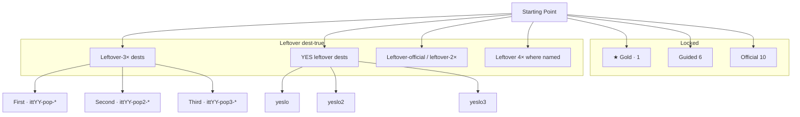

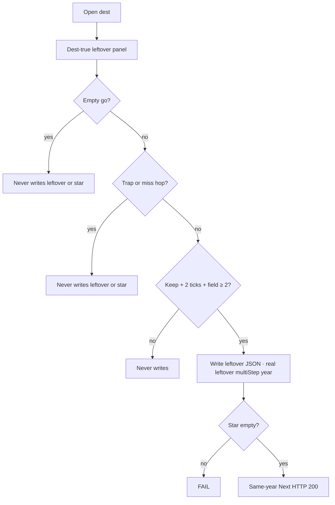

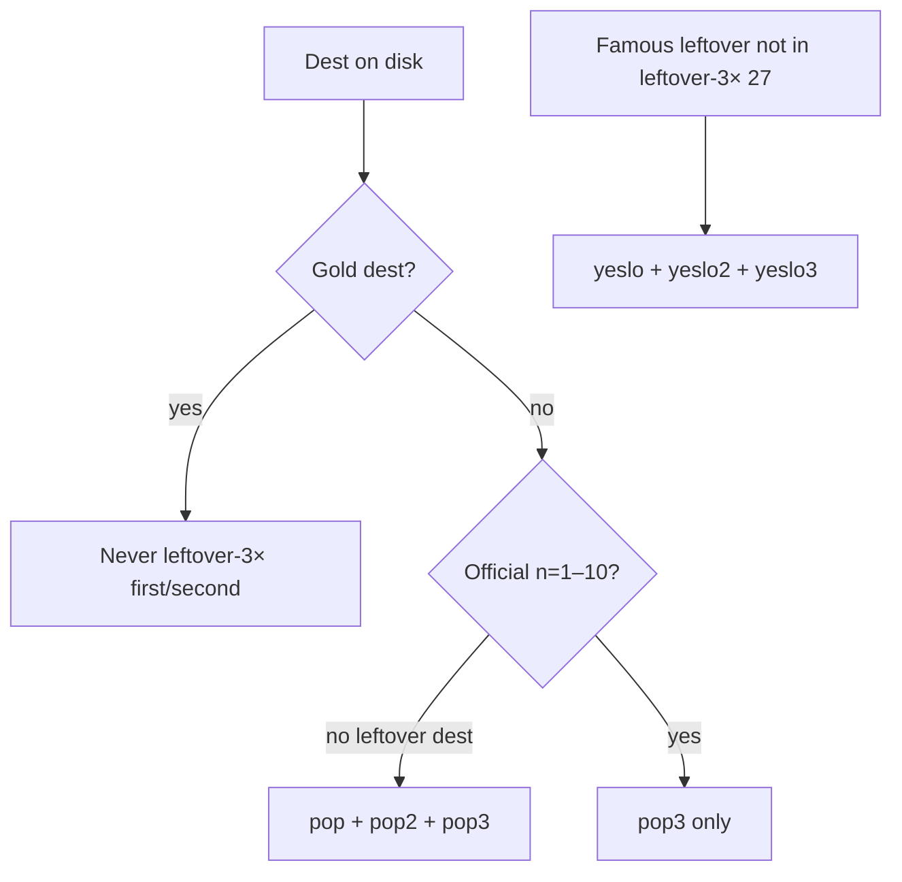

Usual leftover-3×: **9/9/9** dests. Leftover-18 / lean: 2001 **6/6/6** · 2002 **6/6/6** · 2003 **6/5/6** · 2014 **6/3/9** · 2016 **6/3/9**.

---

## 1994–1998

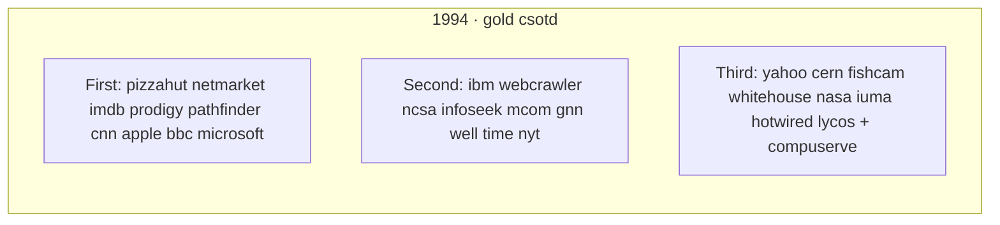

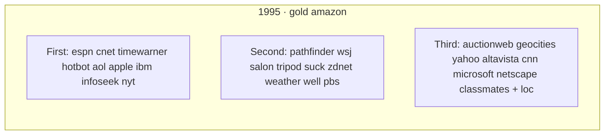

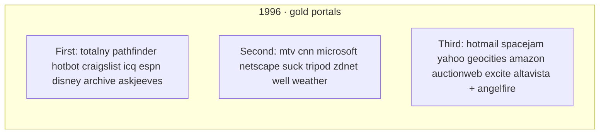

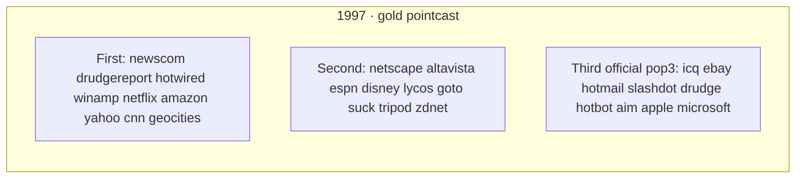

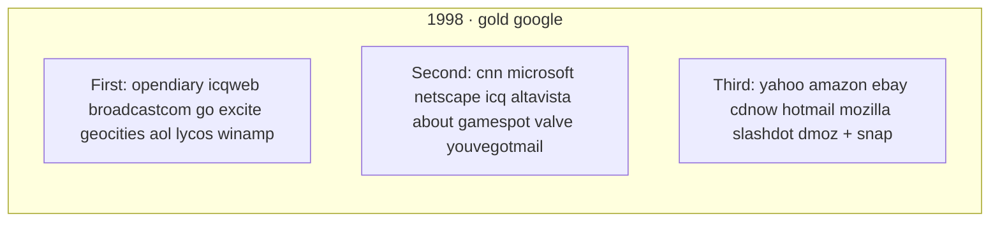

YES leftover: 1994 intel sun mit startingpoint weather loc exploratorium smithsonian personal · 1995 match npr beanies opentext hotwired sun · 1996 aolportal bluemountain four11 infospace realplayer theglobe xoom · 1997 mp3com scripting usatoday yandex dancing-baby · 1998 ayb bowienet four11 hillmancurtis mp3com realplayer textfiles.

---

## 1999–2005

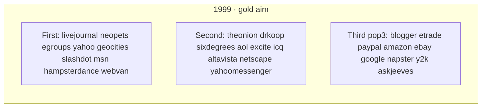

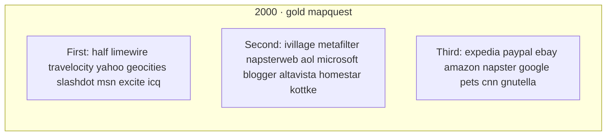

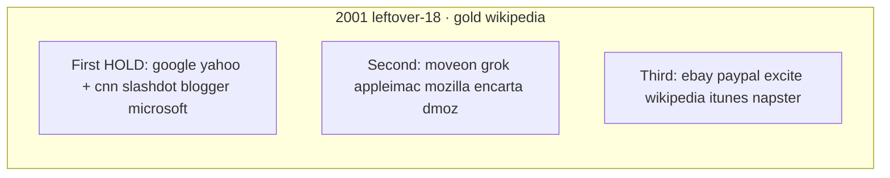

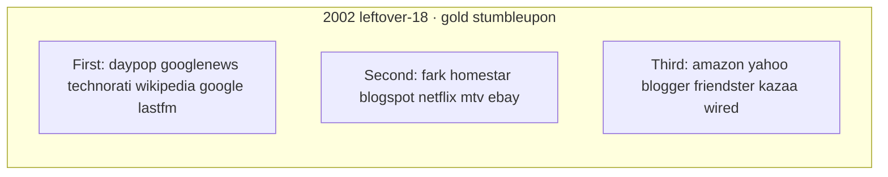

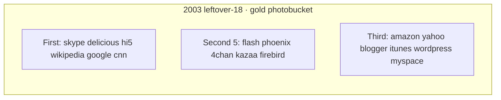

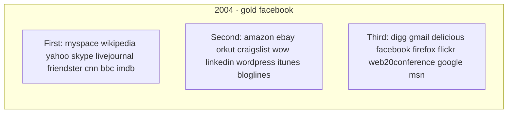

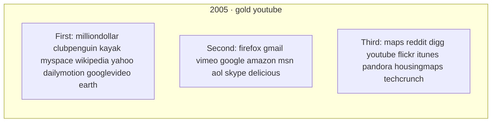

YES leftover: 1999 cnn microsoft sourceforge · 2000 womencom baidu askjeeves netscape hampsterdance y2k gamespot hotbot dmoz about infoseek bbc · 2001 archive amazon movabletype xp msn askjeeves · 2002 phoenix mozilla ipod isp movabletype · 2003 linkedin friendster adsense bloglines · 2004 microsoft aol · 2005 facebook lastfm reader secondlife blogger wordpress cnn apple mashable programmableweb analytics googleearth yelp odeo linkedin.

---

## 2006–2010

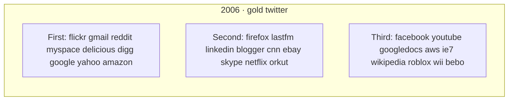

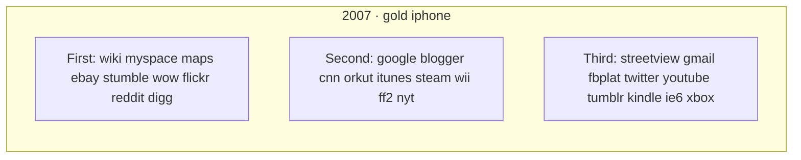

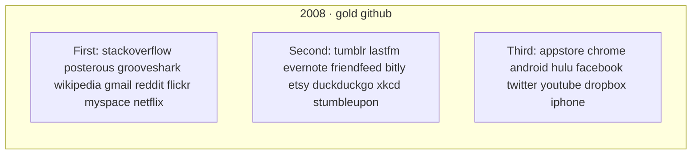

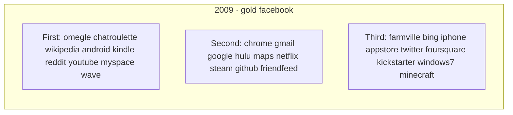

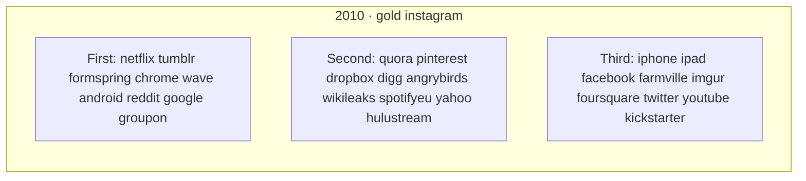

YES leftover: 2006 vimeo reader secondlife wow mashable techcrunch wordpress msn apple · 2007 li sl nintendo bbc amz nfx · 2008 wordpress google yahoo delicious digg mashable vimeo linkedin nyt · 2009 safari ie8 gvoice palmpre · 2010 instant flickrbox gmailtab facetime windowsphone.

---

## 2011–2017 · 2019

```mermaid
flowchart LR
  subgraph y11 [2011 · gold googleplus]
    R1[First: icloud pinterest linkedin kindlefire minecraft twitch dropbox chrome gmusic]
    R2[Second: android4 lion netflix reddit steam skype github lastfm xbox]
    R3[Third: spotify iphone facebook ipad airbnb instagram twitter qwikster + youtube]
  end
```

```mermaid
flowchart LR
  subgraph y12 [2012 · gold instagram]
    S1[First: drawsomething googledrive snapchat youtube uber buzzfeed chrome soundcloud surface]
    S2[Second: trello lyft kindlefire tumblr netflix gmail amazon twitter waze]
    S3[Third: medium path flipboard pinterest facebook iphone wikipedia + reddit windows8]
  end
```

```mermaid
flowchart LR
  subgraph y14 [2014 lean · gold whatsapp]
    T1[First 6: snapchat instagram uber twitter musically14 truecrypt]
    T2[Second 3: oculus serial ello]
    T3[Third 9: youtube wikipedia facebook heartbleed icebucket iphone material slack twitch]
  end
```

```mermaid
flowchart LR
  subgraph y15 [2015 · gold periscope]
    U1[First: instagram spotify netflix meerkat applemusicsub win10get vine echo youtube]
    U2[Second: uber twitch slack tinder reddit twitter facebook gmail chrome]
    U3[Third: googlephotos windows10 applemusic edge snapchat discord letsencrypt + wikipedia nyt]
  end
```

```mermaid
flowchart LR
  subgraph y16 [2016 lean · gold IG Stories]
    V1[First 6: slack reddit netflix youtube alphago assistant]
    V2[Second 3: houseparty inbox jio]
    V3[Third: pokemongo iphone vine snapchat musically + smario fblive moments superbowl]
  end
```

```mermaid
flowchart LR
  subgraph y17 [2017 · gold Face ID]
    W1[First: snapipo bitcoinath echoshow reddit youtube hqtrivia notpetya yahoo3b discord17]
    W2[Second: amazon android8 bitmoji cloudbleed creditfrz flashend pixel2 signal17 telegram17]
    W3[Third: fortnite teams switch wannacry musically equifax + xboxonex slack17 pixelbook]
  end
```

```mermaid
flowchart LR
  subgraph y19 [2019 · gold disneyplus]
    X1[First: facebook fortnite hidelikes instagram netflix reddit slack snapchat twitch]
    X2[Second: youtube zoom10m wework gplus pinterest twitter spotify tumblr wikipedia]
    X3[Third: tiktok arcade appletv stadia airpodspro chrome windows10 + oculusquest nyt]
  end
```

YES leftover: 2011 chromebook ubercab silk rdio jobs nintendo roblox wallet maps · 2012 googleplus nexus play yahoo windows-phone drivebox tumblr12 · 2014 none extra · 2015 messenger hbonow secret titleii ytgaming pinterest tumblr github linkedin · 2016 dyn · 2017 odyssey · 2019 area51 libra applecard.

---

## 2021–2022

```mermaid
flowchart LR
  subgraph y21 [2021 · gold att]
    Y1[First: youtube wikipedia discord clubhouse nft squid shorts airtag gme]
    Y2[Second: beeple bayc opensea coinbase spaces21 fboutage haugen log4j rbxipo]
    Y3[Third: signal copilot meta windows11 flash chrome windows10 facebook + tiktok]
  end
```

```mermaid
flowchart LR
  subgraph y22 [2022 · gold chatgpt]
    Z1[First: youtube wikipedia facebook ftx steamdeck passkeys midjourney lensa3 tiktok]
    Z2[Second: temu merge lastpass whisper copilotga ios16 figmaad reddit instagram]
    Z3[Third: twitter wordle stablediffusion mastodon bereal dalle2 chrome windows10 + craiyon]
  end
```

YES leftover: 2021 ios15 whatsapp21 telegram21 dalle1 codex win365 pixel6 robinhood paramount · 2022 discord netflix github notionai slack heardle quordle lockdown win22h2.

---

## Dest-true leftover e2e packs

| Command | What it walks |
|---------|----------------|
| `npm run test:e2e:1994-1998-3x` | leftover-3× + YES leftover + three-machines |
| `npm run test:e2e:1999-2005-3x` | leftover-3× + YES leftover + three-machines |
| `npm run test:e2e:2006-2010-3x` | leftover-3× + YES leftover + three-machines |
| `npm run test:e2e:2010-2015-3x` | leftover-3× + YES leftover + three-machines |
| `npm run test:e2e:2016-2019-3x` | leftover-3× + YES leftover |
| `npm run test:e2e:2018-2022-3x` | leftover-3× + YES leftover + three-machines |
| leftover 4× + leftover-unique | leftover 4× dest-true + leftover-unique strips |
