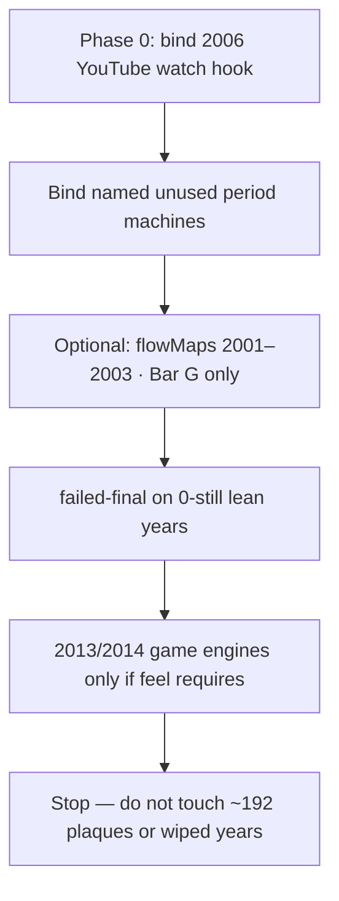

# Museum-grade A — costed close plan

**Date:** 2026-09-04  
**Source:** deep-research-2 (partial; claims verified against live tree).  
**Status:** plan only. Do not implement until a phase is named.  
**Law:** live tree + `scripts/itt_gate.py` `SHIP_YEARS` + [`DISK-TRUTH.md`](DISK-TRUTH.md). Hub **25 years** (1994–2017 + 2019). **2018 / 2020–2025 wiped.** Guided **exactly 6**. Stars do not move. Leftover never stamps official `whenKey`. Never invent brand pixels. ILS June websites table **ends 2018**.

Do **not** mix bars. Do **not** restore wiped years. Do **not** grow lean forests. Do **not** rewire the ~192 generic official-verb plaques unless a dest is named.

Companions: [`P0-OFFICIAL-DEST-DEAD-WRITERS-MAP-2026-09-04.md`](P0-OFFICIAL-DEST-DEAD-WRITERS-MAP-2026-09-04.md) · [`MUSEUM-GRADE-A-MINUTE-FLOWS-2026-09-04.md`](MUSEUM-GRADE-A-MINUTE-FLOWS-2026-09-04.md) (visitor minutes + exact next-links) · [`MUSEUM-GRADE-A-TO-100-EVERY-YEAR.md`](MUSEUM-GRADE-A-TO-100-EVERY-YEAR.md) (hub range lags) · [`MUSEUM-GRADE-100-GATES-EVERY-YEAR-1994-2023.md`](MUSEUM-GRADE-100-GATES-EVERY-YEAR-1994-2023.md) (scoreboard lags).

---

## 1. What 100% means

| Bar | 100% | Now |
|-----|------|-----|
| **G — ship gates** | Door + gold dest + official 10 **files** + 2× + flowMaps + game/famous | Dest files **25/25**. G6 hole: no `ITT.flowMaps["2001"|"2002"|"2003"]`. Stale GATES “28/28 = 10/10” loses to disk. |
| **A — museum feel** | Star is a period product verb · every official-10 dest writes `whenKey` from a **year-true** control · leftover is not the official save · forest does not drown thesis · costume era-true · stills or `[failed-final]` | **0/25 years** |

Leftover isolation is already closed: leftover keys remapped (`*-lx` / `*-ab`); `js/immersion/leftover-official.js` refuses to stamp a trail `whenKey`.

---

## 2. Close order (Bar A)

Six A slices, in this order: gold product verb → official dest writes from period control → leftover is not the official save → home fold does not drown thesis → costume era-true → harvest or `[failed-final]`. No year is 100% A until the last slice.

---

## 3. Phase 0

**Only one official dest is actually dead.**

| Dest | Official key | Disk truth | Cost |
|------|--------------|------------|------|
| `years/2006/sites/youtube/index.html` | `itt06-yt` | Leftover writes `yt-lx`. Writer `bootWatch` in `js/immersion/year-2006-extras.js` needs `[data-yt06-watch]`. Button **not on dest**. | **S ≤2h** · 1 HTML · 0 new JS |

**2013 Loop Six / 2014 Tile Fold are leftover-shaped, not dead.**  
`year-2013-extras.js` `bootGuess` writes `itt13-game-loopsix` on New Game. `year-2014-extras.js` `bootTile` writes `itt14-game-tilefold` after two folds. Extras boot from `boot.js`. There is still **no** Loop Six / Tile Fold engine — that is feel (L each), not a dead writer.

Nearby, not Phase 0:

- 2006 News Feed already writes `itt06-feed` via leftover-shaped `[data-ff06-save]`.
- 2006 official n=10 is leftover `linerider.html`; cabinet is TrailSled `itt06-game-sled`.
- 2007 gold + Safari Queue already write via `[data-official-verb]`.
- 2010 Instagram dual-writes `itt10-ig-posts` (trails) and `itt10-ig` (alias). Leave it.

---

## 4. Named dests to bind (after Phase 0)

Rewire **only** dests that already host an unused period machine. Leave `js/immersion/official-verb.js` as the shared plaque writer.

| Year | Dest | Bind | Cost |
|------|------|------|------|
| 1995 | `sites/amazon/index.html` | existing machine | M pass |
| 1995 | `sites/auctionweb/item-laser.html` | existing machine | M pass |
| 1996 | `sites/hotmail/index.html` | Enter already has `data-official-verb` | S |
| 1996 | Space Jam | **sacred — do not stamp** | — |
| 1998 | `sites/amazon/music.html` | unused machine | M pass |
| 2004 | `sites/gmail/index.html` | Sign in already verbed | S |
| 2004 | `sites/flickr/index.html` | bind Upload, not leftover host | M pass |
| 2004 | Facebook dest **if** it already has a product machine | bind | M pass |
| 2005 | `sites/maps/index.html` | bind `data-maps-search` / drag | M pass |
| 2008 | `sites/appstore/index.html` | bind catalog, not “Install leftover” | M pass |
| 2008 | `sites/chrome/index.html` | unused machine | M pass |

**13 dests in scope** (Phase 0 YouTube + the bind list). The other ~192 stay on the plaque.

---

## 5. Per live year

Bar G dest files are 10/10 on every live year. Bar A is not 100 on any row. Forests: 1994–2006, 2008. Lean: 2007, 2009, 2011, 2013–2017, 2019.

| Year | Bar G | Named Bar A gap | NEVER | Cheapest close |
|------|-------|-----------------|-------|----------------|
| 1994 | dests ✓ | NASA leftover plaque | yahoo.com as gold | leave plaque |
| 1995 | dests ✓ | Amazon + AuctionWeb unused machines | — | bind |
| 1996 | dests ✓ | HoTMaiL Enter already verbed | Space Jam sacred | bind Enter; leave Jam |
| 1997 | dests ✓ | generic plaques | — | leave |
| 1998 | dests ✓ | Music unused machine | — | bind Music |
| 1999 | dests ✓ | generic plaques | — | leave |
| 2000 | dests ✓ | generic plaques | — | leave |
| 2001 | dests ✓ · **no flowMaps** | leftover beside Search | — | add flowMaps only |
| 2002 | dests ✓ · **no flowMaps** | generic plaques | — | add flowMaps only |
| 2003 | dests ✓ · **no flowMaps** | generic plaques | — | add flowMaps only |
| 2004 | dests ✓ | Gmail/Flickr/FB machines | — | bind |
| 2005 | dests ✓ | Maps leftover vs unused search/drag | — | bind search/drag |
| 2006 | dests ✓ | **dead YouTube writer** | no google.com habit dest after 2006 | Phase 0 hook |
| 2007 | dests ✓ | gold + game are official-verb | Chrome / App Store dest / 3G / 292-HTML / `iphone/about.html` | leave Safari Queue |
| 2008 | dests ✓ | App Store + Chrome unused machines | — | bind |
| 2009 | dests ✓ | 0 stills | — | `[failed-final]` or harvest · no new folders |
| 2010 | dests ✓ | dual-write · 0 stills | — | leave dual-write · harvest last |
| 2011 | dests ✓ | 0 stills | `itt11-groupon` · `tumblr` · `wiki` · `ig-posts` | leave dests · harvest last |
| 2012 | dests ✓ | 0 stills | — | harvest last |
| 2013 | dests ✓ | extras write Loop Six; no engine | — | engine only if feel requires · no new folders |
| 2014 | dests ✓ | extras write Tile Fold; no engine | Google leftover never a dest · HTML ≤70 | engine only if feel requires |
| 2015 | dests ✓ | 0 stills | Watch / Meerkat / Stories as star | `[failed-final]` or harvest · no new folders |
| 2016 | dests ✓ | 0 stills | Peach dest | `[failed-final]` or harvest |
| 2017 | dests ✓ | 0 stills | — | `[failed-final]` or harvest |
| 2018 | **wiped** | — | do not scaffold | boarded |
| 2019 | dests ✓ | 0 stills | trial never writes · no June 2019 ILS digit | `[failed-final]` or harvest |
| 2020–2025 | **wiped** | — | do not scaffold | boarded |

---

## 6. Measurable cost

| Work | Hours | Files | Lifts |
|------|-------|-------|-------|
| Phase 0: `[data-yt06-watch]` on 2006 YouTube | **S ≤2h** | 1 HTML · 0 new JS | 1 dead official key |
| Bind HoTMaiL Enter + Gmail Sign in | **S** | 2 HTML | 2 dests already verbed |
| Bind unused machines (Amazon, AuctionWeb, Music, Flickr, Maps, App Store, Chrome, optional 2004 FB) | **M 2–8h** one pass | ~8 HTML · 0 new JS | ~8 dests |
| G6 flowMaps 2001–2003 | **S** | 1 JS config | 3 years Bar G only |
| 2013 Loop Six + 2014 Tile Fold engines | **L 1–2d each** | 2 HTML + 0–2 JS | feel, not write |
| `[failed-final]` on 0-still years | **S–M** | gold + official dests on 9 years | last A slice |
| Harvest real stills | **L–XL** | same 9 years | only if not failed-final |
| Remaining ~192 plaques / new dests / wiped trees | **do not do** | — | 0 by law |

**In scope:** 13 dests · 0 required new JS · 9 years stills-or-failed-final.  
**e2e:** prove `itt06-yt` on watch; prove named rewires write from the period control, not the leftover plaque. one-thing stays the gold pack.

Hours are bands, not a stopwatch.

---

## 7. ROI rank

1. 2006 YouTube hook — only dead official writer.  
2. HoTMaiL + Gmail — already carry `data-official-verb`.  
3. Other named unused machines — one HTML pass.  
4. flowMaps 2001–2003 — Bar G, not A.  
5. `[failed-final]` on 0-still years.  
6. 2013 / 2014 engines — feel only.  
7. Harvest stills.  
8. Stop.

Home-fold and costume have no cheapest named HTML in this pass. Do not grow forests to chase them.

---

## 8. Uncertainty

- Dest-existence 250/250 taken from the 2026-09-04 P0 scan; this pass did not re-walk every file.  
- 2013/2014 official keys **can write** via extras if extras boot (verified in JS). They are not dead writers.  
- ~192 is a bucket count, not a new dest-by-dest roster.  
- A-to-100 / GATES hub ranges lag disk (still board 2006/2007 or score 2018 live).  
- No Wayback / WDM queue was fetched; stills = harvest or `[failed-final]`.

---

## 9. Done when

- [x] Playing 2006 YouTube writes `itt06-yt`; leftover still writes `yt-lx` only.  
- [x] Named unused machines write official keys from the period control.  
- [x] Optional: `ITT.flowMaps` exists for 2001–2003.  
- [x] Lean 0-still dests have harvest **or** `[failed-final]`.  
- [x] Wiped years still have no tree. ~192 plaques untouched unless named.
