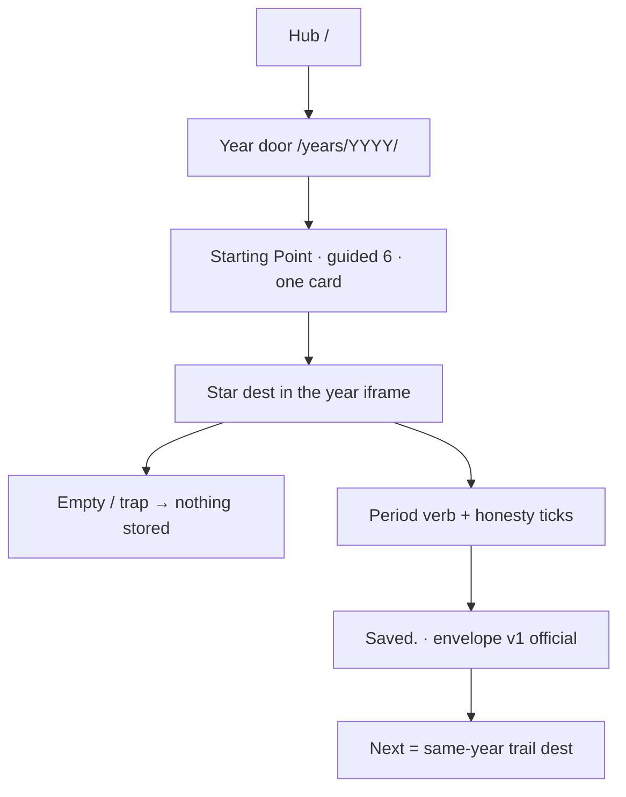

# Museum-grade UI + UX — completion path

**Date:** 2026-10-09  
**Status:** Slices A–E implemented on dests already on disk. Slice F public tree waits on **push**. Not ship law.  
**Ship law:** [`DISK-TRUTH.md`](DISK-TRUTH.md) · `js/year-card.json` · `scripts/itt_gate.py` `SHIP_YEARS`.  
**Already shipped chrome map:** [`MUSEUM-GRADE-UI.md`](MUSEUM-GRADE-UI.md) phases 1–7. Do not reopen those as a new program.  
**Phase locks (A–E):** [`MUSEUM-GRADE-UX-PHASES.md`](MUSEUM-GRADE-UX-PHASES.md) · `e2e/ux-phase1-honesty.spec.js` through `e2e/ux-phase5-2015.spec.js`. Off dest-true 12.  
**Honesty / envelope:** [`PROD-USER-DATA-SRP.md`](PROD-USER-DATA-SRP.md) · [`WORKING-FLOW-PHASES.md`](WORKING-FLOW-PHASES.md).  
**Current holes:** [`YEAR-INCOMPLETE-NOW.md`](YEAR-INCOMPLETE-NOW.md).  
**All-phase scan:** [`PHASE-SCAN.md`](PHASE-SCAN.md) — improvisation, shortfalls, inconsistencies, broken flows. Not ship law.  
**Local:** http://127.0.0.1:8080 · **Public:** https://sourabhligade.github.io/internet-through-time/ (origin tree; local is ahead until **push**).

Museum grade is a visitor who can enter any of the **24 live doors**, tell the year from the window, finish **one star verb**, and leave on a trail that stays that year. Empty, trap, and incomplete write nothing. Status is `Saved.` or `This browser blocked the save.` Leftover never stamps official n=1–10. It is **not** more dest folders, a shared Chrome skin, a modern lobby, leftover-3×, or restoring 2015 / 2016 / 2017–2019 / 2023–2025.

Do not dest-farm. Do not unfreeze 1994–2006 dest HTML unless a dest-attribute fix is named. Do not invent period logos. Slice F starts only on the word **push**.

---

## Standing (2026-10-09)

Intended ship is about **98%**. Visitor dest-true **415** is green. Hub **24 / 24**. Named packs on every live year. Working-flow phases 1–6 marked done on all eight 4-year bands. leftover-2× unique **1,138** on disk. leftover-3× unique catalogs **empty**.

Chrome phases 1–5 and 7 in [`MUSEUM-GRADE-UI.md`](MUSEUM-GRADE-UI.md) already passed their e2e locks (cards, footer/clock, year window, 390px, builder words clipped, public URL). Phase 6 was a checklist walk, not a dest-farm.

Three **done-when** lines in that file still overclaim against live dests. This file is how those lines become true **on dests already on disk**.

| Done-when (MUSEUM-GRADE-UI) | Disk now | What “complete” means |
|-----------------------------|----------|------------------------|
| 6. Trap / empty / missing pick write nothing. The star key is the only official save. | Slice A: GO Catch extras skip when the dest has `[data-official-verb]`. Reactions extras do not bind Like-only after dest-true. Trail complete is reqs + need + verb. Gold leftover on 1994–2001 stars still writes leftover keys, not the star. | One official envelope `{v:1, kind:official, real:true}` on the trail key. Extras skip when any `[data-official-verb]` exists on that dest. Warehouse complete paths fill reqs + need then click the verb. |
| 7. Visitor never sees `[failed-final]`, a storage key, or “Open leftover” as the thing to do. | Clip CSS hides most `.itt-pixel-failed` and `code` keys. 2015 is omitted; React YearRail is gone. Wikipedia UseMod still paints a visible reconstruction line. Five leftover dests keep **Open leftover**. Gold leftover packing is first paint on eight 1994–2001 stars. | Clip stays. Do not delete `[failed-final]` from HTML. Gold leftover on official dests stays a leftover key. Visitor action on a star is the period verb. |
| 9. `docs/checklists/` ticked for every live door. | Official 10 walked. Open boxes are 2000 leftover n=11–40, 2011 image-readme. 2015 is omitted. | Tick only after a visit. Image-readme stays `[ ]`. Do not invent logos. Do not dest-farm `years/2015/`. |

Local HEAD `1f418c9c9` is **4 commits ahead** of origin `81c652c65`. GitHub Pages serves origin. Museum-grade on the public URL waits on the word **push**.

---

## What this file will not do

These stay wait-to-name. They are **not** museum-grade UI+UX.

| Wait | File | Until |
|------|------|-------|
| 2008 Pack B/C (~70 dest folders) | [`2008-IMPLEMENT-PHASES.md`](2008-IMPLEMENT-PHASES.md) | `implement 2008 Pack B` / `Pack C` |
| Dest doubling | [`FAMOUS-DOUBLE-CRITERIA.md`](FAMOUS-DOUBLE-CRITERIA.md) · leftover-2× links already on disk | the word `2x` |
| Famous-double step 2 (opensocial, leftover spotify, houseofcards, dalle) | same | `famous-double step 2` |
| Grow trail n to 10 (2004=8, 2013=9, 2014=9) | [`YEAR-INCOMPLETE-NOW.md`](YEAR-INCOMPLETE-NOW.md) | named dest-farm (do not) |
| Restore 2017–2019 / 2023–2025 | DISK-TRUTH | stay 0 |
| leftover-3× unique catalogs | empty | stay empty |
| Invent 2011 period logos | `assets/period/2011/` | a real capture, never a draw. 2015 is omitted (no period tree) |
| Unfreeze 1994–2006 dest HTML | forests | a named dest-attribute only |
| Full warehouse `npm test` as the UX gate | dest-true 12 | do not |

---

## How to complete (named slices)

Slices A–E ran together as `all of it`. After this pass: related Playwright, `npm run check`, dest-true 12, `npm run build`. Push only when the user says **push**.

### Slice A — Honesty writers — done

Slice A closed extras dual-write on dests that still exist: 2006 YouTube Watch / Twttr, 2009 Like, 2010 iPad order skip extras when the dest or button owns `[data-official-verb]`. Plot / Guess Doodle Start are year games (DO-NOT-APPLY), not dual-star extras.

| # | Dest | Bug | Fix |
|---|------|-----|-----|
| A4 | `e2e/year-pack-io.js` | `trapThenOfficial` asserts `blob.real` only. Kit extras also set `real: true`. | Assert `blob.v === 1` and `blob.kind === "official"`. |

**Done when:** dest-true 12 still green. Visitor sees one sentence: `Saved.`

### Slice B — Dest in the year window (`dest in window`) — implemented; B1 first-boot abort closed

Museum-grade look is the dest **inside** that year’s OS/browser frame.

Visitor path (always):

1. Hub http://127.0.0.1:8080/
2. Year door http://127.0.0.1:8080/years/YYYY/
3. Starting Point chip → star dest in the iframe

Direct dest URLs stay HTTP 200. They are not the grade path. Opening `lucky.html` as its own tab is dest raw on purpose.

| # | Gap | Where | Fix class |
|---|-----|-------|-----------|
| B1 | `setIframeSrc` can abort the first `pages/home.html` load (`net::ERR_ABORTED`) and cancel the CSS import chain | `js/browser/create.js` | **Closed.** `seedHistory` leaves relative `pages/home.html` loading (no halt/`about:blank` upgrade). `hideOverlay()` already seeds; first-boot does not seed twice. `setIframeSrc` bounce stays for same-path Home/reload. Keep sandbox `allow-same-origin allow-scripts` so dest JS and localStorage share origin. Lock: `e2e/ux-phase2-window.spec.js`. |
| B2 | Year shell `height: 100%` vs dest `itt-dest-page.css` overflow fight | [`ITT-CSS-LAYERS.md`](ITT-CSS-LAYERS.md) | Standing. Shell owns the window. Dest owns the room. Do not paint 1994 with Chrome-habit. |
| B3 | Gold leftover packing first paint on 1994–2001 official stars | `itt-leftover-fold.css` shows `[data-lo-panel][data-itt-gold-lx]` on `html[data-official-key]` | Standing. Gold stays leftover (`display:block; clear:both; margin-top:1.5em`). Do not make it the star verb. Did not restyle dest body flex/order (would unfreeze dest layout). |
| B4 | Lean leftover dests use period leftover face (2008 XP face is on disk) | `css/leftover-dest-face.css` | Standing. Recheck 2007–2009 leftover dests at 1100px after any selector edit. |

**Done when:** hub → year → star, the window still says that year, the verb is in the frame, leftover workshop stays folded unless `?deep=1`.

### Slice C — Receipt glass (`receipt glass`) — done on named dests

Visitor-facing copy. Keys stay in storage. They leave the glass.

| Event | Copy |
|-------|------|
| Write accepted | `Saved.` |
| Quota / private mode | `This browser blocked the save.` |
| Empty / trap / incomplete | Hold sentence in red. Nothing stored. |

Live official dests print `Saved.` Keys stay in storage. Do not rewrite every leftover dest in other years in one pass. HTML official-verb hold is `#a00`; `Saved.` is `#060`. 2015 is omitted.

Clip stays: `.itt-pixel-failed`, `code[data-itt-clip]`. Leave `[failed-final]` in HTML. Wikipedia reconstruction line is exhibit copy; do not treat it as a JS exception.

**Done when:** star dests in the slice print `Saved.` or blocked, never the storage key, never a second extras error after a legal save.

### Slice D — Phone 390 rewalk (`phone 390 rewalk`) — lock re-run

Phase 4 passed 2026-10-04. Later CSS (leftover-dest-face 2008, `--chrome-light`, 2009 traps) can regress.

Viewport **390×844**. One pass per chrome group, not 5,000 dests.

| Group | Open |
|-------|------|
| Win95 | http://127.0.0.1:8080/years/1994/ |
| Win98 / IE | http://127.0.0.1:8080/years/1998/ |
| XP | http://127.0.0.1:8080/years/2004/ and http://127.0.0.1:8080/years/2008/ |
| Like | http://127.0.0.1:8080/years/2009/ |
| Light / G+ | http://127.0.0.1:8080/years/2011/ |
| Vine | http://127.0.0.1:8080/years/2013/ |
| Flat | http://127.0.0.1:8080/years/2014/ |
| Omitted 2015 | http://127.0.0.1:8080/app/index.html#/year/2015 — not a door |
| Chrome habit | http://127.0.0.1:8080/years/2022/ |

Pass: menubar inside 390, directory reachable, guided still six, cards still one card, no sideways scroll, Chrome-habit chips ~16px. Fail: a shared phone skin that repaints 1994 and 2022 the same way.

Lock already on disk: `e2e/phase4-phone.spec.js`. Re-run it. Fix only the group that fails.

### Slice E — 2015 omitted lock — done

2015 is omitted. No `years/2015` tree. No invented HTML forest.

| Check | Pass |
|-------|------|
| Hub card | none |
| Hash | `/app/index.html#/year/2015` is not a door. Never Periscope. |
| `#/year/2017` | Not-a-door. Never Periscope |
| Dest-farm | Do not dest-farm `years/2015` |

Rebuild: `npm run build` from repo root. Do not hand-edit `app/assets/`. Image-readme stays `[ ]`.

### Slice F — Public tree matches local (`push`)

Museum-grade on the public URL is the **same tree** as local :8080.

1. Slices A–C green on dest-true 12.  
2. User says **push**.  
3. `museum/1994-2020-lean` updates. GitHub Pages (legacy, root `/`) serves the 24 doors.  
4. Actions billing (#17) still will not run the workflow. Local `npm run ci` stays the gate.  
5. Recheck https://sourabhligade.github.io/internet-through-time/ hub + one door per chrome group.

Do not add 2017–2019 or 2023–2025 to Pages.

---

## Visitor walk (grade path)

Do this after each named slice. Tick the checklist line only after the URL does what the line says.

Stars to open (one per live year):

| Year | Star | Local URL |
|------|------|-----------|
| 1994 | CSotD | http://127.0.0.1:8080/years/1994/ then chip |
| 1995 | SSL checkout | http://127.0.0.1:8080/years/1995/sites/amazon/ssl-checkout.html from the year door |
| 1996 | Portal Wars | http://127.0.0.1:8080/years/1996/sites/portals/wars.html |
| 1997 | PointCast | http://127.0.0.1:8080/years/1997/ |
| 1998 | I'm Feeling Lucky | http://127.0.0.1:8080/years/1998/sites/google/lucky.html |
| 1999 | AIM | http://127.0.0.1:8080/years/1999/ |
| 2000 | MapQuest | http://127.0.0.1:8080/years/2000/ |
| 2001 | Wikipedia UseMod | http://127.0.0.1:8080/years/2001/sites/wikipedia/edit.html |
| 2002 | StumbleUpon | http://127.0.0.1:8080/years/2002/ |
| 2003 | Photobucket | http://127.0.0.1:8080/years/2003/ |
| 2004 | thefacebook networks | http://127.0.0.1:8080/years/2004/ · trail n=8 |
| 2005 | YouTube upload | http://127.0.0.1:8080/years/2005/ |
| 2006 | Twttr | http://127.0.0.1:8080/years/2006/ |
| 2007 | iPhone Safari | http://127.0.0.1:8080/years/2007/ |
| 2008 | App Store | http://127.0.0.1:8080/years/2008/ |
| 2009 | Like | http://127.0.0.1:8080/years/2009/ |
| 2010 | Instagram iOS | http://127.0.0.1:8080/years/2010/ |
| 2011 | Google+ | http://127.0.0.1:8080/years/2011/ |
| 2012 | IG Android | http://127.0.0.1:8080/years/2012/ |
| 2013 | Vine 6s | http://127.0.0.1:8080/years/2013/ · trail n=9 |
| 2014 | WhatsApp Install | http://127.0.0.1:8080/years/2014/ · trail n=9 |
| 2015 | omitted | http://127.0.0.1:8080/app/index.html#/year/2015 is not a door |
| 2020 | Zoom Leave | http://127.0.0.1:8080/years/2020/ |
| 2021 | Ask App Not to Track | http://127.0.0.1:8080/years/2021/ |
| 2022 | ChatGPT Send | http://127.0.0.1:8080/years/2022/ |

---

## Gate (this path is green)

| Check | Pass |
|-------|------|
| `npm run check` | 0. DEST_FIELD / WEAK_REAL / HASH_CTA stay 0 |
| `npm run test:e2e:dest-true` | 415 |
| `npm run build` | only if the React omitted-hash hall changed |
| `e2e/phase4-phone.spec.js` | after slice D |
| `e2e/phase5-glass.spec.js` | after slice C |
| Hub + one door per chrome group on :8080 | verb in the frame, year in the window |
| Public URL | same 24 doors after **push** |

Full warehouse `npm test` is not the UX gate.

---

## Name next

Slices A–E are in. B1 first-boot abort is closed. Remaining museum-grade close:

1. Recheck the visitor URLs on :8080 (no browser MCP).
2. **push** (slice F) — public tree matches local. GitHub Actions still will not run (#17).

Pack B/C, `2x`, famous-double step 2, and restore bands are other files. They do not make the window a museum.

All-phase scan (every program vs disk): [`PHASE-SCAN.md`](PHASE-SCAN.md).
