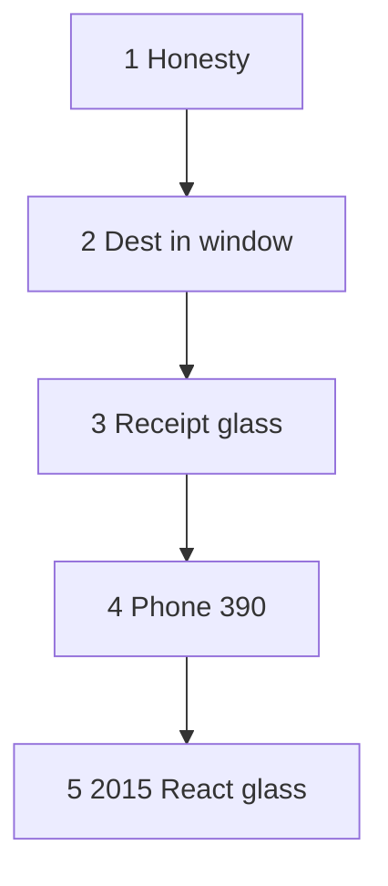

# Museum-grade UX — 5 phases

**Date:** 2026-10-09  
**Status:** Phases 1–5 implemented on dests already on disk. Not ship law. Off dest-true 12.  
**Ship law:** [`DISK-TRUTH.md`](DISK-TRUTH.md) · `js/year-card.json` · `scripts/itt_gate.py` `SHIP_YEARS`.  
**Chrome map (shipped):** [`MUSEUM-GRADE-UI.md`](MUSEUM-GRADE-UI.md) phases 1–7. Do not reopen those as a new program.  
**Slice map:** [`MUSEUM-GRADE-UX-COMPLETE.md`](MUSEUM-GRADE-UX-COMPLETE.md).  
**All-phase scan:** [`PHASE-SCAN.md`](PHASE-SCAN.md).  
**Local:** http://127.0.0.1:8080

These five phases lock visitor honesty, the dest in the year window, receipt glass, phone 390, and the 2015 React door. They do not dest-farm. They do not restore 2017–2019 / 2023–2025. B1 first-boot abort is closed (`seedHistory` leaves relative `pages/home.html` loading). `setIframeSrc` bounce stays for same-path Home/reload. Slice F public tree waits on **push**.



| Phase | What it finishes | Lock | State |
|-------|------------------|------|-------|
| 1 | One official envelope. Extras skip when the dest owns `[data-official-verb]`. Empty / trap / incomplete write nothing. | `e2e/ux-phase1-honesty.spec.js` | Implemented |
| 2 | Hub → year door → star dest sits in that year’s iframe. Gold leftover stays leftover. First-boot `pages/home.html` is not `ERR_ABORTED`. Home from a dest still lands Starting Point. | `e2e/ux-phase2-window.spec.js` | Implemented. B1 first-boot abort closed. Gold leftover 3em gap. |
| 3 | Accepted write prints `Saved.` Keys stay in storage. They leave the glass. Empty / trap / incomplete hold in red. Honesty also inside the year iframe. | `e2e/ux-phase3-receipt.spec.js` | Implemented |
| 4 | Chrome groups still fit 390×844. Guided stays six. No shared phone skin. | `e2e/ux-phase4-phone.spec.js` | Implemented. Full 25-door lock remains `e2e/phase4-phone.spec.js`. |
| 5 | 2015 React door: header is the stop, no `itt15-` on the glass, `#/year/2017` is not a door. | `e2e/ux-phase5-2015.spec.js` | Implemented |

Gate after a change in these files: the matching `ux-phaseN-*.spec.js` with `--workers=1`, then `npm run check`. Scan improvisation: `e2e/ux-phase-scan.spec.js` and `e2e/chrome-habit-shell.spec.js`. Dest-true 12 stays the visitor push pack. Full `npm test` is not this gate.

---

## Phase 1 — Honesty writers

One trail key. One envelope `{v:1, kind:official, real:true}`. Empty / trap / incomplete never write the star when official-verb owns the dest.

Same extras class already folded (scan, no dest-farm): 2006 Watch / Twttr, 2009 Like, 2010 iPad order. Plot / Guess Doodle are year games.

**Done when:** dest-true 12 still green. Phase 1 spec green. Visitor sees one writer.

**Local:** http://127.0.0.1:8080/years/1998/sites/google/lucky.html · http://127.0.0.1:8080/app/index.html#/year/2015

---

## Phase 2 — Dest in the year window

Museum-grade look is the dest **inside** that year’s OS/browser frame.

Visitor path:

1. Hub http://127.0.0.1:8080/
2. Year door http://127.0.0.1:8080/years/YYYY/ (2015: http://127.0.0.1:8080/app/index.html#/year/2015)
3. Starting Point chip → star dest in `#content`

Direct dest URLs stay HTTP 200. They are dest-as-tab, not the grade path.

| Check | Pass |
|-------|------|
| Year door iframe | Starting Point `.ott-guided` loads. First `pages/home.html` is not `ERR_ABORTED`. iframe `src` stays relative `pages/home.html` until dest nav. |
| Dest in frame | 1998 Lucky in the iframe. Parent still says 1998. |
| 2022 ChatGPT in frame | Dest HTML, year chrome stays 2022. |
| Gold leftover | `html[data-official-key] [data-lo-panel][data-itt-gold-lx]` is `display:block` with a top gap. Fold CSS keeps `margin-top: 1.5em`. Writes leftover keys, not the star. |
| Direct dest | `/years/1998/sites/google/lucky.html` HTTP 200. |
| Home / reload | Same-path absolute reload still bounces through `about:blank` (`setIframeSrc`). |

**B1 closed:** `seedHistory` no longer upgrades relative HOME through `setIframeSrc` halt + `about:blank`. `hideOverlay()` already seeds; first-boot does not seed twice. Keep sandbox `allow-same-origin allow-scripts`.

**Done when:** hub → year → star, the window still says that year, leftover workshop stays folded unless `?deep=1`. Gold leftover in the iframe writes leftover keys, not the star. First-boot `pages/home.html` is not `ERR_ABORTED`.

---

## Phase 3 — Receipt glass

| Event | Copy |
|-------|------|
| Write accepted | `Saved.` |
| Quota / private mode | `This browser blocked the save.` |
| Empty / trap / incomplete | Hold sentence in red. Nothing stored. |

Named dests in this lock: 1998 Lucky, 2015 Periscope. Status node is `[data-official-status]`, the extras status hook, or React `.status`. It must not print `itt15-`.

Clip stays: `.itt-pixel-failed`, `code[data-itt-clip]`. Leave `[failed-final]` in HTML. Wikipedia reconstruction line is exhibit copy.

Hold / blocked copy is `#a00`. `Saved.` is `#060`. React `OfficialStop` uses `.status.is-hold` / `.status.is-ok` to match official-verb dests.

**Done when:** those dests print `Saved.` or blocked after a legal save. No storage key on the glass. Empty / trap / incomplete hold in red. No second extras error after dest-true.

**Local:** http://127.0.0.1:8080/years/1998/sites/google/lucky.html · http://127.0.0.1:8080/app/index.html#/year/2015

---

## Phase 4 — Phone 390 rewalk

Viewport **390×844**. One pass per chrome group. Fail: a shared phone skin that paints 1994 and 2022 the same way.

| Group | Open |
|-------|------|
| Win95 | http://127.0.0.1:8080/years/1994/ |
| Win98 / IE | http://127.0.0.1:8080/years/1998/ |
| XP | http://127.0.0.1:8080/years/2004/ and http://127.0.0.1:8080/years/2008/ |
| Like | http://127.0.0.1:8080/years/2009/ |
| Light / G+ | http://127.0.0.1:8080/years/2011/ |
| Vine | http://127.0.0.1:8080/years/2013/ |
| Flat | http://127.0.0.1:8080/years/2014/ |
| React | http://127.0.0.1:8080/app/index.html#/year/2015 |
| Chrome habit | http://127.0.0.1:8080/years/2022/ |

Pass: menubar inside 390 when that year has a menubar, directory reachable, guided still six, cards still one card, no sideways scroll, Chrome-habit chips ~16px.

Full 25-door lock: `e2e/phase4-phone.spec.js`. This phase rewalks the groups above.

---

## Phase 5 — 2015 React glass

2015 is the React door. No `years/2015` tree. No invented HTML forest.

| Check | Pass |
|-------|------|
| Hub card | `/app/index.html#/year/2015` |
| Header | The stop you are on. Starting Point shows Periscope as the star. Apple Music header is Apple Music. |
| Verb | In the first screen. No visible `itt15-` leaf. |
| Envelope | `ITT.User.store` → `{real:true, kind:official}` after ticks + title + Go LIVE. Copy `Saved.` |
| Leftover | `ALSO_2015` 20 leftover rooms. No leftover list without `?deep=1`. |
| `#/year/2017` | Heading “2017 is not a door”. Never Periscope. |

Rebuild: `npm run build` from repo root when `react/src/` changes. Do not hand-edit `app/assets/`. Image-readme stays `[ ]`.

**Local:** http://127.0.0.1:8080/app/index.html#/year/2015

---

## How to run

```
npx playwright test e2e/ux-phase1-honesty.spec.js e2e/ux-phase2-window.spec.js e2e/ux-phase3-receipt.spec.js e2e/ux-phase4-phone.spec.js e2e/ux-phase5-2015.spec.js --workers=1
```

Then `npm run check`. Do not add these files to the dest-true 12.

## Wait-to-name (not these phases)

Pack B/C, `2x`, famous-double step 2, trail n under 10, restore absent years, leftover-3×, invent logos, unfreeze 1994–2006, **push**.
