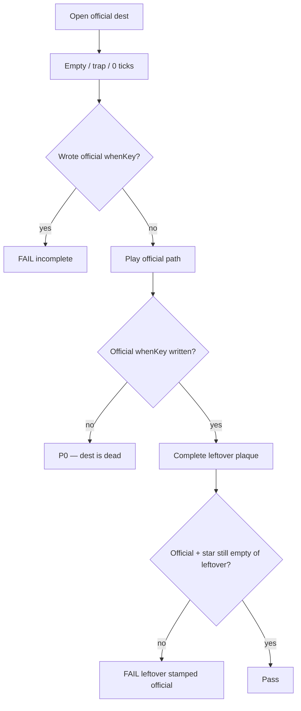
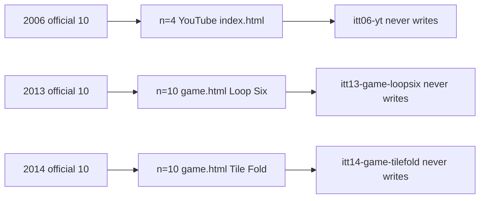
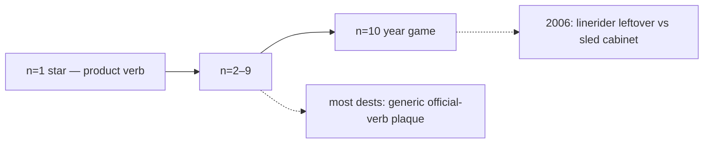
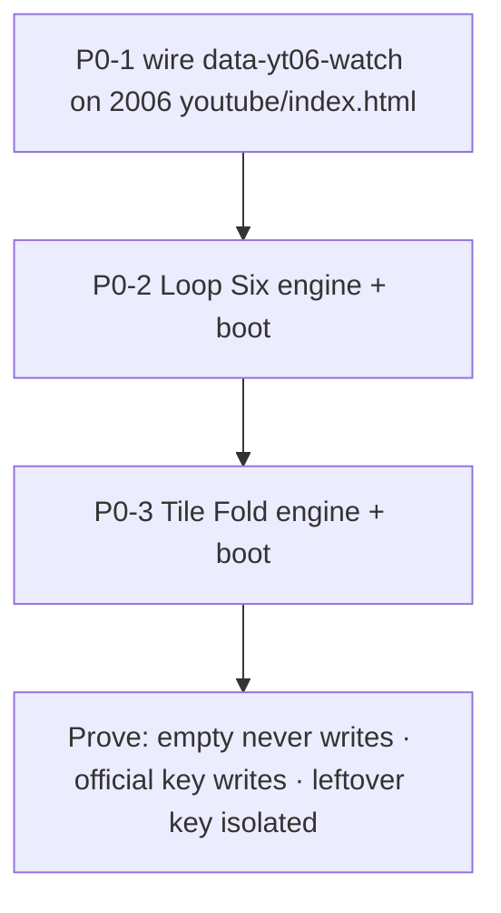

# P0 — official dests whose whenKey never writes

**Date:** 2026-09-04  
**Status:** scan map. Not an implement pass.  
**Law:** live tree + `scripts/itt_gate.py` `SHIP_YEARS` + [`DISK-TRUTH.md`](DISK-TRUTH.md). Hub **25 years** · **2018 / 2020–2025 wiped**. Leftover complete is leftover theater. Official REAL = product verb, year-true game `saveBest`, or a dest-specific writer — not leftover `data-lo-save`.

**Do not:** restore 2018 / 2020–2025. Invent dests. Invent brand pixels. Treat leftover-official green as official REAL.

---

## 1. What this scan covered

| Layer | Result |
|-------|--------|
| Live years on disk | **25** (1994–2017 + 2019) |
| Official n=1–10 dest files | **250 / 250** exist |
| Leftover `data-lo-key` = official suffix | **0** |
| Dest-field / weak-real / hash-CTA | **0** |
| Gold dests missing a writer | **0** |
| Guided 6 | **pass** (painted in JS on `pages/home.html`) |
| one-thing rows | every live year present (wiped 2020/2023/2024 rows skip) |

**Not run:** full leftover-official dest e2e (thousands of leftover plaques). That pack is leftover theater.

---

## 2. Check flow (any official dest)

---

## 3. Extreme P0 — official key never writes

Three dests. Playing them cannot stamp the official `whenKey`. Leftover plaques write leftover keys only.

### P0-1 · 2006 n=4 YouTube Google-owned

| | |
|--|--|
| Dest | `years/2006/sites/youtube/index.html` |
| Official | `itt06-yt` |
| Next | `sites/googledocs/index.html` |
| On page | leftover `yt-lx` only |
| Writer that exists | `js/immersion/year-2006-extras.js` `bootWatch` → `[data-yt06-watch]` |
| Why dead | that button is **not on the dest** |
| Complete when | dest has the independent-until-9-Oct watch path; empty / Google-owned-as-March trap never write; complete writes `itt06-yt`; leftover stays `yt-lx` |

### P0-2 · 2013 n=10 Loop Six

| | |
|--|--|
| Dest | `years/2013/sites/playable/game.html` |
| Official | `itt13-game-loopsix` |
| On page | Start + Beat A/B + 15s trap. Leftover `game-loopsix-lx` |
| Scripts | `immersion-2013.js` only. **No** `year-game-boot.js`. **No** Loop Six game JS. |
| Why dead | leftover remapped off official suffix; play buttons do not persist `itt13-game-loopsix` |
| Complete when | game engine + boot bind `saveBest` / `saveJSON` to `itt13-game-loopsix`; empty Start / 15s trap never write; leftover stays `game-loopsix-lx` |

### P0-3 · 2014 n=10 Tile Fold

| | |
|--|--|
| Dest | `years/2014/sites/playable/game.html` |
| Official | `itt14-game-tilefold` |
| On page | Start. Leftover remapped off official suffix |
| Scripts | `immersion-2014.js` only. **No** game engine. |
| Why dead | same as Loop Six |
| Complete when | game engine + boot write `itt14-game-tilefold`; incomplete never writes; leftover stays leftover |

---

## 4. Official-10 shape (not P0)

| Bucket | Count | Meaning |
|--------|------:|---------|
| Gold + year-true product hook | 24 | star dests write |
| Year-true product (n=2–10) | ~17 | dest-specific hook |
| Game cabinet with engine | 17 | `saveBest` / game JS |
| Generic official-verb plaque | ~192 | writes official key; leftover-shaped |
| Dead official dest | **3** | this file |

Generic official-verb is leftover-shaped **on purpose after leftover keys were remapped**. It is P1 if a dest needs a year-true verb (Maps drag, harvest, filter+share). It is **not** P0 — the official key writes.

---

## 5. Nearby holes — do not call P0

| Item | Why not P0 |
|------|------------|
| 2006 n=2 News Feed `itt06-feed` | Writes via leftover-shaped `[data-ff06-save]` in `year-2006-extras.js` |
| 2006 n=10 Line Rider vs TrailSled | Official dest is leftover `linerider.html`. Cabinet `game.html` is sled (`itt06-game-sled`). Split, not dead. |
| 2007 Safari Queue | Official-verb plaque writes `itt07-game-safariq`. Lean door. Not a YearGame engine. |
| 2010 star dual key | Dest writes `itt10-ig-posts` (trails) and `itt10-ig` (one-thing). Dual-write. |
| 2007 / 2009 extras = 0 | Lean-year law |
| Old MD saying 2015 wiped | Live tree + DISK-TRUTH win |
| leftover-official e2e green | Leftover theater |

---

## 6. Implement order if named

1. **P0-1** — put the existing `bootWatch` host on the dest. Do not invent a second YouTube gold (2005 upload stays `itt05-yt-uploads`).
2. **P0-2** — Loop Six playable. Six beats. 15s trap never writes.
3. **P0-3** — Tile Fold playable. Incomplete never writes.
4. Re-scan this file’s §3. Dead list must be **0**.

**Stop.** Do not expand into the 192 generic official-verb dests unless named.
