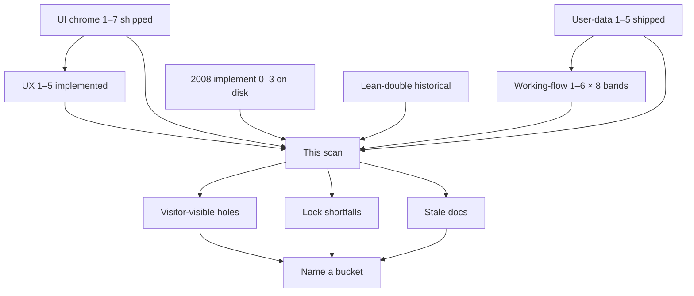
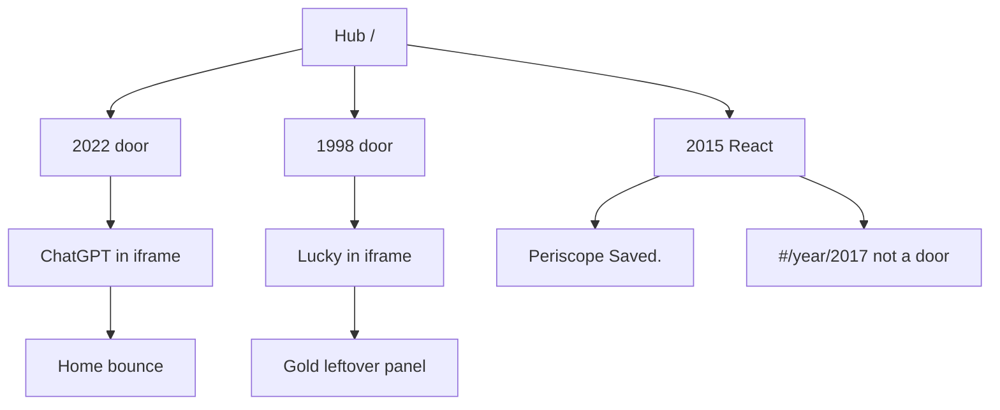

# Phase scan — improvisation, shortfalls, inconsistencies, broken flows

**Date:** 2026-10-09  
**Status:** Scan map plus improvisation buckets implemented on dests already on disk (helper, receipt, gold-lx, docs-scrub, pack-b-verify). **Not ship law.**  
**Ship law:** [`DISK-TRUTH.md`](DISK-TRUTH.md) · `js/year-card.json` · `scripts/itt_gate.py` `SHIP_YEARS`.  
**Year holes:** [`YEAR-INCOMPLETE-NOW.md`](YEAR-INCOMPLETE-NOW.md).  
**UX remainder:** [`MUSEUM-GRADE-UX-COMPLETE.md`](MUSEUM-GRADE-UX-COMPLETE.md) · locks [`MUSEUM-GRADE-UX-PHASES.md`](MUSEUM-GRADE-UX-PHASES.md).  
**Working-flow:** [`WORKING-FLOW-PHASES.md`](WORKING-FLOW-PHASES.md).  
**User-data:** [`PROD-USER-DATA-SRP.md`](PROD-USER-DATA-SRP.md).  
**Chrome UI:** [`MUSEUM-GRADE-UI.md`](MUSEUM-GRADE-UI.md).  
**GitNexus:** repo `internet-through-time` · path `/Users/sourabhligade/internet-through-time` · worktree same · index origin `81c652c65` · **6 behind** HEAD `2b82043bd`.  
**Local:** http://127.0.0.1:8080 · **Public:** https://sourabhligade.github.io/internet-through-time/ (origin tree).

This file is the 2026-10-09 scan of **all phase programs**. Every program is marked done. Improvisation buckets below are now on disk with `e2e/ux-phase-scan.spec.js` plus UX phase 2 / 3 locks. Dest-true **436** holds. Slice F public tree waits on **push**. Public Pages is origin.

Do not dest-farm from this file. Do not restore 2017–2019 / 2023–2025. Do not unfreeze 1994–2006 dest HTML unless a dest-attribute fix is named. Do not grow leftover-3× catalogs. Do not grow trail n. Do not invent 2011 / 2015 logos. Say the bucket name to start: **helper**, **receipt**, **gold-lx**, **docs-scrub**, **commit**, **push**, **Pack B/C**, **`2x`**, **famous-double**, **restore**.

---

## How to read

| Bucket | Meaning |
|--------|---------|
| **Done** | Phase lock exists and the named dests / chrome groups pass. |
| **Broken / visitor-visible** | A visitor can see it on :8080. Highest priority. |
| **Shortfall** | The lock samples a slice. Museum grade on 25 doors is larger than the lock. |
| **Inconsistency** | Two docs, or a doc and disk, disagree. |
| **Improvisation** | Closable on dests already on disk. Starts when that bucket is named. |
| **Named wait** | Pack B/C as new dests, `2x`, famous-double, restore, **commit**, **push**. |
| **Standing law** | Trail n=8/9/9, leftover-3× empty, absent years 0, image-readme `[ ]`. Not unfinished work. |

---

## Git and gates at scan time

| Item | Value |
|------|--------|
| Branch | `museum/1994-2020-lean` |
| HEAD | `2b82043bd` Lock museum-grade UX phases 1–5 |
| Origin | `81c652c65` · local **6** ahead |
| Dirty | B1 `js/browser/create.js`, UX phase 2–4 specs, OfficialStop hold colors, React rebuild `app/assets/index-DL5sRlvD.js` + `index-CjdwpCwF.css`, this scan’s docs |
| dest-true 12 | **436** |
| `npm run check` | **0** (at last UX 3–5 gate) |
| UX phase 1 | 4/4 |
| UX phase 2 | 10/10 (includes first-boot abort) |
| UX phase 3–5 | 23/23 |
| Full warehouse `npm test` | Not this gate |
| GitHub Actions | Will not run (#17 billing lock) |

---

## 1. Museum-grade UX phases 1–5

Locks: `e2e/ux-phase1-honesty.spec.js` … `e2e/ux-phase5-2015.spec.js`. Helper: `e2e/ux-phase-io.js`. Off dest-true 12. Map: [`MUSEUM-GRADE-UX-PHASES.md`](MUSEUM-GRADE-UX-PHASES.md).

| Phase | Claim | What the lock actually walks | Shortfall |
|------:|-------|------------------------------|-----------|
| 1 Honesty | Implemented | Direct dest: 1998 Lucky and remaining live stars. Trap / extras skip / dest-true official envelope. | Other years and stars unproven here. Path is dest-as-tab |
| 2 Dest in window | Implemented. B1 first-boot abort closed | Hub → 1998 / 2022 → Starting Point chip → dest in `#content`. Gold leftover in Lucky iframe writes leftover. Direct Lucky HTTP 200. First `pages/home.html` is not `ERR_ABORTED` | Other doors untested here. Home/reload bounce documented, not asserted |
| 3 Receipt | Implemented | Lucky + Periscope `Saved.` Hold **color** `#a00` on empty/trap and Periscope incomplete | Receipt inside iframe unproven on other stars |
| 4 Phone 390 | Implemented | Chrome **groups**: 1994, 1998, 2004, 2008, 2009, 2011, 2013, 2014, 2022 + 2015 React. HABIT years skip menubar | Full 25-door lock remains `e2e/phase4-phone.spec.js`. UX file omits 1995–97, 1999–2003, 2005–07, 2010, 2012, 2020, 2021 |
| 5 2015 React | Implemented | Hub card, no `years/2015`, header is the stop, no visible `itt15-` leaf, Periscope envelope, `ALSO_2015=[]`, `#/year/2017` not a door | Uses `?stop=` so it never hits the dead `clickRailKey` helper |

**B1 closed (uncommitted):** `seedHistory` leaves relative `pages/home.html` loading. `hideOverlay()` already seeds. First-boot does not seed twice. `setIframeSrc` bounce stays for same-path **absolute** Home/reload. Sandbox stays `allow-same-origin allow-scripts`.

**Standing beside these phases (UX-COMPLETE B2–B4):**

| # | Gap | Where | Class |
|---|-----|-------|--------|
| B2 | Year shell `height: 100%` vs dest `itt-dest-page.css` overflow | [`ITT-CSS-LAYERS.md`](ITT-CSS-LAYERS.md) | Standing. Shell owns the window. Dest owns the room |
| B3 | Gold leftover packing first paint on 1994–2001 official stars | `css/itt-leftover-fold.css` `html[data-official-key] [data-lo-panel][data-itt-gold-lx] { display:block }` | Standing. Kind leftover. Verb shares the room |
| B4 | Lean leftover dests use period leftover face | `css/leftover-dest-face.css` | Standing. Recheck 2007–2009 leftover dests at 1100px after selector edits |

---

## 2. Museum-grade UI chrome 1–7

Map: [`MUSEUM-GRADE-UI.md`](MUSEUM-GRADE-UI.md). Do not reopen as a new program.

| Phase | Claim | Lock | Live note |
|------:|-------|------|-----------|
| 1 Cards | Passed | `e2e/start-cards.spec.js` 26/26 | Starting Point guided + flows share one card per year |
| 2 Footer / clock | Passed | `e2e/phase2-footer-clock.spec.js` | One footer. Status `Document: Done` |
| 3 Year window | Passed | `e2e/phase3-window.spec.js` | Toolbar / address / coach match the year |
| 4 Phone 390 | Passed | `e2e/phase4-phone.spec.js` 26/26 | Full door lock. UX phase 4 is the group rewalk |
| 5 Glass | Passed | `e2e/phase5-glass.spec.js` | Clip CSS. Five dests keep **Open leftover** on purpose |
| 6 Checklist walk | Walked | Checklists | File said 548 ticked / 44 open, then 561/31. Live ~**571 ticked / 22 open** |
| 7 Public URL | Passed 2026-10-07 | GitHub Pages | Serves origin. Local is 6 ahead + dirty. Slice F is **push** |

**Done-when overclaims** (same file, called out in UX-COMPLETE):

| # | Done-when text | Disk |
|---|----------------|------|
| 6 | Trap / empty / missing pick write nothing. Star key is the only official save | True on folded named dests. Extras `store` without `official:true` can still be kind `toy` |
| 7 | Visitor never sees `[failed-final]`, a storage key, or “Open leftover” as the thing to do | Wikipedia UseMod line is on the glass. Gold leftover first paint on eight stars. Five dests keep Open leftover |
| 9 | `docs/checklists/` ticked for every live door | Open: 2000 leftover n=11–40, 2011 image-readme, 2015 image-readme. Image lines stay `[ ]` |

---

## 3. Prod user-data phases 1–5

Map: [`PROD-USER-DATA-SRP.md`](PROD-USER-DATA-SRP.md).

| Phase | Claim | Disk |
|------:|-------|------|
| 1 Honest saves | Implemented 2026-10-07 | `ITT.User.{save,read,finished,store,take}` on `js/lib/util.js`. Envelope `{v:1, year, key, kind, real:true, ts}` |
| 2 Lean loads lean | Implemented | leanBoot 2007–2014 and 2020–2022. EXTRA leftover-official |
| 3 Drop leftover-3× rails | Mostly | Unique catalogs empty (`e2e/leftover-3x-unique.matrix.json` is `[]`). `year-true-leftover.js` held for CORE 1994–2006 |
| 4 Visitor CI / docs | Implemented | dest-true 12. Hub 25 doors. React 2015 only |
| 5 Toys / games / React on User | Structurally done, kind honesty incomplete | Immersion `localStorage.setItem` is 0. Writers go through `User.store` / `User.save` |

**Writer holes that remain:**

| Hole | What happens | Cite |
|------|----------------|------|
| Dual API | Trail engines call `User.save`. Brand / extras / React call `User.store` (~141). `store` infers kind; default is **`toy`** | `js/lib/util.js` `userInferKind` |
| Extras still look like `saveJSON` | Kit wraps `ITT.User.store` | `js/immersion/year-extras-kit.js` |
| Toy overwrite | Blob without `official:true` / leftover flags → kind `toy`. `storageFinished` then hides Next on a star key | `storageFinished` in `year-extras-kit.js` (all live year stars, not only eight) |
| Kit `bootChecks` | Prints `Saved.` and honors a blocked save. Passes `opts.kind` from extra flags | `year-extras-kit.js` |
| Dual keys | 2009 Like extras would write `like` and `fb-likes` if the button were not the verb | `year-2009-extras.js` |
| Passport | Second schema `itt-passport` | `js/museum-progress.js` |
| Gold leftover | Second writer, leftover key, first-paint panel on eight stars | fold CSS + dest HTML |

**Stale memory vs disk (closed already):** AIM official receipt is `Saved.` (`js/immersion/aim.js`). SSL has `data-official-verb` (`years/1995/sites/amazon/ssl-checkout.html`). `storageFinished` lists every live year star.

PROD body still says “Today: **155** `localStorage.setItem` sites.” Immersion setItem is 0.

---

## 4. Working-flow phases 1–6 × eight bands

Map: [`WORKING-FLOW-PHASES.md`](WORKING-FLOW-PHASES.md). Registers: `e2e/registers/band-YYYY-YYYY.json`. Six lock files per band (`register`, `one-writer`, `empty-holds`, `receipt`, `leftover-off-star`, band walk).

| Band | Live years | Save pages (doc) | Phases 1–6 |
|------|------------|-----------------:|------------|
| 1994–1997 | frozen four | 841 | Done. `saveBest` score 0 writes nothing |
| 1998–2001 | frozen four | 1,539 | Done. Lucky / AIM / MapQuest / Wikipedia |
| 2002–2005 | frozen four | 2,319 | Done. Stumble / Photobucket / thefacebook / YouTube upload. 2004 trail n=8 |
| 2006–2009 | 2006 frozen, 2007–2009 lean | 794 | Done. Twttr / Like extras skip when verb owns. Plot Start writes nothing |
| 2010–2013 | lean | 182 | Done. iPad extras skip. Guess Doodle Start writes nothing. 2013 trail n=9 |
| 2014–2017 | 2014, 2015 React. 2017 absent | 115 HTML + 10 React | Done. 2017 stays 0 |
| 2018–2021 | 2020, 2021. 2018–2019 absent | 40 | Done. 2018–2019 stay 0 |
| 2022–2025 | 2022. 2023–2025 absent | 29 | Done. 2023–2025 stay 0 |

**Doc vs disk inside that file:**

- Year table dest folders sum to **4,935**. Total row still prints **4,938**.
- Intro “proved second stores” table is stale. wiped-year extras are gone with the year tree.
- Same table lists 2009 Like and 2006 Twttr as toy. Live buttons carry `data-official-verb` (`years/2009/sites/facebook/index.html`, `years/2006/sites/twitter/index.html`).
- 2010–2013 **header** still says Facebook 1B is the missing checklist line. Same file’s phase 1 says `itt12-facebook` is ticked and heading is Official flows (10).
- 2014–2017 phase 2 still says Stories / GO / Reactions “keep `official:true`” (extras). Live extras skip; official-verb is the writer.

Band walks are warehouse-scale (841 / 1,539 / 2,319 rows). They are off dest-true 12. Full `npm test` is not the visitor push gate.

---

## 5. 2008 implement phases

Map: [`2008-IMPLEMENT-PHASES.md`](2008-IMPLEMENT-PHASES.md).

| Doc | Disk |
|-----|------|
| Phases 0–3 on disk (door, App Store star, official 10, Pack A 35) | True |
| Pack B/C wait · gates `[ ]` | **113** dest folders under `years/2008/sites/`. Pack B slugs **present**: hi5, orkut, bebo, ning, scribd, craigslist, xkcd, opensocial, ie8, **windows7** (`win7` name missing) |
| Phase 6 leftover-2× on Pack A | Named 2026-10-02; rails on rooms already on disk |
| Dest-true includes 2008 | `e2e/2008-mvp.spec.js` in dest-true 12 |

Remaining named-wait is cite / e2e proof of rooms **already on disk**, plus Pack C under cap. Adding folders to “finish Pack B” is dest-farm.

---

## 6. Lean-double phases

Map: [`LEAN-DOUBLE-PHASES.md`](LEAN-DOUBLE-PHASES.md). Header: **Historical**. Not ship law.

| Doc | Disk |
|-----|------|
| 2009 boarded | 2009 is live HTML (Like `itt09-like`) |
| Hub 25 | Hub **26** |
| Phase 4 named implement waits on a word | leftover-2× unique catalog **1,138** already on disk |
| Caps as aims | Live dest counts still under those caps. Further dest growth waits on **`2x`** |

---

## Broken / visitor-visible

These are the flows a visitor can hit on :8080.

### V1 — React rail helper dead

`e2e/helpers.js` `clickRailKey` locates `.rails li` that contains `<code>` with the storage key. `react/src/YearRail.jsx` prints `{row.n} {row.name}` only. No `<code>`.

`e2e/chrome-habit-shell.spec.js` still calls `openReactStop(page, "2015", "itt15-periscope")`. UX phases 3 and 5 use `#/year/2015?stop=itt15-periscope` and pass.

**Visitor:** the door works. **Warehouse chrome-habit** can hang looking for a code node.

http://127.0.0.1:8080/app/index.html#/year/2015

### V2 — Home / Reload blank-bounce after a dest

First-boot relative `pages/home.html` is no longer aborted (B1, uncommitted). After dest nav the iframe src is absolute under `/years/…`. Home and Reload still halt → `about:blank` → absolute HOME. Looks like a broken year door.

http://127.0.0.1:8080/years/2022/ → ChatGPT chip → Home  
http://127.0.0.1:8080/years/1998/ → Lucky chip → Home

### V3 — Gold leftover first paint on eight stars

`itt-leftover-fold.css` shows `[data-lo-panel][data-itt-gold-lx]` on `html[data-official-key]`. Stars: `itt94-csotd`, `itt95-ssl-checkout`, `itt96-portal-wars`, `itt97-pointcast`, `itt98-lucky`, `itt99-aim`, `itt00-mapquest`, `itt01-wiki`.

Write is leftover (`itt98-gold-lx` etc.). Star stays empty. Trap / Keep / Save this leftover share first paint with the period verb. Phase 2 locks Lucky. UX-COMPLETE B3 still standing.

http://127.0.0.1:8080/years/1998/sites/google/lucky.html  
http://127.0.0.1:8080/years/1994/ then CSotD chip

### V4 — Wikipedia reconstruction on the glass

`years/2001/sites/wikipedia/edit.html` bakes `.itt-pixel-failed` UseMod copy. Exhibit, still a UI-7 overclaim.

http://127.0.0.1:8080/years/2001/sites/wikipedia/edit.html

### V5 — Receipt dialects print keys

Off the named 2015 / Lucky set:

| Copy | Where |
|------|--------|
| `Saved · ` + key | `year-2009-extras.js`, `year-2013-extras.js`, `year-2006-extras.js`, `year-popular-3x.js`, `sourceforge.js` |
| `Saved in this browser` | `real-flow.js`, `docs.js`, `no-mock-culture-ack.js`, `iphone.js` |
| `okMsg · key` | Closed on kit `bootChecks`. Remaining dialects: 2006 / 2009 / 2013 extras, popular-3×, SourceForge |

Named dests print `Saved.` OfficialStop hold is red `#a00`, ok is green `#060`.

http://127.0.0.1:8080/years/1998/sites/google/lucky.html  
http://127.0.0.1:8080/app/index.html#/year/2015?stop=itt15-periscope

### V6 — Catch / Love extras stay silent

When `verbOwned`, extras **return** with no hold sentence. Phase 1 locks “writes nothing.” Phase 3 wants a red hold.

### V7 — Dual status nodes

`official-verb.js` `say()` **creates** `[data-official-status]` on first refuse/save. `e2e/ux-phase-io.js` `statusText` unions extras hooks and prefers `Saved.` / blocked.

### V8 — Public tree ≠ local

https://sourabhligade.github.io/internet-through-time/ is origin `81c652c65`. Slice F waits on **push**. GitHub Actions still will not run (#17).

---

## Shortfalls (locks vs 25-door grade)

| ID | Gap | Detail |
|----|-----|--------|
| S1 | Honesty / receipt sample | Lucky + Periscope. Other stars live on dest-true 12, not on UX 1 / 3 |
| S2 | Honesty / receipt path | Direct dest URLs (`itt-dest-top`). Envelope inside `#content` is unproven except phase 2 dest-open |
| S3 | Hold color sample | Stories empty/trap + Periscope incomplete only |
| S4 | Phone sample | UX 4 = chrome groups. UI 4 = 25 doors |
| S5 | HABIT menubar | 2022 skips `menusFit` on purpose. Full lock still covers 2020 / 2021 chips |
| S6 | `store` vs `save` | React `OfficialStop` uses `store`. Envelope still `{kind:official}` via `official:true` |
| S7 | UI-6 / UI-7 / UI-9 | Overclaim vs leftover extras, gold-lx, Wikipedia line, checklist opens |
| S8 | WF census | 4,938 vs 4,935 dest folders |
| S9 | WF dual-writer intro | Stale vs `verbOwned` |
| S10 | PROD inventory | “155 setItem” vs zero immersion setItem |
| S11 | 2008 Pack B | Doc wait vs folders on disk |
| S12 | Lean-double | 2009 boarded / hub 25 vs live 26 / 2009 live |

Trail n **8 / 9 / 9** (2004 / 2013 / 2014) is disk law. leftover-3× unique catalog is empty. 2017–2019 and 2023–2025 stay 0. Those are standing rules.

---

## Inconsistencies

| Topic | A | B |
|-------|---|---|
| Grade path | Hub → year door → chip → dest in iframe | UX 1 / 3 open dest-as-tab |
| Gold leftover | Visible first paint on official stars | leftover-off-star: kind leftover, star empty |
| AIM | Session “Signed on as …” | Official receipt `Saved.` |
| 2009 Like extras | Would dual-write `like` + `fb-likes` | Button is `data-official-verb`, extras return |
| 2006 Twttr extras | Would `saveJSON` `itt06-tweets` | Button is `data-official-verb`, extras return |
| 2010 iPad | Extras skip when Place order is the verb | Dual keys `ipad` + `ipad-order` remain if extras run |
| Facebook 1B | WF 2010–2013 header: missing checklist line | Same file phase 1: ticked, heading 10 |
| YEAR-CHROME-PLAN | OfficialStop `Saved · key`, 22-door language | Live OfficialStop `Saved.`, hub 26 |
| Phase 7 same tree | UI.md: public serves 25 doors | Public = origin; local 6 ahead + dirty |

---

## Improvisation room

Closable on dests **already on disk**. Starts when that name is used. No new dest folders.

| Name | Work | Files | State |
|------|------|--------|-------|
| **helper** | Retarget `clickRailKey` to `?stop=` / stop name. Chrome-habit uses the same path as UX 5 | `e2e/helpers.js`, `e2e/chrome-habit-shell.spec.js` | Implemented |
| **iframe-receipt** | One honesty / receipt case inside `#content` after 1998 → Lucky | `e2e/ux-phase3-receipt.spec.js` | Implemented |
| **hold-color** | Assert `#a00` on empty + trap | `e2e/ux-phase3-receipt.spec.js` | Implemented |
| **status-node** | Bake one `[data-official-status]` on named dests (dest-attribute) | Lucky / Periscope | Implemented |
| **kit-receipt** | `bootChecks` prints `Saved.` and honors save failure | `js/immersion/year-extras-kit.js` | Implemented |
| **kind-pass** | Pass `kind` through kit `bootChecks` / 5× leftover `store` | year-extras-kit + year-5x-pack | Implemented |
| **gold-lx** | CSS-only 3em gap so the period verb stays the first action. Do not restyle frozen dest bodies | `css/itt-leftover-fold.css` | Implemented |
| **home-bounce** | Home from a dest still lands Starting Point after the bounce | `e2e/ux-phase2-window.spec.js` | Implemented |
| **docs-scrub** | WF dual-writer table, Facebook 1B header, 2008 Pack B wait vs disk, YEAR-CHROME-PLAN receipt, lean-double 2009 boarded, PROD 155 setItem | those md files | Implemented |
| **pack-b-verify** | Cite / e2e rooms already under `years/2008/sites/`. Flip gates. Do not add folders | `docs/2008-IMPLEMENT-PHASES.md` + `e2e/ux-phase-scan.spec.js` | Implemented |

Leave Wikipedia reconstruction copy. Leave image-readme `[ ]`. Leave 2000 n=11–40 leftover. Leave AIM “Signed on as” as session theater. Leave five Open leftover dests unless a period verb already exists on-page.

---

## Named waits

| Word | What it starts |
|------|----------------|
| **commit** | Land B1 + UX 3–5 + React rebuild + this scan locally. HEAD is still `2b82043bd` |
| **push** | Slice F. Public tree matches local. Actions still will not run (#17) |
| **`2x`** | Dest doubling. leftover-2× **links** are already 1,158 |
| **famous-double** | Step 2 cited-not-built (opensocial is already on 2008 disk; houseofcards / dalle still absent) |
| **Pack B/C** | As **new** dests. Pack B folders are largely present; adding more is dest-farm |
| **restore** | 2017–2019 / 2023–2025 stay 0 until this word |

There is **no UX phase 6**. Museum-grade UX 1–5 are the set.

---

## Standing law (not holes)

| Rule | Live |
|------|------|
| Trail n | 2004 = **8**, 2013 = **9**, 2014 = **9**. Official length 256/256 under disk law |
| leftover-3× unique | Catalog `[]`. Warehouse leftover-3× specs assert the config files are **absent** |
| Absent years | 2017–2019 and 2023–2025: no tree, no hub card, no React door |
| Image-readme | 2011 and 2015 `assets/period/YYYY/` readme only. Do not draw logos |
| 2000 n=11–40 | On trail, leftover, checklist open on purpose |
| Frozen HTML | 1994–2006 dest HTML. Dest-attribute fixes only when named |
| Sandbox | `allow-same-origin allow-scripts` on `#content`. Needed so dest JS and localStorage share origin |

---

## Recheck URLs

Visitor walk after any named bucket. Tick only after the URL does what the line says.

1. http://127.0.0.1:8080/
2. http://127.0.0.1:8080/years/2022/ — Starting Point, then ChatGPT chip, then Home
3. http://127.0.0.1:8080/years/1998/ — Lucky chip in the window
4. http://127.0.0.1:8080/years/1998/sites/google/lucky.html — gold leftover first paint, dest-as-tab
5. http://127.0.0.1:8080/years/2001/sites/wikipedia/edit.html — UseMod reconstruction line
6. http://127.0.0.1:8080/app/index.html#/year/2015 — header is the stop; empty Go LIVE red; ticks + title + Go LIVE `Saved.`
7. http://127.0.0.1:8080/app/index.html#/year/2017 — “2017 is not a door”
8. Phone 390: http://127.0.0.1:8080/years/1994/ · http://127.0.0.1:8080/years/2008/ · http://127.0.0.1:8080/years/2022/
9. Public (origin): https://sourabhligade.github.io/internet-through-time/

---

## Name next

1. Recheck the URLs above (no browser MCP).
2. Name a bucket: **helper**, **receipt** (kit-receipt / hold-color / iframe-receipt / status-node), **gold-lx**, **docs-scrub**, **commit**, **push**.
3. Named expansion stays other files: Pack B/C as new dests, `2x`, famous-double, restore.
