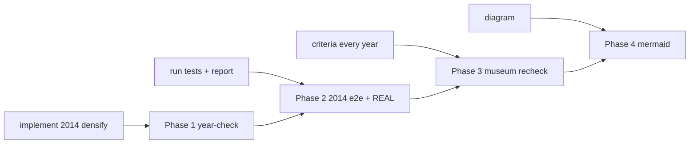
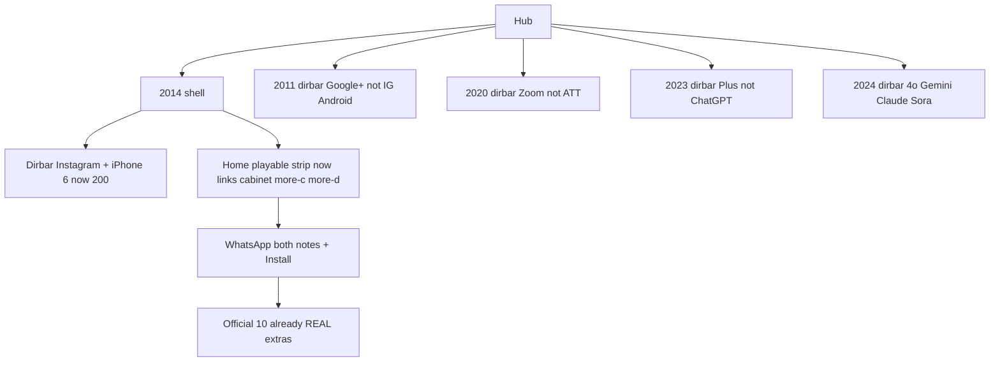

# Session inventory — what was added, where, and how

**Date:** 2026-08-29  
**Scope:** this conversation only (2014 densify year-check → all-years recheck).  
**Rule followed:** no dest folders, no forest restore, no star/guided-6 move, no wipe. Links and checks only, plus honesty gates that were already supposed to exist.

This file is the file-level inventory. Walk diagrams stay in [`ALL-YEARS-CRITERIA-RECHECK-2026-08-29.md`](ALL-YEARS-CRITERIA-RECHECK-2026-08-29.md). 2014 dest-by-dest bible stays [`2014-EVERY-FLOW-MINUTE-E2E-2026-08-29.md`](2014-EVERY-FLOW-MINUTE-E2E-2026-08-29.md).

---

## 0. How to read this

| Word | Meaning here |
|------|----------------|
| **Added** | New file on disk |
| **Changed** | Existing file edited. No new dest folder. |
| **Not added** | Official dests, leftover 4× panels, more-c/d games, extras.js writers — those were already live. This pass **linked, checked, or ungated** them. |



---

## Phase 1 — 2014 densify year-check

**Ask:** implement the year check if it aligns with other years as densify.

**How:** sibling specs `e2e/2010-densify.spec.js` … `e2e/2016-densify.spec.js` already lock About dual-cite, guided 6, star trap/empty then complete, leftover dest copy, map lists dests, shell class. 2014 had mvp + flows + implemented-real. It did **not** have `2014-densify.spec.js`. Dest copy was already on the bar. Two shell buttons 404’d.

### Added

| File | What it is |
|------|------------|
| `e2e/2014-densify.spec.js` | 11 Playwright tests. About 968,882,453 / 861,379,152 January + Watch/Stories/Discover/Periscope/Win10 bans. Guided 6 + chip → WhatsApp. Star Messenger + 0–1 notes never write; both deal notes + Install writes. Heartbleed exploit never / rotate. Ice celeb trap. Leftover copy on iPhone / Pay / Material / Slack / Twitch. Snap not Discover 2015. Map official 10. Shell `os-win7` `browser-ie9`. Dirbar dests 200. Watchline / Win10line ship 2015. Messenger leftover. Tile Fold trap + more-c/d exist. |

### Changed

| File | What | How |
|------|------|-----|
| `years/2014/index.html` dirbar | `sites/instagram/video.html` **IG Video** and `sites/chrome/index.html` **Chrome** | Those dests do not exist (2013 clone leftover). Chrome habit is 2015+. Replaced with live dests `sites/instagram/index.html` and `sites/iphone/index.html`. Star stays WhatsApp. |
| `years/2014/pages/home.html` | Playable strip was Tile Fold + famous only | Added links (not dests) to cabinet, extra-a, extra-b, more-c **Hearth Hand**, more-d **Destiny Tower** so density matches 2015/2016 home. |
| `package.json` `test:e2e:2014` | Only mvp + flows + one-thing | Now also `2014-densify.spec.js` + `2014-implemented-real.spec.js` — same pack as 2013/2015. |
| `docs/2014-READ-FIRST.md` | Door index | Points at densify spec. |
| `docs/2014-EVERY-FLOW-MINUTE-E2E-2026-08-29.md` | Command board | Densify command added. |
| `docs/2014-IN-PLACE-DONE-GOALS-PHASES-FLOWS-MINUTE-E2E-2026-08-29.md` | How to test | Densify command added. |

**Result:** densify **11/11**. No new HTML dests.

---

## Phase 2 — run session tests + REAL vs mock + 2014 report

**Ask:** run tests for everything in this session; check added flows are not mock; write a report with a diagram.

### Changed

| File | What | How |
|------|------|-----|
| `e2e/one-thing-per-year.spec.js` 2014 `complete` | Clicked Install alone | After extras honesty, 0–1 deal notes **must not write**. Complete now clicks `[data-wa14-deal="16b"]` then `[data-wa14-deal="rsu"]` then Install. Incomplete still clicks Messenger only. |

### Added

| File | What it is |
|------|------------|
| `docs/2014-DENSIFY-SESSION-CHECK-2026-08-29.md` | 2014 session check map: test board, writer classes A–E, official 10 trap/incomplete/complete table, walk mermaid, dirbar mermaid, fail-if. |

**Tests that run (not new files):** `2014-implemented-real` 11, `2014-flows` 5, `2014-mvp` 3, leftover-official 8, 2× leftover 134, one-thing 2, popular 3× + F1–F5 6, year-home-densify 3, full-more c/d 4. **187 green** after the one-thing fix. `audit-mock-flows.js`: DEST_FIELD 0 · WEAK_REAL 0 · HASH_CTA 0 · no 2014 UNWIRED.

Official 10 were **already REAL** (`js/immersion/year-2014-extras.js`). This phase did not add writers. It proved trap/empty never write and complete writes `{ real:true, year:"2014" }`.

---

## Phase 3 — every year against the same criteria

**Ask:** follow the research + implement criteria for every single year; recheck; do necessary changes.

**How:** mechanical scan of 1994–2024 (guided, chip, official 10 dests, more-c/d, dirbar 200s) + `check-all-years.py --http` **31/31**. Real fails were clone dirbars, stale wipe flags, missing densify specs, and `data-official-verb` on 2011 extras buttons.

### Added — densify year-checks

| File | Locks |
|------|--------|
| `e2e/2007-densify.spec.js` | About `121,892,559` + App Store / Chrome bans. Guided 6 (JS `paintStart`) + chip → iPhone. App Store trap never writes; ticks + capacity + Safari writes `itt07-iphone`. |
| `e2e/2020-densify.spec.js` | About Netcraft `1,295,973,827` + table ends 2018 + participants not users. Guided 6 + chip → Zoom meeting. Dirbar 200 · no ATT/Copilot clone. |
| `e2e/2021-densify.spec.js` | About `1,197,982,359` + 4.9 billion. Guided 6 + chip → ATT. Dirbar 200. |
| `e2e/2022-densify.spec.js` | About `1,167,715,133` + 5.3 billion. Guided 6 + chip → ChatGPT. Dirbar 200. |
| `e2e/2023-densify.spec.js` | About table ends 2018 + 5.4 billion + $20. Guided 6 + chip → Plus. Dirbar 200 · no ChatGPT/Wordle clone. |
| `e2e/2024-densify.spec.js` | About `1,079,154,539` + 13 May 2024. Guided 6 + chip → 4o. Dirbar 200 · no Signal/Copilot clone. |

### Changed — dirbars (links only)

| File | Removed (404 / wrong year) | Added hrefs (dests already on disk) |
|------|----------------------------|-------------------------------------|
| `years/2011/index.html` | IG Android, IPO, SOPA, Maps flop, Chrome | `sites/googleplus/index.html` · `spotify` · `iphone` (Siri) · `facebook` (Timeline) · About |
| `years/2020/index.html` | ATT, Signal, Copilot, Meta | `sites/zoom/meeting.html` · `reels` · `openai` · `flash` |
| `years/2023/index.html` | ChatGPT, Twitter, Wordle, SD | `sites/plus/index.html` · `gpt4` · `bingchat` · `threads` |
| `years/2024/index.html` | Signal, Copilot, Meta | `sites/gemini/index.html` · `claude35` · `sora` (4o already there) |

Pinterest + Twitter on 2011 already existed and stayed.

### Changed — honesty (remove auto-save clash)

Same 2014 bug: `data-official-verb` writes the official key before extras ticks.

| File | Button | Removed attr |
|------|--------|--------------|
| `years/2011/sites/iphone/index.html` | Ask Siri `[data-sr11-ask]` | `data-official-verb` |
| `years/2011/sites/spotify/index.html` | Free invite `[data-sp11-sku="free"]` | `data-official-verb` |
| `years/2011/sites/facebook/index.html` | Set leftover cover `[data-tl11-coverbtn]` | `data-official-verb` |
| `years/2011/sites/airbnb/index.html` | Request leftover `[data-ab11-go]` | `data-official-verb` |

Writer remains `js/immersion/year-2011-extras.js` (ticks + product step).

### Changed — densify spec + npm

| File | What |
|------|------|
| `e2e/2011-densify.spec.js` | New test: dirbar dests resolve · no 2012 clone rooms |
| `package.json` `test:e2e:2007` | Pointed at missing `2007-mvp/flows/trail` files. Now `year-2007-lean.spec.js` + `2007-densify.spec.js` + one-thing. |

### Changed — stale wipe / disk truth

| File | Was | Now |
|------|-----|-----|
| `scripts/audit-all-year-flows.js` | `WIPED = {2014}` · scan to 2019 | `WIPED = {2025}` · scan 1994–2024 · stars for 2014 + 2020–2024 restored |
| `scripts/check-every-flow.js` | `WIPED = {2007,2020,2024,2025}` · scan to 2023 | `WIPED = {2025}` · scan to 2024 · gold 2007 = iPhone Safari `data-ip07-` |
| `docs/2009-READ-FIRST.md` | year was wiped | lean door on disk ~47 HTML |
| `docs/2012-READ-FIRST.md` | year is wiped · do not implement | lean door on disk ~89 HTML · disk-truth section |
| `docs/2020-READ-FIRST.md` | 2024/2025 stay wiped | 2025 boarded · 2024 live |
| `docs/2023-READ-FIRST.md` | 2024 still wiped | 2024 GPT-4o live · 2025 boarded |

### Added — recheck map

| File | What |
|------|------|
| `docs/ALL-YEARS-CRITERIA-RECHECK-2026-08-29.md` | Museum-wide fail/fix table + mermaid (check path, spine, stars, dirbar remaps, writer honesty) |

Dirbar 404 scan after remap: **0** on 1994–2024.

---

## Phase 4 — diagrams

Mermaid added **inside** `docs/ALL-YEARS-CRITERIA-RECHECK-2026-08-29.md` (check path, spine, star chain, dirbar remaps, writer honesty). No new dests.

---

## Where nothing was added (on purpose)

| Thing | Why |
|-------|-----|
| New `years/*/sites/*` folders | Cap / lean door. Link existing dests. |
| New official writers / keys | Official 10 already in `js/config/flow-trails.js` + extras. |
| New leftover 4× panels | Already on dests. 2× e2e already 134/134 for 2014. |
| Forced `#ott-guided` HTML on 1994–2006 / 2008 | Those inject guided 6 via `js/year-ui/start.js` `paintStart`. |
| Densify specs for 1994–1999 | Those years use sites/buttons/5× packs + `year-home-densify`. |
| Strip every `data-official-verb` museum-wide | Some leftover dests **are** that writer. Only extras-gated official buttons are the clash. |
| 2025 door | Boarded. |

---

## File list (this conversation)

**New (11)**

```
e2e/2014-densify.spec.js
e2e/2007-densify.spec.js
e2e/2020-densify.spec.js
e2e/2021-densify.spec.js
e2e/2022-densify.spec.js
e2e/2023-densify.spec.js
e2e/2024-densify.spec.js
docs/2014-DENSIFY-SESSION-CHECK-2026-08-29.md
docs/ALL-YEARS-CRITERIA-RECHECK-2026-08-29.md
docs/SESSION-ADDED-WHAT-WHERE-HOW-2026-08-29.md   ← this file
```

**Edited live dests / shells (10)**

```
years/2014/index.html
years/2014/pages/home.html
years/2011/index.html
years/2011/sites/iphone/index.html
years/2011/sites/spotify/index.html
years/2011/sites/facebook/index.html
years/2011/sites/airbnb/index.html
years/2020/index.html
years/2023/index.html
years/2024/index.html
```

**Edited checks / docs (12)**

```
e2e/2011-densify.spec.js
e2e/one-thing-per-year.spec.js
package.json
scripts/audit-all-year-flows.js
scripts/check-every-flow.js
docs/2014-READ-FIRST.md
docs/2014-EVERY-FLOW-MINUTE-E2E-2026-08-29.md
docs/2014-IN-PLACE-DONE-GOALS-PHASES-FLOWS-MINUTE-E2E-2026-08-29.md
docs/2009-READ-FIRST.md
docs/2012-READ-FIRST.md
docs/2020-READ-FIRST.md
docs/2023-READ-FIRST.md
```

---

## How a visitor sees it



---

## How to re-run

```bash
python3 scripts/check-all-years.py --http http://127.0.0.1:8080

npx playwright test \
  e2e/2014-densify.spec.js e2e/2014-implemented-real.spec.js \
  e2e/2014-flows.spec.js e2e/2014-mvp.spec.js \
  e2e/2007-densify.spec.js e2e/2011-densify.spec.js \
  e2e/2020-densify.spec.js e2e/2021-densify.spec.js \
  e2e/2022-densify.spec.js e2e/2023-densify.spec.js \
  e2e/2024-densify.spec.js --workers=1
```
