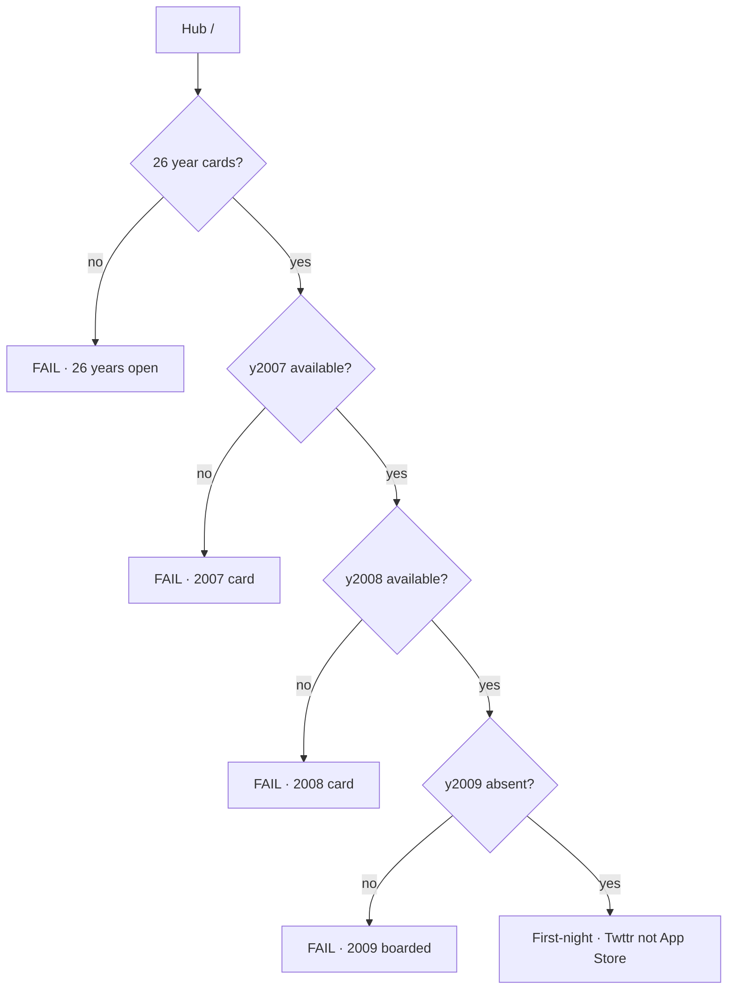
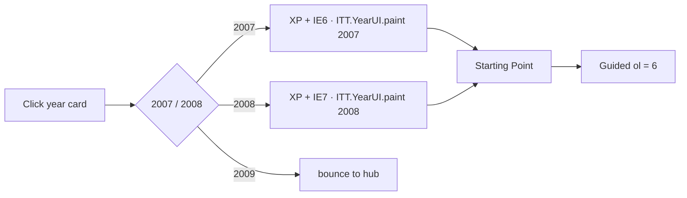
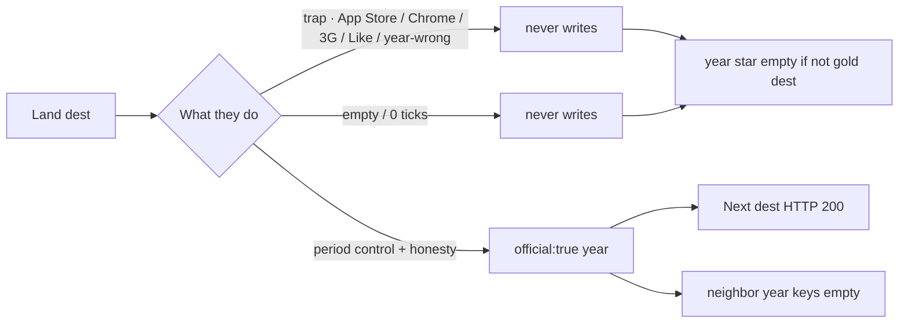
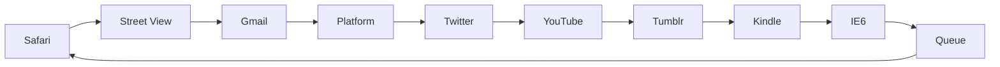
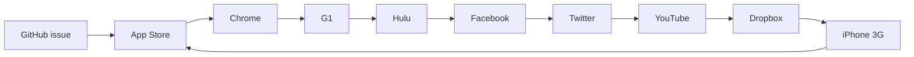
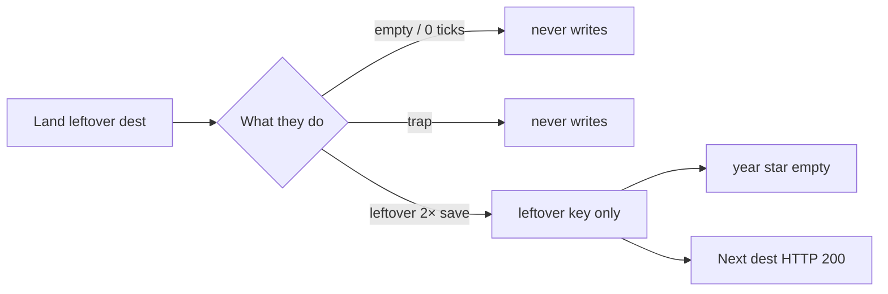
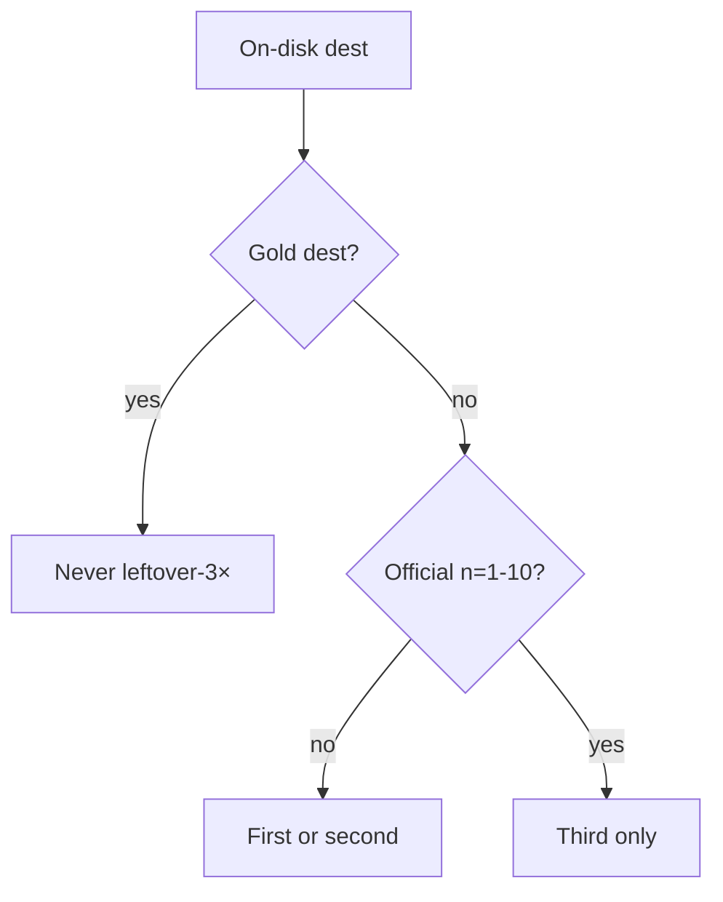

# Check every flow — session diagram

**Date:** 2026-09-10  
**Hub:** 26 years (1994–2008 + 2010–2020). **2009 boarded.**  
**Locks:** [`2007-CHECK-EVERY-FLOW-MAP.md`](2007-CHECK-EVERY-FLOW-MAP.md) · [`2008-CHECK-EVERY-FLOW-MAP.md`](2008-CHECK-EVERY-FLOW-MAP.md)

Walk top to bottom. Fail the first red box.

---

## 1. Hub

---

## 2. Year shell

---

## 3. Official dest minute (every official dest)

Use on:

**2007** Safari · Street View · Gmail open · Platform · Twitter leftover · YouTube leftover · Tumblr · Kindle · IE6 · Safari Queue  

**2008** GitHub issue · App Store · Chrome · G1 · Hulu · Facebook Connect · Twitter leftover · YouTube leftover · Dropbox · iPhone 3G

---

## 4. Official Next chains

---

## 5. Leftover dest minute (every leftover dest)

Leftover **2×** = two `data-lo-save` writers (`slug` + `slug-d2`).

| Year | Leftover 2× dests |
|-----:|------------------:|
| 2007 | 82 / 82 |
| 2008 | 199 / 199 |
| 2011 | 98 / 98 |

---

## 6. Leftover-3× who may sit

Gold dests never leftover-3× first: **2007 `iphone`** · **2008 `github`** · **2011 `googleplus`**.

---

## 7. Pass table

| Check | Pass |
|-------|------|
| Hub | 26 years · 2007 + 2008 cards · no 2009 card |
| 2007 shell | XP+IE6 · guided 6 · gold dest-true |
| 2008 shell | XP+IE7 · guided 6 · gold dest-true |
| Official 10 | trap/empty never write · `official:true` |
| Leftover 2× | two writers · never the star |
| Leftover-3× first | no gold dest |
| Warehouse | each dest once |
| Neighbor keys | `itt06-tweets` / `itt07-iphone` / `itt09-like` empty after a walk |

**e2e:** `2007-dest-true-official` · `2008-dest-true-official` · `2007-leftover-2x` · `2011-leftover-2x` · `gold-leftover-isolation` · `hub-years` · `2007-every-link` · `2008-every-link`
