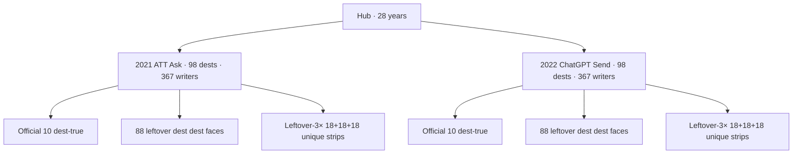
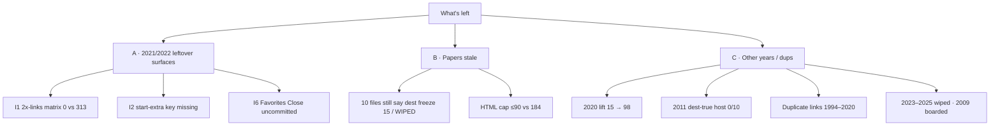
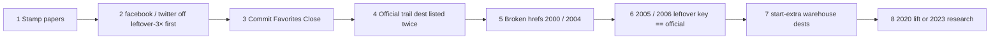

# What’s left — map

**Date:** 2026-09-11  
**Live:** 28 years open · 2021 ATT Ask · 2022 ChatGPT Send · dest freeze **98** · leftover writers **367** · leftover-3× **18+18+18**.  
**2009 boarded.** **2023–2025 wiped.**

Walk top to bottom. Fail the first red box only if that cut is **named**.

---

## Now (done)

| Bar | 2021 | 2022 |
|-----|-----:|-----:|
| Dest folders | 98 | 98 |
| Official dest-true | 10/10 | 10/10 |
| Leftover dest dest faces | 88/88 | 88/88 |
| Leftover writers | 367 | 367 |
| Leftover-3× | 18+18+18 | 18+18+18 |
| Gold dest leftover-3× first | 0 | 0 |
| Mock leftover dest dests | 0 | 0 |
| Checklist lists every dest | 98/98 | 98/98 |

---

## Left — three lanes

---

## Lane A — 2021 / 2022 leftover surfaces

Dests are shipped. These are **listing / chrome**, not dest folders.

| # | Left | Measurable | Disk | Fix if named |
|--:|------|------------|------|--------------|
| A1 | `2x-links.matrix.json` | 2011 = **313** rows | 2021 **0** · 2022 **0** | add leftover-2× listing **or** leave writers on dest HTML |
| A2 | `start-extra.js` | 2011 = yes | 2021 **no** · 2022 **no** | add year key **or** keep home warehouse |
| A3 | Favorites Close | committed | **uncommitted** | commit hoist + cache-bust |
| A4 | 2021 facebook on leftover-3× **first** | 0 official dests on first | **done** · airbnb leftover | — |
| A5 | 2022 twitter on leftover-3× **first** | 0 official dests on first | **done** · slack leftover | — |

Official dests on leftover-3× **third** (8 dests each year) match 2011 leftover-3× third. Not a dest bug unless you name “official dests off leftover-3× third.”

---

## Lane B — papers stale

Dests exist. MDs still describe the research-only pass.

| File | Still says | Disk |
|------|------------|------|
| `2021-FROM-SCRATCH-…` | dest freeze **15** · WIPED · leftover-3× 3+3 · HTML ≤90 | 98 · live · 18+18+18 · 184 HTML |
| `2022-FROM-SCRATCH-…` | dest freeze **15** · no year tree · leftover-3× 3+3 | 98 · live · 18+18+18 |
| `2021-EVERY-FLOW-…` | G7 WIPED · dest freeze 15 | CUT-OPEN · 98 |
| `2022-EVERY-FLOW-…` | same | same |
| `2021-5K-…` / `2022-5K-…` | WIPED | live |
| `2022-MAP-…` | dest freeze 15 · WIPED | 98 · live |
| `2022-FLOW-DIAGRAM` | leftover-3× 3+3 | leftover-3× 18+18+18 |
| `2011-VS-2021-2022-FLOW-COUNT` | dest freeze 15 · leftover-3× 3+3 · leftover 2× floor 30 | 98 · 18+18+18 · leftover 2× floor 196 |
| `2021-READ-FIRST` / `2022-READ-FIRST` | HTML cap ≤90 | 184 HTML |
| DEST-TRUE leftover-4× line | ban through 2021 · restore 2022–2025 | 2022 live · leftover-4× 0 |

**Fix if named:** stamp dest freeze 98 · leftover-3× 18+18+18 · 2022 live · leftover dest dest faces · HTML 184.

---

## Lane C — other years / duplicate links

From [`ALL-YEARS-DUPLICATE-LINKS-FLOWS-AUDIT-2026-09-11.md`](ALL-YEARS-DUPLICATE-LINKS-FLOWS-AUDIT-2026-09-11.md).

### C1 · 2020 density (not lifted)

| Metric | 2020 now | 2021 / 2022 |
|--------|---------:|------------:|
| Dest folders | 15 | 98 |
| Leftover writers | 30 | 367 |
| Leftover-3× | 3+3 | 18+18+18 |

### C2 · 2011 dest-true host

Official dests write official keys. Dest-true verb-host = **0 / 10**. 2021 / 2022 = **10 / 10**.

### C3 · Duplicate links (user sees dest twice)

| Kind | Years | Worst |
|------|-------|-------|
| Official dest on leftover-3× **first** | **17 years** | 2006 · 9 dests |
| Official 10 trail lists dest twice | 7 years | 2004 facebook **×4** |
| start-extra lists dests already on leftover-3× / official | **27 years** (1994–2020) | 2011 · **56 dests** |
| Broken dest href | 2000 · 2004 | `aim` `maps` `mapquest` |
| Leftover key `trail-q` shared across dests | 1994–2000, 2004–2006, 2010, 2012 | leftover dest A writes dest B |
| Leftover key == official key | **2005** (7) · **2006** (12) | leftover complete can write official |

### C4 · Not opened

| Year | Status |
|------|--------|
| 2009 | boarded · do not put on year menu |
| 2023 | wiped · no tree · no research |
| 2024 | wiped |
| 2025 | wiped |

Leftover-official **313** lift · leftover-4× · dest-farm past dest freeze 98 · **banned** unless named.

---

## Suggested order (if you name a cut)

1. Stamp papers (no dest change).  
2. 2021 facebook / 2022 twitter off leftover-3× first.  
3. Commit Favorites Close.  
4. Official trail dest listed twice.  
5. Broken hrefs 2000 / 2004.  
6. 2005 / 2006 leftover key == official key.  
7. start-extra warehouse dests already on leftover-3×.  
8. **Named later:** 2020 lift · 2011 dest-true host · 2023 from-scratch.

---

**Parents:** [`2021-2022-MD-VS-DISK-UNDONE-2026-09-11.md`](2021-2022-MD-VS-DISK-UNDONE-2026-09-11.md) · [`ALL-YEARS-DUPLICATE-LINKS-FLOWS-AUDIT-2026-09-11.md`](ALL-YEARS-DUPLICATE-LINKS-FLOWS-AUDIT-2026-09-11.md) · [`2021-2022-EVERY-FLOW-CHECKLIST-2026-09-11.md`](2021-2022-EVERY-FLOW-CHECKLIST-2026-09-11.md)
