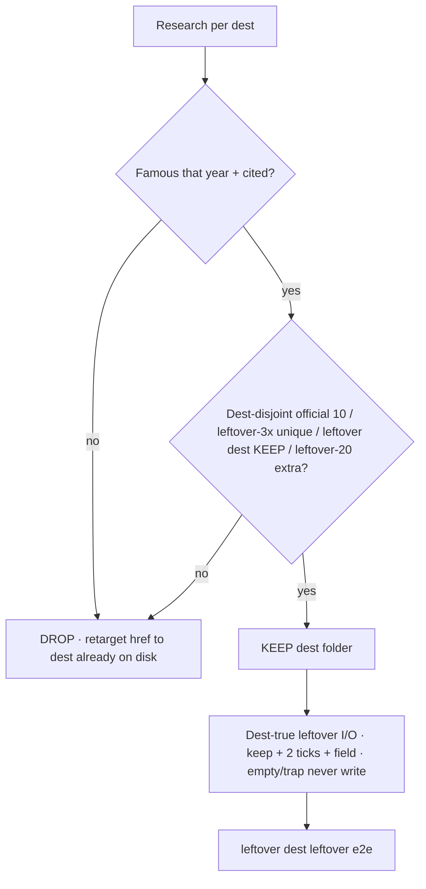

# Year-by-year research → implement steps

**Date:** 2026-09-20
**Status:** Extra dest DROP applied (539 gone · 166 KEEP stay). Year-false MISS 0. Extra dest KEEP leftover dest-true I/O implemented (gmusic · pandora · ios9 index). Do not dest-farm leftover-20 except 2017. Do not push from this file.
**Ship law:** [`DISK-TRUTH.md`](DISK-TRUTH.md) · [`VISITOR-100-FLOWS.md`](VISITOR-100-FLOWS.md) · [`YEAR-FALSE-KEEP-DROP.md`](YEAR-FALSE-KEEP-DROP.md) · [`TODO-EXTRA-DEST-RESEARCH.md`](TODO-EXTRA-DEST-RESEARCH.md) · [`DEST-TRUE-FLOW-NAMES.md`](DEST-TRUE-FLOW-NAMES.md).

Visitor 100% is dest-true I/O on dests already on disk, not dest-folder count. Empty / trap never write. Leftover never writes the year star. KEEP leftover dests only if famous that year and cited. Miss the cap rather than invent.

## How to read this file

Each year has the same 8 implement steps. Flip `[x]` only after disk + e2e. Stops stay `[ ]` so nobody implements them.

1. Confirm year kind (forest / dest-lock lean / dest-lock reverted / boarded / wiped).
2. Official 10 dest-true I/O (`data-official-need` 280/280 playable). Empty / trap never write the star.
3. Leftover-3× unique dest-true dests (caps: most 9 · 2018=3 · 2021=5 · 2017=0 leftover-20 instead).
4. Year-false KEEP leftover dests stay. Year-false DROP leftover dests already gone. Official 10 DROPs stay on disk (museum law).
5. Extra dest DROP already applied (clone leftover dest leftover / year-false / dest-farm). Replacement is a dest already on disk.
6. Extra dest KEEP leftover dest-true I/O (`data-lo-panel` + `data-itt-dest-true` + keep pick + 2 req + field). Not leftover-3× unique. Not official 10.
7. Recheck dest-folder count vs DISK-TRUTH. Href retargets 0 broken.
8. Stops: do not dest-farm leftover-20 except 2017 · do not grow leftover-3× unique past 2018=3 / 2021=5 · do not dest-lock forests / 2013 / 2018 / 2022 / 2015–2020 again · do not un-board 2009 · do not restore 2023–2025 · do not invent brand pixels.

Named lists live in the source files. This file is the implement order, not a second KEEP/DROP table.

## Summary

| Year | Kind | Dest folders | Year-false | Extra KEEP | Extra DROP | Leftover-3× unique | Leftover dest KEEP | Extra KEEP leftover I/O |
|-----:|------|-------------:|------------|-----------:|-----------:|-------------------:|-------------------:|-------------------------|
| 1994 | forest | 156 | KEEP 8 · DROP 5 · DO-NOT-APPLY 1 · MISS 0 | 0 | 2 | 0 | 0 | no extra KEEP (DROP only / leftover dest KEEP leftover I/O) |
| 1995 | forest | 152 | KEEP 11 · DROP 2 · DO-NOT-APPLY 1 · MISS 0 | 0 | 1 | 0 | 0 | no extra KEEP (DROP only / leftover dest KEEP leftover I/O) |
| 1996 | forest | 152 | KEEP 10 · DROP 3 · DO-NOT-APPLY 1 · MISS 0 | 0 | 2 | 0 | 0 | no extra KEEP (DROP only / leftover dest KEEP leftover I/O) |
| 1997 | forest | 163 | KEEP 12 · DROP 1 · DO-NOT-APPLY 1 · MISS 0 | 0 | 4 | 0 | 0 | no extra KEEP (DROP only / leftover dest KEEP leftover I/O) |
| 1998 | forest | 149 | KEEP 9 · DROP 5 · DO-NOT-APPLY 0 · MISS 0 | 0 | 4 | 0 | 0 | no extra KEEP (DROP only / leftover dest KEEP leftover I/O) |
| 1999 | forest | 426 | KEEP 14 · DROP 0 · DO-NOT-APPLY 0 · MISS 0 | 0 | 6 | 0 | 0 | no extra KEEP (DROP only / leftover dest KEEP leftover I/O) |
| 2000 | forest | 477 | KEEP 9 · DROP 4 · DO-NOT-APPLY 0 · MISS 0 | 0 | 7 | 0 | 0 | no extra KEEP (DROP only / leftover dest KEEP leftover I/O) |
| 2001 | forest | 257 | KEEP 6 · DROP 3 · DO-NOT-APPLY 1 · MISS 0 | 0 | 4 | 0 | 0 | no extra KEEP (DROP only / leftover dest KEEP leftover I/O) |
| 2002 | forest | 224 | KEEP 9 · DROP 0 · DO-NOT-APPLY 1 · MISS 0 | 0 | 10 | 0 | 0 | no extra KEEP (DROP only / leftover dest KEEP leftover I/O) |
| 2003 | forest | 199 | KEEP 9 · DROP 0 · DO-NOT-APPLY 1 · MISS 0 | 0 | 7 | 0 | 0 | no extra KEEP (DROP only / leftover dest KEEP leftover I/O) |
| 2004 | forest | 800 | KEEP 10 · DROP 1 · DO-NOT-APPLY 0 · MISS 0 | 0 | 10 | 0 | 0 | no extra KEEP (DROP only / leftover dest KEEP leftover I/O) |
| 2005 | forest | 339 | KEEP 12 · DROP 1 · DO-NOT-APPLY 1 · MISS 0 | 0 | 11 | 0 | 0 | no extra KEEP (DROP only / leftover dest KEEP leftover I/O) |
| 2006 | forest | 366 | KEEP 8 · DROP 2 · DO-NOT-APPLY 1 · MISS 0 | 0 | 10 | 0 | 0 | no extra KEEP (DROP only / leftover dest KEEP leftover I/O) |
| 2007 | dest-lock lean | 33 | KEEP 21 · DROP 14 · DO-NOT-APPLY 7 · MISS 0 | 0 | 0 | 9 | 14 | no extra KEEP (DROP only / leftover dest KEEP leftover I/O) |
| 2008 | forest | 586 | KEEP 12 · DROP 2 · DO-NOT-APPLY 0 · MISS 0 | 0 | 11 | 0 | 0 | no extra KEEP (DROP only / leftover dest KEEP leftover I/O) |
| 2009 | boarded | 78 | boarded (not dest-true map) | 0 | 0 | 0 | 0 | STOP boarded |
| 2010 | dest-lock lean | 29 | KEEP 19 · DROP 16 · DO-NOT-APPLY 6 · MISS 0 | 0 | 1 | 9 | 10 | no extra KEEP (DROP only / leftover dest KEEP leftover I/O) |
| 2011 | dest-lock lean | 41 | KEEP 32 · DROP 14 · DO-NOT-APPLY 4 · MISS 0 | 2 | 7 | 9 | 20 | all KEEP leftover I/O |
| 2012 | dest-lock lean | 32 | KEEP 24 · DROP 13 · DO-NOT-APPLY 5 · MISS 0 | 0 | 0 | 9 | 11 | no extra KEEP (DROP only / leftover dest KEEP leftover I/O) |
| 2013 | lean Vine | 52 | KEEP 10 · DROP 0 · DO-NOT-APPLY 8 · MISS 0 | 34 | 2 | 9 | 0 | all KEEP leftover I/O |
| 2014 | dest-lock lean | 25 | KEEP 17 · DROP 11 · DO-NOT-APPLY 8 · MISS 0 | 0 | 0 | 9 | 7 | no extra KEEP (DROP only / leftover dest KEEP leftover I/O) |
| 2015 | dest-lock reverted | 50 | KEEP 11 · DROP 2 · DO-NOT-APPLY 6 · MISS 0 | 31 | 163 | 9 | 0 | all KEEP leftover I/O |
| 2016 | dest-lock reverted | 57 | KEEP 47 · DROP 40 · DO-NOT-APPLY 6 · MISS 0 | 4 | 9 | 9 | 34 | all KEEP leftover I/O |
| 2017 | dest-lock reverted leftover-20 | 68 | KEEP 26 · DROP 3 · DO-NOT-APPLY 1 · MISS 0 | 39 | 154 | 0 (leftover-20) | 0 (leftover-20 extras 20) | all KEEP leftover I/O |
| 2018 | dest-lock reverted lean-door | 24 | KEEP 20 · DROP 20 · DO-NOT-APPLY 4 · MISS 0 | 0 | 0 | 3 | 11 | no extra KEEP (DROP only / leftover dest KEEP leftover I/O) |
| 2019 | dest-lock reverted | 73 | KEEP 8 · DROP 0 · DO-NOT-APPLY 11 · MISS 0 | 54 | 97 | 9 | 0 | all KEEP leftover I/O |
| 2020 | dest-lock reverted | 22 | KEEP 9 · DROP 1 · DO-NOT-APPLY 10 · MISS 0 | 2 | 17 | 9 | 1 | all KEEP leftover I/O |
| 2021 | dest-lock lean stop-5 | 18 | KEEP 9 · DROP 13 · DO-NOT-APPLY 8 · MISS 0 | 0 | 0 | 5 | 3 | no extra KEEP (DROP only / leftover dest KEEP leftover I/O) |
| 2022 | dest-true lean | 25 | KEEP 13 · DROP 15 · DO-NOT-APPLY 10 · MISS 0 | 0 | 0 | 9 | 6 | no extra KEEP (DROP only / leftover dest KEEP leftover I/O) |
| 2023 | wiped | 0 (no tree) | wiped | 0 | 0 | 0 | 0 | STOP wiped |
| 2024 | wiped | 0 (no tree) | wiped | 0 | 0 | 0 | 0 | STOP wiped |
| 2025 | wiped | 0 (no tree) | wiped | 0 | 0 | 0 | 0 | STOP wiped |

Hub **28 years** 1994–2008 + 2010–2022. **2009 boarded.** **2023–2025 wiped.**

## 1994

**Kind:** Forest leftover-2× workshop. Official 10 dest-true. Leftover dest leftover is leftover-2× on dests, not leftover-3× unique JSON.

**Star:** `csotd` · CSotD guestbook · `itt94-csotd`. Empty / trap never write this key. Leftover never writes this key.

**Dest folders on disk:** 156.

**Official 10:** csotd · yahoo · cern · fishcam · whitehouse · nasa · iuma · hotwired · lycos · playable

**Year-false (dest-true map):** KEEP 8 · DROP 5 · DO-NOT-APPLY 1 · MISS 0. Named rows: [`YEAR-FALSE-KEEP-DROP.md`](YEAR-FALSE-KEEP-DROP.md) · [`DEST-TRUE-FLOW-NAMES.md`](DEST-TRUE-FLOW-NAMES.md). Official 10 DROPs stay on disk. Playable is DO-NOT-APPLY.

**Leftover-3× unique:** none (forest leftover-2× / boarded).

**Leftover dest KEEP:** none as leftover dest leftover dests. Forest leftover dest-true packs live in `js/config/year-true-packs.json`.

**Extra dest research:** KEEP 0 · DROP 2 (DROP applied). Cite rows: [`TODO-EXTRA-DEST-RESEARCH.md`](TODO-EXTRA-DEST-RESEARCH.md).

No extra dest KEEP. DROP 2 clone leftover dest leftover folders already gone.

### Implement steps

- [x] 1 Year kind locked: forest. Do not dest-lock forests / 2013 / 2018 / 2022 / 2015–2020 again. Do not dest-farm leftover-20 except 2017.
- [x] 2 Official 10 dest-true I/O on disk. Star `itt94-csotd`. `data-official-need` filled. Empty / trap never write the star.
- [x] 3 Leftover-3× unique JSON is not this year's job (forest leftover-2× / leftover dest leftover packs).
- [x] 4 Year-false KEEP leftover dests stay. Year-false DROP leftover dest leftover dests already gone. Official 10 DROPs stay. Playable DO-NOT-APPLY.
- [x] 5 Extra dest DROP applied (2 dest folders gone). Hrefs retargeted to dests already on disk. Do not restore DROP dests.
- [x] 6 Forest leftover dest-true packs leftover I/O already (year-true-packs). Extra dest KEEP = 0.
- [x] 7 Dest-folder count 156 matches DISK-TRUTH / e2e WANT_FOLDERS. Links audit 0 broken after extra dest DROP.
- [x] 8 Stops stay stops: no leftover-20 dest-farm · no leftover-3× unique growth past 2018=3 / 2021=5 · no invented brand pixels · no push from this file.

## 1995

**Kind:** Forest leftover-2× workshop. Official 10 dest-true. Leftover dest leftover is leftover-2× on dests, not leftover-3× unique JSON.

**Star:** `amazon` · Amazon SSL checkout · `itt95-ssl-checkout`. Empty / trap never write this key. Leftover never writes this key.

**Dest folders on disk:** 152.

**Official 10:** amazon · auctionweb · geocities · yahoo · altavista · cnn · microsoft · netscape · pathfinder · playable

**Year-false (dest-true map):** KEEP 11 · DROP 2 · DO-NOT-APPLY 1 · MISS 0. Named rows: [`YEAR-FALSE-KEEP-DROP.md`](YEAR-FALSE-KEEP-DROP.md) · [`DEST-TRUE-FLOW-NAMES.md`](DEST-TRUE-FLOW-NAMES.md). Official 10 DROPs stay on disk. Playable is DO-NOT-APPLY.

**Leftover-3× unique:** none (forest leftover-2× / boarded).

**Leftover dest KEEP:** none as leftover dest leftover dests. Forest leftover dest-true packs live in `js/config/year-true-packs.json`.

**Extra dest research:** KEEP 0 · DROP 1 (DROP applied). Cite rows: [`TODO-EXTRA-DEST-RESEARCH.md`](TODO-EXTRA-DEST-RESEARCH.md).

No extra dest KEEP. DROP 1 clone leftover dest leftover folders already gone.

### Implement steps

- [x] 1 Year kind locked: forest. Do not dest-lock forests / 2013 / 2018 / 2022 / 2015–2020 again. Do not dest-farm leftover-20 except 2017.
- [x] 2 Official 10 dest-true I/O on disk. Star `itt95-ssl-checkout`. `data-official-need` filled. Empty / trap never write the star.
- [x] 3 Leftover-3× unique JSON is not this year's job (forest leftover-2× / leftover dest leftover packs).
- [x] 4 Year-false KEEP leftover dests stay. Year-false DROP leftover dest leftover dests already gone. Official 10 DROPs stay. Playable DO-NOT-APPLY.
- [x] 5 Extra dest DROP applied (1 dest folders gone). Hrefs retargeted to dests already on disk. Do not restore DROP dests.
- [x] 6 Forest leftover dest-true packs leftover I/O already (year-true-packs). Extra dest KEEP = 0.
- [x] 7 Dest-folder count 152 matches DISK-TRUTH / e2e WANT_FOLDERS. Links audit 0 broken after extra dest DROP.
- [x] 8 Stops stay stops: no leftover-20 dest-farm · no leftover-3× unique growth past 2018=3 / 2021=5 · no invented brand pixels · no push from this file.

## 1996

**Kind:** Forest leftover-2× workshop. Official 10 dest-true. Leftover dest leftover is leftover-2× on dests, not leftover-3× unique JSON.

**Star:** `portals` · Portal wars · `itt96-portal-wars`. Empty / trap never write this key. Leftover never writes this key.

**Dest folders on disk:** 152.

**Official 10:** portals · hotmail · spacejam · yahoo · geocities · amazon · auctionweb · excite · altavista · playable

**Year-false (dest-true map):** KEEP 10 · DROP 3 · DO-NOT-APPLY 1 · MISS 0. Named rows: [`YEAR-FALSE-KEEP-DROP.md`](YEAR-FALSE-KEEP-DROP.md) · [`DEST-TRUE-FLOW-NAMES.md`](DEST-TRUE-FLOW-NAMES.md). Official 10 DROPs stay on disk. Playable is DO-NOT-APPLY.

**Leftover-3× unique:** none (forest leftover-2× / boarded).

**Leftover dest KEEP:** none as leftover dest leftover dests. Forest leftover dest-true packs live in `js/config/year-true-packs.json`.

**Extra dest research:** KEEP 0 · DROP 2 (DROP applied). Cite rows: [`TODO-EXTRA-DEST-RESEARCH.md`](TODO-EXTRA-DEST-RESEARCH.md).

No extra dest KEEP. DROP 2 clone leftover dest leftover folders already gone.

### Implement steps

- [x] 1 Year kind locked: forest. Do not dest-lock forests / 2013 / 2018 / 2022 / 2015–2020 again. Do not dest-farm leftover-20 except 2017.
- [x] 2 Official 10 dest-true I/O on disk. Star `itt96-portal-wars`. `data-official-need` filled. Empty / trap never write the star.
- [x] 3 Leftover-3× unique JSON is not this year's job (forest leftover-2× / leftover dest leftover packs).
- [x] 4 Year-false KEEP leftover dests stay. Year-false DROP leftover dest leftover dests already gone. Official 10 DROPs stay. Playable DO-NOT-APPLY.
- [x] 5 Extra dest DROP applied (2 dest folders gone). Hrefs retargeted to dests already on disk. Do not restore DROP dests.
- [x] 6 Forest leftover dest-true packs leftover I/O already (year-true-packs). Extra dest KEEP = 0.
- [x] 7 Dest-folder count 152 matches DISK-TRUTH / e2e WANT_FOLDERS. Links audit 0 broken after extra dest DROP.
- [x] 8 Stops stay stops: no leftover-20 dest-farm · no leftover-3× unique growth past 2018=3 / 2021=5 · no invented brand pixels · no push from this file.

## 1997

**Kind:** Forest leftover-2× workshop. Official 10 dest-true. Leftover dest leftover is leftover-2× on dests, not leftover-3× unique JSON.

**Star:** `pointcast` · PointCast · `itt97-pointcast`. Empty / trap never write this key. Leftover never writes this key.

**Dest folders on disk:** 163.

**Official 10:** pointcast · icq · ebay · hotmail · slashdot · drudge · hotbot · apple · microsoft · playable

**Year-false (dest-true map):** KEEP 12 · DROP 1 · DO-NOT-APPLY 1 · MISS 0. Named rows: [`YEAR-FALSE-KEEP-DROP.md`](YEAR-FALSE-KEEP-DROP.md) · [`DEST-TRUE-FLOW-NAMES.md`](DEST-TRUE-FLOW-NAMES.md). Official 10 DROPs stay on disk. Playable is DO-NOT-APPLY.

**Leftover-3× unique:** none (forest leftover-2× / boarded).

**Leftover dest KEEP:** none as leftover dest leftover dests. Forest leftover dest-true packs live in `js/config/year-true-packs.json`.

**Extra dest research:** KEEP 0 · DROP 4 (DROP applied). Cite rows: [`TODO-EXTRA-DEST-RESEARCH.md`](TODO-EXTRA-DEST-RESEARCH.md).

No extra dest KEEP. DROP 4 clone leftover dest leftover folders already gone.

### Implement steps

- [x] 1 Year kind locked: forest. Do not dest-lock forests / 2013 / 2018 / 2022 / 2015–2020 again. Do not dest-farm leftover-20 except 2017.
- [x] 2 Official 10 dest-true I/O on disk. Star `itt97-pointcast`. `data-official-need` filled. Empty / trap never write the star.
- [x] 3 Leftover-3× unique JSON is not this year's job (forest leftover-2× / leftover dest leftover packs).
- [x] 4 Year-false KEEP leftover dests stay. Year-false DROP leftover dest leftover dests already gone. Official 10 DROPs stay. Playable DO-NOT-APPLY.
- [x] 5 Extra dest DROP applied (4 dest folders gone). Hrefs retargeted to dests already on disk. Do not restore DROP dests.
- [x] 6 Forest leftover dest-true packs leftover I/O already (year-true-packs). Extra dest KEEP = 0.
- [x] 7 Dest-folder count 163 matches DISK-TRUTH / e2e WANT_FOLDERS. Links audit 0 broken after extra dest DROP.
- [x] 8 Stops stay stops: no leftover-20 dest-farm · no leftover-3× unique growth past 2018=3 / 2021=5 · no invented brand pixels · no push from this file.

## 1998

**Kind:** Forest leftover-2× workshop. Official 10 dest-true. Leftover dest leftover is leftover-2× on dests, not leftover-3× unique JSON.

**Star:** `google` · I'm Feeling Lucky · `itt98-lucky`. Empty / trap never write this key. Leftover never writes this key.

**Dest folders on disk:** 149.

**Official 10:** google · yahoo · amazon · ebay · cdnow · hotmail · mozilla · slashdot · dmoz · snap

**Year-false (dest-true map):** KEEP 9 · DROP 5 · DO-NOT-APPLY 0 · MISS 0. Named rows: [`YEAR-FALSE-KEEP-DROP.md`](YEAR-FALSE-KEEP-DROP.md) · [`DEST-TRUE-FLOW-NAMES.md`](DEST-TRUE-FLOW-NAMES.md). Official 10 DROPs stay on disk. Playable is DO-NOT-APPLY.

**Leftover-3× unique:** none (forest leftover-2× / boarded).

**Leftover dest KEEP:** none as leftover dest leftover dests. Forest leftover dest-true packs live in `js/config/year-true-packs.json`.

**Extra dest research:** KEEP 0 · DROP 4 (DROP applied). Cite rows: [`TODO-EXTRA-DEST-RESEARCH.md`](TODO-EXTRA-DEST-RESEARCH.md).

No extra dest KEEP. DROP 4 clone leftover dest leftover folders already gone.

### Implement steps

- [x] 1 Year kind locked: forest. Do not dest-lock forests / 2013 / 2018 / 2022 / 2015–2020 again. Do not dest-farm leftover-20 except 2017.
- [x] 2 Official 10 dest-true I/O on disk. Star `itt98-lucky`. `data-official-need` filled. Empty / trap never write the star.
- [x] 3 Leftover-3× unique JSON is not this year's job (forest leftover-2× / leftover dest leftover packs).
- [x] 4 Year-false KEEP leftover dests stay. Year-false DROP leftover dest leftover dests already gone. Official 10 DROPs stay. Playable DO-NOT-APPLY.
- [x] 5 Extra dest DROP applied (4 dest folders gone). Hrefs retargeted to dests already on disk. Do not restore DROP dests.
- [x] 6 Forest leftover dest-true packs leftover I/O already (year-true-packs). Extra dest KEEP = 0.
- [x] 7 Dest-folder count 149 matches DISK-TRUTH / e2e WANT_FOLDERS. Links audit 0 broken after extra dest DROP.
- [x] 8 Stops stay stops: no leftover-20 dest-farm · no leftover-3× unique growth past 2018=3 / 2021=5 · no invented brand pixels · no push from this file.

## 1999

**Kind:** Forest leftover-2× workshop. Official 10 dest-true. Leftover dest leftover is leftover-2× on dests, not leftover-3× unique JSON.

**Star:** `aim` · AIM · `itt99-aim`. Empty / trap never write this key. Leftover never writes this key.

**Dest folders on disk:** 426.

**Official 10:** aim · napster · google · blogger · y2k · sourceforge · paypal · amazon · ebay · askjeeves

**Year-false (dest-true map):** KEEP 14 · DROP 0 · DO-NOT-APPLY 0 · MISS 0. Named rows: [`YEAR-FALSE-KEEP-DROP.md`](YEAR-FALSE-KEEP-DROP.md) · [`DEST-TRUE-FLOW-NAMES.md`](DEST-TRUE-FLOW-NAMES.md). Official 10 DROPs stay on disk. Playable is DO-NOT-APPLY.

**Leftover-3× unique:** none (forest leftover-2× / boarded).

**Leftover dest KEEP:** none as leftover dest leftover dests. Forest leftover dest-true packs live in `js/config/year-true-packs.json`.

**Extra dest research:** KEEP 0 · DROP 6 (DROP applied). Cite rows: [`TODO-EXTRA-DEST-RESEARCH.md`](TODO-EXTRA-DEST-RESEARCH.md).

No extra dest KEEP. DROP 6 clone leftover dest leftover folders already gone.

### Implement steps

- [x] 1 Year kind locked: forest. Do not dest-lock forests / 2013 / 2018 / 2022 / 2015–2020 again. Do not dest-farm leftover-20 except 2017.
- [x] 2 Official 10 dest-true I/O on disk. Star `itt99-aim`. `data-official-need` filled. Empty / trap never write the star.
- [x] 3 Leftover-3× unique JSON is not this year's job (forest leftover-2× / leftover dest leftover packs).
- [x] 4 Year-false KEEP leftover dests stay. Year-false DROP leftover dest leftover dests already gone. Official 10 DROPs stay. Playable DO-NOT-APPLY.
- [x] 5 Extra dest DROP applied (6 dest folders gone). Hrefs retargeted to dests already on disk. Do not restore DROP dests.
- [x] 6 Forest leftover dest-true packs leftover I/O already (year-true-packs). Extra dest KEEP = 0.
- [x] 7 Dest-folder count 426 matches DISK-TRUTH / e2e WANT_FOLDERS. Links audit 0 broken after extra dest DROP.
- [x] 8 Stops stay stops: no leftover-20 dest-farm · no leftover-3× unique growth past 2018=3 / 2021=5 · no invented brand pixels · no push from this file.

## 2000

**Kind:** Forest leftover-2× workshop. Official 10 dest-true. Leftover dest leftover is leftover-2× on dests, not leftover-3× unique JSON.

**Star:** `mapquest` · MapQuest · `itt00-mapquest`. Empty / trap never write this key. Leftover never writes this key.

**Dest folders on disk:** 477.

**Official 10:** mapquest · amazon · ebay · paypal · napster · gnutella · pets · google · cnn · y2k

**Year-false (dest-true map):** KEEP 9 · DROP 4 · DO-NOT-APPLY 0 · MISS 0. Named rows: [`YEAR-FALSE-KEEP-DROP.md`](YEAR-FALSE-KEEP-DROP.md) · [`DEST-TRUE-FLOW-NAMES.md`](DEST-TRUE-FLOW-NAMES.md). Official 10 DROPs stay on disk. Playable is DO-NOT-APPLY.

**Leftover-3× unique:** none (forest leftover-2× / boarded).

**Leftover dest KEEP:** none as leftover dest leftover dests. Forest leftover dest-true packs live in `js/config/year-true-packs.json`.

**Extra dest research:** KEEP 0 · DROP 7 (DROP applied). Cite rows: [`TODO-EXTRA-DEST-RESEARCH.md`](TODO-EXTRA-DEST-RESEARCH.md).

No extra dest KEEP. DROP 7 clone leftover dest leftover folders already gone.

### Implement steps

- [x] 1 Year kind locked: forest. Do not dest-lock forests / 2013 / 2018 / 2022 / 2015–2020 again. Do not dest-farm leftover-20 except 2017.
- [x] 2 Official 10 dest-true I/O on disk. Star `itt00-mapquest`. `data-official-need` filled. Empty / trap never write the star.
- [x] 3 Leftover-3× unique JSON is not this year's job (forest leftover-2× / leftover dest leftover packs).
- [x] 4 Year-false KEEP leftover dests stay. Year-false DROP leftover dest leftover dests already gone. Official 10 DROPs stay. Playable DO-NOT-APPLY.
- [x] 5 Extra dest DROP applied (7 dest folders gone). Hrefs retargeted to dests already on disk. Do not restore DROP dests.
- [x] 6 Forest leftover dest-true packs leftover I/O already (year-true-packs). Extra dest KEEP = 0.
- [x] 7 Dest-folder count 477 matches DISK-TRUTH / e2e WANT_FOLDERS. Links audit 0 broken after extra dest DROP.
- [x] 8 Stops stay stops: no leftover-20 dest-farm · no leftover-3× unique growth past 2018=3 / 2021=5 · no invented brand pixels · no push from this file.

## 2001

**Kind:** Forest leftover-2× workshop. Official 10 dest-true. Leftover dest leftover is leftover-2× on dests, not leftover-3× unique JSON.

**Star:** `wikipedia` · Wikipedia UseMod · `itt01-wiki`. Empty / trap never write this key. Leftover never writes this key.

**Dest folders on disk:** 257.

**Official 10:** wikipedia · archive · itunes · apple · napster · movabletype · google · yahoo · amazon · playable

**Year-false (dest-true map):** KEEP 6 · DROP 3 · DO-NOT-APPLY 1 · MISS 0. Named rows: [`YEAR-FALSE-KEEP-DROP.md`](YEAR-FALSE-KEEP-DROP.md) · [`DEST-TRUE-FLOW-NAMES.md`](DEST-TRUE-FLOW-NAMES.md). Official 10 DROPs stay on disk. Playable is DO-NOT-APPLY.

**Leftover-3× unique:** none (forest leftover-2× / boarded).

**Leftover dest KEEP:** none as leftover dest leftover dests. Forest leftover dest-true packs live in `js/config/year-true-packs.json`.

**Extra dest research:** KEEP 0 · DROP 4 (DROP applied). Cite rows: [`TODO-EXTRA-DEST-RESEARCH.md`](TODO-EXTRA-DEST-RESEARCH.md).

No extra dest KEEP. DROP 4 clone leftover dest leftover folders already gone.

### Implement steps

- [x] 1 Year kind locked: forest. Do not dest-lock forests / 2013 / 2018 / 2022 / 2015–2020 again. Do not dest-farm leftover-20 except 2017.
- [x] 2 Official 10 dest-true I/O on disk. Star `itt01-wiki`. `data-official-need` filled. Empty / trap never write the star.
- [x] 3 Leftover-3× unique JSON is not this year's job (forest leftover-2× / leftover dest leftover packs).
- [x] 4 Year-false KEEP leftover dests stay. Year-false DROP leftover dest leftover dests already gone. Official 10 DROPs stay. Playable DO-NOT-APPLY.
- [x] 5 Extra dest DROP applied (4 dest folders gone). Hrefs retargeted to dests already on disk. Do not restore DROP dests.
- [x] 6 Forest leftover dest-true packs leftover I/O already (year-true-packs). Extra dest KEEP = 0.
- [x] 7 Dest-folder count 257 matches DISK-TRUTH / e2e WANT_FOLDERS. Links audit 0 broken after extra dest DROP.
- [x] 8 Stops stay stops: no leftover-20 dest-farm · no leftover-3× unique growth past 2018=3 / 2021=5 · no invented brand pixels · no push from this file.

## 2002

**Kind:** Forest leftover-2× workshop. Official 10 dest-true. Leftover dest leftover is leftover-2× on dests, not leftover-3× unique JSON.

**Star:** `stumbleupon` · StumbleUpon · `itt02-stumble`. Empty / trap never write this key. Leftover never writes this key.

**Dest folders on disk:** 224.

**Official 10:** stumbleupon · isp · kazaa · wired · phoenix · mozilla · ipod · friendster · movabletype · playable

**Year-false (dest-true map):** KEEP 9 · DROP 0 · DO-NOT-APPLY 1 · MISS 0. Named rows: [`YEAR-FALSE-KEEP-DROP.md`](YEAR-FALSE-KEEP-DROP.md) · [`DEST-TRUE-FLOW-NAMES.md`](DEST-TRUE-FLOW-NAMES.md). Official 10 DROPs stay on disk. Playable is DO-NOT-APPLY.

**Leftover-3× unique:** none (forest leftover-2× / boarded).

**Leftover dest KEEP:** none as leftover dest leftover dests. Forest leftover dest-true packs live in `js/config/year-true-packs.json`.

**Extra dest research:** KEEP 0 · DROP 10 (DROP applied). Cite rows: [`TODO-EXTRA-DEST-RESEARCH.md`](TODO-EXTRA-DEST-RESEARCH.md).

No extra dest KEEP. DROP 10 clone leftover dest leftover folders already gone.

### Implement steps

- [x] 1 Year kind locked: forest. Do not dest-lock forests / 2013 / 2018 / 2022 / 2015–2020 again. Do not dest-farm leftover-20 except 2017.
- [x] 2 Official 10 dest-true I/O on disk. Star `itt02-stumble`. `data-official-need` filled. Empty / trap never write the star.
- [x] 3 Leftover-3× unique JSON is not this year's job (forest leftover-2× / leftover dest leftover packs).
- [x] 4 Year-false KEEP leftover dests stay. Year-false DROP leftover dest leftover dests already gone. Official 10 DROPs stay. Playable DO-NOT-APPLY.
- [x] 5 Extra dest DROP applied (10 dest folders gone). Hrefs retargeted to dests already on disk. Do not restore DROP dests.
- [x] 6 Forest leftover dest-true packs leftover I/O already (year-true-packs). Extra dest KEEP = 0.
- [x] 7 Dest-folder count 224 matches DISK-TRUTH / e2e WANT_FOLDERS. Links audit 0 broken after extra dest DROP.
- [x] 8 Stops stay stops: no leftover-20 dest-farm · no leftover-3× unique growth past 2018=3 / 2021=5 · no invented brand pixels · no push from this file.

## 2003

**Kind:** Forest leftover-2× workshop. Official 10 dest-true. Leftover dest leftover is leftover-2× on dests, not leftover-3× unique JSON.

**Star:** `photobucket` · Photobucket upload · `itt03-photobucket`. Empty / trap never write this key. Leftover never writes this key.

**Dest folders on disk:** 199.

**Official 10:** photobucket · itunes · wordpress · linkedin · myspace · friendster · adsense · bloglines · blogger · playable

**Year-false (dest-true map):** KEEP 9 · DROP 0 · DO-NOT-APPLY 1 · MISS 0. Named rows: [`YEAR-FALSE-KEEP-DROP.md`](YEAR-FALSE-KEEP-DROP.md) · [`DEST-TRUE-FLOW-NAMES.md`](DEST-TRUE-FLOW-NAMES.md). Official 10 DROPs stay on disk. Playable is DO-NOT-APPLY.

**Leftover-3× unique:** none (forest leftover-2× / boarded).

**Leftover dest KEEP:** none as leftover dest leftover dests. Forest leftover dest-true packs live in `js/config/year-true-packs.json`.

**Extra dest research:** KEEP 0 · DROP 7 (DROP applied). Cite rows: [`TODO-EXTRA-DEST-RESEARCH.md`](TODO-EXTRA-DEST-RESEARCH.md).

No extra dest KEEP. DROP 7 clone leftover dest leftover folders already gone.

### Implement steps

- [x] 1 Year kind locked: forest. Do not dest-lock forests / 2013 / 2018 / 2022 / 2015–2020 again. Do not dest-farm leftover-20 except 2017.
- [x] 2 Official 10 dest-true I/O on disk. Star `itt03-photobucket`. `data-official-need` filled. Empty / trap never write the star.
- [x] 3 Leftover-3× unique JSON is not this year's job (forest leftover-2× / leftover dest leftover packs).
- [x] 4 Year-false KEEP leftover dests stay. Year-false DROP leftover dest leftover dests already gone. Official 10 DROPs stay. Playable DO-NOT-APPLY.
- [x] 5 Extra dest DROP applied (7 dest folders gone). Hrefs retargeted to dests already on disk. Do not restore DROP dests.
- [x] 6 Forest leftover dest-true packs leftover I/O already (year-true-packs). Extra dest KEEP = 0.
- [x] 7 Dest-folder count 199 matches DISK-TRUTH / e2e WANT_FOLDERS. Links audit 0 broken after extra dest DROP.
- [x] 8 Stops stay stops: no leftover-20 dest-farm · no leftover-3× unique growth past 2018=3 / 2021=5 · no invented brand pixels · no push from this file.

## 2004

**Kind:** Forest leftover-2× workshop. Official 10 dest-true. Leftover dest leftover is leftover-2× on dests, not leftover-3× unique JSON.

**Star:** `facebook` · thefacebook networks · `itt04-thefacebook-networks`. Empty / trap never write this key. Leftover never writes this key.

**Dest folders on disk:** 800.

**Official 10:** facebook · gmail · firefox · flickr · delicious · digg · web20conference (plus trail pages in dest folders)

**Year-false (dest-true map):** KEEP 10 · DROP 1 · DO-NOT-APPLY 0 · MISS 0. Named rows: [`YEAR-FALSE-KEEP-DROP.md`](YEAR-FALSE-KEEP-DROP.md) · [`DEST-TRUE-FLOW-NAMES.md`](DEST-TRUE-FLOW-NAMES.md). Official 10 DROPs stay on disk. Playable is DO-NOT-APPLY.

**Leftover-3× unique:** none (forest leftover-2× / boarded).

**Leftover dest KEEP:** none as leftover dest leftover dests. Forest leftover dest-true packs live in `js/config/year-true-packs.json`.

**Extra dest research:** KEEP 0 · DROP 10 (DROP applied). Cite rows: [`TODO-EXTRA-DEST-RESEARCH.md`](TODO-EXTRA-DEST-RESEARCH.md).

No extra dest KEEP. DROP 10 clone leftover dest leftover folders already gone.

### Implement steps

- [x] 1 Year kind locked: forest. Do not dest-lock forests / 2013 / 2018 / 2022 / 2015–2020 again. Do not dest-farm leftover-20 except 2017.
- [x] 2 Official 10 dest-true I/O on disk. Star `itt04-thefacebook-networks`. `data-official-need` filled. Empty / trap never write the star.
- [x] 3 Leftover-3× unique JSON is not this year's job (forest leftover-2× / leftover dest leftover packs).
- [x] 4 Year-false KEEP leftover dests stay. Year-false DROP leftover dest leftover dests already gone. Official 10 DROPs stay. Playable DO-NOT-APPLY.
- [x] 5 Extra dest DROP applied (10 dest folders gone). Hrefs retargeted to dests already on disk. Do not restore DROP dests.
- [x] 6 Forest leftover dest-true packs leftover I/O already (year-true-packs). Extra dest KEEP = 0.
- [x] 7 Dest-folder count 800 matches DISK-TRUTH / e2e WANT_FOLDERS. Links audit 0 broken after extra dest DROP.
- [x] 8 Stops stay stops: no leftover-20 dest-farm · no leftover-3× unique growth past 2018=3 / 2021=5 · no invented brand pixels · no push from this file.

## 2005

**Kind:** Forest leftover-2× workshop. Official 10 dest-true. Leftover dest leftover is leftover-2× on dests, not leftover-3× unique JSON.

**Star:** `youtube` · YouTube upload · `itt05-yt-uploads`. Empty / trap never write this key. Leftover never writes this key.

**Dest folders on disk:** 339.

**Official 10:** youtube · maps · pandora · housingmaps · digg · reddit · flickr · itunes · techcrunch · playable

**Year-false (dest-true map):** KEEP 12 · DROP 1 · DO-NOT-APPLY 1 · MISS 0. Named rows: [`YEAR-FALSE-KEEP-DROP.md`](YEAR-FALSE-KEEP-DROP.md) · [`DEST-TRUE-FLOW-NAMES.md`](DEST-TRUE-FLOW-NAMES.md). Official 10 DROPs stay on disk. Playable is DO-NOT-APPLY.

**Leftover-3× unique:** none (forest leftover-2× / boarded).

**Leftover dest KEEP:** none as leftover dest leftover dests. Forest leftover dest-true packs live in `js/config/year-true-packs.json`.

**Extra dest research:** KEEP 0 · DROP 11 (DROP applied). Cite rows: [`TODO-EXTRA-DEST-RESEARCH.md`](TODO-EXTRA-DEST-RESEARCH.md).

No extra dest KEEP. DROP 11 clone leftover dest leftover folders already gone.

### Implement steps

- [x] 1 Year kind locked: forest. Do not dest-lock forests / 2013 / 2018 / 2022 / 2015–2020 again. Do not dest-farm leftover-20 except 2017.
- [x] 2 Official 10 dest-true I/O on disk. Star `itt05-yt-uploads`. `data-official-need` filled. Empty / trap never write the star.
- [x] 3 Leftover-3× unique JSON is not this year's job (forest leftover-2× / leftover dest leftover packs).
- [x] 4 Year-false KEEP leftover dests stay. Year-false DROP leftover dest leftover dests already gone. Official 10 DROPs stay. Playable DO-NOT-APPLY.
- [x] 5 Extra dest DROP applied (11 dest folders gone). Hrefs retargeted to dests already on disk. Do not restore DROP dests.
- [x] 6 Forest leftover dest-true packs leftover I/O already (year-true-packs). Extra dest KEEP = 0.
- [x] 7 Dest-folder count 339 matches DISK-TRUTH / e2e WANT_FOLDERS. Links audit 0 broken after extra dest DROP.
- [x] 8 Stops stay stops: no leftover-20 dest-farm · no leftover-3× unique growth past 2018=3 / 2021=5 · no invented brand pixels · no push from this file.

## 2006

**Kind:** Forest leftover-2× workshop. Official 10 dest-true. Leftover dest leftover is leftover-2× on dests, not leftover-3× unique JSON.

**Star:** `twitter` · Twttr · `itt06-tweets`. Empty / trap never write this key. Leftover never writes this key.

**Dest folders on disk:** 366.

**Official 10:** twitter · facebook · youtube · googledocs · aws · ie7 · wikipedia · roblox · playable

**Year-false (dest-true map):** KEEP 8 · DROP 2 · DO-NOT-APPLY 1 · MISS 0. Named rows: [`YEAR-FALSE-KEEP-DROP.md`](YEAR-FALSE-KEEP-DROP.md) · [`DEST-TRUE-FLOW-NAMES.md`](DEST-TRUE-FLOW-NAMES.md). Official 10 DROPs stay on disk. Playable is DO-NOT-APPLY.

**Leftover-3× unique:** none (forest leftover-2× / boarded).

**Leftover dest KEEP:** none as leftover dest leftover dests. Forest leftover dest-true packs live in `js/config/year-true-packs.json`.

**Extra dest research:** KEEP 0 · DROP 10 (DROP applied). Cite rows: [`TODO-EXTRA-DEST-RESEARCH.md`](TODO-EXTRA-DEST-RESEARCH.md).

No extra dest KEEP. DROP 10 clone leftover dest leftover folders already gone.

### Implement steps

- [x] 1 Year kind locked: forest. Do not dest-lock forests / 2013 / 2018 / 2022 / 2015–2020 again. Do not dest-farm leftover-20 except 2017.
- [x] 2 Official 10 dest-true I/O on disk. Star `itt06-tweets`. `data-official-need` filled. Empty / trap never write the star.
- [x] 3 Leftover-3× unique JSON is not this year's job (forest leftover-2× / leftover dest leftover packs).
- [x] 4 Year-false KEEP leftover dests stay. Year-false DROP leftover dest leftover dests already gone. Official 10 DROPs stay. Playable DO-NOT-APPLY.
- [x] 5 Extra dest DROP applied (10 dest folders gone). Hrefs retargeted to dests already on disk. Do not restore DROP dests.
- [x] 6 Forest leftover dest-true packs leftover I/O already (year-true-packs). Extra dest KEEP = 0.
- [x] 7 Dest-folder count 366 matches DISK-TRUTH / e2e WANT_FOLDERS. Links audit 0 broken after extra dest DROP.
- [x] 8 Stops stay stops: no leftover-20 dest-farm · no leftover-3× unique growth past 2018=3 / 2021=5 · no invented brand pixels · no push from this file.

## 2007

**Kind:** Dest-lock lean door. Leftover dest KEEP leftover I/O. Leftover-3× unique 9.

**Star:** `iphone` · iPhone Safari · `itt07-iphone`. Empty / trap never write this key. Leftover never writes this key.

**Dest folders on disk:** 33.

**Official 10:** iphone · streetview · gmail · fbplat · twitter · youtube · tumblr · kindle · ie6 · playable

**Year-false (dest-true map):** KEEP 21 · DROP 14 · DO-NOT-APPLY 7 · MISS 0. Named rows: [`YEAR-FALSE-KEEP-DROP.md`](YEAR-FALSE-KEEP-DROP.md) · [`DEST-TRUE-FLOW-NAMES.md`](DEST-TRUE-FLOW-NAMES.md). Official 10 DROPs stay on disk. Playable is DO-NOT-APPLY.

**Leftover-3× unique:** wiki · stumble · maps · flickr · myspace · reddit · ebay · wow · digg

**Leftover dest KEEP:** hackernews · friendfeed · netflix · appletv · ipodtouch · justintv · icanhas · funnyordie · pownce · androidann · gears · iplayer · amazonmp3 · safari3

**Extra dest research:** no extra dest leftover dest leftover on this year (or not in extra dest table).

### Implement steps

- [x] 1 Year kind locked: dest-lock lean. Do not dest-lock forests / 2013 / 2018 / 2022 / 2015–2020 again. Do not dest-farm leftover-20 except 2017.
- [x] 2 Official 10 dest-true I/O on disk. Star `itt07-iphone`. `data-official-need` filled. Empty / trap never write the star.
- [x] 3 Leftover-3× unique dest-true dests (9). Incomplete never writes leftover. Leftover never writes the star.
- [x] 4 Year-false KEEP leftover dests stay. Year-false DROP leftover dest leftover dests already gone. Official 10 DROPs stay. Playable DO-NOT-APPLY.
- [x] 5 No extra dest DROP on this year.
- [x] 6 Leftover dest KEEP leftover dest-true I/O already on leftover dest KEEP dests. No extra dest KEEP this year.
- [x] 7 Dest-folder count 33 matches DISK-TRUTH / e2e WANT_FOLDERS. Links audit 0 broken after extra dest DROP.
- [x] 8 Stops stay stops: no leftover-20 dest-farm · no leftover-3× unique growth past 2018=3 / 2021=5 · no invented brand pixels · no push from this file.

## 2008

**Kind:** Forest leftover-2× workshop. Official 10 dest-true. Unique leftover-3× is not the forest job.

**Star:** `github` · GitHub issue · `itt08-github`. Empty / trap never write this key. Leftover never writes this key.

**Dest folders on disk:** 586.

**Official 10:** github · appstore · chrome · android · hulu · facebook · twitter · youtube · dropbox · iphone

**Year-false (dest-true map):** KEEP 12 · DROP 2 · DO-NOT-APPLY 0 · MISS 0. Named rows: [`YEAR-FALSE-KEEP-DROP.md`](YEAR-FALSE-KEEP-DROP.md) · [`DEST-TRUE-FLOW-NAMES.md`](DEST-TRUE-FLOW-NAMES.md). Official 10 DROPs stay on disk. Playable is DO-NOT-APPLY.

**Leftover-3× unique:** none (forest leftover-2× / boarded).

**Leftover dest KEEP:** none as leftover dest leftover dests. Forest leftover dest-true packs live in `js/config/year-true-packs.json`.

**Extra dest research:** KEEP 0 · DROP 11 (DROP applied). Cite rows: [`TODO-EXTRA-DEST-RESEARCH.md`](TODO-EXTRA-DEST-RESEARCH.md).

No extra dest KEEP. DROP 11 clone leftover dest leftover folders already gone.

### Implement steps

- [x] 1 Year kind locked: forest. Do not dest-lock forests / 2013 / 2018 / 2022 / 2015–2020 again. Do not dest-farm leftover-20 except 2017.
- [x] 2 Official 10 dest-true I/O on disk. Star `itt08-github`. `data-official-need` filled. Empty / trap never write the star.
- [x] 3 Leftover-3× unique JSON is not this year's job (forest leftover-2× / leftover dest leftover packs).
- [x] 4 Year-false KEEP leftover dests stay. Year-false DROP leftover dest leftover dests already gone. Official 10 DROPs stay. Playable DO-NOT-APPLY.
- [x] 5 Extra dest DROP applied (11 dest folders gone). Hrefs retargeted to dests already on disk. Do not restore DROP dests.
- [x] 6 Forest leftover dest-true packs leftover I/O already (year-true-packs). Extra dest KEEP = 0.
- [x] 7 Dest-folder count 586 matches DISK-TRUTH / e2e WANT_FOLDERS. Links audit 0 broken after extra dest DROP.
- [x] 8 Stops stay stops: no leftover-20 dest-farm · no leftover-3× unique growth past 2018=3 / 2021=5 · no invented brand pixels · no push from this file.

## 2009

**Kind:** Boarded plaque. Tree stays. Not a visitor leftover warehouse. Do not un-board.

**Star (boarded):** `like` · Like (boarded) · `itt09-like`.

**Dest folders on disk:** 78 (plaque; not a visitor leftover warehouse).

### Implement steps

- [ ] 1 STOP. Do not un-board 2009. Do not dest-farm 2009 leftover dest leftover.
- [x] 2 Tree stays. Year-shell is not a playable door.
- [x] 3 `e2e/2009-mvp.spec.js` plaque stays.
- [x] 4 Hub has no 2009 year card.

## 2010

**Kind:** Dest-lock lean door. Leftover dest KEEP leftover I/O. Leftover-3× unique 9.

**Star:** `instagram` · Instagram iOS · `itt10-ig-posts`. Empty / trap never write this key. Leftover never writes this key.

**Dest folders on disk:** 29.

**Official 10:** instagram · iphone · ipad · facebook · farmville · imgur · foursquare · twitter · youtube · playable

**Year-false (dest-true map):** KEEP 19 · DROP 16 · DO-NOT-APPLY 6 · MISS 0. Named rows: [`YEAR-FALSE-KEEP-DROP.md`](YEAR-FALSE-KEEP-DROP.md) · [`DEST-TRUE-FLOW-NAMES.md`](DEST-TRUE-FLOW-NAMES.md). Official 10 DROPs stay on disk. Playable is DO-NOT-APPLY.

**Leftover-3× unique:** android · chrome · formspring · google · groupon · netflix · reddit · tumblr · wave

**Leftover dest KEEP:** flipboard · minecraft · hulu · angry · path · googlebuzz · chromewebstore · kinect · cityville · ibooks

**Extra dest research:** KEEP 0 · DROP 1 (DROP applied). Cite rows: [`TODO-EXTRA-DEST-RESEARCH.md`](TODO-EXTRA-DEST-RESEARCH.md).

No extra dest KEEP. DROP 1 clone leftover dest leftover folders already gone.

### Implement steps

- [x] 1 Year kind locked: dest-lock lean. Do not dest-lock forests / 2013 / 2018 / 2022 / 2015–2020 again. Do not dest-farm leftover-20 except 2017.
- [x] 2 Official 10 dest-true I/O on disk. Star `itt10-ig-posts`. `data-official-need` filled. Empty / trap never write the star.
- [x] 3 Leftover-3× unique dest-true dests (9). Incomplete never writes leftover. Leftover never writes the star.
- [x] 4 Year-false KEEP leftover dests stay. Year-false DROP leftover dest leftover dests already gone. Official 10 DROPs stay. Playable DO-NOT-APPLY.
- [x] 5 Extra dest DROP applied (1 dest folders gone). Hrefs retargeted to dests already on disk. Do not restore DROP dests.
- [x] 6 Leftover dest KEEP leftover dest-true I/O already on leftover dest KEEP dests. No extra dest KEEP this year.
- [x] 7 Dest-folder count 29 matches DISK-TRUTH / e2e WANT_FOLDERS. Links audit 0 broken after extra dest DROP.
- [x] 8 Stops stay stops: no leftover-20 dest-farm · no leftover-3× unique growth past 2018=3 / 2021=5 · no invented brand pixels · no push from this file.

## 2011

**Kind:** Dest-lock lean door. Leftover dest KEEP leftover I/O. Leftover-3× unique 9.

**Star:** `googleplus` · Google+ Hangout · `itt11-gplus`. Empty / trap never write this key. Leftover never writes this key.

**Dest folders on disk:** 41.

**Official 10:** googleplus · spotify · iphone · facebook · ipad · airbnb · instagram · twitter · qwikster · playable

**Year-false (dest-true map):** KEEP 32 · DROP 14 · DO-NOT-APPLY 4 · MISS 0. Named rows: [`YEAR-FALSE-KEEP-DROP.md`](YEAR-FALSE-KEEP-DROP.md) · [`DEST-TRUE-FLOW-NAMES.md`](DEST-TRUE-FLOW-NAMES.md). Official 10 DROPs stay on disk. Playable is DO-NOT-APPLY.

**Leftover-3× unique:** icloud · pinterest · linkedin · kindlefire · minecraft · twitch · youtube · dropbox · hulu

**Leftover dest KEEP:** snapchat · ios5 · imessage · chromebook · honeycomb · ics · wechat · line · temple · skyrim · nytpaywall · skypebuy · grouponipo · zyngaipo · googlewallet · stripe · codecademy · nintendo3ds · psnhack · gowalla

**Extra dest research:** KEEP 2 · DROP 7 (DROP applied). Cite rows: [`TODO-EXTRA-DEST-RESEARCH.md`](TODO-EXTRA-DEST-RESEARCH.md).

KEEP extra dest leftover I/O:

| Slug | Cite (from extra dest research) | Leftover I/O |
|------|---------------------------------|--------------|
| `gmusic` | Google Music store launch 16 Nov 2011 (The Verge). Dest-disjoint. Extra dest stays. | dest-true leftover I/O |
| `pandora` | Pandora IPO 14–15 Jun 2011 (TechCrunch). Dest-disjoint. Extra dest stays. | dest-true leftover I/O |

### Implement steps

- [x] 1 Year kind locked: dest-lock lean. Do not dest-lock forests / 2013 / 2018 / 2022 / 2015–2020 again. Do not dest-farm leftover-20 except 2017.
- [x] 2 Official 10 dest-true I/O on disk. Star `itt11-gplus`. `data-official-need` filled. Empty / trap never write the star.
- [x] 3 Leftover-3× unique dest-true dests (9). Incomplete never writes leftover. Leftover never writes the star.
- [x] 4 Year-false KEEP leftover dests stay. Year-false DROP leftover dest leftover dests already gone. Official 10 DROPs stay. Playable DO-NOT-APPLY.
- [x] 5 Extra dest DROP applied (7 dest folders gone). Hrefs retargeted to dests already on disk. Do not restore DROP dests.
- [x] 6 Extra dest KEEP leftover dest-true I/O on every KEEP dest (2): keep pick · 2 ticks · field · trap never writes · leftover never writes `itt11-gplus`.
- [x] 7 Dest-folder count 41 matches DISK-TRUTH / e2e WANT_FOLDERS. Links audit 0 broken after extra dest DROP.
- [x] 8 Stops stay stops: no leftover-20 dest-farm · no leftover-3× unique growth past 2018=3 / 2021=5 · no invented brand pixels · no push from this file.

This pass leftover I/O (extra dest KEEP that were missing dest-true leftover I/O):

- [x] `years/2011/sites/gmusic/index.html` — Google Music store 16 Nov 2011 (The Verge). Key `itt11-gmusic-lx`. Trap = Google+ as gold. Next leftover dest KEEP `snapchat`.
- [x] `years/2011/sites/pandora/index.html` — Pandora IPO 14–15 Jun 2011 (TechCrunch). Key `itt11-pandora-lx`. Trap = Google+ as gold. Next leftover dest KEEP `snapchat`.
- [x] Both dests dest-disjoint leftover dest KEEP 20 ∪ leftover-3× unique 9 ∪ official 10. Added to `e2e/lean-double-leftover.matrix.json`.

## 2012

**Kind:** Dest-lock lean door. Leftover dest KEEP leftover I/O. Leftover-3× unique 9.

**Star:** `instagram` · IG Android · `itt12-ig-android`. Empty / trap never write this key. Leftover never writes this key.

**Dest folders on disk:** 32.

**Official 10:** instagram · pinterest · facebook · iphone · wikipedia · medium · path · flipboard · playable

**Year-false (dest-true map):** KEEP 24 · DROP 13 · DO-NOT-APPLY 5 · MISS 0. Named rows: [`YEAR-FALSE-KEEP-DROP.md`](YEAR-FALSE-KEEP-DROP.md) · [`DEST-TRUE-FLOW-NAMES.md`](DEST-TRUE-FLOW-NAMES.md). Official 10 DROPs stay on disk. Playable is DO-NOT-APPLY.

**Leftover-3× unique:** drawsomething · googledrive · snapchat · uber · buzzfeed · surface · windows8 · reddit · youtube

**Leftover dest KEEP:** tinder · duolingo · coursera · udacity · edx · nexus7 · jellybean · ios6 · googleplay · kindlefirehd · coinbase

**Extra dest research:** no extra dest leftover dest leftover on this year (or not in extra dest table).

### Implement steps

- [x] 1 Year kind locked: dest-lock lean. Do not dest-lock forests / 2013 / 2018 / 2022 / 2015–2020 again. Do not dest-farm leftover-20 except 2017.
- [x] 2 Official 10 dest-true I/O on disk. Star `itt12-ig-android`. `data-official-need` filled. Empty / trap never write the star.
- [x] 3 Leftover-3× unique dest-true dests (9). Incomplete never writes leftover. Leftover never writes the star.
- [x] 4 Year-false KEEP leftover dests stay. Year-false DROP leftover dest leftover dests already gone. Official 10 DROPs stay. Playable DO-NOT-APPLY.
- [x] 5 No extra dest DROP on this year.
- [x] 6 Leftover dest KEEP leftover dest-true I/O already on leftover dest KEEP dests. No extra dest KEEP this year.
- [x] 7 Dest-folder count 32 matches DISK-TRUTH / e2e WANT_FOLDERS. Links audit 0 broken after extra dest DROP.
- [x] 8 Stops stay stops: no leftover-20 dest-farm · no leftover-3× unique growth past 2018=3 / 2021=5 · no invented brand pixels · no push from this file.

## 2013

**Kind:** Lean door (Vine 6s). Dest-lock never applied as that pass. Leftover-3× unique 9. Extra dest KEEP leftover I/O. Holes-only leftover-double.

**Star:** `vine` · Vine 6s · `itt13-vine-posts`. Empty / trap never write this key. Leftover never writes this key.

**Dest folders on disk:** 52.

**Official 10:** vine · instagram · snapchat · iphone · snowden · telegram · tumblr · windows81 · playable

**Year-false (dest-true map):** KEEP 10 · DROP 0 · DO-NOT-APPLY 8 · MISS 0. Named rows: [`YEAR-FALSE-KEEP-DROP.md`](YEAR-FALSE-KEEP-DROP.md) · [`DEST-TRUE-FLOW-NAMES.md`](DEST-TRUE-FLOW-NAMES.md). Official 10 DROPs stay on disk. Playable is DO-NOT-APPLY.

**Leftover-3× unique:** askfm · chrome · facebook · medium · reddit · twitter · whisper · yikyak · youtube

**Leftover dest KEEP:** none as leftover dest leftover dests. Forest leftover dest-true packs live in `js/config/year-true-packs.json`.

**Extra dest research:** KEEP 34 · DROP 2 (DROP applied). Cite rows: [`TODO-EXTRA-DEST-RESEARCH.md`](TODO-EXTRA-DEST-RESEARCH.md).

KEEP extra dest leftover I/O:

| Slug | Cite (from extra dest research) | Leftover I/O |
|------|---------------------------------|--------------|
| `bitcoin` | Bitcoin 2013 price bubble. Dest-disjoint from official Snowden dest. | dest-true leftover I/O |
| `bustle` | Bustle 2013. | dest-true leftover I/O |
| `canva13` | Canva launched 2012; 2013 growth. Dest-disjoint leftover dest KEEP none. KEEP as 2013 mass design dest. | dest-true leftover I/O |
| `chromecast` | Chromecast launch 24 Jul 2013. | dest-true leftover I/O |
| `deliveroo` | Deliveroo London 2013. Dest-disjoint. | dest-true leftover I/O |
| `dogecoin` | Dogecoin Dec 2013. | dest-true leftover I/O |
| `doordash` | DoorDash / Palo Alto Delivery 2013 YC. | dest-true leftover I/O |
| `emojipedia` | Emojipedia 2013. | dest-true leftover I/O |
| `facebookhome` | Facebook Home Android launcher Apr 2013. Dest-disjoint leftover-3× unique facebook dest. | dest-true leftover I/O |
| `giphy` | Giphy launch Feb 2013 (TPM 4 Feb 2013). | dest-true leftover I/O |
| `googlekeep` | Google Keep 20 Mar 2013. | dest-true leftover I/O |
| `graphsearch` | Facebook Graph Search Jan 2013. | dest-true leftover I/O |
| `gta5` | Grand Theft Auto V 17 Sep 2013. | dest-true leftover I/O |
| `hangouts13` | Google Hangouts May 2013. Dest-disjoint leftover-3× unique. | dest-true leftover I/O |
| `healthcare` | HealthCare.gov Oct 2013. | dest-true leftover I/O |
| `hummingbird` | Google Hummingbird search Sep 2013. | dest-true leftover I/O |
| `internetorg` | Internet.org 2013. | dest-true leftover I/O |
| `ios7` | iOS 7 18 Sep 2013. | dest-true leftover I/O |
| `iphone5s` | iPhone 5s / Touch ID 20 Sep 2013. | dest-true leftover I/O |
| `itch` | itch.io 2013. | dest-true leftover I/O |
| `itunesradio` | iTunes Radio 11 Sep 2013. | dest-true leftover I/O |
| `kahoot` | Kahoot 2013. | dest-true leftover I/O |
| `kitkat` | Android 4.4 KitKat 31 Oct 2013. | dest-true leftover I/O |
| `mega` | MEGA Kim Dotcom 20 Jan 2013. | dest-true leftover I/O |
| `patreon` | Patreon launch 2 May 2013 (Wikipedia). | dest-true leftover I/O |
| `pluto` | Pluto TV 2013. | dest-true leftover I/O |
| `prism13` | NSA PRISM 2013 leaks. Dest-disjoint official snowden dest (different dest). | dest-true leftover I/O |
| `producthunt13` | Product Hunt 6 Nov 2013 (Wikipedia). | dest-true leftover I/O |
| `ps413` | PlayStation 4 15 Nov 2013. | dest-true leftover I/O |
| `react` | React open-sourced JSConf US 29 May 2013. | dest-true leftover I/O |
| `unsplash` | Unsplash 2013. | dest-true leftover I/O |
| `vicenews` | VICE News 2013. | dest-true leftover I/O |
| `waitbutwhy` | Wait But Why 2013. | dest-true leftover I/O |
| `xboxone13` | Xbox One 22 Nov 2013. | dest-true leftover I/O |

### Implement steps

- [x] 1 Year kind locked: lean Vine. Do not dest-lock forests / 2013 / 2018 / 2022 / 2015–2020 again. Do not dest-farm leftover-20 except 2017.
- [x] 2 Official 10 dest-true I/O on disk. Star `itt13-vine-posts`. `data-official-need` filled. Empty / trap never write the star.
- [x] 3 Leftover-3× unique dest-true dests (9). Incomplete never writes leftover. Leftover never writes the star.
- [x] 4 Year-false KEEP leftover dests stay. Year-false DROP leftover dest leftover dests already gone. Official 10 DROPs stay. Playable DO-NOT-APPLY.
- [x] 5 Extra dest DROP applied (2 dest folders gone). Hrefs retargeted to dests already on disk. Do not restore DROP dests.
- [x] 6 Extra dest KEEP leftover dest-true I/O on every KEEP dest (34): keep pick · 2 ticks · field · trap never writes · leftover never writes `itt13-vine-posts`.
- [x] 7 Dest-folder count 52 matches DISK-TRUTH / e2e WANT_FOLDERS. Links audit 0 broken after extra dest DROP.
- [x] 8 Stops stay stops: no leftover-20 dest-farm · no leftover-3× unique growth past 2018=3 / 2021=5 · no invented brand pixels · no push from this file.

## 2014

**Kind:** Dest-lock lean door. Leftover dest KEEP leftover I/O. Leftover-3× unique 9.

**Star:** `whatsapp` · WhatsApp Install · `itt14-wa-install`. Empty / trap never write this key. Leftover never writes this key.

**Dest folders on disk:** 25.

**Official 10:** whatsapp · heartbleed · icebucket · iphone · applepay · material · slack · twitch · playable

**Year-false (dest-true map):** KEEP 17 · DROP 11 · DO-NOT-APPLY 8 · MISS 0. Named rows: [`YEAR-FALSE-KEEP-DROP.md`](YEAR-FALSE-KEEP-DROP.md) · [`DEST-TRUE-FLOW-NAMES.md`](DEST-TRUE-FLOW-NAMES.md). Official 10 DROPs stay on disk. Playable is DO-NOT-APPLY.

**Leftover-3× unique:** facebook · instagram · musically14 · snapchat · truecrypt · twitter · uber · wikipedia · youtube

**Leftover dest KEEP:** alibabaipo · oculusfb · inbox · echo · flappybird · game2048 · ios8

**Extra dest research:** no extra dest leftover dest leftover on this year (or not in extra dest table).

### Implement steps

- [x] 1 Year kind locked: dest-lock lean. Do not dest-lock forests / 2013 / 2018 / 2022 / 2015–2020 again. Do not dest-farm leftover-20 except 2017.
- [x] 2 Official 10 dest-true I/O on disk. Star `itt14-wa-install`. `data-official-need` filled. Empty / trap never write the star.
- [x] 3 Leftover-3× unique dest-true dests (9). Incomplete never writes leftover. Leftover never writes the star.
- [x] 4 Year-false KEEP leftover dests stay. Year-false DROP leftover dest leftover dests already gone. Official 10 DROPs stay. Playable DO-NOT-APPLY.
- [x] 5 No extra dest DROP on this year.
- [x] 6 Leftover dest KEEP leftover dest-true I/O already on leftover dest KEEP dests. No extra dest KEEP this year.
- [x] 7 Dest-folder count 25 matches DISK-TRUTH / e2e WANT_FOLDERS. Links audit 0 broken after extra dest DROP.
- [x] 8 Stops stay stops: no leftover-20 dest-farm · no leftover-3× unique growth past 2018=3 / 2021=5 · no invented brand pixels · no push from this file.

## 2015

**Kind:** Dest-lock reverted. Official 10 dest-true. Leftover-3× unique 9. Extra dest KEEP leftover I/O. Do not dest-farm leftover-20.

**Star:** `periscope` · Periscope Go LIVE · `itt15-periscope`. Empty / trap never write this key. Leftover never writes this key.

**Dest folders on disk:** 50.

**Official 10:** periscope · googlephotos · windows10 · applemusic · edge · apple · snapchat · discord · letsencrypt · playable

**Year-false (dest-true map):** KEEP 11 · DROP 2 · DO-NOT-APPLY 6 · MISS 0. Named rows: [`YEAR-FALSE-KEEP-DROP.md`](YEAR-FALSE-KEEP-DROP.md) · [`DEST-TRUE-FLOW-NAMES.md`](DEST-TRUE-FLOW-NAMES.md). Official 10 DROPs stay on disk. Playable is DO-NOT-APPLY.

**Leftover-3× unique:** applemusicsub · echo · instagram · meerkat · netflix · spotify · vine · win10get · youtube

**Leftover dest KEEP:** none as leftover dest leftover dests. Forest leftover dest-true packs live in `js/config/year-true-packs.json`.

**Extra dest research:** KEEP 31 · DROP 163 (DROP applied). Cite rows: [`TODO-EXTRA-DEST-RESEARCH.md`](TODO-EXTRA-DEST-RESEARCH.md).

KEEP extra dest leftover I/O:

| Slug | Cite (from extra dest research) | Leftover I/O |
|------|---------------------------------|--------------|
| `amppage` | AMP announced 7 Oct 2015. | leftover I/O (workshop) |
| `androidpay` | Android Pay 2015. | dest-true leftover I/O |
| `applenews` | Apple News iOS 9 2015. | dest-true leftover I/O |
| `applepencil` | Apple Pencil with iPad Pro 2015. | dest-true leftover I/O |
| `applewatch` | Apple Watch 24 Apr 2015. | dest-true leftover I/O |
| `beats1` | Beats 1 30 Jun 2015. | dest-true leftover I/O |
| `dx12` | DirectX 12 2015. | dest-true leftover I/O |
| `elcapitan` | OS X El Capitan 30 Sep 2015. | dest-true leftover I/O |
| `ethereum` | Ethereum Frontier 30 Jul 2015. | dest-true leftover I/O |
| `fblive` | Facebook Live 2015/2016. Dest-disjoint leftover-3× unique instagram. | leftover I/O (workshop) |
| `http2` | HTTP/2 RFC 7540 May 2015. | dest-true leftover I/O |
| `instantarticles` | Facebook Instant Articles 2015. | dest-true leftover I/O |
| `ios9` | iOS 9 16 Sep 2015. | dest-true leftover I/O |
| `ipadpro` | iPad Pro 11 Nov 2015. | dest-true leftover I/O |
| `ipfs` | IPFS 2015. | dest-true leftover I/O |
| `iphone6s` | iPhone 6s 25 Sep 2015. | dest-true leftover I/O |
| `k8s` | Kubernetes 1.0 21 Jul 2015. | dest-true leftover I/O |
| `livephotos` | Live Photos iPhone 6s 2015. | dest-true leftover I/O |
| `lowpower` | iOS 9 Low Power Mode 2015. | dest-true leftover I/O |
| `marshmallow` | Android 6.0 Marshmallow 5 Oct 2015. | dest-true leftover I/O |
| `moments` | Twitter Moments 6 Oct 2015. Dest-disjoint leftover-3× unique. | dest-true leftover I/O |
| `nexus5x` | Nexus 5X 2015. | dest-true leftover I/O |
| `nexus6p` | Nexus 6P 2015. | dest-true leftover I/O |
| `nowontap` | Now on Tap Android M 2015. | dest-true leftover I/O |
| `projectfi` | Project Fi 2015. | dest-true leftover I/O |
| `safari9` | Safari 9 2015. | dest-true leftover I/O |
| `splitview` | iPad Split View iOS 9 2015. | dest-true leftover I/O |
| `swiftoss` | Swift open-sourced 3 Dec 2015. | leftover I/O (workshop) |
| `tvos` | tvOS / Apple TV 4th gen 2015. | dest-true leftover I/O |
| `wasm` | WebAssembly announced 2015. | dest-true leftover I/O |
| `watchos2` | watchOS 2 2015. | dest-true leftover I/O |

### Implement steps

- [x] 1 Year kind locked: dest-lock reverted. Do not dest-lock forests / 2013 / 2018 / 2022 / 2015–2020 again. Do not dest-farm leftover-20 except 2017.
- [x] 2 Official 10 dest-true I/O on disk. Star `itt15-periscope`. `data-official-need` filled. Empty / trap never write the star.
- [x] 3 Leftover-3× unique dest-true dests (9). Incomplete never writes leftover. Leftover never writes the star.
- [x] 4 Year-false KEEP leftover dests stay. Year-false DROP leftover dest leftover dests already gone. Official 10 DROPs stay. Playable DO-NOT-APPLY.
- [x] 5 Extra dest DROP applied (163 dest folders gone). Hrefs retargeted to dests already on disk. Do not restore DROP dests.
- [x] 6 Extra dest KEEP leftover dest-true I/O on every KEEP dest (31): keep pick · 2 ticks · field · trap never writes · leftover never writes `itt15-periscope`.
- [x] 7 Dest-folder count 50 matches DISK-TRUTH / e2e WANT_FOLDERS. Links audit 0 broken after extra dest DROP.
- [x] 8 Stops stay stops: no leftover-20 dest-farm · no leftover-3× unique growth past 2018=3 / 2021=5 · no invented brand pixels · no push from this file.

This pass leftover I/O (extra dest KEEP dest door missing `index.html`):

- [x] `years/2015/sites/ios9/index.html` — iOS 9 16 Sep 2015. Key `itt15-ios9-lx`. Trap = Periscope as this dest. Next extra dest KEEP `applewatch`.
- [x] `about.html` / `blockers.html` leftover I/O stay (`itt15-ios9-ab` · `itt15-block-lx`). Dest door is now `index.html`.
- [x] `js/config/2015.js` rooms includes `sites/ios9/index.html`. Atlas already pointed at `sites/ios9/index.html`.
- [x] `e2e/leftover-official.matrix.json` row `itt15-ios9-lx`.

## 2016

**Kind:** Dest-lock reverted. Thin lean leftover dest KEEP leftover I/O plus extra dest KEEP leftover I/O. Leftover-3× unique 9. Legal 3× leftover dests on thin 2016 only.

**Star:** `instagram` · IG Stories · `itt16-ig-stories`. Empty / trap never write this key. Leftover never writes this key.

**Dest folders on disk:** 57.

**Official 10:** instagram · pokemongo · facebook · whatsapp · iphone · vine · snapchat · musically · windows10 · playable

**Year-false (dest-true map):** KEEP 47 · DROP 40 · DO-NOT-APPLY 6 · MISS 0. Named rows: [`YEAR-FALSE-KEEP-DROP.md`](YEAR-FALSE-KEEP-DROP.md) · [`DEST-TRUE-FLOW-NAMES.md`](DEST-TRUE-FLOW-NAMES.md). Official 10 DROPs stay on disk. Playable is DO-NOT-APPLY.

**Leftover-3× unique:** alphago · assistant · dyn · fblive · moments · netflix · reddit · slack · youtube

**Leftover dest KEEP:** douyin · airpods · pixel · nougat · allo · duo · googlehome · oculusrift · psvr · overwatch · doom2016 · uncharted4 · nomanssky · clashroyale · panamapapers · figma · thedao · ethereum · ios10 · sierra · daydream · battlefield1 · letsencrypt · tesla · mastodon · ringer · athletic · peach · tay · zcash · prisma · vive · miitomo · iana

**Extra dest research:** KEEP 4 · DROP 9 (DROP applied). Cite rows: [`TODO-EXTRA-DEST-RESEARCH.md`](TODO-EXTRA-DEST-RESEARCH.md).

KEEP extra dest leftover I/O:

| Slug | Cite (from extra dest research) | Leftover I/O |
|------|---------------------------------|--------------|
| `houseparty` | Houseparty launch Feb 2016 (Wikipedia). Dest-disjoint. Extra dest stays. | leftover I/O (workshop) |
| `jio` | Reliance Jio 4G 5 Sep 2016 (The Guardian / Android Authority). Dest-disjoint. Extra dest stays. | leftover I/O (workshop) |
| `linkedinms` | Microsoft acquires LinkedIn 13 Jun 2016, close 8 Dec 2016 (Microsoft blog). Dest-disjoint. Extra dest stays. | leftover I/O (workshop) |
| `smario` | Super Mario Run iOS 15 Dec 2016 (GameSpot / IGN). Dest-disjoint. Extra dest stays. | leftover I/O (workshop) |

### Implement steps

- [x] 1 Year kind locked: dest-lock reverted. Do not dest-lock forests / 2013 / 2018 / 2022 / 2015–2020 again. Do not dest-farm leftover-20 except 2017.
- [x] 2 Official 10 dest-true I/O on disk. Star `itt16-ig-stories`. `data-official-need` filled. Empty / trap never write the star.
- [x] 3 Leftover-3× unique dest-true dests (9). Incomplete never writes leftover. Leftover never writes the star.
- [x] 4 Year-false KEEP leftover dests stay. Year-false DROP leftover dest leftover dests already gone. Official 10 DROPs stay. Playable DO-NOT-APPLY.
- [x] 5 Extra dest DROP applied (9 dest folders gone). Hrefs retargeted to dests already on disk. Do not restore DROP dests.
- [x] 6 Extra dest KEEP leftover dest-true I/O on every KEEP dest (4): keep pick · 2 ticks · field · trap never writes · leftover never writes `itt16-ig-stories`.
- [x] 7 Dest-folder count 57 matches DISK-TRUTH / e2e WANT_FOLDERS. Links audit 0 broken after extra dest DROP.
- [x] 8 Stops stay stops: no leftover-20 dest-farm · no leftover-3× unique growth past 2018=3 / 2021=5 · no invented brand pixels · no push from this file.

## 2017

**Kind:** Dest-lock reverted. leftover dest KEEP = 0. Unique leftover-20 extras stay dest-true. Extra dest KEEP leftover I/O. Do not dest-farm leftover-20.

**Star:** `iphone` · Face ID · `itt17-faceid`. Empty / trap never write this key. Leftover never writes this key.

**Dest folders on disk:** 68.

**Official 10:** iphone · fortnite · twitter · teams · vine · switch · wannacry · musically · equifax · playable

**Year-false (dest-true map):** KEEP 26 · DROP 3 · DO-NOT-APPLY 1 · MISS 0. Named rows: [`YEAR-FALSE-KEEP-DROP.md`](YEAR-FALSE-KEEP-DROP.md) · [`DEST-TRUE-FLOW-NAMES.md`](DEST-TRUE-FLOW-NAMES.md). Official 10 DROPs stay on disk. Playable is DO-NOT-APPLY.

**Leftover-3× unique:** none (forest leftover-2× / boarded).

**Leftover dest KEEP:** 0. Unique leftover-20 extras stay: `ios11` · `pubgnote` · `cuphead` · `twitterlite` · `snapipo` · `slack17` · `hangoutschat` · `snapmap` · `instagram17` · `botw` · `splatoon2` · `notpetya` · `krack` · `tbh` · `messengerday` · `creditfrz` · `cloudbleed` · `gettingoverit` · `hollowknight`.

**Extra dest research:** KEEP 39 · DROP 154 (DROP applied). Cite rows: [`TODO-EXTRA-DEST-RESEARCH.md`](TODO-EXTRA-DEST-RESEARCH.md).

KEEP extra dest leftover I/O:

| Slug | Cite (from extra dest research) | Leftover I/O |
|------|---------------------------------|--------------|
| `bch` | Bitcoin Cash Aug 2017. | dest-true leftover I/O |
| `cardano` | Cardano 2017. | dest-true leftover I/O |
| `codww2` | Call of Duty WWII 2017. | dest-true leftover I/O |
| `coreml` | Core ML WWDC 2017. | dest-true leftover I/O |
| `destiny2` | Destiny 2 6 Sep 2017. | dest-true leftover I/O |
| `echoshow` | Amazon Echo Show 2017. Dest-disjoint leftover-3× unique none 2017. | leftover I/O (workshop) |
| `essentialph1` | Essential Phone 2017. | dest-true leftover I/O |
| `galaxys8` | Galaxy S8 2017. | dest-true leftover I/O |
| `googlehomemini` | Google Home Mini 2017. | dest-true leftover I/O |
| `googlelens` | Google Lens 2017. | dest-true leftover I/O |
| `googlepay` | Google Pay 2017. | dest-true leftover I/O |
| `highsierra` | macOS High Sierra 25 Sep 2017. | dest-true leftover I/O |
| `homepodann` | HomePod announced 2017 (ships 2018). 2017 event KEEP. | dest-true leftover I/O |
| `horizonzd` | Horizon Zero Dawn 2017. | dest-true leftover I/O |
| `hqtrivia` | HQ Trivia 2017. | leftover I/O (workshop) |
| `imacpro` | iMac Pro announced 2017. | dest-true leftover I/O |
| `injustice2` | Injustice 2 2017. | dest-true leftover I/O |
| `ipadpro105` | iPad Pro 10.5 2017. | dest-true leftover I/O |
| `ipadpro129` | iPad Pro 12.9 2nd gen 2017. | dest-true leftover I/O |
| `iphone8` | iPhone 8 22 Sep 2017. Dest-disjoint official Face ID iPhone X dest. | dest-true leftover I/O |
| `iphone8plus` | iPhone 8 Plus 2017. | dest-true leftover I/O |
| `mariokart8d` | Mario Kart 8 Deluxe 28 Apr 2017. | dest-true leftover I/O |
| `mariorabbids` | Mario + Rabbids 2017. | dest-true leftover I/O |
| `model3` | Tesla Model 3 production 2017. | dest-true leftover I/O |
| `nier` | NieR:Automata 2017. | dest-true leftover I/O |
| `note8` | Galaxy Note 8 2017. | dest-true leftover I/O |
| `persona5` | Persona 5 2017 West. | dest-true leftover I/O |
| `pixel2` | Pixel 2 4 Oct 2017. | leftover I/O (workshop) |
| `pixel2xl` | Pixel 2 XL 2017. | dest-true leftover I/O |
| `pixelbook` | Pixelbook 2017. | leftover I/O (workshop) |
| `pixelbuds` | Pixel Buds 2017. | dest-true leftover I/O |
| `pubg` | PUBG 2017. leftover-20 extra is pubgnote. Dest-disjoint. | dest-true leftover I/O |
| `re7` | Resident Evil 7 2017. | dest-true leftover I/O |
| `snesclassic` | SNES Classic 2017. | dest-true leftover I/O |
| `tekken7` | Tekken 7 2017. | dest-true leftover I/O |
| `watch3` | Apple Watch Series 3 2017. | dest-true leftover I/O |
| `watchos4` | watchOS 4 2017. | dest-true leftover I/O |
| `wolfenstein2` | Wolfenstein II 2017. | dest-true leftover I/O |
| `xenoblade2` | Xenoblade Chronicles 2 1 Dec 2017. | dest-true leftover I/O |

### Implement steps

- [x] 1 Year kind locked: dest-lock reverted leftover-20. Do not dest-lock forests / 2013 / 2018 / 2022 / 2015–2020 again. Do not dest-farm leftover-20 except 2017.
- [x] 2 Official 10 dest-true I/O on disk. Star `itt17-faceid`. `data-official-need` filled. Empty / trap never write the star.
- [x] 3 Leftover-3× unique JSON is not this year's job (forest leftover-2× / leftover dest leftover packs).
- [x] 4 Year-false KEEP leftover dests stay. Year-false DROP leftover dest leftover dests already gone. Official 10 DROPs stay. Playable DO-NOT-APPLY.
- [x] 5 Extra dest DROP applied (154 dest folders gone). Hrefs retargeted to dests already on disk. Do not restore DROP dests.
- [x] 6 Extra dest KEEP leftover dest-true I/O on every KEEP dest (39): keep pick · 2 ticks · field · trap never writes · leftover never writes `itt17-faceid`.
- [x] 7 Dest-folder count 68 matches DISK-TRUTH / e2e WANT_FOLDERS. Links audit 0 broken after extra dest DROP.
- [x] 8 Stops stay stops: no leftover-20 dest-farm · no leftover-3× unique growth past 2018=3 / 2021=5 · no invented brand pixels · no push from this file.

## 2018

**Kind:** Dest-lock reverted lean-door model (GDPR Manage). leftover-3× unique stop 3. Leftover dest KEEP leftover I/O.

**Star:** `gdpr` · GDPR Manage · `itt18-gdpr`. Empty / trap never write this key. Leftover never writes this key.

**Dest folders on disk:** 24.

**Official 10:** gdpr · tiktok · trust · instagram · chrome · homepod · spectre · fortnite · github · playable

**Year-false (dest-true map):** KEEP 20 · DROP 20 · DO-NOT-APPLY 4 · MISS 0. Named rows: [`YEAR-FALSE-KEEP-DROP.md`](YEAR-FALSE-KEEP-DROP.md) · [`DEST-TRUE-FLOW-NAMES.md`](DEST-TRUE-FLOW-NAMES.md). Official 10 DROPs stay on disk. Playable is DO-NOT-APPLY.

**Leftover-3× unique:** reddit · youtube · wikipedia  (stop 3)

**Leftover dest KEEP:** gplusgone · androidpie · ios12 · pubg · rdr2 · mojave · onedot · epicstore · nso · espnplus · caffeine

**Extra dest research:** no extra dest leftover dest leftover on this year (or not in extra dest table).

### Implement steps

- [x] 1 Year kind locked: dest-lock reverted lean-door. Do not dest-lock forests / 2013 / 2018 / 2022 / 2015–2020 again. Do not dest-farm leftover-20 except 2017.
- [x] 2 Official 10 dest-true I/O on disk. Star `itt18-gdpr`. `data-official-need` filled. Empty / trap never write the star.
- [x] 3 Leftover-3× unique dest-true dests (3 stop). Incomplete never writes leftover. Leftover never writes the star.
- [x] 4 Year-false KEEP leftover dests stay. Year-false DROP leftover dest leftover dests already gone. Official 10 DROPs stay. Playable DO-NOT-APPLY.
- [x] 5 No extra dest DROP on this year.
- [x] 6 Leftover dest KEEP leftover dest-true I/O already on leftover dest KEEP dests. No extra dest KEEP this year.
- [x] 7 Dest-folder count 24 matches DISK-TRUTH / e2e WANT_FOLDERS. Links audit 0 broken after extra dest DROP.
- [x] 8 Stops stay stops: no leftover-20 dest-farm · no leftover-3× unique growth past 2018=3 / 2021=5 · no invented brand pixels · no push from this file.

## 2019

**Kind:** Dest-lock reverted. Official 10 dest-true. Leftover-3× unique 9. Extra dest KEEP leftover I/O. Do not dest-farm leftover-20.

**Star:** `disneyplus` · Disney+ Continue · `itt19-disneyplus`. Empty / trap never write this key. Leftover never writes this key.

**Dest folders on disk:** 73.

**Official 10:** disneyplus · tiktok · arcade · appletv · stadia · iphone · airpodspro · chrome · windows10 · playable

**Year-false (dest-true map):** KEEP 8 · DROP 0 · DO-NOT-APPLY 11 · MISS 0. Named rows: [`YEAR-FALSE-KEEP-DROP.md`](YEAR-FALSE-KEEP-DROP.md) · [`DEST-TRUE-FLOW-NAMES.md`](DEST-TRUE-FLOW-NAMES.md). Official 10 DROPs stay on disk. Playable is DO-NOT-APPLY.

**Leftover-3× unique:** amazon · facebook · google · instagram · nyt · oculusquest · twitter · yahoo · youtube

**Leftover dest KEEP:** none as leftover dest leftover dests. Forest leftover dest-true packs live in `js/config/year-true-packs.json`.

**Extra dest research:** KEEP 54 · DROP 97 (DROP applied). Cite rows: [`TODO-EXTRA-DEST-RESEARCH.md`](TODO-EXTRA-DEST-RESEARCH.md).

KEEP extra dest leftover I/O:

| Slug | Cite (from extra dest research) | Leftover I/O |
|------|---------------------------------|--------------|
| `airpods2` | AirPods 2 2019. Dest-disjoint official AirPods Pro dest. | dest-true leftover I/O |
| `android10` | Android 10 3 Sep 2019. | dest-true leftover I/O |
| `anthem19` | Anthem 2019. | dest-true leftover I/O |
| `apex` | Apex Legends 4 Feb 2019. | dest-true leftover I/O |
| `applecard` | Apple Card Aug 2019. | dest-true leftover I/O |
| `applewatch5` | Apple Watch Series 5 2019. | dest-true leftover I/O |
| `area51` | Storm Area 51 2019. | leftover I/O (workshop) |
| `astralchain` | Astral Chain 2019. | dest-true leftover I/O |
| `bloodstained` | Bloodstained 2019. | dest-true leftover I/O |
| `borderlands3` | Borderlands 3 2019. | dest-true leftover I/O |
| `catalina` | macOS Catalina 7 Oct 2019. | dest-true leftover I/O |
| `control19` | Control 27 Aug 2019. | dest-true leftover I/O |
| `crashteamracing` | CTR Nitro-Fueled 2019. | dest-true leftover I/O |
| `daysgone` | Days Gone 2019. | dest-true leftover I/O |
| `deathstranding` | Death Stranding 8 Nov 2019. | dest-true leftover I/O |
| `discoelysium` | Disco Elysium 15 Oct 2019. | dest-true leftover I/O |
| `dmc5` | Devil May Cry 5 2019. | dest-true leftover I/O |
| `fireemblem3h` | Fire Emblem Three Houses 2019. | dest-true leftover I/O |
| `galaxyfold` | Galaxy Fold 2019. | dest-true leftover I/O |
| `galaxynote10` | Galaxy Note 10 2019. | dest-true leftover I/O |
| `galaxys10` | Galaxy S10 2019. | dest-true leftover I/O |
| `geforcenow` | GeForce Now 2019. | dest-true leftover I/O |
| `hidelikes` | Instagram hide likes 2019 tests. Dest-disjoint leftover-3× unique instagram. | leftover I/O (workshop) |
| `huawei` | US Huawei ban 2019. | leftover I/O (workshop) |
| `ios13` | iOS 13 19 Sep 2019. | dest-true leftover I/O |
| `ipad7` | iPad 7th gen 2019. | dest-true leftover I/O |
| `ipadmini5` | iPad mini 5 2019. | dest-true leftover I/O |
| `ipados` | iPadOS 2019. | dest-true leftover I/O |
| `jedifallenorder` | Jedi Fallen Order 2019. | dest-true leftover I/O |
| `kingdomhearts3` | Kingdom Hearts III 2019. | dest-true leftover I/O |
| `libra` | Facebook Libra 18 Jun 2019. Dest-disjoint leftover-3× unique facebook dest. | leftover I/O (workshop) |
| `linksawakening` | Link's Awakening Switch 2019. | dest-true leftover I/O |
| `luigismansion3` | Luigi's Mansion 3 2019. | dest-true leftover I/O |
| `macbookpro16` | 16-inch MacBook Pro 2019. | dest-true leftover I/O |
| `macpro19` | Mac Pro 2019. | dest-true leftover I/O |
| `mariomaker2` | Super Mario Maker 2 2019. | dest-true leftover I/O |
| `metroexodus` | Metro Exodus 2019. | dest-true leftover I/O |
| `mixer19` | Mixer shutdown 22 Jul 2019 / Microsoft. | dest-true leftover I/O |
| `mk11` | Mortal Kombat 11 2019. | dest-true leftover I/O |
| `modernwarfare19` | Call of Duty Modern Warfare 2019. | dest-true leftover I/O |
| `nsmbudeluxe` | New Super Mario Bros. U Deluxe 2019. | dest-true leftover I/O |
| `outerwilds` | Outer Wilds 30 May 2019. | dest-true leftover I/O |
| `outerworlds` | The Outer Worlds 2019. | dest-true leftover I/O |
| `pixel3a` | Pixel 3a 2019. | dest-true leftover I/O |
| `pixel4` | Pixel 4 2019. | dest-true leftover I/O |
| `residentevil2` | Resident Evil 2 remake 2019. | dest-true leftover I/O |
| `ringfit` | Ring Fit Adventure 2019. | dest-true leftover I/O |
| `sekiro` | Sekiro 22 Mar 2019. | dest-true leftover I/O |
| `switchlite` | Switch Lite 20 Sep 2019. | dest-true leftover I/O |
| `tetris99` | Tetris 99 2019. | dest-true leftover I/O |
| `untitledgoose` | Untitled Goose Game 20 Sep 2019. | dest-true leftover I/O |
| `wework` | WeWork IPO collapse 2019. | leftover I/O (workshop) |
| `xcloud` | xCloud preview 2019. | dest-true leftover I/O |
| `yoshicrafted` | Yoshi's Crafted World 2019. | dest-true leftover I/O |

### Implement steps

- [x] 1 Year kind locked: dest-lock reverted. Do not dest-lock forests / 2013 / 2018 / 2022 / 2015–2020 again. Do not dest-farm leftover-20 except 2017.
- [x] 2 Official 10 dest-true I/O on disk. Star `itt19-disneyplus`. `data-official-need` filled. Empty / trap never write the star.
- [x] 3 Leftover-3× unique dest-true dests (9). Incomplete never writes leftover. Leftover never writes the star.
- [x] 4 Year-false KEEP leftover dests stay. Year-false DROP leftover dest leftover dests already gone. Official 10 DROPs stay. Playable DO-NOT-APPLY.
- [x] 5 Extra dest DROP applied (97 dest folders gone). Hrefs retargeted to dests already on disk. Do not restore DROP dests.
- [x] 6 Extra dest KEEP leftover dest-true I/O on every KEEP dest (54): keep pick · 2 ticks · field · trap never writes · leftover never writes `itt19-disneyplus`.
- [x] 7 Dest-folder count 73 matches DISK-TRUTH / e2e WANT_FOLDERS. Links audit 0 broken after extra dest DROP.
- [x] 8 Stops stay stops: no leftover-20 dest-farm · no leftover-3× unique growth past 2018=3 / 2021=5 · no invented brand pixels · no push from this file.

## 2020

**Kind:** Dest-lock reverted. Leftover dest KEEP = clubhouse. Extra dest KEEP leftover I/O. Leftover-3× unique 9. Leftover-double is clubhouse only.

**Star:** `zoom` · Zoom Leave · `itt20-zoom`. Empty / trap never write this key. Leftover never writes this key.

**Dest folders on disk:** 22.

**Official 10:** zoom · houseparty · discord · teams · classroom · netflix · tiktok · amongus · animalcrossing · playable

**Year-false (dest-true map):** KEEP 9 · DROP 1 · DO-NOT-APPLY 10 · MISS 0. Named rows: [`YEAR-FALSE-KEEP-DROP.md`](YEAR-FALSE-KEEP-DROP.md) · [`DEST-TRUE-FLOW-NAMES.md`](DEST-TRUE-FLOW-NAMES.md). Official 10 DROPs stay on disk. Playable is DO-NOT-APPLY.

**Leftover-3× unique:** amazon · facebook · google · instagram · nyt · reddit · slack · wikipedia · youtube

**Leftover dest KEEP:** clubhouse

**Extra dest research:** KEEP 2 · DROP 17 (DROP applied). Cite rows: [`TODO-EXTRA-DEST-RESEARCH.md`](TODO-EXTRA-DEST-RESEARCH.md).

KEEP extra dest leftover I/O:

| Slug | Cite (from extra dest research) | Leftover I/O |
|------|---------------------------------|--------------|
| `hbomax` | HBO Max launch 27 May 2020 (WarnerMedia press). Dest-disjoint. Extra dest stays. | dest-true leftover I/O |
| `peacock` | Peacock national launch 15 Jul 2020 (TechCrunch / Forbes). Dest-disjoint. Extra dest stays. | dest-true leftover I/O |

### Implement steps

- [x] 1 Year kind locked: dest-lock reverted. Do not dest-lock forests / 2013 / 2018 / 2022 / 2015–2020 again. Do not dest-farm leftover-20 except 2017.
- [x] 2 Official 10 dest-true I/O on disk. Star `itt20-zoom`. `data-official-need` filled. Empty / trap never write the star.
- [x] 3 Leftover-3× unique dest-true dests (9). Incomplete never writes leftover. Leftover never writes the star.
- [x] 4 Year-false KEEP leftover dests stay. Year-false DROP leftover dest leftover dests already gone. Official 10 DROPs stay. Playable DO-NOT-APPLY.
- [x] 5 Extra dest DROP applied (17 dest folders gone). Hrefs retargeted to dests already on disk. Do not restore DROP dests.
- [x] 6 Extra dest KEEP leftover dest-true I/O on every KEEP dest (2): keep pick · 2 ticks · field · trap never writes · leftover never writes `itt20-zoom`.
- [x] 7 Dest-folder count 22 matches DISK-TRUTH / e2e WANT_FOLDERS. Links audit 0 broken after extra dest DROP.
- [x] 8 Stops stay stops: no leftover-20 dest-farm · no leftover-3× unique growth past 2018=3 / 2021=5 · no invented brand pixels · no push from this file.

## 2021

**Kind:** Dest-lock lean door. leftover-3× unique stop 5. Leftover dest KEEP leftover I/O.

**Star:** `att` · ATT Ask · `itt21-att`. Empty / trap never write this key. Leftover never writes this key.

**Dest folders on disk:** 18.

**Official 10:** att · signal · copilot · meta · windows11 · flash · chrome · windows10 · facebook · playable

**Year-false (dest-true map):** KEEP 9 · DROP 13 · DO-NOT-APPLY 8 · MISS 0. Named rows: [`YEAR-FALSE-KEEP-DROP.md`](YEAR-FALSE-KEEP-DROP.md) · [`DEST-TRUE-FLOW-NAMES.md`](DEST-TRUE-FLOW-NAMES.md). Official 10 DROPs stay on disk. Playable is DO-NOT-APPLY.

**Leftover-3× unique:** amazon · google · instagram · twitter · youtube  (stop 5)

**Leftover dest KEEP:** nft · coinbaseipo · epicapple

**Extra dest research:** no extra dest leftover dest leftover on this year (or not in extra dest table).

### Implement steps

- [x] 1 Year kind locked: dest-lock lean stop-5. Do not dest-lock forests / 2013 / 2018 / 2022 / 2015–2020 again. Do not dest-farm leftover-20 except 2017.
- [x] 2 Official 10 dest-true I/O on disk. Star `itt21-att`. `data-official-need` filled. Empty / trap never write the star.
- [x] 3 Leftover-3× unique dest-true dests (5 stop). Incomplete never writes leftover. Leftover never writes the star.
- [x] 4 Year-false KEEP leftover dests stay. Year-false DROP leftover dest leftover dests already gone. Official 10 DROPs stay. Playable DO-NOT-APPLY.
- [x] 5 No extra dest DROP on this year.
- [x] 6 Leftover dest KEEP leftover dest-true I/O already on leftover dest KEEP dests. No extra dest KEEP this year.
- [x] 7 Dest-folder count 18 matches DISK-TRUTH / e2e WANT_FOLDERS. Links audit 0 broken after extra dest DROP.
- [x] 8 Stops stay stops: no leftover-20 dest-farm · no leftover-3× unique growth past 2018=3 / 2021=5 · no invented brand pixels · no push from this file.

## 2022

**Kind:** Dest-true lean (ChatGPT Send). Leftover dest KEEP leftover I/O. Leftover-3× unique 9.

**Star:** `chatgpt` · ChatGPT Send · `itt22-chatgpt`. Empty / trap never write this key. Leftover never writes this key.

**Dest folders on disk:** 25.

**Official 10:** chatgpt · wordle · twitter · bereal · iphone · ftx · mastodon · tiktok · windows11 · playable

**Year-false (dest-true map):** KEEP 13 · DROP 15 · DO-NOT-APPLY 10 · MISS 0. Named rows: [`YEAR-FALSE-KEEP-DROP.md`](YEAR-FALSE-KEEP-DROP.md) · [`DEST-TRUE-FLOW-NAMES.md`](DEST-TRUE-FLOW-NAMES.md). Official 10 DROPs stay on disk. Playable is DO-NOT-APPLY.

**Leftover-3× unique:** amazon · facebook · google · instagram · netflix · nyt · reddit · wikipedia · youtube

**Leftover dest KEEP:** temu · stablediff · midjourney · dalle2 · ios16 · m2

**Extra dest research:** no extra dest leftover dest leftover on this year (or not in extra dest table).

### Implement steps

- [x] 1 Year kind locked: dest-true lean. Do not dest-lock forests / 2013 / 2018 / 2022 / 2015–2020 again. Do not dest-farm leftover-20 except 2017.
- [x] 2 Official 10 dest-true I/O on disk. Star `itt22-chatgpt`. `data-official-need` filled. Empty / trap never write the star.
- [x] 3 Leftover-3× unique dest-true dests (9). Incomplete never writes leftover. Leftover never writes the star.
- [x] 4 Year-false KEEP leftover dests stay. Year-false DROP leftover dest leftover dests already gone. Official 10 DROPs stay. Playable DO-NOT-APPLY.
- [x] 5 No extra dest DROP on this year.
- [x] 6 Leftover dest KEEP leftover dest-true I/O already on leftover dest KEEP dests. No extra dest KEEP this year.
- [x] 7 Dest-folder count 25 matches DISK-TRUTH / e2e WANT_FOLDERS. Links audit 0 broken after extra dest DROP.
- [x] 8 Stops stay stops: no leftover-20 dest-farm · no leftover-3× unique growth past 2018=3 / 2021=5 · no invented brand pixels · no push from this file.

## 2023

**Kind:** Wiped. No tree. No config. No hub card. Do not restore.

**Dest folders:** none.

### Implement steps

- [ ] 1 STOP. Do not restore this year tree, config, or hub card.
- [x] 2 Confirm no `years/2023/` on disk.
- [x] 3 Confirm no `js/config/2023.js`.
- [x] 4 Hub has no year card.

## 2024

**Kind:** Wiped. No tree. No config. No hub card. Do not restore.

**Dest folders:** none.

### Implement steps

- [ ] 1 STOP. Do not restore this year tree, config, or hub card.
- [x] 2 Confirm no `years/2024/` on disk.
- [x] 3 Confirm no `js/config/2024.js`.
- [x] 4 Hub has no year card.

## 2025

**Kind:** Wiped. No tree. No config. No hub card. Do not restore.

**Dest folders:** none.

### Implement steps

- [ ] 1 STOP. Do not restore this year tree, config, or hub card.
- [x] 2 Confirm no `years/2025/` on disk.
- [x] 3 Confirm no `js/config/2025.js`.
- [x] 4 Hub has no year card.

## Recheck

After this pass:

- Extra dest KEEP leftover I/O gaps: **0** (was gmusic · pandora · ios9 index).
- Extra dest DROP dests on disk: **0**.
- Extra dest KEEP dests on disk: **166**.
- Dest-true leftover I/O engine unchanged: `js/immersion/leftover-official.js` (`bootOne`). Dest HTML only.
- Do not push unless a later message says push.

