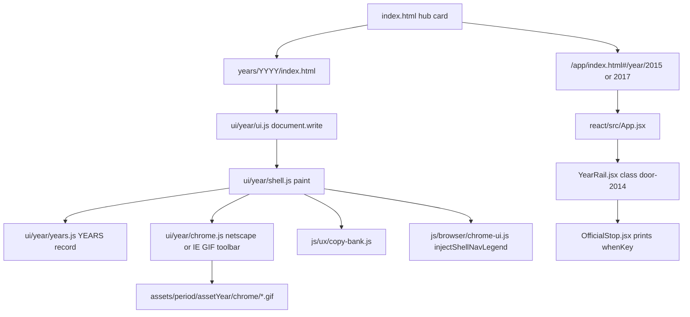

# Year chrome — production plan

**Date:** 2026-10-01
**Status:** Implemented in the working tree on 2026-10-01. A recheck the same day closed three shortfalls: 2022 uses the dark Chrome-habit taskbar and tab (the blue taskbar rule is gone), 2006–2009 home addresses stay on `home.microsoft.com` after boot, and the React door shows that habit address. Shell choices below stay locked. Not ship law. Counts of 22 or 24 doors in this plan are that day's scope.
**Law:** `js/year-card.json` · live hub · [`DISK-TRUTH.md`](DISK-TRUTH.md). Live hub is **25 doors** (1994–2015 and 2020–2022). **2015 is the React door.** **2017–2019 and 2023–2025 are absent.** This file does not add dest folders.

The years and the save data are far enough along to grade. The shell that frames them is not. The HTML doors share one painter (`ui/year/shell.js`) and three toolbar builders, but the record in `ui/year/years.js` often names a browser the painter does not draw. The React door (2015) does not use that painter. Production grade is one chrome contract, two renderers, dest HTML left where it is.

## What production grade means here

A visitor opens a live hub card, lands in that year's desktop, and can finish the star without the page teaching them a storage key or an absent year. Empty, trap, and incomplete still write nothing. Leftover still does not write the star. Hub cards stay the year number on one gray border (`css/hub-lean.css`). No accounts, no metrics vendor, no new dest folders, no restore of 2017–2019 or 2023–2025. The public Vercel project stays down until a separate publish decision. Local check is `python3 -m http.server 8080 --bind 127.0.0.1`.

`npm test` (full warehouse) stays red on purpose. A chrome PR is green when the shell specs below pass, not when the warehouse count moves.

## How a year is painted today



HTML boot is classic scripts, not modules. React is a Vite bundle in `app/assets/`. Rebuild with `npm run build` from the repo root. That runs `npm run build --prefix react`. Do not hand-edit `app/assets/`.

`chrome.js` `ieToolbar(spec)` always loads `assets/period/{spec.chrome}/chrome/btn-*.gif`. `chrome22Toolbar()` returns `""`. The Chrome habit bar is painted inline in `shell.js` when `toolbar === "chrome22"`: text arrows `← → ↻ ⌂`, no GIF, address from `spec.location`. Only 2022 sets that toolbar.

`copy-bank.js` already uses one coach sentence on every era: Starting Point is the all-years list, Toolbar Home is this year's landing. That matches the legend in `chrome-ui.js` ("Lost? Starting Point = all years · toolbar Home = this year"). `css/chrome-habit.css` then sets `.os-win10 .shell-nav-legend` and `.browser-chrome-habit .shell-nav-legend` to `display: none !important`, so 2022 never shows it.

Phone, as of this tree, is not the 2026-09-29 map. `docs/UI-FIX-MAP.md` is stale on this point. At `max-width: 640px`, both `css/win95-netscape.css` and `css/netscape-chrome.css` set `.dirbar { display: flex }`. 1994's desktop gutter stays `padding-left: 92px` above 640px (`netscape-chrome.css` line 208) and becomes `8px` under 640px. `.os-win10 .dirbar { display: flex }` in `chrome-habit.css` is unconditional, so 2022 keeps the directory at every width.

Toolbar GIF folders that exist: 1994–2002, 2004, 2005, 2006, 2007 (10 buttons each). `btn-back.gif` is byte-identical from 2004 through 2007. There is no distinct IE7, IE8, IE9, or Chrome pixel pack. 2003, 2008, 2010, 2012, 2013, 2014, and 2022 have no `chrome/` button folder. 2009's `chrome/` folder is two logos, not a toolbar.

CSS that actually changes the frame:

| Class | File | What it changes |
|---|---|---|
| `browser-ie5` | `css/ie5-overrides.css` | IE5 title bar and toolbar metrics |
| `os-winxp`, `browser-ie6`, `browser-ie7` | same file, one rule | XP Luna desktop. IE7 is not drawn apart from IE6 |
| `os-win7` | same file, later block | Win7 taskbar and title bar. `browser-ie8` / `browser-ie9` are named in a comment and have no selector of their own |
| `os-win10`, `browser-chrome-habit` | `css/chrome-habit.css` | Flat white toolbar, Segoe-class type, legend hidden |

1994–1997 leave `bodyClass` empty. Their look comes from which CSS file the year lists (`netscape-chrome.css` or `win95-netscape.css`), not from an `os-*` class.

## Each open year

Mass desktop is the machine a typical person had at the start of that year. The star room (iPhone, App Store, Like, Vine, WhatsApp, Periscope, Face ID, ChatGPT) stays a room inside the shell. It does not become the desktop.

| Year | Mass desktop at the time | What the record claims | What the painter does | Gap | Move with current tech |
|---|---|---|---|---|---|
| 1994 | Win 3.1, Netscape 1.0. No taskbar. Win95 is August 1995 | Netscape 1.0, `maximized: false`, `hasTaskbar: false`, location `home.nerf.edu/web1994/` | Netscape toolbar, own GIF folder, 92px icon gutter | Matches | Keep. Phone already drops the gutter |
| 1995 | Win95 (24 Aug), Netscape 2 by the end of the year | `family: win95`, toolbar netscape, label "Win95 · Netscape 2.0" | `win95-netscape.css`, 1995 GIFs. `bodyClass` empty | Matches. OS class is implicit | Set `bodyClass` to `os-win95` only if a rule exists for it. Do not invent one to chase a class name |
| 1996 | Win95, Netscape 3 still ahead of IE3 | Netscape 3.0, family win95 | Same painter, 1996 GIFs | Matches | None |
| 1997 | Win95, IE4 is the mass story, Netscape 4 still installed | Label IE 4.0, toolbar `ie`, chrome folder 1997 | IE GIF toolbar. `bodyClass` empty, so no `os-win95` / `browser-ie4` rule applies | Frame is the shared Win95 sheet, not a named IE4 body | Add `year-1997 os-win95 browser-ie4` only when those selectors exist. Until then the label is ahead of the CSS |
| 1998 | Win98, IE4 still the common install | `os-win98 browser-ie4`, folder 1998 | IE toolbar from 1998 GIFs | Class is set. Dedicated `browser-ie4` rules were not found in `css/` | Keep the GIFs. Add IE4 title-bar deltas in `ie5-overrides.css` only as a named CSS PR, reusing the IE5 pattern |
| 1999 | Win98 SE, IE5 | `os-win98 browser-ie5`, folder 1999 | `browser-ie5` rules in `ie5-overrides.css` | Matches | None |
| 2000 | Win98 and WinME still mass, IE 5.5 | Label "IE 5.5", class `browser-ie5`, folder 2000 | IE5 skin, 2000 GIFs | Label and class disagree | Point the class at the label: add `browser-ie55` as a thin delta on `browser-ie5`, or change the label back to IE5. Recommendation: keep the 5.5 label and alias `.browser-ie55` to the IE5 rules plus the version string |
| 2001 | XP from October, IE6. No Firefox, no Safari, no Chrome | `os-winxp browser-ie6`, folder 2001 | XP Luna block in `ie5-overrides.css` | Matches | None |
| 2002 | XP + IE6 | same | folder 2002 | Matches | None |
| 2003 | XP + IE6 | Label IE6, `chrome: "2004"` | Buttons load `assets/period/2004/chrome/` because `assets/period/2003/chrome/` does not exist | Honest borrow | Record `assetYear: "2004"` separately from the calendar year so the borrow is data, not a surprise |
| 2004 | XP + IE6. Firefox 1.0 is November, a room | `os-winxp browser-ie6`, folder 2004 | Own GIFs | Matches | None |
| 2005 | XP + IE6 mass. Firefox is growing. No Chrome | Label IE6, `chrome: "2004"` | 2004 GIFs. `assets/period/2005/chrome/` exists and `btn-back.gif` matches 2004 byte for byte | Borrow is visually a no-op | Set `assetYear` to 2005 so the path matches the year. Do not draw a new set |
| 2006 | XP + IE6 | same pattern, `chrome: "2004"`, own folder exists and matches | Same pixels | Same | `assetYear: "2006"` |
| 2007 | XP still the mass desktop. Vista shipped in January and was not the mass install. IE7 is common after late 2006. iPhone is June, a device | Label "XP · IE6 · iPhone Safari is a room", class `browser-ie6`, `chrome: "2004"` | XP Luna + IE6 GIFs. Own 2007 folder matches 2004 bytes | Shell matches the label. The label is the conservative choice versus IE7 | Locked: keep IE6. Star room stays the iPhone |
| 2008 | XP still mass, IE7 common, Chrome is a September beta | Label and class say IE7 (`browser-ie7`). `chrome: "2004"`. App Store is a room | `browser-ie7` is grouped with `browser-ie6` in `ie5-overrides.css` (lines 596–598). Buttons are the 2004 GIF set. No `assets/period/2008/chrome/` | The year says IE7 and draws IE6 | Keep XP. Keep borrowed `assetYear: "2004"`. Add a `browser-ie7` title-bar delta (taller blue bar, still the same GIFs) so the class does something. Do not draw Chrome as the shell |
| 2009 | IE8 shipped in March. Win7 shipped in October. XP is still a huge installed base in January | Label "XP · IE8", class `os-winxp browser-ie8`, `chrome: "2007"` | XP Luna, because `os-winxp` wins. `browser-ie8` has no rule. GIFs are the shared IE6 set. 2009 `chrome/` is two logos, not buttons | Three-way split: label IE8, frame XP/IE6, asset year 2007 | Locked: stay `os-winxp`. Document the GIF borrow. Do not move 2009 to Win7 |
| 2010 | Win7 + IE8. Chrome is rising. iPad is a room | `os-win7 browser-ie8`, label says IE8, `chrome: "2007"` | Win7 frame from `body.os-win7`. Toolbar GIFs still IE6. No 2010 chrome folder | Frame is Win7. Buttons are not IE8 | Hide the GIF `` under `body.os-win7 .toolbar .btn-img img` and show `.btn-label`, which `ieToolbar` already emits. Flat Win7 buttons, no new art |
| 2012 | Win7, IE9. Chrome passes IE on some counters late in the year, not in January | `os-win7 browser-ie9`, `chrome: "2007"`, location `home.microsoft.com/.../web2012/` | Win7 frame, IE6 GIFs, no `browser-ie9` rules | Same as 2010, label says IE9 | Same text-button treatment scoped to `.browser-ie9`. Leave the January shell on IE |
| 2013 | Win7 still the mass PC. Chrome is the habit browser on many global stats. Win8 is not the mass desktop | Label "IE9 desktop residual", class `browser-ie9`, `chrome: "2007"` | Same Win7 + IE6 GIFs | Label admits "residual". Painter does not show IE9 | Same `.browser-ie9` text buttons. Do not flip the shell to Chrome in this pass |
| 2014 | Win7 and 8.1. IE11 is Microsoft's browser on 8.1. Chrome is the mass desktop browser by late year | Label "Win7 · IE9", location `home.microsoft.com/.../web2014/`, `chrome: "2007"`, `leanBoot` | Same | IE9 is an exhibit frame, not late-2014 mass | Locked: keep IE9 on Win7, apply the text-button skin, keep `home.microsoft.com` |
| 2015 | Win10 from 29 July. Edge ships. Chrome is the habit browser | React door, star Periscope. No `years.js` row. No `years/2015/` tree | Live: `door os-win10 browser-chrome-habit`. Hall lists 2015 only. `OfficialStop` says `Saved.` Hold is red `#a00`. | Chrome-habit glass on disk | Locked: stay the 2022 Chrome-habit contract inside React. Do not build `years/2015/` |
| 2017 | Win10 + Chrome habit | React, star Face ID. No HTML tree | Same React flaws as 2015 | No period shell | Same Chrome-habit frame as 2015, one React component |
| 2022 | Win10 still mass, Win11 exists, Chrome | `os-win10 browser-chrome-habit`, `toolbar: "chrome22"`, location `https://www.google.com/web2022/`. `chrome` field is still `"2007"` | `shell.js` ignores GIFs for `chrome22` and paints the text omnibox. Legend hidden. `chrome22Toolbar()` in `chrome.js` is an empty stub | Closest year. Asset field is a lie. Legend is gone. Painter is split across two files | Locked: stay Win10. Move the omnibox markup from `shell.js` into `chrome.js` `chrome22Toolbar`. Set `assetYear` to null. Un-hide the legend |

2017–2019 and 2023–2025 are absent. They do not get a hub card or a sentence on the React hall. 2011, 2020, 2021, and 2022 are live HTML doors. 2011 is Win7 + IE 8. The 2017 row above is the 2026-10-01 plan, not a live door.

## One chrome record, two renderers

Recommended end state: the year card is the only list of open years, and each open year carries a `chrome` object the HTML painter and the React doors both read.

```js
{
  "year": "2022",
  "kind": "html",
  "href": "years/2022/",
  "star": "itt22-chatgpt",
  "leanBoot": true,
  "hashToHtml": true,
  "chrome": {
    "os": "win10",
    "browser": "chrome-habit",
    "toolbar": "chrome22",
    "assetYear": null,
    "location": "https://www.google.com/web2022/",
    "maximized": true,
    "hasTaskbar": true
  }
}
```

`bodyClass` becomes a function of that object: `year-YYYY os-{os} browser-{browser}`. `yearLabel` becomes a function of the same object plus a short room clause already in the label ("iPhone Safari is a room"). Do not keep a third hand-written class string that can drift, which is what happened to 2000 and 2008.

`ui/year/years.js` keeps the per-year directory, thesis, and about HTML. Those are content. Chrome fields are read from `js/year-card.json` (the browser copy `js/year-card.js` already loads on the hub and the atlas). `shell.js` paint signature stays `paint(year)`.

Toolbar choice stays the branch that is already in `shell.js`:

- `netscape` → `chrome.js` `netscapeToolbar`, GIFs from `assetYear`
- `ie` → `ieToolbar`, GIFs from `assetYear`, with `.btn-label` already in the markup
- `chrome22` → the omnibox that today is inline in `shell.js`, moved into `chrome22Toolbar` so the empty stub is gone

IE8 and IE9 do not get new GIF art. `body.browser-ie8 .toolbar img` and `body.browser-ie9 .toolbar img` are hidden, and the existing text labels become the buttons, on top of the Win7 frame that `body.os-win7` already paints. IE6 and Netscape keep their GIFs. IE7 keeps the GIFs and gains a title-bar rule so `browser-ie7` is not a synonym of `browser-ie6`.

React does not import the classic `ITT` global. It already imports the year card in `react/src/years.js`. `YearRail` reads `card.years[year].chrome` and sets `className={"door os-" + chrome.os + " browser-" + chrome.browser}` instead of `door door-2014`. The trail inside the frame stays `OfficialStop`. Success copy is "Saved in this browser." Blocked copy is "This browser blocked the save." The storage key stays in the DOM for tests (`id={stop.whenKey}`) and leaves the visitor sentence.

`App.jsx` `Hall` lede becomes the two React years and a link back to `../index.html`. It does not interpolate `cardList("absent")` or `cardList("boarded")`.

`hashToHtml` years (2014, 2022) keep bouncing `#/year/YYYY` to `/years/YYYY/`. They do not grow a second React paint path.

### Why not the other two shapes

Keeping two shells and only patching strings fixes the React key leak, then the next mismatch lands in `years.js` again. That can be PR 2 of this plan. It is not the end state.

Rewriting every year and every dest as React components fails the constraints that already hold: static hosting, frozen forests (`assert_mutable`), thousands of dest files, `document.write` boot, and no backend. Dest HTML stays under `years/YYYY/sites/`. A Vite conversion of the static shell is a later program, after this chrome contract is true. `docs/ARCHITECTURE.md` already says year differences live in config and content, shared behavior lives once.

### Phone and legend

One rule for every open year: under 640px the directory wraps (`display: flex; flex-wrap: wrap`) and the 1994 icon gutter collapses. That is already what the two Netscape sheets do. Do not reintroduce `display: none` on `.dirbar`.

Delete the `display: none !important` on `.shell-nav-legend` for `.os-win10` and `.browser-chrome-habit`. Keep hiding `#itt-layer-legend` (Machine / Web / Game) on Chrome habit. That band is 1995 museum chrome. The comment in `chrome-habit.css` already says so.

The coach sentence is already right. No copy-bank rewrite is required unless a year starts calling Starting Point the year map again. `pages/home.html` is also titled Starting Point inside year configs. The legend uses Starting Point for the hub. Leave that name collision for a later copy pass. This plan does not rename rooms.

## Risks

| Risk | Severity | Mitigation |
|---|---|---|
| `assetYear` points at a missing folder and the toolbar 404s | High | Only 1994–2002 and 2004–2007 have button folders. 2003 and 2008 stay on 2004. 2009–2014 either stay on 2007 GIFs or switch to text labels and stop requesting GIFs. A unit check lists every `assetYear` and `ls`s the folder |
| IE7 CSS grouped with IE6 gets split badly and XP years change look | Medium | New `browser-ie7` rules must be more specific than the group selector at `ie5-overrides.css` 596. Screenshot 2001 and 2008 before and after |
| React rebuild drifts from `app/index.html` script hash | High | PR that touches `react/src` runs `npm run build` in `react/` and commits the emitted asset plus the hash in `app/index.html` together |
| Save keys change while chrome is edited | High | `whenKey` strings and `official-verb.js` / `leftover-official.js` are out of scope. Tests assert the same keys |
| Period CSS `@import` chain leaks dest chrome | Medium | Dest wayfind and footer stay in `css/itt-dest-page.css` only, per `docs/ITT-CSS-LAYERS.md`. This plan does not put shell rules back into `period-YYYY.css` |
| Frozen years gain dest folders | High | No PR in this plan creates a folder under `years/1994`–`years/2006` |
| Hub card design regresses | Medium | Do not edit `css/hub-lean.css` except to keep the year-number treatment. `e2e/hub-years.spec.js` must expect 24 cards |

## Security and privacy

No new network calls. No third-party fonts. Period assets stay under `assets/period/`. `localStorage` key names do not change. CSP stays `connect-src 'self'`. The debug ring stays `?debug=1` and `js/debug-ring.js`. No analytics.

## Observability

Shell paint already runs in the page. A failed GIF is a 404 in the network panel, which the asset-year check turns into a static failure before a browser is opened. React save failures keep using the existing blocked-save sentence. No new log pipeline.

## Rollout

Each PR is mergeable on its own. None of them wipe a year or add a dest.

1. **Record the chrome contract on the year card.** Add the `chrome` object for all 24 open years, copied from the table above, including the borrows (`2003.assetYear = "2004"`, `2008.assetYear = "2004"`). Absent years get no chrome object. `ui/year/years.js` still paints from its own fields. A node or Python check fails if card chrome and `years.js` disagree. Files: `js/year-card.json`, `js/year-card.js`, a small check in `scripts/`. Depends on nothing.

2. **Make the painter read the card.** `shell.js` overlays `chrome` from the card onto the year spec before building the toolbar. Output must match PR 1's parity check, so this PR is a no-visual-change refactor. Files: `ui/year/shell.js`, `ui/year/years.js`. Depends on PR 1.

3. **Fix the data lies that do not need new art.** 2000 class alias `browser-ie55`. 2005 and 2006 `assetYear` to their own folders. 2022 `assetYear: null`. Move the omnibox markup into `chrome.js` `chrome22Toolbar`. Files: `js/year-card.json`, `ui/year/years.js`, `ui/year/chrome.js`, `ui/year/shell.js`. Depends on PR 2.

4. **Win7 and IE7 skins from CSS already in the tree.** Text labels on `.browser-ie8` and `.browser-ie9`. A title-bar delta for `.browser-ie7` that does not change `.browser-ie6`. Files: `css/ie5-overrides.css`. Depends on PR 3.

5. **Legend and phone contract.** Remove the legend `display: none` for Win10 and Chrome habit. Keep the 640px directory wrap. Files: `css/chrome-habit.css`, and the 640px blocks only if a year still hides `.dirbar`. Depends on PR 3.

6. **React doors wear the same contract.** Hall copy, `YearRail` class, `OfficialStop` sentences, read `chrome` from the card. `cd react && npm run build`. Files: `react/src/App.jsx`, `react/src/YearRail.jsx`, `react/src/OfficialStop.jsx`, `react/src/styles.css`, `app/index.html`, `app/assets/*`. Depends on PR 1. Can land in parallel with PR 3–5.

7. **Lock it.** Extend `e2e/shell-chrome.spec.js`, `e2e/chrome-habit-shell.spec.js`, and `e2e/hub-years.spec.js`: 25 hub cards, 2022 toolbar is not an IE GIF, React hall text has no "absent", a finished React stop's visible status does not contain `itt17-` or `itt15-`. Depends on PR 3 and PR 6.

## Key decisions

1. **One chrome object on `js/year-card.json`.** The card is already what `itt_gate.py` and the React door list read. A second JSON file would be another list to drift.
2. **Two renderers stay.** HTML years keep `ui/year/shell.js`. React years keep their trail components and only borrow the chrome classes. Dest HTML is not ported.
3. **No new brand pixels.** Distinct IE7/8/9/Chrome button art does not exist in `assets/period/`. Later Microsoft years use CSS on labels the toolbar already renders. Chrome habit uses the text omnibox 2022 already uses.
4. **January shell, star in a room.** iPhone, Chrome-the-product, App Store, Like, Vine, WhatsApp, Periscope, Face ID, and ChatGPT do not replace the desktop of that year.
5. **2022 is the Chrome-habit HTML door.** the wiped year is gone.
6. **Hub visual law is unchanged.** Year number, one gray border.
7. **Save contract is unchanged.** Two writers, same keys, visitor copy without the key.

## Locked shell choices

Decided 2026-10-01. The PRs above use these. Do not reopen them in an implement pass.

1. **2007** stays XP and IE6. The iPhone stays a room. Vista does not become the shell.
2. **2009** stays XP and IE8. Win7 styling begins at 2010, where the class is already `os-win7`.
3. **2013 and 2014** stay Win7 and IE9. Chrome habit starts at the 2015 React door. WhatsApp stays a room.
4. **2015** wears the Win10 Chrome-habit frame around the existing React trail. It does not gain a `years/2015/` tree, and it does not stay a flat exhibit. 2017 is absent and does not get that frame.
5. **2022** stays Windows 10. Win11 is out of this plan.

## Non-goals

- Dest doubling, Pack B/C for 2008, leftover-3× catalogs, leftover-20 on any year but 2017.
- Turning 2014 into a React door. `#/year/2014` already bounces to HTML.
- Rewriting `js/browser/create.js` or the immersion engines.
- Publishing a public URL.
- Renaming Starting Point.
- Drawing logos, or replacing `[failed-final]` with invented brand pixels.

## References

- `ui/year/years.js`, `ui/year/shell.js`, `ui/year/chrome.js`
- `js/year-card.json`, `js/ux/copy-bank.js`, `js/browser/chrome-ui.js`
- `css/ie5-overrides.css`, `css/chrome-habit.css`, `css/netscape-chrome.css`, `css/win95-netscape.css`, `css/itt-dest-page.css`
- `react/src/App.jsx`, `react/src/YearRail.jsx`, `react/src/OfficialStop.jsx`
- `docs/ARCHITECTURE.md`, `docs/ITT-CSS-LAYERS.md`, `docs/DISK-TRUTH.md`
- `docs/UI-FIX-MAP.md` is a 2026-09-29 finding list. Phone directory and coach sentences in that file do not match this tree.
