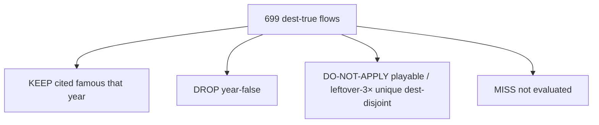

# Year-false KEEP / DROP / MISS map

**Date:** 2026-09-20
**Source:** `year-false-keep-drop` continue · [`DEST-TRUE-FLOW-MAP.md`](DEST-TRUE-FLOW-MAP.md)
**Status:** Leftover dest DROPs applied on disk (0 leftover dest DROP folders remain). Forest pack DROPs: 11 dests deleted 2026-09-20; 1995 `pathfinder` stays (official n=9). Official 10 DROPs stay on disk. Not dest-farm.

KEEP = famous that year, cited. DROP = year-false, cited. MISS = not evaluated (do not invent). DO-NOT-APPLY = cited DROP that museum law still keeps (playable year-game · leftover-3× unique dest-disjoint leftover dests · Chrome/Win10 residual).

| Verdict | Count |
|--------|------:|
| KEEP | 405 |
| DROP (cited year-false) | 191 |
| DO-NOT-APPLY (law keeps) | 103 |
| MISS (not evaluated) | 0 |
| Dest-true flows on map | 699 |

## 1994 · star `csotd`

| Slug | Class | Verdict |
|------|-------|---------|
| `csotd` | official 10 | **KEEP** |
| `yahoo` | official 10 | **KEEP** |
| `cern` | official 10 | **DROP** |
| `fishcam` | official 10 | **DROP** |
| `whitehouse` | official 10 | **KEEP** |
| `nasa` | official 10 | **DROP** |
| `iuma` | official 10 | **DROP** |
| `hotwired` | official 10 | **KEEP** |
| `lycos` | official 10 | **KEEP** |
| `playable` | official 10 | **DO-NOT-APPLY** |
| `webcrawler` | forest pack | **KEEP** |
| `galaxy` | forest pack | **KEEP** |
| `gnn` | forest pack | **KEEP** |
| `jumpstation` | forest pack | **DROP** |
KEEP 8 · DROP 5 · DO-NOT-APPLY 1 · MISS 0

## 1995 · star `amazon`

| Slug | Class | Verdict |
|------|-------|---------|
| `amazon` | official 10 | **KEEP** |
| `auctionweb` | official 10 | **KEEP** |
| `geocities` | official 10 | **KEEP** |
| `yahoo` | official 10 | **KEEP** |
| `altavista` | official 10 | **KEEP** |
| `cnn` | official 10 | **KEEP** |
| `microsoft` | official 10 | **KEEP** |
| `netscape` | official 10 | **KEEP** |
| `pathfinder` | official 10 | **DROP** |
| `playable` | official 10 | **DO-NOT-APPLY** |
| `classmates` | forest pack | **KEEP** |
| `match` | forest pack | **KEEP** |
| `tripod` | forest pack | **KEEP** |
| `pathfinder` | forest pack | **DROP** |

KEEP 11 · DROP 2 · DO-NOT-APPLY 1 · MISS 0

## 1996 · star `portals`

| Slug | Class | Verdict |
|------|-------|---------|
| `portals` | official 10 | **KEEP** |
| `hotmail` | official 10 | **KEEP** |
| `spacejam` | official 10 | **KEEP** |
| `yahoo` | official 10 | **KEEP** |
| `geocities` | official 10 | **DROP** |
| `amazon` | official 10 | **KEEP** |
| `auctionweb` | official 10 | **KEEP** |
| `excite` | official 10 | **KEEP** |
| `altavista` | official 10 | **KEEP** |
| `playable` | official 10 | **DO-NOT-APPLY** |
| `angelfire` | forest pack | **KEEP** |
| `aolportal` | forest pack | **DROP** |
| `realplayer` | forest pack | **KEEP** |
| `theglobe` | forest pack | **DROP** |
KEEP 10 · DROP 3 · DO-NOT-APPLY 1 · MISS 0

## 1997 · star `pointcast`

| Slug | Class | Verdict |
|------|-------|---------|
| `pointcast` | official 10 | **KEEP** |
| `icq` | official 10 | **KEEP** |
| `ebay` | official 10 | **KEEP** |
| `hotmail` | official 10 | **KEEP** |
| `slashdot` | official 10 | **KEEP** |
| `drudge` | official 10 | **KEEP** |
| `hotbot` | official 10 | **KEEP** |
| `apple` | official 10 | **KEEP** |
| `microsoft` | official 10 | **KEEP** |
| `playable` | official 10 | **DO-NOT-APPLY** |
| `aim` | forest pack | **KEEP** |
| `winamp` | forest pack | **KEEP** |
| `javaplugin` | forest pack | **DROP** |
| `scripting` | forest pack | **KEEP** |
KEEP 12 · DROP 1 · DO-NOT-APPLY 1 · MISS 0

## 1998 · star `google`

| Slug | Class | Verdict |
|------|-------|---------|
| `google` | official 10 | **KEEP** |
| `yahoo` | official 10 | **KEEP** |
| `amazon` | official 10 | **KEEP** |
| `ebay` | official 10 | **KEEP** |
| `cdnow` | official 10 | **KEEP** |
| `hotmail` | official 10 | **DROP** |
| `mozilla` | official 10 | **KEEP** |
| `slashdot` | official 10 | **DROP** |
| `dmoz` | official 10 | **KEEP** |
| `snap` | official 10 | **KEEP** |
| `goto` | forest pack | **KEEP** |
| `mp3com` | forest pack | **DROP** |
| `realplayer` | forest pack | **DROP** |
| `winamp` | forest pack | **DROP** |
KEEP 9 · DROP 5 · DO-NOT-APPLY 0 · MISS 0

## 1999 · star `aim`

| Slug | Class | Verdict |
|------|-------|---------|
| `aim` | official 10 | **KEEP** |
| `napster` | official 10 | **KEEP** |
| `google` | official 10 | **KEEP** |
| `blogger` | official 10 | **KEEP** |
| `y2k` | official 10 | **KEEP** |
| `sourceforge` | official 10 | **KEEP** |
| `paypal` | official 10 | **KEEP** |
| `amazon` | official 10 | **KEEP** |
| `ebay` | official 10 | **KEEP** |
| `askjeeves` | official 10 | **KEEP** |
| `yahoomessenger` | forest pack | **KEEP** |
| `etrade` | forest pack | **KEEP** |
| `webvan` | forest pack | **KEEP** |
| `boocom` | forest pack | **KEEP** |
KEEP 14 · DROP 0 · DO-NOT-APPLY 0 · MISS 0

## 2000 · star `mapquest`

| Slug | Class | Verdict |
|------|-------|---------|
| `mapquest` | official 10 | **KEEP** |
| `amazon` | official 10 | **KEEP** |
| `ebay` | official 10 | **DROP** |
| `paypal` | official 10 | **KEEP** |
| `napster` | official 10 | **KEEP** |
| `gnutella` | official 10 | **KEEP** |
| `pets` | official 10 | **KEEP** |
| `google` | official 10 | **KEEP** |
| `cnn` | official 10 | **DROP** |
| `y2k` | official 10 | **KEEP** |
| `limewire` | forest pack | **KEEP** |
| `expedia` | forest pack | **DROP** |
| `travelocity` | forest pack | **DROP** |
KEEP 9 · DROP 4 · DO-NOT-APPLY 0 · MISS 0

## 2001 · star `wikipedia`

| Slug | Class | Verdict |
|------|-------|---------|
| `wikipedia` | official 10 | **KEEP** |
| `archive` | official 10 | **KEEP** |
| `itunes` | official 10 | **KEEP** |
| `apple` | official 10 | **KEEP** |
| `napster` | official 10 | **KEEP** |
| `movabletype` | official 10 | **KEEP** |
| `google` | official 10 | **DROP** |
| `yahoo` | official 10 | **DROP** |
| `amazon` | official 10 | **DROP** |
| `playable` | official 10 | **DO-NOT-APPLY** |
KEEP 6 · DROP 3 · DO-NOT-APPLY 1 · MISS 0

## 2002 · star `stumbleupon`

| Slug | Class | Verdict |
|------|-------|---------|
| `stumbleupon` | official 10 | **KEEP** |
| `isp` | official 10 | **KEEP** |
| `kazaa` | official 10 | **KEEP** |
| `wired` | official 10 | **KEEP** |
| `phoenix` | official 10 | **KEEP** |
| `mozilla` | official 10 | **KEEP** |
| `ipod` | official 10 | **KEEP** |
| `friendster` | official 10 | **KEEP** |
| `movabletype` | official 10 | **KEEP** |
| `playable` | official 10 | **DO-NOT-APPLY** |
KEEP 9 · DROP 0 · DO-NOT-APPLY 1 · MISS 0

## 2003 · star `photobucket`

| Slug | Class | Verdict |
|------|-------|---------|
| `photobucket` | official 10 | **KEEP** |
| `itunes` | official 10 | **KEEP** |
| `wordpress` | official 10 | **KEEP** |
| `linkedin` | official 10 | **KEEP** |
| `myspace` | official 10 | **KEEP** |
| `friendster` | official 10 | **KEEP** |
| `adsense` | official 10 | **KEEP** |
| `bloglines` | official 10 | **KEEP** |
| `blogger` | official 10 | **KEEP** |
| `playable` | official 10 | **DO-NOT-APPLY** |
KEEP 9 · DROP 0 · DO-NOT-APPLY 1 · MISS 0

## 2004 · star `facebook`

| Slug | Class | Verdict |
|------|-------|---------|
| `facebook` | official 10 | **KEEP** |
| `gmail` | official 10 | **KEEP** |
| `firefox` | official 10 | **KEEP** |
| `flickr` | official 10 | **KEEP** |
| `delicious` | official 10 | **DROP** |
| `digg` | official 10 | **KEEP** |
| `web20conference` | official 10 | **KEEP** |
| `basecamp` | forest pack | **KEEP** |
| `tinypic` | forest pack | **KEEP** |
| `orkutseed` | forest pack | **KEEP** |
| `worldofwarcraft` | forest pack | **KEEP** |
KEEP 10 · DROP 1 · DO-NOT-APPLY 0 · MISS 0

## 2005 · star `youtube`

| Slug | Class | Verdict |
|------|-------|---------|
| `youtube` | official 10 | **KEEP** |
| `maps` | official 10 | **KEEP** |
| `pandora` | official 10 | **KEEP** |
| `housingmaps` | official 10 | **KEEP** |
| `digg` | official 10 | **KEEP** |
| `reddit` | official 10 | **KEEP** |
| `flickr` | official 10 | **KEEP** |
| `itunes` | official 10 | **KEEP** |
| `techcrunch` | official 10 | **KEEP** |
| `playable` | official 10 | **DO-NOT-APPLY** |
| `utorrent` | forest pack | **KEEP** |
| `googleearth` | forest pack | **KEEP** |
| `kayak` | forest pack | **KEEP** |
| `secondlife` | forest pack | **DROP** |
KEEP 12 · DROP 1 · DO-NOT-APPLY 1 · MISS 0

## 2006 · star `twitter`

| Slug | Class | Verdict |
|------|-------|---------|
| `twitter` | official 10 | **KEEP** |
| `facebook` | official 10 | **KEEP** |
| `youtube` | official 10 | **KEEP** |
| `googledocs` | official 10 | **KEEP** |
| `aws` | official 10 | **KEEP** |
| `ie7` | official 10 | **KEEP** |
| `wikipedia` | official 10 | **KEEP** |
| `roblox` | official 10 | **KEEP** |
| `playable` | official 10 | **DO-NOT-APPLY** |
| `meebo` | forest pack | **DROP** |
| `huffpost` | forest pack | **DROP** |
KEEP 8 · DROP 2 · DO-NOT-APPLY 1 · MISS 0

## 2007 · star `iphone`

| Slug | Class | Verdict |
|------|-------|---------|
| `iphone` | official 10 | **KEEP** |
| `streetview` | official 10 | **KEEP** |
| `gmail` | official 10 | **KEEP** |
| `fbplat` | official 10 | **KEEP** |
| `twitter` | official 10 | **KEEP** |
| `youtube` | official 10 | **DROP** |
| `tumblr` | official 10 | **KEEP** |
| `kindle` | official 10 | **KEEP** |
| `ie6` | official 10 | **DO-NOT-APPLY** |
| `playable` | official 10 | **DO-NOT-APPLY** |
| `wiki` | leftover-3× unique | **DROP** |
| `myspace` | leftover-3× unique | **DO-NOT-APPLY** |
| `maps` | leftover-3× unique | **DROP** |
| `ebay` | leftover-3× unique | **DO-NOT-APPLY** |
| `stumble` | leftover-3× unique | **DROP** |
| `wow` | leftover-3× unique | **DO-NOT-APPLY** |
| `flickr` | leftover-3× unique | **DO-NOT-APPLY** |
| `reddit` | leftover-3× unique | **DO-NOT-APPLY** |
| `digg` | leftover-3× unique | **DROP** |
| `hackernews` | leftover dest | **KEEP** |
| `friendfeed` | leftover dest | **KEEP** |
| `tesla` | leftover dest | **DROP** |
| `amazon` | leftover dest | **DROP** |
| `bbc` | leftover dest | **DROP** |
| `aol` | leftover dest | **DROP** |
| `msn` | leftover dest | **DROP** |
| `ask` | leftover dest | **DROP** |
| `netflix` | leftover dest | **KEEP** |
| `appletv` | leftover dest | **KEEP** |
| `ipodtouch` | leftover dest | **KEEP** |
| `justintv` | leftover dest | **KEEP** |
| `icanhas` | leftover dest | **KEEP** |
| `funnyordie` | leftover dest | **KEEP** |
| `pownce` | leftover dest | **KEEP** |
| `androidann` | leftover dest | **KEEP** |
| `feedburner` | leftover dest | **DROP** |
| `gears` | leftover dest | **KEEP** |
| `iplayer` | leftover dest | **KEEP** |
| `lastfm` | leftover dest | **DROP** |
| `clubpenguin` | leftover dest | **DROP** |
| `amazonmp3` | leftover dest | **KEEP** |
| `safari3` | leftover dest | **KEEP** |
KEEP 21 · DROP 14 · DO-NOT-APPLY 7 · MISS 0

## 2008 · star `github`

| Slug | Class | Verdict |
|------|-------|---------|
| `github` | official 10 | **KEEP** |
| `appstore` | official 10 | **KEEP** |
| `chrome` | official 10 | **KEEP** |
| `android` | official 10 | **KEEP** |
| `hulu` | official 10 | **KEEP** |
| `facebook` | official 10 | **KEEP** |
| `twitter` | official 10 | **DROP** |
| `youtube` | official 10 | **DROP** |
| `dropbox` | official 10 | **KEEP** |
| `iphone` | official 10 | **KEEP** |
| `evernote` | forest pack | **KEEP** |
| `groupon` | forest pack | **KEEP** |
| `airbnb` | forest pack | **KEEP** |
| `spotifyseed` | forest pack | **KEEP** |

KEEP 12 · DROP 2 · DO-NOT-APPLY 0 · MISS 0

## 2010 · star `instagram`

| Slug | Class | Verdict |
|------|-------|---------|
| `instagram` | official 10 | **KEEP** |
| `iphone` | official 10 | **KEEP** |
| `ipad` | official 10 | **KEEP** |
| `facebook` | official 10 | **KEEP** |
| `farmville` | official 10 | **KEEP** |
| `imgur` | official 10 | **DROP** |
| `foursquare` | official 10 | **DROP** |
| `twitter` | official 10 | **DROP** |
| `youtube` | official 10 | **DROP** |
| `playable` | official 10 | **DO-NOT-APPLY** |
| `netflix` | leftover-3× unique | **DO-NOT-APPLY** |
| `tumblr` | leftover-3× unique | **DO-NOT-APPLY** |
| `formspring` | leftover-3× unique | **KEEP** |
| `chrome` | leftover-3× unique | **DO-NOT-APPLY** |
| `wave` | leftover-3× unique | **KEEP** |
| `android` | leftover-3× unique | **KEEP** |
| `reddit` | leftover-3× unique | **DO-NOT-APPLY** |
| `google` | leftover-3× unique | **DO-NOT-APPLY** |
| `groupon` | leftover-3× unique | **KEEP** |
| `flipboard` | leftover dest | **KEEP** |
| `minecraft` | leftover dest | **KEEP** |
| `baidu` | leftover dest | **DROP** |
| `yandex` | leftover dest | **DROP** |
| `hulu` | leftover dest | **KEEP** |
| `angry` | leftover dest | **KEEP** |
| `path` | leftover dest | **KEEP** |
| `googlebuzz` | leftover dest | **KEEP** |
| `chromewebstore` | leftover dest | **KEEP** |
| `kinect` | leftover dest | **KEEP** |
| `cityville` | leftover dest | **KEEP** |
| `ibooks` | leftover dest | **KEEP** |
| `ios4` | leftover dest | **DROP** |
| `nexusone` | leftover dest | **DROP** |
| `froyo` | leftover dest | **DROP** |
| `skype` | leftover dest | **DROP** |
| `wordpress` | leftover dest | **DROP** |
| `bing` | leftover dest | **DROP** |
| `flickr` | leftover dest | **DROP** |
| `wikipedia` | leftover dest | **DROP** |
| `ebay` | leftover dest | **DROP** |
| `paypal` | leftover dest | **DROP** |
KEEP 19 · DROP 16 · DO-NOT-APPLY 6 · MISS 0

## 2011 · star `googleplus`

| Slug | Class | Verdict |
|------|-------|---------|
| `googleplus` | official 10 | **KEEP** |
| `spotify` | official 10 | **KEEP** |
| `iphone` | official 10 | **KEEP** |
| `facebook` | official 10 | **KEEP** |
| `ipad` | official 10 | **KEEP** |
| `airbnb` | official 10 | **DROP** |
| `instagram` | official 10 | **DROP** |
| `twitter` | official 10 | **DROP** |
| `qwikster` | official 10 | **KEEP** |
| `playable` | official 10 | **DO-NOT-APPLY** |
| `icloud` | leftover-3× unique | **KEEP** |
| `pinterest` | leftover-3× unique | **KEEP** |
| `linkedin` | leftover-3× unique | **KEEP** |
| `kindlefire` | leftover-3× unique | **KEEP** |
| `minecraft` | leftover-3× unique | **KEEP** |
| `twitch` | leftover-3× unique | **KEEP** |
| `youtube` | leftover-3× unique | **DO-NOT-APPLY** |
| `dropbox` | leftover-3× unique | **DO-NOT-APPLY** |
| `hulu` | leftover-3× unique | **DO-NOT-APPLY** |
| `snapchat` | leftover dest | **KEEP** |
| `ios5` | leftover dest | **KEEP** |
| `imessage` | leftover dest | **KEEP** |
| `chromebook` | leftover dest | **KEEP** |
| `honeycomb` | leftover dest | **KEEP** |
| `ics` | leftover dest | **KEEP** |
| `wechat` | leftover dest | **KEEP** |
| `line` | leftover dest | **KEEP** |
| `temple` | leftover dest | **KEEP** |
| `skyrim` | leftover dest | **KEEP** |
| `nytpaywall` | leftover dest | **KEEP** |
| `skypebuy` | leftover dest | **KEEP** |
| `grouponipo` | leftover dest | **KEEP** |
| `zyngaipo` | leftover dest | **KEEP** |
| `googlewallet` | leftover dest | **KEEP** |
| `stripe` | leftover dest | **KEEP** |
| `duolingo` | leftover dest | **DROP** |
| `codecademy` | leftover dest | **KEEP** |
| `baidu` | leftover dest | **DROP** |
| `yandex` | leftover dest | **DROP** |
| `wikipedia` | leftover dest | **DROP** |
| `amazon` | leftover dest | **DROP** |
| `reddit` | leftover dest | **DROP** |
| `tumblr` | leftover dest | **DROP** |
| `netflix` | leftover dest | **DROP** |
| `github` | leftover dest | **DROP** |
| `whatsapp` | leftover dest | **DROP** |
| `path` | leftover dest | **DROP** |
| `nintendo3ds` | leftover dest | **KEEP** |
| `psnhack` | leftover dest | **KEEP** |
| `gowalla` | leftover dest | **KEEP** |
KEEP 32 · DROP 14 · DO-NOT-APPLY 4 · MISS 0

## 2012 · star `instagram`

| Slug | Class | Verdict |
|------|-------|---------|
| `instagram` | official 10 | **KEEP** |
| `pinterest` | official 10 | **KEEP** |
| `facebook` | official 10 | **KEEP** |
| `iphone` | official 10 | **KEEP** |
| `wikipedia` | official 10 | **KEEP** |
| `medium` | official 10 | **KEEP** |
| `path` | official 10 | **KEEP** |
| `flipboard` | official 10 | **KEEP** |
| `playable` | official 10 | **DO-NOT-APPLY** |
| `drawsomething` | leftover-3× unique | **KEEP** |
| `googledrive` | leftover-3× unique | **KEEP** |
| `snapchat` | leftover-3× unique | **KEEP** |
| `uber` | leftover-3× unique | **DO-NOT-APPLY** |
| `buzzfeed` | leftover-3× unique | **DO-NOT-APPLY** |
| `youtube` | leftover-3× unique | **DO-NOT-APPLY** |
| `reddit` | leftover-3× unique | **DO-NOT-APPLY** |
| `surface` | leftover-3× unique | **KEEP** |
| `windows8` | leftover-3× unique | **KEEP** |
| `tinder` | leftover dest | **KEEP** |
| `duolingo` | leftover dest | **KEEP** |
| `baidu` | leftover dest | **DROP** |
| `yandex` | leftover dest | **DROP** |
| `vk` | leftover dest | **DROP** |
| `coursera` | leftover dest | **KEEP** |
| `udacity` | leftover dest | **KEEP** |
| `edx` | leftover dest | **KEEP** |
| `nexus7` | leftover dest | **KEEP** |
| `jellybean` | leftover dest | **KEEP** |
| `ios6` | leftover dest | **KEEP** |
| `applemaps` | leftover dest | **DROP** |
| `googleplay` | leftover dest | **KEEP** |
| `kindlefirehd` | leftover dest | **KEEP** |
| `github` | leftover dest | **DROP** |
| `dropbox` | leftover dest | **DROP** |
| `evernote` | leftover dest | **DROP** |
| `linkedin` | leftover dest | **DROP** |
| `etsy` | leftover dest | **DROP** |
| `netflix` | leftover dest | **DROP** |
| `hulu` | leftover dest | **DROP** |
| `whatsapp` | leftover dest | **DROP** |
| `coinbase` | leftover dest | **KEEP** |
| `tumblr` | leftover dest | **DROP** |
KEEP 24 · DROP 13 · DO-NOT-APPLY 5 · MISS 0

## 2013 · star `vine`

| Slug | Class | Verdict |
|------|-------|---------|
| `vine` | official 10 | **KEEP** |
| `instagram` | official 10 | **KEEP** |
| `snapchat` | official 10 | **KEEP** |
| `iphone` | official 10 | **KEEP** |
| `snowden` | official 10 | **KEEP** |
| `telegram` | official 10 | **KEEP** |
| `tumblr` | official 10 | **KEEP** |
| `windows81` | official 10 | **KEEP** |
| `playable` | official 10 | **DO-NOT-APPLY** |
| `askfm` | leftover-3× unique | **KEEP** |
| `whisper` | leftover-3× unique | **DO-NOT-APPLY** |
| `youtube` | leftover-3× unique | **DO-NOT-APPLY** |
| `chrome` | leftover-3× unique | **DO-NOT-APPLY** |
| `medium` | leftover-3× unique | **DO-NOT-APPLY** |
| `yikyak` | leftover-3× unique | **KEEP** |
| `reddit` | leftover-3× unique | **DO-NOT-APPLY** |
| `facebook` | leftover-3× unique | **DO-NOT-APPLY** |
| `twitter` | leftover-3× unique | **DO-NOT-APPLY** |
KEEP 10 · DROP 0 · DO-NOT-APPLY 8 · MISS 0

## 2014 · star `whatsapp`

| Slug | Class | Verdict |
|------|-------|---------|
| `whatsapp` | official 10 | **KEEP** |
| `heartbleed` | official 10 | **KEEP** |
| `icebucket` | official 10 | **KEEP** |
| `iphone` | official 10 | **KEEP** |
| `applepay` | official 10 | **KEEP** |
| `material` | official 10 | **KEEP** |
| `slack` | official 10 | **KEEP** |
| `twitch` | official 10 | **KEEP** |
| `playable` | official 10 | **DO-NOT-APPLY** |
| `snapchat` | leftover-3× unique | **DO-NOT-APPLY** |
| `instagram` | leftover-3× unique | **DO-NOT-APPLY** |
| `uber` | leftover-3× unique | **DO-NOT-APPLY** |
| `twitter` | leftover-3× unique | **DO-NOT-APPLY** |
| `musically14` | leftover-3× unique | **KEEP** |
| `truecrypt` | leftover-3× unique | **KEEP** |
| `facebook` | leftover-3× unique | **DO-NOT-APPLY** |
| `wikipedia` | leftover-3× unique | **DO-NOT-APPLY** |
| `youtube` | leftover-3× unique | **DO-NOT-APPLY** |
| `baidu` | leftover dest | **DROP** |
| `yandex` | leftover dest | **DROP** |
| `vk` | leftover dest | **DROP** |
| `chrome` | leftover dest | **DROP** |
| `google` | leftover dest | **DROP** |
| `yahoo` | leftover dest | **DROP** |
| `amazon` | leftover dest | **DROP** |
| `netflix` | leftover dest | **DROP** |
| `github` | leftover dest | **DROP** |
| `reddit` | leftover dest | **DROP** |
| `alibabaipo` | leftover dest | **KEEP** |
| `oculusfb` | leftover dest | **KEEP** |
| `inbox` | leftover dest | **KEEP** |
| `echo` | leftover dest | **KEEP** |
| `flappybird` | leftover dest | **KEEP** |
| `game2048` | leftover dest | **KEEP** |
| `androidl` | leftover dest | **DROP** |
| `ios8` | leftover dest | **KEEP** |
KEEP 17 · DROP 11 · DO-NOT-APPLY 8 · MISS 0

## 2015 · star `periscope`

| Slug | Class | Verdict |
|------|-------|---------|
| `periscope` | official 10 | **KEEP** |
| `googlephotos` | official 10 | **KEEP** |
| `windows10` | official 10 | **KEEP** |
| `applemusic` | official 10 | **KEEP** |
| `edge` | official 10 | **KEEP** |
| `apple` | official 10 | **KEEP** |
| `snapchat` | official 10 | **KEEP** |
| `discord` | official 10 | **KEEP** |
| `letsencrypt` | official 10 | **KEEP** |
| `playable` | official 10 | **DO-NOT-APPLY** |
| `instagram` | leftover-3× unique | **DO-NOT-APPLY** |
| `spotify` | leftover-3× unique | **DO-NOT-APPLY** |
| `netflix` | leftover-3× unique | **DO-NOT-APPLY** |
| `meerkat` | leftover-3× unique | **KEEP** |
| `applemusicsub` | leftover-3× unique | **DROP** |
| `win10get` | leftover-3× unique | **DROP** |
| `vine` | leftover-3× unique | **DO-NOT-APPLY** |
| `echo` | leftover-3× unique | **KEEP** |
| `youtube` | leftover-3× unique | **DO-NOT-APPLY** |
KEEP 11 · DROP 2 · DO-NOT-APPLY 6 · MISS 0

## 2016 · star `instagram`

| Slug | Class | Verdict |
|------|-------|---------|
| `instagram` | official 10 | **KEEP** |
| `pokemongo` | official 10 | **KEEP** |
| `facebook` | official 10 | **KEEP** |
| `whatsapp` | official 10 | **KEEP** |
| `iphone` | official 10 | **KEEP** |
| `vine` | official 10 | **KEEP** |
| `snapchat` | official 10 | **KEEP** |
| `musically` | official 10 | **KEEP** |
| `windows10` | official 10 | **KEEP** |
| `playable` | official 10 | **DO-NOT-APPLY** |
| `slack` | leftover-3× unique | **DO-NOT-APPLY** |
| `reddit` | leftover-3× unique | **DO-NOT-APPLY** |
| `netflix` | leftover-3× unique | **DO-NOT-APPLY** |
| `youtube` | leftover-3× unique | **DO-NOT-APPLY** |
| `alphago` | leftover-3× unique | **KEEP** |
| `assistant` | leftover-3× unique | **KEEP** |
| `dyn` | leftover-3× unique | **KEEP** |
| `fblive` | leftover-3× unique | **KEEP** |
| `moments` | leftover-3× unique | **DO-NOT-APPLY** |
| `douyin` | leftover dest | **KEEP** |
| `wikipedia` | leftover dest | **DROP** |
| `twitter` | leftover dest | **DROP** |
| `amazon` | leftover dest | **DROP** |
| `google` | leftover dest | **DROP** |
| `yahoo` | leftover dest | **DROP** |
| `baidu` | leftover dest | **DROP** |
| `yandex` | leftover dest | **DROP** |
| `chrome` | leftover dest | **DROP** |
| `github` | leftover dest | **DROP** |
| `pinterest` | leftover dest | **DROP** |
| `tumblr` | leftover dest | **DROP** |
| `twitch` | leftover dest | **DROP** |
| `discord` | leftover dest | **DROP** |
| `airpods` | leftover dest | **KEEP** |
| `pixel` | leftover dest | **KEEP** |
| `nougat` | leftover dest | **KEEP** |
| `allo` | leftover dest | **KEEP** |
| `duo` | leftover dest | **KEEP** |
| `googlehome` | leftover dest | **KEEP** |
| `oculusrift` | leftover dest | **KEEP** |
| `psvr` | leftover dest | **KEEP** |
| `overwatch` | leftover dest | **KEEP** |
| `doom2016` | leftover dest | **KEEP** |
| `uncharted4` | leftover dest | **KEEP** |
| `nomanssky` | leftover dest | **KEEP** |
| `clashroyale` | leftover dest | **KEEP** |
| `signal` | leftover dest | **DROP** |
| `telegram` | leftover dest | **DROP** |
| `paypal` | leftover dest | **DROP** |
| `applepay` | leftover dest | **DROP** |
| `panamapapers` | leftover dest | **KEEP** |
| `figma` | leftover dest | **KEEP** |
| `thedao` | leftover dest | **KEEP** |
| `ethereum` | leftover dest | **KEEP** |
| `ios10` | leftover dest | **KEEP** |
| `sierra` | leftover dest | **KEEP** |
| `daydream` | leftover dest | **KEEP** |
| `battlefield1` | leftover dest | **KEEP** |
| `letsencrypt` | leftover dest | **KEEP** |
| `steam` | leftover dest | **DROP** |
| `wechat` | leftover dest | **DROP** |
| `tinder` | leftover dest | **DROP** |
| `uber` | leftover dest | **DROP** |
| `airbnb` | leftover dest | **DROP** |
| `spotify` | leftover dest | **DROP** |
| `hulu` | leftover dest | **DROP** |
| `nyt` | leftover dest | **DROP** |
| `bbc` | leftover dest | **DROP** |
| `dropbox` | leftover dest | **DROP** |
| `gitlab` | leftover dest | **DROP** |
| `shopify` | leftover dest | **DROP** |
| `stripe` | leftover dest | **DROP** |
| `minecraft` | leftover dest | **DROP** |
| `roblox` | leftover dest | **DROP** |
| `messenger` | leftover dest | **DROP** |
| `skype` | leftover dest | **DROP** |
| `tesla` | leftover dest | **KEEP** |
| `canva` | leftover dest | **DROP** |
| `medium` | leftover dest | **DROP** |
| `vk` | leftover dest | **DROP** |
| `taobao` | leftover dest | **DROP** |
| `ebay` | leftover dest | **DROP** |
| `etsy` | leftover dest | **DROP** |
| `mastodon` | leftover dest | **KEEP** |
| `ringer` | leftover dest | **KEEP** |
| `athletic` | leftover dest | **KEEP** |
| `peach` | leftover dest | **KEEP** |
| `tay` | leftover dest | **KEEP** |
| `zcash` | leftover dest | **KEEP** |
| `prisma` | leftover dest | **KEEP** |
| `vive` | leftover dest | **KEEP** |
| `miitomo` | leftover dest | **KEEP** |
| `iana` | leftover dest | **KEEP** |
KEEP 47 · DROP 40 · DO-NOT-APPLY 6 · MISS 0

## 2017 · star `iphone`

| Slug | Class | Verdict |
|------|-------|---------|
| `iphone` | official 10 | **KEEP** |
| `fortnite` | official 10 | **KEEP** |
| `twitter` | official 10 | **KEEP** |
| `teams` | official 10 | **KEEP** |
| `vine` | official 10 | **KEEP** |
| `switch` | official 10 | **KEEP** |
| `wannacry` | official 10 | **KEEP** |
| `musically` | official 10 | **KEEP** |
| `equifax` | official 10 | **KEEP** |
| `playable` | official 10 | **DO-NOT-APPLY** |
| `animoji` | leftover-20 extra | **KEEP** |
| `ios11` | leftover-20 extra | **KEEP** |
| `pubgnote` | leftover-20 extra | **KEEP** |
| `cuphead` | leftover-20 extra | **KEEP** |
| `twitterlite` | leftover-20 extra | **KEEP** |
| `snapipo` | leftover-20 extra | **KEEP** |
| `slack17` | leftover-20 extra | **DROP** |
| `hangoutschat` | leftover-20 extra | **KEEP** |
| `snapmap` | leftover-20 extra | **KEEP** |
| `instagram17` | leftover-20 extra | **DROP** |
| `botw` | leftover-20 extra | **KEEP** |
| `splatoon2` | leftover-20 extra | **KEEP** |
| `notpetya` | leftover-20 extra | **KEEP** |
| `krack` | leftover-20 extra | **KEEP** |
| `tbh` | leftover-20 extra | **KEEP** |
| `messengerday` | leftover-20 extra | **KEEP** |
| `creditfrz` | leftover-20 extra | **DROP** |
| `cloudbleed` | leftover-20 extra | **KEEP** |
| `gettingoverit` | leftover-20 extra | **KEEP** |
| `hollowknight` | leftover-20 extra | **KEEP** |
KEEP 26 · DROP 3 · DO-NOT-APPLY 1 · MISS 0

## 2018 · star `gdpr`

| Slug | Class | Verdict |
|------|-------|---------|
| `gdpr` | official 10 | **KEEP** |
| `tiktok` | official 10 | **KEEP** |
| `trust` | official 10 | **KEEP** |
| `instagram` | official 10 | **KEEP** |
| `chrome` | official 10 | **KEEP** |
| `homepod` | official 10 | **KEEP** |
| `spectre` | official 10 | **KEEP** |
| `fortnite` | official 10 | **KEEP** |
| `github` | official 10 | **KEEP** |
| `playable` | official 10 | **DO-NOT-APPLY** |
| `reddit` | leftover-3× unique | **DO-NOT-APPLY** |
| `youtube` | leftover-3× unique | **DO-NOT-APPLY** |
| `wikipedia` | leftover-3× unique | **DO-NOT-APPLY** |
| `facebook` | leftover dest | **DROP** |
| `twitter` | leftover dest | **DROP** |
| `amazon` | leftover dest | **DROP** |
| `google` | leftover dest | **DROP** |
| `yahoo` | leftover dest | **DROP** |
| `baidu` | leftover dest | **DROP** |
| `yandex` | leftover dest | **DROP** |
| `netflix` | leftover dest | **DROP** |
| `snapchat` | leftover dest | **DROP** |
| `discord` | leftover dest | **DROP** |
| `gplusgone` | leftover dest | **KEEP** |
| `androidpie` | leftover dest | **KEEP** |
| `ios12` | leftover dest | **KEEP** |
| `spotify` | leftover dest | **DROP** |
| `twitch` | leftover dest | **DROP** |
| `whatsapp` | leftover dest | **DROP** |
| `linkedin` | leftover dest | **DROP** |
| `pinterest` | leftover dest | **DROP** |
| `steam` | leftover dest | **DROP** |
| `wechat` | leftover dest | **DROP** |
| `tinder` | leftover dest | **DROP** |
| `uber` | leftover dest | **DROP** |
| `airbnb` | leftover dest | **DROP** |
| `pubg` | leftover dest | **KEEP** |
| `rdr2` | leftover dest | **KEEP** |
| `mojave` | leftover dest | **KEEP** |
| `onedot` | leftover dest | **KEEP** |
| `epicstore` | leftover dest | **KEEP** |
| `nso` | leftover dest | **KEEP** |
| `espnplus` | leftover dest | **KEEP** |
| `caffeine` | leftover dest | **KEEP** |
KEEP 20 · DROP 20 · DO-NOT-APPLY 4 · MISS 0

## 2019 · star `disneyplus`

| Slug | Class | Verdict |
|------|-------|---------|
| `disneyplus` | official 10 | **KEEP** |
| `tiktok` | official 10 | **KEEP** |
| `arcade` | official 10 | **KEEP** |
| `appletv` | official 10 | **KEEP** |
| `stadia` | official 10 | **KEEP** |
| `iphone` | official 10 | **KEEP** |
| `airpodspro` | official 10 | **KEEP** |
| `chrome` | official 10 | **DO-NOT-APPLY** |
| `windows10` | official 10 | **DO-NOT-APPLY** |
| `playable` | official 10 | **DO-NOT-APPLY** |
| `amazon` | leftover-3× unique | **DO-NOT-APPLY** |
| `facebook` | leftover-3× unique | **DO-NOT-APPLY** |
| `google` | leftover-3× unique | **DO-NOT-APPLY** |
| `instagram` | leftover-3× unique | **DO-NOT-APPLY** |
| `nyt` | leftover-3× unique | **DO-NOT-APPLY** |
| `oculusquest` | leftover-3× unique | **KEEP** |
| `twitter` | leftover-3× unique | **DO-NOT-APPLY** |
| `yahoo` | leftover-3× unique | **DO-NOT-APPLY** |
| `youtube` | leftover-3× unique | **DO-NOT-APPLY** |

KEEP 8 · DROP 0 · DO-NOT-APPLY 11 · MISS 0

## 2020 · star `zoom`

| Slug | Class | Verdict |
|------|-------|---------|
| `zoom` | official 10 | **KEEP** |
| `houseparty` | official 10 | **KEEP** |
| `discord` | official 10 | **KEEP** |
| `teams` | official 10 | **KEEP** |
| `classroom` | official 10 | **KEEP** |
| `netflix` | official 10 | **DROP** |
| `tiktok` | official 10 | **KEEP** |
| `amongus` | official 10 | **KEEP** |
| `animalcrossing` | official 10 | **KEEP** |
| `playable` | official 10 | **DO-NOT-APPLY** |
| `amazon` | leftover-3× unique | **DO-NOT-APPLY** |
| `facebook` | leftover-3× unique | **DO-NOT-APPLY** |
| `google` | leftover-3× unique | **DO-NOT-APPLY** |
| `instagram` | leftover-3× unique | **DO-NOT-APPLY** |
| `youtube` | leftover-3× unique | **DO-NOT-APPLY** |
| `slack` | leftover-3× unique | **DO-NOT-APPLY** |
| `reddit` | leftover-3× unique | **DO-NOT-APPLY** |
| `wikipedia` | leftover-3× unique | **DO-NOT-APPLY** |
| `nyt` | leftover-3× unique | **DO-NOT-APPLY** |
| `clubhouse` | leftover dest | **KEEP** |
KEEP 9 · DROP 1 · DO-NOT-APPLY 10 · MISS 0

## 2021 · star `att`

| Slug | Class | Verdict |
|------|-------|---------|
| `att` | official 10 | **KEEP** |
| `signal` | official 10 | **KEEP** |
| `copilot` | official 10 | **KEEP** |
| `meta` | official 10 | **KEEP** |
| `windows11` | official 10 | **KEEP** |
| `flash` | official 10 | **KEEP** |
| `chrome` | official 10 | **DO-NOT-APPLY** |
| `windows10` | official 10 | **DO-NOT-APPLY** |
| `facebook` | official 10 | **DROP** |
| `playable` | official 10 | **DO-NOT-APPLY** |
| `amazon` | leftover-3× unique | **DO-NOT-APPLY** |
| `google` | leftover-3× unique | **DO-NOT-APPLY** |
| `instagram` | leftover-3× unique | **DO-NOT-APPLY** |
| `twitter` | leftover-3× unique | **DO-NOT-APPLY** |
| `youtube` | leftover-3× unique | **DO-NOT-APPLY** |
| `yahoo` | leftover dest | **DROP** |
| `baidu` | leftover dest | **DROP** |
| `yandex` | leftover dest | **DROP** |
| `wikipedia` | leftover dest | **DROP** |
| `reddit` | leftover dest | **DROP** |
| `netflix` | leftover dest | **DROP** |
| `tiktok` | leftover dest | **DROP** |
| `discord` | leftover dest | **DROP** |
| `twitch` | leftover dest | **DROP** |
| `github` | leftover dest | **DROP** |
| `nft` | leftover dest | **KEEP** |
| `coinbaseipo` | leftover dest | **KEEP** |
| `epicapple` | leftover dest | **KEEP** |
| `m1` | leftover dest | **DROP** |
| `clubhouse21` | leftover dest | **DROP** |
KEEP 9 · DROP 13 · DO-NOT-APPLY 8 · MISS 0

## 2022 · star `chatgpt`

| Slug | Class | Verdict |
|------|-------|---------|
| `chatgpt` | official 10 | **KEEP** |
| `wordle` | official 10 | **KEEP** |
| `twitter` | official 10 | **KEEP** |
| `bereal` | official 10 | **KEEP** |
| `iphone` | official 10 | **KEEP** |
| `ftx` | official 10 | **KEEP** |
| `mastodon` | official 10 | **KEEP** |
| `tiktok` | official 10 | **DROP** |
| `windows11` | official 10 | **DROP** |
| `playable` | official 10 | **DO-NOT-APPLY** |
| `amazon` | leftover-3× unique | **DO-NOT-APPLY** |
| `google` | leftover-3× unique | **DO-NOT-APPLY** |
| `instagram` | leftover-3× unique | **DO-NOT-APPLY** |
| `facebook` | leftover-3× unique | **DO-NOT-APPLY** |
| `youtube` | leftover-3× unique | **DO-NOT-APPLY** |
| `reddit` | leftover-3× unique | **DO-NOT-APPLY** |
| `wikipedia` | leftover-3× unique | **DO-NOT-APPLY** |
| `netflix` | leftover-3× unique | **DO-NOT-APPLY** |
| `nyt` | leftover-3× unique | **DO-NOT-APPLY** |
| `temu` | leftover dest | **KEEP** |
| `chrome` | leftover dest | **DROP** |
| `baidu` | leftover dest | **DROP** |
| `yandex` | leftover dest | **DROP** |
| `yahoo` | leftover dest | **DROP** |
| `github` | leftover dest | **DROP** |
| `discord` | leftover dest | **DROP** |
| `twitch` | leftover dest | **DROP** |
| `spotify` | leftover dest | **DROP** |
| `snapchat` | leftover dest | **DROP** |
| `whatsapp` | leftover dest | **DROP** |
| `linkedin` | leftover dest | **DROP** |
| `pinterest` | leftover dest | **DROP** |
| `musk` | leftover dest | **DROP** |
| `stablediff` | leftover dest | **KEEP** |
| `midjourney` | leftover dest | **KEEP** |
| `dalle2` | leftover dest | **KEEP** |
| `ios16` | leftover dest | **KEEP** |
| `m2` | leftover dest | **KEEP** |
KEEP 13 · DROP 15 · DO-NOT-APPLY 10 · MISS 0
## Do not apply without a named pass

| Year | Slug | Why museum law keeps it |
|------|------|-------------------------|
| 1994 | `playable` | year-game dest · official n=10 · not leftover dest |
| 2007 | `ie6` | XP/IE6 residual official dest · not leftover dest |
| 2010 | `playable` | year-game dest · official n=10 · not leftover dest |
| 2011 | `playable` | year-game dest · official n=10 · not leftover dest |
| 2012 | `playable` | year-game dest · official n=10 · not leftover dest |
| 2013 | `playable` | year-game dest · official n=10 · not leftover dest |
| 2014 | `playable` | year-game dest · official n=10 · not leftover dest |
| 2015 | `playable` | year-game dest · official n=10 · not leftover dest |
| 2016 | `playable` | year-game dest · official n=10 · not leftover dest |
| 2017 | `playable` | year-game dest · official n=10 · not leftover dest |
| 2018 | `playable` | year-game dest · official n=10 · not leftover dest |
| 2018 | `reddit` | leftover-3× unique dest-disjoint leftover dest · not “launch that year” · do not dest-farm leftover-3× unique stop |
| 2018 | `wikipedia` | leftover-3× unique dest-disjoint leftover dest · not “launch that year” · do not dest-farm leftover-3× unique stop |
| 2018 | `youtube` | leftover-3× unique dest-disjoint leftover dest · not “launch that year” · do not dest-farm leftover-3× unique stop |
| 2019 | `amazon` | leftover-3× unique dest-disjoint leftover dest · not “launch that year” · do not dest-farm leftover-3× unique stop |
| 2019 | `chrome` | Chrome/Win10 habit residual · not leftover dest to delete without named pass |
| 2019 | `facebook` | leftover-3× unique dest-disjoint leftover dest · not “launch that year” · do not dest-farm leftover-3× unique stop |
| 2019 | `google` | leftover-3× unique dest-disjoint leftover dest · not “launch that year” · do not dest-farm leftover-3× unique stop |
| 2019 | `instagram` | leftover-3× unique dest-disjoint leftover dest · not “launch that year” · do not dest-farm leftover-3× unique stop |
| 2019 | `playable` | year-game dest · official n=10 · not leftover dest |
| 2019 | `twitter` | leftover-3× unique dest-disjoint leftover dest · not “launch that year” · do not dest-farm leftover-3× unique stop |
| 2019 | `windows10` | Chrome/Win10 habit residual · not leftover dest to delete without named pass |
| 2019 | `youtube` | leftover-3× unique dest-disjoint leftover dest · not “launch that year” · do not dest-farm leftover-3× unique stop |
| 2020 | `amazon` | leftover-3× unique dest-disjoint leftover dest · not “launch that year” · do not dest-farm leftover-3× unique stop |
| 2020 | `facebook` | leftover-3× unique dest-disjoint leftover dest · not “launch that year” · do not dest-farm leftover-3× unique stop |
| 2020 | `google` | leftover-3× unique dest-disjoint leftover dest · not “launch that year” · do not dest-farm leftover-3× unique stop |
| 2020 | `instagram` | leftover-3× unique dest-disjoint leftover dest · not “launch that year” · do not dest-farm leftover-3× unique stop |
| 2020 | `playable` | year-game dest · official n=10 · not leftover dest |
| 2020 | `reddit` | leftover-3× unique dest-disjoint leftover dest · not “launch that year” · do not dest-farm leftover-3× unique stop |
| 2020 | `wikipedia` | leftover-3× unique dest-disjoint leftover dest · not “launch that year” · do not dest-farm leftover-3× unique stop |
| 2020 | `youtube` | leftover-3× unique dest-disjoint leftover dest · not “launch that year” · do not dest-farm leftover-3× unique stop |
| 2021 | `amazon` | leftover-3× unique dest-disjoint leftover dest · not “launch that year” · do not dest-farm leftover-3× unique stop |
| 2021 | `chrome` | Chrome/Win10 habit residual · not leftover dest to delete without named pass |
| 2021 | `google` | leftover-3× unique dest-disjoint leftover dest · not “launch that year” · do not dest-farm leftover-3× unique stop |
| 2021 | `instagram` | leftover-3× unique dest-disjoint leftover dest · not “launch that year” · do not dest-farm leftover-3× unique stop |
| 2021 | `playable` | year-game dest · official n=10 · not leftover dest |
| 2021 | `twitter` | leftover-3× unique dest-disjoint leftover dest · not “launch that year” · do not dest-farm leftover-3× unique stop |
| 2021 | `windows10` | Chrome/Win10 habit residual · not leftover dest to delete without named pass |
| 2021 | `youtube` | leftover-3× unique dest-disjoint leftover dest · not “launch that year” · do not dest-farm leftover-3× unique stop |
| 2022 | `amazon` | leftover-3× unique dest-disjoint leftover dest · not “launch that year” · do not dest-farm leftover-3× unique stop |
| 2022 | `facebook` | leftover-3× unique dest-disjoint leftover dest · not “launch that year” · do not dest-farm leftover-3× unique stop |
| 2022 | `google` | leftover-3× unique dest-disjoint leftover dest · not “launch that year” · do not dest-farm leftover-3× unique stop |
| 2022 | `instagram` | leftover-3× unique dest-disjoint leftover dest · not “launch that year” · do not dest-farm leftover-3× unique stop |
| 2022 | `playable` | year-game dest · official n=10 · not leftover dest |
| 2022 | `reddit` | leftover-3× unique dest-disjoint leftover dest · not “launch that year” · do not dest-farm leftover-3× unique stop |
| 2022 | `wikipedia` | leftover-3× unique dest-disjoint leftover dest · not “launch that year” · do not dest-farm leftover-3× unique stop |
| 2022 | `youtube` | leftover-3× unique dest-disjoint leftover dest · not “launch that year” · do not dest-farm leftover-3× unique stop |

## Coverage

Named dest-true flows: KEEP 405 · DROP 191 · DO-NOT-APPLY 103 · MISS **0**. Research continue `year-false-keep-drop` scored every remaining MISS row. Cites live in the workflow scratch report.

Leftover dest DROPs still on disk were deleted 2026-09-20 (13 dest folders: 2007 feedburner/lastfm/clubpenguin · 2010 ios4/nexusone/froyo · 2011 duolingo/path · 2012 applemaps · 2014 androidl · 2021 m1/clubhouse21 · 2022 musk). Earlier leftover dest DROPs were already gone. Official 10, leftover-3× unique dests, playable year-games, leftover-4× unique chrome/twitter/soundcloud, and 2017 leftover-20 extras stay. Do not dest-farm 2015/2017/2019 dest folders. Do not invent official 11th dests. Do not strip leftover-3× unique dests from the 2018=3 / 2021=5 stops because they launched earlier.

