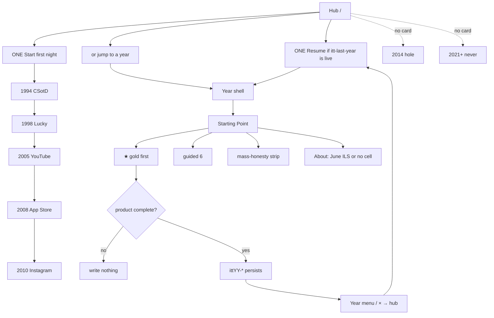
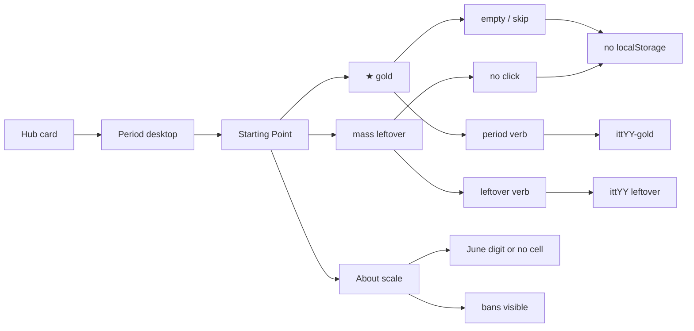
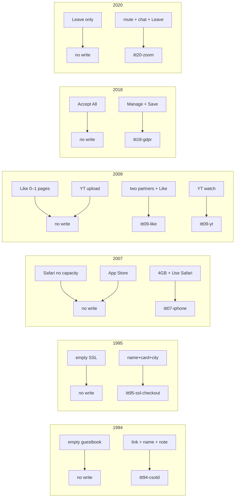
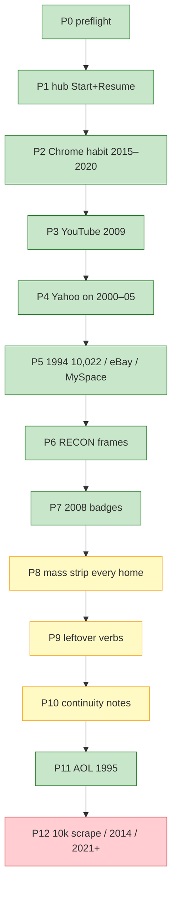
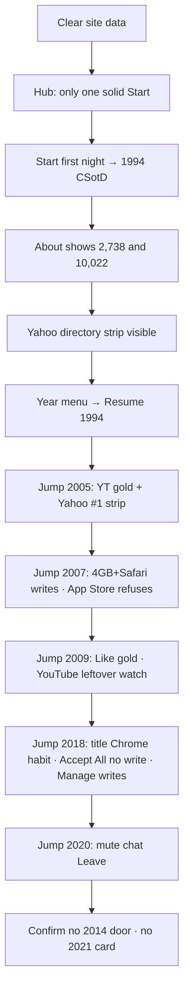

# Flow-check diagrams — is the 10k program done?

**Date:** 2026-08-22  
**How to use:** Walk top to bottom. Green in the last recheck = shipped. Amber = partial. Red = must stay undone or still open.

Legend: **DONE** · **PARTIAL** · **OPEN** · **NEVER** (correctly out of scope)

---

## 1. Whole-museum visitor flow



**Check**

- [x] One primary Start  
- [x] Resume for 2007 / 2009 / 2011 / 2013 / 2015–2020  
- [x] No playable 2014 / 2021+  
- [x] Star is first on every home · guided is exactly 6  

---

## 2. One year, every time (template)



Use this on **each** year below. Gold column is the lock. Mass column is the 10k-program leftover.

---

## 3. Every live year — gold + mass flow

```mermaid
flowchart TB
  subgraph dense ["Dense 1994–2001 · DONE"]
    y94["1994 CSotD → itt94-csotd<br/>mass: Yahoo directory + 10,022"]
    y95["1995 SSL → itt95-ssl-checkout<br/>mass: AOL #1 start-page"]
    y96["1996 portals → itt96-portal-wars<br/>mass: AOL #1"]
    y97["1997 PointCast → itt97-pointcast<br/>mass: eBay memory"]
    y98["1998 Lucky → itt98-lucky<br/>mass: Google not top 10"]
    y99["1999 AIM → itt99-aim<br/>mass: AOL #1"]
    y00["2000 MapQuest → itt00-mapquest<br/>mass: Yahoo #1 + smile/Pets"]
    y01["2001 Wiki → itt01-wiki-pages<br/>mass: Yahoo #1 · Google #9"]
  end

  subgraph forest ["Forest 2002–2008 · DONE gold / PARTIAL bleed"]
    y02["2002 Stumble → itt02-stumble<br/>mass: Yahoo #1 + continuity note"]
    y03["2003 Photobucket → itt03-photobucket<br/>mass: Yahoo + MySpace memory"]
    y04["2004 thefacebook → itt04-thefacebook-networks<br/>mass: Yahoo #1"]
    y05["2005 YT upload → itt05-yt-uploads<br/>mass: Yahoo still #1"]
    y06["2006 Twitter 140 → itt06-tweets<br/>mass: Google takes #1"]
    y07["2007 Safari → itt07-iphone<br/>App Store = TRAP · MySpace #4"]
    y08["2008 chip App Store · gold GitHub itt08-github<br/>YT/FB chart · continuity"]
  end

  subgraph lean ["Lean 2009–2020 · DONE gold / PARTIAL leftovers"]
    y09["2009 Like → itt09-like<br/>NEW: YouTube leftover itt09-yt"]
    y10["2010 IG iOS → itt10-ig"]
    y11["2011 G+ → itt11-gplus<br/>do not rebuild google.com"]
    y12["2012 IG Android → itt12-ig-android"]
    y13["2013 Vine → itt13-vine-posts"]
    y15["2015 Periscope → itt15-periscope<br/>Chrome habit costume"]
    y16["2016 Stories → itt16-ig-stories"]
    y17["2017 Face ID → itt17-faceid"]
    y18["2018 GDPR Manage → itt18-gdpr<br/>Accept All = no write · FYP taps"]
    y19["2019 Disney+ → itt19-disneyplus"]
    y20["2020 Zoom mute→chat→Leave → itt20-zoom"]
  end

  y01 --> y02
  y08 --> y09
  y13 -.->|hole| y14["2014 NEVER"]
  y14 -.-> y15
  y20 -.->|no card| y21["2021+ NEVER"]
```



2020 last-year walkable map: [`2020-5K-WEB-FLOW-MAP.md`](2020-5K-WEB-FLOW-MAP.md).

**2008 honesty:** the ★ chip points at App Store. The locked one-thing *key* is still `itt08-github`. Both exist. Do not “fix” the chip by stealing the gold.

---

## 4. Gold verb (what to click)

Empty path must **not** write. Complete path **must** write.



Full gold table (same as `e2e/one-thing-per-year.spec.js`):

| Year | Incomplete | Complete | Key |
|-----:|------------|----------|-----|
| 1994 | empty guestbook | today’s link + name + note | `itt94-csotd` |
| 1995 | empty SSL | name + card + city | `itt95-ssl-checkout` |
| 1996 | one portal | Yahoo + Excite + AltaVista | `itt96-portal-wars` |
| 1997 | one channel | News + Weather | `itt97-pointcast` |
| 1998 | Lucky empty | query + Lucky | `itt98-lucky` |
| 1999 | empty sign-on | screen name | `itt99-aim` |
| 2000 | empty directions | from + to | `itt00-mapquest` |
| 2001 | empty Save | wikitext | `itt01-wiki-pages` |
| 2002 | Stumble no interest | tech + Stumble ×2 | `itt02-stumble` |
| 2003 | empty upload | filename | `itt03-photobucket` |
| 2004 | Join no network | harvard + name | `itt04-thefacebook-networks` |
| 2005 | empty title | title + upload | `itt05-yt-uploads` |
| 2006 | empty update | ≤140 | `itt06-tweets` |
| 2007 | Safari no GB | 4GB + Use Safari | `itt07-iphone` |
| 2008 | empty issue | title + body | `itt08-github` |
| 2009 | Like no pages | two pages + Like | `itt09-like` |
| 2010 | share no filter | X-Pro II + caption | `itt10-ig` |
| 2011 | Hangout empty | circle + 2 people | `itt11-gplus` |
| 2012 | share no filter | X-Pro II | `itt12-ig-android` |
| 2013 | post no hold | hold + post | `itt13-vine-posts` |
| 2015 | LIVE empty title | title + Go LIVE | `itt15-periscope` |
| 2016 | empty story | text + add | `itt16-ig-stories` |
| 2017 | Unlock no Look | Look + Unlock | `itt17-faceid` |
| 2018 | Accept All | Manage + Save | `itt18-gdpr` |
| 2019 | Continue no profile | adult + 2 titles + kids + adult + Continue | `itt19-disneyplus` |
| 2020 | Leave only | mute + chat + Leave | `itt20-zoom` |

---

## 5. 10k program — done vs still open



| Still amber | Why it is not “all leftovers done” |
|-------------|-------------------------------------|
| P8 rails | Mass strip shipped. Dense 5× / 2× / 3×3 still sit lower. |
| P9 verbs | Only YouTube 2009 + TikTok FYP became product verbs. Other dest-fields remain. |
| P6 pixels | RECON color frames, not harvested brand stills. |
| P10 bleed | Home notes, not a badge on every clone room. |
| Git | Local only. Not on GitHub until you commit. |

---

## 6. Human walk (15 minutes)



**Command pack**

```
npx playwright test e2e/one-thing-per-year.spec.js e2e/hub-years.spec.js e2e/year-start-trails.spec.js --workers=1
python3 scripts/audit-internal-links.py
```

Last recheck: golds green · 50,591 links · 0 broken · 2019 signature spec aligned to live Disney+ selectors.
